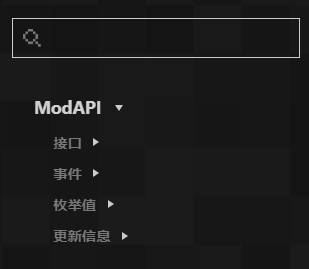
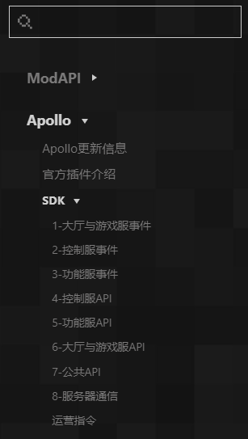
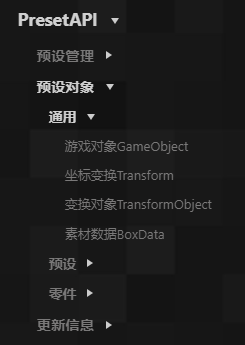

# Overview 

​ The technical manual is mainly divided into three parts: ModAPI, Apollo and PresetAPI. 

## ModSdk Technical Manual 

​ ModAPI is the cornerstone of various developments, allowing developers to customize and modify the game content in Minecraft. 

​ There is a category directory on the left side of the page, which classifies **interfaces** and **events** according to the development module, and can also conveniently check **enumeration values** and **update information**. The search bar can search based on description or API name. 

 

## Apollo Technical Manual 

​ Apollo is a tool for developing and deploying Minecraft PE version online game server clusters. It integrates functional plug-ins, load balancing, cluster management, operation instructions and other functions. Developers only need to focus on MOD business logic and develop more gameplay components, bringing more possibilities for the innovative expansion of Minecraft. 

​ There is a category directory on the left side of the page, including all **official plug-in** introductions, network service **dedicated API** introductions and **update information**. The search bar can search based on description or API name. 

 

## Preset Architecture Technical Manual 

​ Preset API is an API dedicated to preset architecture development. 

​ There is a category directory on the left side of the page, where you can view member variables, interfaces, events of different game object classes and the overall **update information** of the preset API. The search bar can search based on description or API name. 

