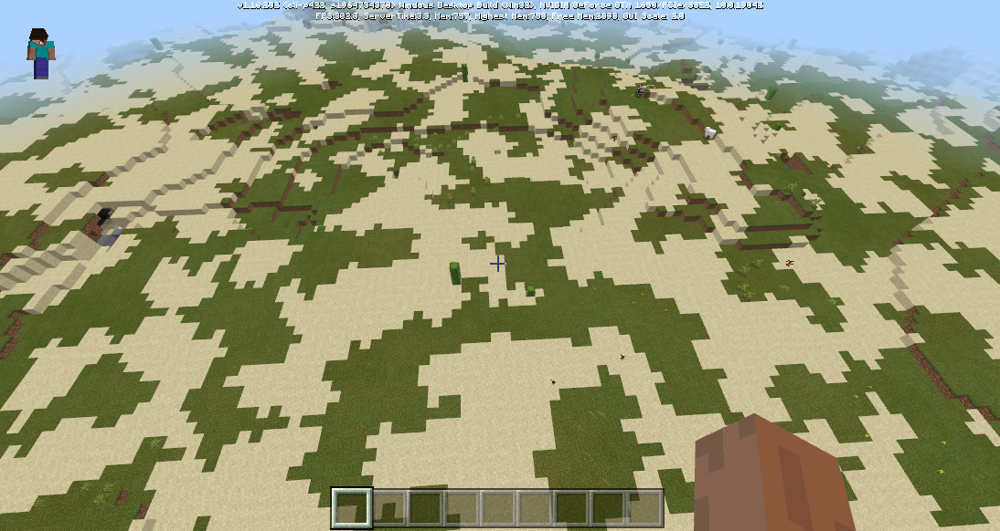

# 2.0 

2022.1.13: Version number (v2.0 BE1.17.2) 

Includes Mod PC package, mobile beta launcher, and server engine. 

- Warm reminder 

On January 21, all channels will update the 2.0 version player package, and players will be updated to version 2.0 one after another. Please arrange the update rhythm reasonably. 

- Introduction to new major functions 

1. Custom terrain 

The original biome can only change the mutation of the biome in "minecraft:overworld_generation_rules" and divide the probability of biome appearance according to temperature. It is impossible to control the layout of the biome more flexibly. Therefore, in version 2.0, we introduced a custom biome source to solve the problem of the original hardcode biome layout. 

With the new function, you can control the generation of terrain more finely. The following is a sample terrain generated using Json. For specific usage, please refer to <a href="../../../mcguide/20-Gameplay Development/15-Custom Game Content/4-Custom Dimensions/2-Biomorphology.html#7. Custom Biome Generation Process (NetEase Edition)" rel="noopenner"> Custom Biome Generation Process (NetEase Edition) </a>. 

 

2. Custom water-containing and snow-containing blocks 

Custom water-containing blocks support the configuration of custom block water-containing related functions in the component, and support python listening events, interface settings, etc. For details, see <a href="../../../mcguide/20-Gameplay Development/15-Custom Game Content/2-Custom Blocks/3-Special Blocks/7-Custom Water-Containing Blocks.html" rel="noopenner"> Custom Water-Containing Blocks </a>. 

Customized snow-containing blocks support the configuration of custom blocks containing snow in components, and support Python listening events, interface settings, etc. For details, see <a href="../../../mcguide/20-Gameplay Development/15-Custom Game Content/2-Custom Blocks/3-Special Blocks/9-Customized Snow-containing Blocks.html" rel="noopenner"> Customized Snow-containing Blocks </a>. 

3. Customized block entities support original particle effects and sound effects 

For details, see <a href="../../../mcguide/20-Gameplay Development/15-Custom Game Content/2-Custom Blocks/4.1-Customized Block Entity Appearance.html#Add Microsoft Original Particle Effects and Sound Effects" rel="noopenner"> Add Microsoft Original Particle Effects and Sound Effects </a>. 

4. Custom Books 

Books, as an item, are mainly for players to browse information. Based on custom books, you can provide a book interface for players, allowing them to gain knowledge by flipping through books. For details, see <a href="../../../mcguide/20-Gameplay Development/15-Custom Game Content/5-Custom Books/01-Custom Basic Books.html" rel="noopenner"> Custom Books </a>. 

 

- Added other features 

Added netease:fuel and netease:cooldown fields to custom basic items. For details, see <a href="../../../mcguide/20-Gameplay Development/15-Custom Game Content/1-Custom Items/1-Custom Basic Items.html" rel="noopenner"> Custom Basic Items </a>. 

- New 

1. Added [GetTopScreen](../Interface/Custom UI/General.md#gettopscreen), get the UI node at the top of the UI stack<!--by mayexing--> 

1. Added [GetBookManager](../Interface/Custom UI/Custom Book.md#getbookmanager), get the book management object<!--by myx--> 

1. Added [NotifyToMultiClients](../Interface/General/Event.md#notifytomulticlients), the server sends events to a specified group of clients<!--by xltang--> 

1. Added [ResetMotion](../Interface/Entity/Behavior.md#resetmotion), reset the instantaneous movement direction vector of the creature<!--by xujiarong02-->

1. Added [SetPersistent](../Interface/Entity/Property.md#setpersistent), set the entity will not be [cleared](https://minecraft.fandom.com/zh/wiki/%E7%94%9F%E6%88%90#.E5.9F.BA.E5.B2.A9.E7.89.88_2) because it is too far away from the player<!--by czh--> 

1. Added [SetLiquidBlock](../Interface/World/Block Management.md#setliquidblock), set the extraBlock interface of the block at a certain position<!--by guanmingyu--> 

1. Added [SetSnowBlock](../Interface/World/Block Management.md#setsnowblock), set the block at a certain position to contain snow<!--by guanmingyu--> 

1. Added [GetLiquidBlock](../Interface/World/Block Management.md#getliquidblock), get the interface of fluid information contained in the block<!--by guanmingyu--> 

1. Added [GetBlockControlAi](../Interface/Entity/Behavior.md#getblockcontrolai), get whether the native AI of the creature is blocked<!--by czh--> 

1. Added [GetSpawnDimension](../Interface/World/Map.md#getspawndimension), get the world birth dimension<!--by czh--> 

1. Added [SetSpawnDimensionAndPosition](../Interface/World/Map.md#setspawndimensionandposition), set the world birth point dimension and coordinates<!--by czh--> 

1. Added [GetPlayerUid](../Interface/Online Lobby.md#getplayeruid), get the player's uid<!--by czh--> 

1. Added [QueryLobbyUserItem](../Interface/Online Lobby.md#querylobbyuseritem), query order interface that has not been shipped<!--by gmy--> 

1. Added [LobbyGetStorage](../Interface/Online Lobby.md#lobbygetstorage), get storage data interface<!--by gmy--> 

1. Added [LobbySetStorageAndUserItem](../Interface/Online Lobby.md#lobbysetstorageanduseritem), set order shipped or stored data interface<!--by gmy--> 

1. Added [GetPlayerRespawnPos](../Interface/Player/Behavior.md#getplayerrespawnpos), added player resurrection point interface<!--by guanmingyu--> 

1. Added [GetEntityTags](../Interface/Entity/Tag.md#getentitytags) to get the entity tag list<!--by gzhuabo--> 

1. Added [AddEntityTag](../Interface/Entity/Tag.md#addentitytag) to add entity tags<!--by gzhuabo--> 

1. Added [RemoveEntityTag](../Interface/Entity/Tag.md#removeentitytag) to remove a specified tag from an entity<!--by gzhuabo--> 

1. Added [EntityHasTag](../Interface/Entity/Tag.md#entityhastag) to determine whether an entity has a specified tag<!--by gzhuabo--> 

1. Added [Pause](../Interface/Effects/ModelEffects.md#pause) to pause model effects<!--by czh--> 

1. Added [Resume](../Interface/Effects/ModelEffects.md#resume) to continue playing model effects<!--by czh--> 

1. Added [Pause](../Interface/Effects/SequenceFrame.md#pause) to pause sequence frame playback<!--by czh--> 

1. Added [SetRotUseZXY](../Interface/Effects/SequenceFrame.md#setrotusezxy) to set the rotation of the sequence frame. The rotation order is around the z, x, y axis<!--by xujiarong--> 

1. Added [SetFreeModelAniSpeed](../Interface/Model.md#setfreemodelanispeed) to set the playback speed of the free model animation<!--by xusifan--> 

1. Added [SetEntityShadowShow](../Interface/Model.md#setentityshadowshow), set entity to open/close shadow rendering<!--by guanmingyu--> 

1. Added [Pause](../Interface/Effect/Particle.md#pause), pause particle playback<!--by czh--> 

1. Added [GetStringHash64](../Interface/Entity/molang.md#getstringhash64), added an interface to return the hash64 of a string variable<!--by guanmingyu--> 

1. Added [Update](../Interface/Custom UI/UI interface.md#update), supplemented documentation<!--by mayexing-->

1. Added [GetScreenName](../Interface/Custom UI/UI interface.md#getscreenname), get the name of this interface<!--by mayexing--> 

1. Added [lobbyGoodBuySucServerEvent](../Event/Online lobby.md#lobbygoodbuysucserverevent), the event thrown by the server when the player logs in to the online lobby or buys goods in the online lobby<!--by guanmingyu--> 

1. Added [HealthChangeServerEvent](../Event/Entity.md#healthchangeserverevent), the event of the change of the life value of the creature<!--by czh--> 

1. Added [BlockLiquidStateChangeServerEvent](../Event/Block.md#blockliquidstatechangeserverevent), the event triggered before the block turns to water or leaves the water (fluid)<!--by guanmingyu--> 

1. Added [BlockLiquidStateChangeAfterServerEvent](../event/block.md#blockliquidstatechangeafterserverevent), which is the event triggered after the block becomes water-containing or leaves water (fluid)<!--by guanmingyu--> 

1. Added [BlockSnowStateChangeServerEvent](../event/block.md#blocksnowstatechangeserverevent), which is the event triggered before the block becomes snow-containing or leaves snow-containing<!--by guanmingyu--> 

1. Added [BlockSnowStateChangeAfterServerEvent](../event/block.md#blocksnowstatechangeafterserverevent), which is the event triggered after the block becomes snow-containing or leaves snow-containing<!--by guanmingyu--> 

1. Added [OnModBlockNeteaseEffectCreatedClientEvent](../event/block.md#onmodblockneteaseeffectcreatedclientevent), custom block entity bound special effect creation success event<!--by xujiarong02--> 

1. Added [HealthChangeClientEvent](../event/entity.md#healthchangeclientevent), event of biological health value change<!--by czh--> 

1. Added [EntityModelChangedClientEvent](../event/entity.md#entitymodelchangedclientevent), added event triggered when entity model is switched. <!--by guanmingyu--> 

1. Add [SetBlockType](../enumeration value/SetBlockType.md), the type of block settings<!--by guanmingyu--> 

- Adjustment 

1. Adjust [CreateUI](../interface/custom UI/general.md#createui), add notes<!--by mayexing--> 

1. Adjust [StartNavTo](../interface/player/navigation.md#startnavto), add parameters to control whether the sequence frame opens depth detection<!--by czh--> 

1. Adjust [PushScreen](../interface/custom UI/general.md#pushscreen), add custom parameters<!--by mayexing--> 

1. Adjust [SetBlockControlAi](../Interface/Entity/Behavior.md#setblockcontrolai), the original model will also freeze when AI is turned off<!--by czh--> 

1. Adjust [ChangePlayerFlyState](../Interface/Player/Behavior.md#changeplayerflystate), add usage restrictions<!--by guanmingyu--> 

1. Adjust [SetCanBlockSetOnFireByLightning](../Interface/World/GameRule.md#setcanblocksetonfirebylightning), release this interface<!--by guanmingyu--> 

1. Adjust [SetCanActorSetOnFireByLightning](../Interface/World/GameRule.md#setcanactorsetonfirebylightning), release this interface<!--by guanmingyu--> 

1. Adjust [GetAttrValue](../interface/entity/attribute.md#getattrvalue), add a new interface for the client to obtain attributes<!--by guanmingyu--> 

1. Adjust [GetAttrMaxValue](../interface/entity/attribute.md#getattrmaxvalue), add a new interface for the client to obtain the maximum value of the attribute<!--by guanmingyu--> 

1. Adjust [GetMolangValue](../interface/entity/molang.md#getmolangvalue), expand the interface, add the return molang variable hash64<!--by guanmingyu--> 

1. Adjust [ChangeBindAutoScale](../interface/custom UI/UI interface.md#changebindautoscale), add a note<!--by mayexing--> 

1. Adjust [OnOffhandItemChangedServerEvent](../event/item.md#onoffhanditemchangedserverevent), add a note: switching the same item with different durability will not trigger this event<!--by guanmingyu--> 

1. Adjust [OnCarriedNewItemChangedServerEvent](../event/item.md#oncarriednewitemchangedserverevent), add a note: switching the same item with different durability will not trigger this event<!--by guanmingyu-->

1. Adjust [ServerItemTryUseEvent](../event/item.md#serveritemtryuseevent), add description of usage scenarios<!--by guanmingyu--> 

1. Adjust [OnItemPutInEnchantingModelServerEvent](../event/item.md#onitemputinenchantingmodelserverevent), change the parameter type of playerId to str<!--by xujiarong02--> 

- Fix 

1. Fixed the problem that educational version NPCs can be summoned through the summon npc command 
1. Fixed [ModelUpdateAnimationMolangVariable](../interface/virtual world/model.md#modelupdateanimationmolangvariable), fixed the problem that the interface does not take effect when scripts/initialize is configured in the client entity<!--by czh--> 

- Offline Demo Download 

Download [DEMO](https://g79.gdl.netease.com/2.0DemoV4.zip). 

