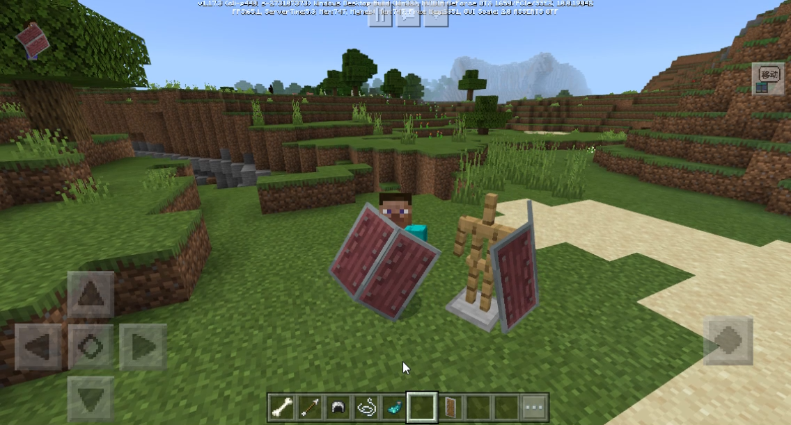
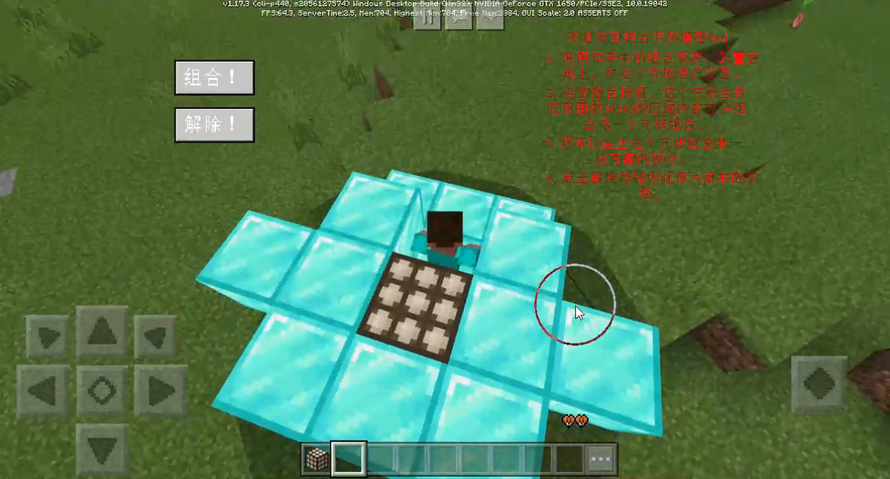
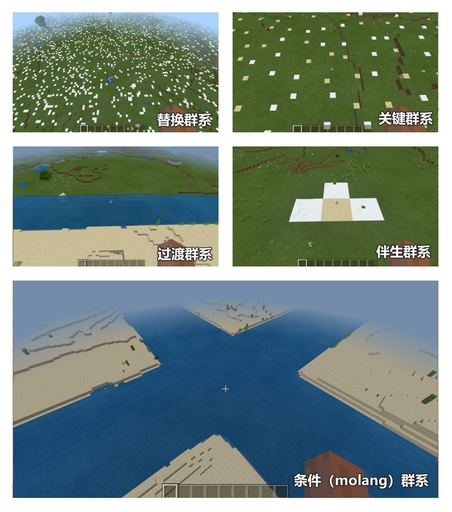

# 2.1 

2022.4.15: Version number (v2.1 BE1.17.3) 

Includes Mod PC package, mobile beta launcher, and server engine. 

- Introduction to new major features 

1. Custom shield 

Supports shield customization, and additional support for shield animation and model. For specific usage, please refer to <a href="../../../mcguide/20-Gameplay Development/15-Custom Game Content/1-Custom Items/8-Custom Shield.html" rel="noopenner"> Custom Shield </a>. 

Demo see: <a href="../../../mcguide/20-Gameplay Development/13-Module SDK Programming/60-Demo Example.html#demomod" rel="noopenner"> Example Introduction </a> 

 

2. Block Merge Mesh & Set Mesh to Entity Model 

Mainly implements 3 functions. 

1) Get the specified block as a block palette, which records the position and type of each block. Refer to [GetBlockPaletteFromPosList](../Interface/World/Block Combination.md#getblockpalettefromposlist) (Server) and other interfaces. 

2) Use the block palette to generate the corresponding mesh model, refer to [CombineBlockPaletteToGeometry](../Interface/Block/Block Geometry Model.md#combineblockpalettetogeometry)(Client) and other interfaces. 

3) Add the specified mesh model to the entity, refer to [AddActorBlockGeometry](../Interface/Entity/Rendering.md#addactorblockgeometry)(Client). 

As shown in the figure below, some blocks are combined into a mesh model and given a rideable entity, achieving an effect similar to assembling a chariot. 

 

For Demo, see: <a href="../../../mcguide/20-Gameplay Development/13-Module SDK Programming/60-Demo Example.html#demomod" rel="noopenner"> Example Introduction </a> 

3. Provide more Chinese version of biome source node types

The 2.1 version of the biome source node can do the following:

1) Replace part of a biome with another biome

2) When biome A and biome B are adjacent, a transitional biome is generated between them

3) Generate a companion biome around the core biome

4) Randomly select a point within a rectangular range of fixed length and width to place the key biome

5) Implement biome source control based on molang statements

4. Custom loot table expansion

Players have added a new luck attribute to affect the number and weight of loot, see: <a href="../../../mconline/10-addon tutorial/Chapter 12: More Complete Custom Drops/Course 02. Loot Pool.html#Supplementary Content" rel="noopenner"> Loot Pool </a> and [Attribute Value](../Enumeration Value/AttrType.md). 

5. UI controls support more attribute setting interfaces 

See [UI Controls](../Interfaces/Custom UI/UI Controls.md) for details.

6. Added 10 json components to block the original large structures 

You can block some large structures in the dimension configuration, see: <a href="../../../mcguide/20-Gameplay Development/15-Custom Game Content/4-Custom Dimension/1-Custom Dimension.html#Dimension Configuration" rel="noopenner"> Dimension Configuration </a> 

7. Added json fields to define item description information 

Added netease:customtips field, see: <a href="../../../mcguide/20-Gameplay Development/15-Custom Game Content/1-Custom Items/1-Custom Basic Items.html#netease-customtips（2-1beta Version Content）" rel="noopenner"> netease-customtips </a> 

- Added 

1. Added [StartMemProfile](../Interface/General/Debug.md#startmemprofile)(Server), Start server script memory analysis<!--by xusifan--> 

1. Add [StopMemProfile](../Interface/General/Debug.md#stopmemprofile)(Server), Stop server script memory analysis and generate flame graph<!--by xusifan--> 

1. Add [StartMemProfile](../Interface/General/Debug.md#startmemprofile)(Client), Start client script memory analysis<!--by xusifan--> 

1. Add [StopMemProfile](../Interface/General/Debug.md#stopmemprofile)(Client), Stop client script memory analysis and generate flame graph<!--by xusifan--> 

1. Add [GetBlankBlockPalette](../Interface/World/Block Combination.md#getblankblockpalette)(Server), Get a blank block palette<!--by xujiarong02--> 

1. Added [GetBlockPaletteFromPosList](../Interface/World/BlockCombination.md#getblockpalettefromposlist)(Server), Create and get a block palette according to the input block position list<!--by xujiarong02--> 

1. Added [GetBlockPaletteBetweenPos](../Interface/World/BlockCombination.md#getblockpalettebetweenpos)(Server), Create and get a block palette according to the input two block positions<!--by xujiarong02--> 

1. Added [SetBlockByBlockPalette](../Interface/World/BlockCombination.md#setblockbyblockpalette)(Server), Set all blocks recorded in the palette to actual blocks according to the input block palette content. <!--by xujiarong02--> 

1. Added [GetBlockBasicInfo](../Interface/Block/Property.md#getblockbasicinfo)(Server), Get basic information of blocks<!--by xusifan--> 

1. Added [SetBlockBasicInfo](../Interface/Block/Property.md#setblockbasicinfo)(Server), Set basic information of blocks<!--by gmy--> 

1. Added [GetBlockCollision](../Interface/World/Block Management.md#getblockcollision)(Server), Get the aabb interface of the current collision of the block at the specified position<!--by xusifan--> 

1. Added [GetBlockClip](../Interface/World/Block Management.md#getblockclip)(Server), Get the aabb interface of the current clip of the block at the specified position<!--by xusifan--> 

1. Added [IsSlimeChunk](../Interface/World/Map.md#isslimechunk)(server side), get whether a block is a slime block. <!--by gmy--> 

1. Added [OpenMobHitBlockDetection](../Event/Entity.md#openmobhitblockdetection)(Server), opened the collision block detection interface<!--by gmy--> 

1. Added [CloseMobHitBlockDetection](../Event/Entity.md#closemobhitblockdetection)(Server), closed the collision block detection interface<!--by gmy--> 

1. Added [SetJumpPower](../Interface/Entity/Behavior.md#setjumppower)(Server), set the creature jump power<!--by gmy--> 

1. Added [SetEntityInteractFilter](../Interface/Entity/Behavior.md#setentityinteractfilter)(Server), set the conditions for interacting with creatures<!--by xiegang--> 

1. Added [GetPlayerUIItem](../interface/block/container.md#getplayeruiitem)(server side), get the item of the synthesis container<!--by jishaobin--> 

1. Added [GetItemDefenceAngle](../interface/item.md#getitemdefenceangle)(server side), get the shield item's defense angle range<!--by gmy--> 

1. Added [SetItemDefenceAngle](../Interface/Item.md#setitemdefenceangle)(Server), set the shield item's defense angle range<!--by gmy--> 

1. Added [SetInputSlotItem](../Interface/Block/Container.md#setinputslotitem)(Server), set the furnace input bar item<!--by huangxiaojie03--> 

1. Added [GetInputSlotItem](../Interface/Block/Container.md#getinputslotitem)(Server), get the furnace input bar item<!--by huangxiaojie03--> 

1. Added [GetOutputSlotItem](../Interface/Block/Container.md#getoutputslotitem)(Server), get the furnace output bar item<!--by huangxiaojie03--> 

1. Added [GetIsBlocking](../Interface/Player/Behavior.md#getisblocking)(Server), Get whether the player is in a blocking state<!--by gmy--> 

1. Added [AddBrewingRecipes](../Interface/World/Recipe.md#addbrewingrecipes)(Server), Added an interface for adding brewing stand recipes<!--by gmy--> 

1. Added [SetEntityShareablesItems](../Interface/Entity/Behavior.md#setentityshareablesitems)(Server), Set the list of items that can be shared/picked up by the entity<!--by xiegang--> 

1. Added [AddActorRenderControllerArray](../Interface/Entity/Rendering.md#addactorrendercontrollerarray)(Client), Add the dictionary arrays element in the entity rendering controller array<!--by xiegang01--> 

1. Added [AddActorBlockGeometry](../Interface/Entity/Rendering.md#addactorblockgeometry)(Client), Add a block geometry model to an entity<!--by xujiarong02--> 

1. Added [DeleteActorBlockGeometry](../Interface/Entity/Rendering.md#deleteactorblockgeometry)(Client), Delete the specified block geometry model in the entity<!--by xujiarong02--> 

1. Added [ClearActorBlockGeometry](../Interface/Entity/Rendering.md#clearactorblockgeometry)(Client), Delete all block geometry models in the entity<!--by xujiarong02--> 

1. Added [SetActorBlockGeometryVisible](../Interface/Entity/Rendering.md#setactorblockgeometryvisible)(Client), Set whether the specified block geometry model in the entity is displayed<!--by xujiarong02--> 

1. Add [SetActorAllBlockGeometryVisible](../Interface/Entity/Rendering.md#setactorallblockgeometryvisible)(Client), Set whether all block geometry models in the entity are displayed<!--by xujiarong02--> 

1. Add [GetBlankBlockPalette](../Interface/World/Block Combination.md#getblankblockpalette)(Client), Get a blank block palette<!--by xujiarong02--> 

1. Add [GetBlockPaletteFromPosList](../Interface/World/Block Combination.md#getblockpalettefromposlist)(Client), Create and get a block palette according to the input block position list<!--by xujiarong02--> 

1. Added [GetBlockPaletteBetweenPos](../Interface/World/Block Combination.md#getblockpalettebetweenpos)(Client), Create and get a block palette according to the two input positions<!--by xujiarong02--> 

1. Added [CombineBlockPaletteToGeometry](../Interface/Block/Block Geometry Model.md#combineblockpalettetogeometry)(Client), Combine all blocks in BlockPalette and convert them into geometry models that can be used for entities<!--by xujiarong02--> 

1. Added [CombineBlockBetweenPosToGeometry](../Interface/Block/Block Geometry Model.md#combineblockbetweenpostogeometry)(Client), Search for all blocks between the two input positions, and combine and convert these blocks into geometry models that can be used for entities<!--by xujiarong02--> 

1. Added [CombineBlockFromPosListToGeometry](../Interface/Block/Block Geometry Model.md#combineblockfromposlisttogeometry)(Client), Search for all blocks between the two positions entered, and merge and convert these blocks into a geometry model that can be used for entities<!--by xujiarong02--> 

1. Added [GetBlockClip](../Interface/World/Block Management.md#getblockclip)(Client), Get the aabb of the current clip of the block at the specified position<!--by xusifan--> 

1. Added [GetBlockCollision](../Interface/World/Block Management.md#getblockcollision)(Client), Get the aabb of the current collision of the block at the specified position<!--by xusifan--> 

1. Added [SetHealthBarDeviation](../Interface/Entity/Rendering.md#sethealthbardeviation)(Client), added an interface for setting the health bar height<!--by gmy--> 

1. Added [GetTexture](../Interface/Model.md#gettexture)(Client), got the model texture name path<!--by huangxiaojie03--> 

1. Added [setUsingShield](../Interface/Player/Behavior.md#setusingshield)(Client), activated the shield state<!--by gmy--> 

1. Added [SetFullSize](../Interface/Custom UI/UI Control.md#setfullsize)(Client), set the size of the control, support percentage and absolute value<!--by mayexing--> 

1. Added [GetFullSize](../Interface/Custom UI/UI Control.md#getfullsize)(Client), Get the size of the control, support proportional value and absolute value<!--by mayexing--> 

1. Added [SetFullPosition](../Interface/Custom UI/UI Control.md#setfullposition)(Client), Set the anchor coordinates (global coordinates) of the control, support proportional value and absolute value<!--by mayexing--> 

1. Added [GetFullPosition](../Interface/Custom UI/UI Control.md#getfullposition)(Client), Get the anchor coordinates of the control, support proportional value and absolute value<!--by mayexing--> 

1. Added [SetAnchorFrom](../Interface/Custom UI/UI Control.md#setanchorfrom)(Client), Set the anchor point of the control relative to the parent node<!--by mayexing--> 

1. Added [GetAnchorFrom](../Interface/Custom UI/UI Control.md#getanchorfrom)(Client), determines which anchor point of the control relative to the parent node to calculate the position and size<!--by mayexing--> 

1. Added [SetAnchorTo](../Interface/Custom UI/UI Control.md#setanchorto)(Client), sets the control's own anchor point position<!--by mayexing--> 

1. Added [GetAnchorTo](../Interface/Custom UI/UI Control.md#getanchorto)(Client), gets the control's own anchor point position information<!--by mayexing--> 

1. Added [SetClipOffset](../Interface/Custom UI/UI Control.md#setclipoffset)(Client), sets the control's clipping offset information<!--by mayexing--> 

1. Added [GetClipOffset](../Interface/Custom UI/UI Control.md#getclipoffset)(Client), Get the clipping offset information of the control<!--by mayexing--> 

1. Added [SetClipsChildren](../Interface/Custom UI/UI Control.md#setclipschildren)(Client), Set whether the control enables clipping<!--by mayexing--> 

1. Added [GetClipsChildren](../Interface/Custom UI/UI Control.md#getclipschildren)(Client), Returns whether a control enables clipping based on the control path<!--by mayexing--> 

1. Added [SetMaxSize](../Interface/Custom UI/UI Control.md#setmaxsize)(Client), Sets the maximum size allowed by the control<!--by mayexing--> 

1. Added [GetMaxSize](../Interface/Custom UI/UI Control.md#getmaxsize)(Client), Get the maximum size value allowed by the control<!--by mayexing--> 

1. Added [SetMinSize](../Interface/Custom UI/UI Control.md#setminsize)(Client), Set the minimum size value allowed by the control<!--by mayexing--> 

1. Added [GetMinSize](../Interface/Custom UI/UI Control.md#getminsize)(Client), Get the minimum size value allowed by the control<!--by mayexing--> 

1. Added [asStackPanel](../Interface/Custom UI/UI Control.md#asstackpanel)(Client), Convert the current BaseUIControl to a StackPanelUIControl instance<!--by mayexing--> 

1. Added [asInputPanel](../Interface/Custom UI/UI Control.md#asinputpanel)(Client), Convert the current BaseUIControl to InputPanelUIControl instance<!--by mayexing--> 

1. Added [SetClipDirection](../Interface/Custom UI/UI Control.md#setclipdirection)(Client), Set the clipping direction of the image control<!--by mayexing--> 

1. Added [GetClipDirection](../Interface/Custom UI/UI Control.md#getclipdirection)(Client), Get the clipping direction of the image control<!--by mayexing--> 

1. Added [SetImageAdaptionType](../Interface/Custom UI/UI Control.md#setimageadaptiontype)(Client), Set the image adaptation method and information of the image control<!--by mayexing--> 

1. Added [SetIsModal](../Interface/Custom UI/UI Control.md#setismodal)(Client), Set whether the current panel is a modal box<!--by mayexing--> 

1. Added [GetIsModal](../Interface/Custom UI/UI Control.md#getismodal)(Client), Determine whether the current panel is a modal box<!--by mayexing--> 

1. Added [SetTextAlignment](../Interface/Custom UI/UI Control.md#settextalignment)(Client), Set the text alignment of the text control<!--by mayexing--> 

1. Added [GetTextAlignment](../Interface/Custom UI/UI Control.md#gettextalignment)(Client), Get the text alignment of the text control<!--by mayexing--> 

1. Added [SetTextLinePadding](../Interface/Custom UI/UI Control.md#settextlinepadding) (Client), set the line spacing of the text control<!--by mayexing--> 

1. Added [GetTextLinePadding](../Interface/Custom UI/UI Control.md#gettextlinepadding)(Client), Get the line spacing of the text control<!--by mayexing--> 

1. Added [EnableTextShadow](../Interface/Custom UI/UI Control.md#enabletextshadow)(Client), Enable the text control to display shadow<!--by mayexing--> 

1. Added [DisableTextShadow](../Interface/Custom UI/UI Control.md#disabletextshadow)(Client), Disable the text control to display shadow<!--by mayexing--> 

1. Added [IsTextShadowEnabled](../Interface/Custom UI/UI Control.md#istextshadowenabled)(Client), Determine whether the text control displays shadow<!--by mayexing--> 

1. Added [SetOrientation](../Interface/Custom UI/UI Control.md#setorientation)(Client), Set the arrangement direction of stackPanel<!--by mayexing--> 

1. Added [GetOrientation](../Interface/Custom UI/UI Control.md#getorientation)(Client), Get the arrangement direction of stackPanel<!--by mayexing--> 

1. Added [SerializeBlockPalette](../Interface/Block/Block Palette.md#serializeblockpalette)(Client/Server), Serialize the data in the block palette for the block palette to be transmitted between the client and server event data<!--by xujiarong02--> 

1. Added [DeserializeBlockPalette](../Interface/Block/Block Palette.md#deserializeblockpalette)(Client/Server), Deserialize the data in the block palette data dictionary for the block palette to transmit event data between the client and server<!--by xujiarong02--> 

1. Add [GetBlockCountInBlockPalette](../Interface/Block/BlockPalette.md#getblockcountinblockpalette)(Client/Server), Get the number of blocks of a certain type in the block palette BlockPalette<!--by xujiarong02--> 

1. Add [DeleteBlockInBlockPalette](../Interface/Block/BlockPalette.md#deleteblockinblockpalette)(Client/Server), Delete a block of a certain type in the block palette BlockPalette<!--by xujiarong02--> 

1. Added [ReplaceBlockInBlockPalette](../Interface/Block/BlockPalette.md#replaceblockinblockpalette)(Client/Server), Replace a block of a certain type in BlockPalette<!--by xujiarong02--> 

1. Added [ReplaceAirByStructureVoid](../Interface/Block/BlockPalette.md#replaceairbystructurevoid)(Client/Server), Set whether to replace all air in BlockPalette with structure void<!--by xujiarong02--> 

1. Added [GetVolumeOfBlockPalette](../Interface/Block/BlockPalette.md#getvolumeofblockpalette)(Client/Server), Get the length, width and height of the cuboid occupied by BlockPalette<!--by xujiarong02--> 

1. Added [GetLocalPosListOfBlocks](../Interface/Block/Block Palette.md#getlocalposlistofblocks)(Client/Server), Get the relative position list of a certain block in the block palette<!--by xujiarong02--> 

1. Added [OnGroundServerEvent](../Event/Entity.md#ongroundserverevent)(Server), Server entity ground event<!--by xusifan--> 

1. Added [FurnaceBurnFinishedServerEvent](../Event/Item.md#furnaceburnfinishedserverevent)(Server), Server furnace burning trigger event<!--by huangxiaojie03--> 

1. Added [UIContainerItemChangedServerEvent](../Event/Item.md#uicontaineritemchangedserverevent)(Server), Added synthesis container item change event<!--by jishaobin--> 

1. Added [ContainerItemChangedServerEvent](../event/item.md#containeritemchangedserverevent)(server), Added container item change event<!--by jishaobin--> 

1. Added [OnMobHitBlockServerEvent](../event/entity.md#onmobhitblockserverevent)(server), Creature and block collision event<!--by gmy--> 

1. Added [HealthChangeBeforeServerEvent](../event/entity.md#healthchangebeforeserverevent)(server), Event before creature health value changes<!--by gmy--> 

1. Added [EntityDroppedItemServerEvent](../event/entity.md#entitydroppeditemserverevent)(server), Events triggered when creatures throw items<!--by xiegang--> 

1. Added [EntityPickupItemServerEvent](../event/entity.md#entitypickupitemserverevent)(server), Events triggered when creatures pick up items (not triggered by players)<!--by xiegang--> 

1. Added [OnPlayerBlockedByShieldBeforeServerEvent](../event/item.md#onplayerblockedbyshieldbeforeserverevent)(server), Events triggered before players use shields to block damage<!--by guanmingyu--> 

1. Added [OnPlayerBlockedByShieldAfterServerEvent](../event/item.md#onplayerblockedbyshieldafterserverevent)(server), Events triggered after players use shields to block damage<!--by guanmingyu--> 

1. Added [OnPlayerActiveShieldServerEvent](../event/item.md#onplayeractiveshieldserverevent)(server side), event triggered by player activating shield<!--by guanmingyu--> 

1. Added [BlockDestroyByLiquidServerEvent](../event/block.md#blockdestroybyliquidserverevent)(server), event of block being destroyed by water<!--by guanmingyu--> 

1. Added [FarmBlockToDirtBlockServerEvent](../event/block.md#farmblocktodirtblockserverevent)(server), triggered when farmland degenerates into dirt<!--by guanmingyu--> 

1. Added [DirtBlockToGrassBlockServerEvent](../event/block.md#dirtblocktograssblockserverevent)(server), triggered when dirt block turns into grass block<!--by guanmingyu--> 

1. Added [GrassBlockToDirtBlockServerEvent](../event/block.md#grassblocktodirtblockserverevent)(server), triggered when grass blocks turn into dirt blocks<!--by guanmingyu--> 

1. Added [PlayerDoInteractServerEvent](../event/entity.md#playerdointeractserverevent)(server), event triggered when players interact with creatures<!--by xiegang--> 

1. Added [BlockBreathability](../enumeration value/BlockBreathability.md), block breathability<!--by xusifan--> 

1. Added [ItemCategory](../enumeration value/ItemCategory.md), item creation column type<!--by xusifan--> 

1. Added [RenderControllerArrayType](../enumeration value/RenderControllerArrayType.md), enumeration value of material, texture, and model in the rendering controller dictionary<!--by xiegang01--> 

1. Added [RenderLayer](../enumeration value/RenderLayer.md), material type when rendering blocks<!--by xusifan--> 

- Adjustment 

1. Adjusted [GetLiquidBlock](../interface/world/block management.md#getliquidblock)(server), added a note<!--by guanmingyu--> 

1. Adjusted [SetAddArea](../interface/world/map.md#setaddarea)(server), added fill instruction description<!--by jishaobin--> 

1. Adjust [SetBlockControlAi](../Interface/Entity/Behavior.md#setblockcontrolai)(Server), add a parameter to freeze the action<!--by czh--> 

1. Adjust [GetEntitiesAround](../Interface/World/Map.md#getentitiesaround)(Server), add the description of subject in the filter<!--by jishaobin--> 

1. Adjust [CraftItemOutputChangeServerEvent](../Event/Item.md#craftitemoutputchangeserverevent)(Server), add the current interface type parameter<!--by jishaobin--> 

Sample Demo download address: [2.1 Demo](https://g79.gdl.netease.com/2.1DemoV5.zip).