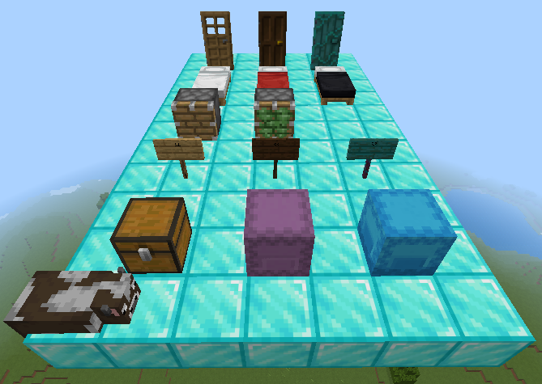
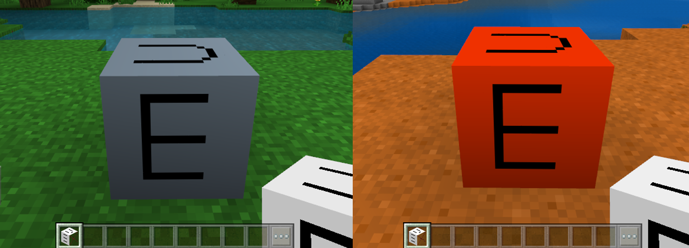
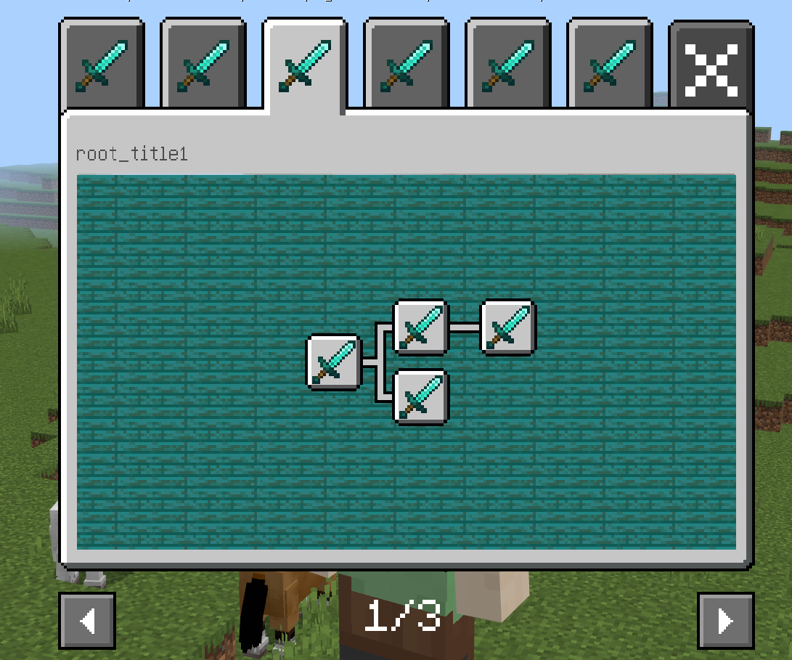

# 2.2 

2022.6.21: Version number (v2.2 BE1.18.0) 

Includes Mod PC package, mobile beta launcher, and server engine. 

- Warm reminder 

On June 7, the first beta version of 2.2 was launched. 

On June 21, the second beta version of 2.2 was launched. 

On June 30, the stable version of 2.2 was launched. 

On July 8, all channels will update the 2.2 version player package, and players will be updated to 2.2 version one after another. Please arrange the update rhythm reasonably. 

Download [2.2 Demo](https://g79.gdl.netease.com/2.2BetaDemoV4.zip). 

- Introduction to new major features 

1. Added support for the creation, playback control and hooking of Microsoft particles, see [Microsoft Particles](../Interface/Effects/Microsoft Particles.md) 

 

2. Each texture of the custom block free model supports a maximum of 64×64. For the production of custom block models, please refer to <a href="../../../mcguide/20-Gameplay Development/15-Custom Game Content/2-Custom Blocks/5-Custom Block Models.html">this document</a>. 

3. The block geometry model supports doors, beds, pistons, sticky pistons, signs, and box blocks

4. For the biome colors of custom blocks and custom block models, please refer to <a href="../../../mcguide/20-Gameplay Development/15-Custom Game Content/2-Custom Blocks/2-Functions.html#Custom Blocks and Custom Block Models Biome Colors (2.2beta Version Content)" rel="noopenner"> this document </a>

5. Some UI controls support attribute animation, please refer to <a href="../../../mcguide/18-Interface and Interaction/19-Control Attribute Animation.html" rel="noopenner"> this document </a>.

6. Added a custom achievement system to support developers to define their own achievement events and display them. For details, see <a href="../../../mcguide/20-Gameplay Development/15-Custom Game Content/16-Custom Achievement System.html" rel="noopenner">Custom Achievements</a> 

​  

- Special Notes 

In a custom dimension, if biome terrain (defined in the netease_biomes directory) is used, the 2d biome rules are used by default. 

**Note: In versions 2.2 and later, we have optimized the movement traffic of custom creatures. Creatures that are far away from the player will teleport. If you feel the effect is poor, you can manually add the netease:ban_bandwidth_optimization:{} component in components to actively turn off this optimization** 

- New 

1. Added [GetRotFromDir](../Interface/General/Mathematics.md#getrotfromdir) (server side), get the rotation angle according to the player's current direction<!--by xujiarong--> 

1. Added [GetRotFromDir](../Interface/General/Mathematics.md#getrotfromdir)(Client), Get the rotation angle by the player's current orientation<!--by xujiarong--> 

1. Added [GetNodeDetailInfo](../Interface/Custom UI/Custom Achievement System.md#getnodedetailinfo)(Server), Get the interface of achievement node information of custom achievement system<!--by cxz--> 

1. Added [SetNodeFinish](../Interface/Custom UI/Custom Achievement System.md#setnodefinish)(Server), Set the interface of completion of a certain achievement node of custom achievement system<!--by cxz--> 

1. Added [AddNodeProgress](../Interface/Custom UI/Custom Achievement System.md#addnodeprogress)(Server), Add the interface of achievement node progress of custom achievement system<!--by cxz--> 

1. Added [GetChildrenNode](../Interface/Custom UI/Custom Achievement System.md#getchildrennode)(Server), Get the interface of all child nodes of the next level of a certain achievement node in the custom achievement system<!--by cxz--> 

1. Added [LobbyGetAchievementStorage](../Interface/Achievement.md#lobbygetachievementstorage)(Server), Get the data interface of cloud achievement storage progress<!--by cxz--> 

1. Added [LobbySetAchievementStorage](../Interface/Achievement.md#lobbysetachievementstorage)(Server), Added the data interface of cloud achievement achievement progress<!--by cxz--> 

1. Added [SetActorBlockGeometryOffset](../Interface/Block/Block Geometry Model.md#setactorblockgeometryoffset)(Client), Set the position offset of the entity's block geometry model. <!--by xujiarong02--> 

1. Added [SetActorBlockGeometryRotation](../Interface/Block/Block Geometry Model.md#setactorblockgeometryrotation)(Client), set the rotation angle of the entity's block geometry model. <!--by xujiarong02--> 

1. Added [EnableActorBlockGeometryTransparent](../Interface/Block/Block Geometry Model.md#enableactorblockgeometrytransparent)(Client), set whether to allow the entity's block geometry model to generate transparency. <!--by xujiarong02--> 

1. Added [SetActorBlockGeometryTransparency](../Interface/Block/Block Geometry Model.md#setactorblockgeometrytransparency)(Client), set the transparency of the entity's block geometry model. <!--by xujiarong02--> 

1. Add [Create](../Interface/Effects/Microsoft Particles.md#create)(Client), create particle emitter<!--by dengruitao--> 

1. Add [CreateBindEntity](../Interface/Effects/Microsoft Particles.md#createbindentity)(Client), create particle emitter and bind entity<!--by dengruitao--> 

1. Add [EmitManually](../Interface/Effects/Microsoft Particles.md#emitmanually)(Client), manually emit particles<!--by dengruitao--> 

1. Add [BindEntity](../Interface/Effects/Microsoft Particles.md#bindentity)(Client), bind particle emitter to specified entity<!--by dengruitao--> 

1. Added [Unbind](../Interface/Effects/Microsoft Particles.md#unbind)(Client), Unbind the particle emitter<!--by dengruitao--> 

1. Added [SetRelative](../Interface/Effects/Microsoft Particles.md#setrelative)(Client), Set whether the particle is calculated in the local space<!--by dengruitao--> 

1. Added [GetBindingID](../Interface/Effects/Microsoft Particles.md#getbindingid)(Client), Get the target ID bound to the particle emitter<!--by dengruitao--> 

1. Added [Remove](../Interface/Effects/Microsoft Particles.md#remove)(Client), Destroy the specified particle emitter<!--by dengruitao--> 

1. Added [RemoveByName](../Interface/Effects/Microsoft Particles.md#removebyname)(Client), Destroy all particle emitters with the specified identifier<!--by dengruitao--> 

1. Add [Exist](../Interface/Effects/Microsoft Particles.md#exist)(Client), Determine whether the specified particle emitter exists<!--by dengruitao--> 

1. Add [Play](../Interface/Effects/Microsoft Particles.md#play)(Client), Play the particle emitter<!--by dengruitao--> 

1. Add [Stop](../Interface/Effects/Microsoft Particles.md#stop)(Client), Stop the particle emitter from playing<!--by dengruitao--> 

1. Add [Hide](../Interface/Effects/Microsoft Particles.md#hide)(Client), Hide the particle emitter<!--by dengruitao--> 

1. Add [Show](../Interface/Effects/Microsoft Particles.md#show)(Client), Show particle emitter<!--by dengruitao--> 

1. Added [Pause](../Interface/Effects/Microsoft Particles.md#pause)(Client), Pause particle emitter update<!--by dengruitao--> 

1. Added [Resume](../Interface/Effects/Microsoft Particles.md#resume)(Client), Resume particle emitter update<!--by dengruitao--> 

1. Added [Replay](../Interface/Effects/Microsoft Particles.md#replay)(Client), Replay particle emitter<!--by dengruitao--> 

1. Added [PlayAt](../Interface/Effects/Microsoft Particles.md#playat)(Client), Set particle emitter playback time<!--by dengruitao--> 

1. Added [IsPausing](../Interface/Effects/Microsoft Particles.md#ispausing)(Client), Determine whether the particle emitter is paused<!--by dengruitao--> 

1. Added [IsHiding](../Interface/Effects/Microsoft Particles.md#ishiding)(Client), to determine whether the particle emitter is hidden<!--by dengruitao--> 

1. Added [SetPos](../Interface/Effects/Microsoft Particles.md#setpos)(Client), to set the particle emitter position<!--by dengruitao--> 

1. Added [GetPos](../Interface/Effects/Microsoft Particles.md#getpos)(Client), to get the particle emitter position<!--by dengruitao--> 

1. Added [SetRot](../Interface/Effects/Microsoft Particles.md#setrot)(Client), to set the particle emitter rotation<!--by dengruitao--> 

1. Added [GetRot](../Interface/Effects/Microsoft Particles.md#getrot)(Client), Get particle emitter rotation<!--by dengruitao--> 

1. Add [SetTimeScale](../Interface/Effects/Microsoft Particles.md#settimescale)(Client), Set the particle emitter playback speed<!--by dengruitao--> 

1. Add [GetTimeScale](../Interface/Effects/Microsoft Particles.md#gettimescale)(Client), Get the particle emitter playback speed<!--by dengruitao--> 

1. Add [GetDuration](../Interface/Effects/Microsoft Particles.md#getduration)(Client), Get the particle emitter playback period<!--by dengruitao--> 

1. Add [GetActiveDuration](../Interface/Effects/Microsoft Particles.md#getactiveduration)(Client), Get the particle emitter activation period<!--by dengruitao--> 

1. Added [GetSleepDuration](../Interface/Effects/Microsoft Particles.md#getsleepduration)(Client), Get the sleep period of the particle emitter<!--by dengruitao--> 

1. Added [GetLoopAge](../Interface/Effects/Microsoft Particles.md#getloopage)(Client), Get the playback time in the particle emitter cycle<!--by dengruitao--> 

1. Added [GetVariable](../Interface/Effects/Microsoft Particles.md#getvariable)(Client), Get the Molang variable value of the particle emitter<!--by dengruitao--> 

1. Added [SetVariable](../Interface/Effects/Microsoft Particles.md#setvariable)(Client), Set the Molang variable value of the particle emitter<!--by dengruitao--> 

1. Added [GetFacingMode](../Interface/Effects/Microsoft Particles.md#getfacingmode)(Client), returns the particle facing mode of the particle emitter<!--by dengruitao--> 

1. Added [resetAnimation](../Interface/Custom UI/UI Control.md#resetanimation)(Client), resets the animation of the control<!--by panlei--> 

1. Added [SetButtonScreenExitCallback](../Interface/Custom UI/UI Control.md#setbuttonscreenexitcallback)(Client), sets the callback function that is triggered when the mouse is not lifted when the canvas where the button is located exits<!--by panlei--> 

1. Added [SetOffsetDelta](../Interface/Custom UI/UI Control.md#setoffsetdelta)(Client), sets the drag offset of the click panel<!--by panlei--> 

1. Added [GetOffsetDelta](../Interface/Custom UI/UI Control.md#getoffsetdelta) (client), get the drag offset of the click panel<!--by panlei--> 

1. Added [OnMobHitMobServerEvent](../Event/Entity.md#onmobhitmobserverevent) (server), creature collision event<!--by wdd--> 

1. Added [OnMobHitMobClientEvent](../Event/Entity.md#onmobhitmobclientevent) (client), creature collision event<!--by wdd--> 

- Adjustment 

1. Adjust [SetPlayerRideEntity](../Interface/Player/Behavior.md#setplayerrideentity)(Server), support riding boats and minecarts<!--by czh--> 

1. Adjust [SetRiderRideEntity](../Interface/Entity/Behavior.md#setriderrideentity)(Server), support riding boats and minecarts<!--by czh--> 

- Deprecated (will not be available in the future) 

1. Deprecated OnPlayerHitMobServerEvent, added a new event OnMobHitMobServerEvent to replace it 

1. Deprecated OnPlayerHitMobClientEvent, added a new event OnMobHitMobClientEvent to replace it 

