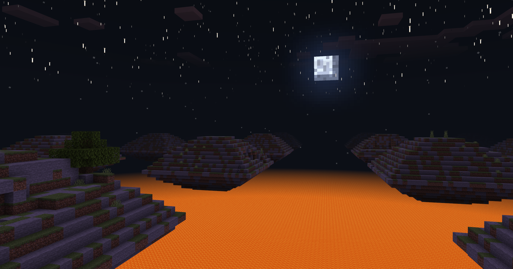
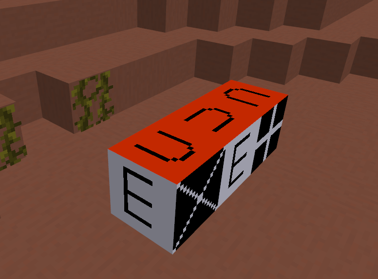
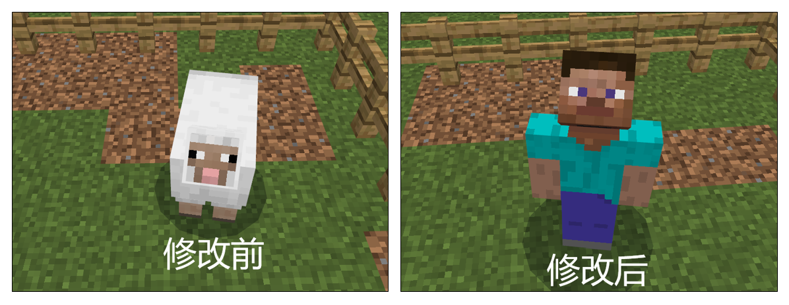

# 2.3 

2022.8.23: Version number (v2.3 BE1.18.0) 

Includes Mod PC package, mobile beta launcher, and server engine. 

- Warm reminder 

On August 23, the first beta version of 2.3 was launched. 

On September 6, the second beta version of 2.3 was launched. 

On September 15, the stable version of 2.3 was launched. 

On September 23, all channels will update the 2.3 version player package, and players will be updated to 2.3 version one after another. Developers are requested to arrange the update rhythm reasonably. 

Download [2.3 Demo](https://g79.gdl.netease.com/2.3DemoV2.zip). 

## Introduction to new major features 

### 1. Custom terrain height 

Two new height control nodes have been added. Developers can configure them in the biome configuration file to flexibly control the height of terrain at different locations in the specified biome. 
For example, the following figure is the effect achieved using the new version of the fill node. 
For details, please refer to <a href="../../../mcguide/20-Gameplay Development/15-Custom Game Content/4-Custom Dimensions/2-Biomorphology.html#5. Custom Biome Height (NetEase Version)">This document</a>. 

 

### 2. Support skeleton model to connect Microsoft particles 

For details, please see [Microsoft particle interface](../interface/special effects/Microsoft particles.md#bindmodel) 

 

### 3. Colormap supports the specified face of the block 

For details, please refer to <a href="../../../mcguide/20-Gameplay Development/15-Custom Game Content/2-Custom Blocks/2-Functions.html#Custom Blocks and Custom Block Models' Biome Color">This document</a>. 

 

### 4. Entity supports interface settings for meshes and textures 

For details, see [Entity Interface](../Interface/Entity/Rendering.md#AddActorGeometry) 

 

## API Changes

### New 

1. Added [PlayHudHeartBlinkAnim](../Interface/Native UI.md#playhudheartblinkanim)(Client), plays the animation of the original version's health change when it is injured<!--by wangjian18--> 

2. Added [SetPlayerUIItem](../Interface/Block/Container.md#setplayeruiitem)(Server), sets the item of the synthesis container<!--by wangdingdong--> 

3. Added [AddActorGeometry](../Interface/Entity/Rendering.md#addactorgeometry)(Client), adds biological rendering geometry<!--by wangdingdong--> 

4. Added [RemoveActorGeometry](../Interface/Entity/Rendering.md#removeactorgeometry)(Client), deletes biological rendering geometry<!--by wangdingdong--> 

5. Added [AddActorTexture](../Interface/Entity/Rendering.md#addactortexture)(Client), added biological rendering texture<!--by wangdingdong--> 

6. Added [RemoveActorTexture](../Interface/Entity/Rendering.md#removeactortexture)(Client), deleted biological rendering texture<!--by wangdingdong--> 

7. Added [SetPlayerItemInHandVisible](../Interface/Player/Rendering.md#setplayeriteminhandvisible)(Client), set whether to hide the player's handheld item model display<!--by xujiarong02--> 

8. Added [GetBlockTextures](../Interface/Block/Rendering.md#getblocktextures)(Client), got the initial texture information of the block<!--by wangdingdong--> 

9. Added [SetEmoteSwitch](../Interface/Native UI.md#setemoteswitch)(Client), Set the emoticon switch<!--by huangxiaojie03--> 

10. Added [BindModel](../Interface/Effects/Microsoft Particles.md#bindmodel)(Client), Bind the particle emitter to the skeleton model<!--by wangdingdong--> 

11. Added [GetBindingModleID](../Interface/Effects/Microsoft Particles.md#getbindingmodleid)(Client), Get the skeleton model id bound to the particle emitter<!--by wangdingdong--> 

12. Added [AchievementCompleteEvent](../Events/World.md#achievementcompleteevent)(Server), Player completes the custom achievement event<!--by cxz--> 

13. Added [AddPlayerCreatedClientEvent](../Event/World.md#addplayercreatedclientevent)(Client), added the event of resource loading completion after other players on the client enter the block AOI<!--by wdd--> 

### Adjustment 

1. Adjusted [GetPlayerList](../Interface/World/Entity Management.md#getplayerlist)(Server), returned the list sorted by id<!--by wdd--> 

2. Adjusted [SetAttrValue](../Interface/Entity/Attribute.md#setattrvalue)(Server), returned False when the set value exceeds the float representation range<!--by wangdingdong--> 

3. Adjusted [SetAttrMaxValue](../Interface/Entity/Attribute.md#setattrmaxvalue)(Server), returned False when the set value exceeds the float representation range<!--by wangdingdong--> 

4. Adjust [RegisterBlockPatterns](../Interface/World/Block Combination.md#registerblockpatterns)(Server), return False when there is already a synthesis with the same pattern and defines combination<!--by wdd--> 

5. Adjust [SetBlockNew](../Interface/World/Block Management.md#setblocknew)(Server), add parameter isLegacy, default is False, that is, use the state corresponding to the latest version of aux<!--by wdd--> 

6. Adjust [OnPlayerActiveShieldServerEvent](../Event/Item.md#onplayeractiveshieldserverevent)(Server), switch shield in stealth state will also trigger this event<!--by czh--> 

7. Adjust [StartRidingClientEvent](../Event/Entity.md#startridingclientevent)(Client), delete cancel parameter, when client triggers event, player has already mounted<!--by xusifan--> 

### Deprecated (will not be available in the future) 

1. Deprecated UnDefineEvent. DefineEvent is no longer required before listening to custom events, so there is no need to use UnDefineEvent 
