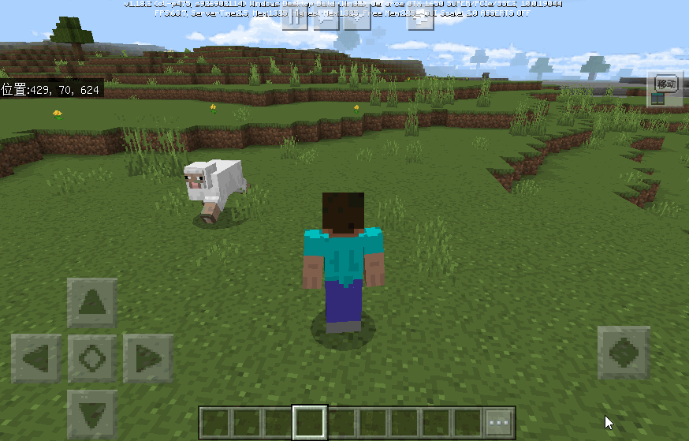
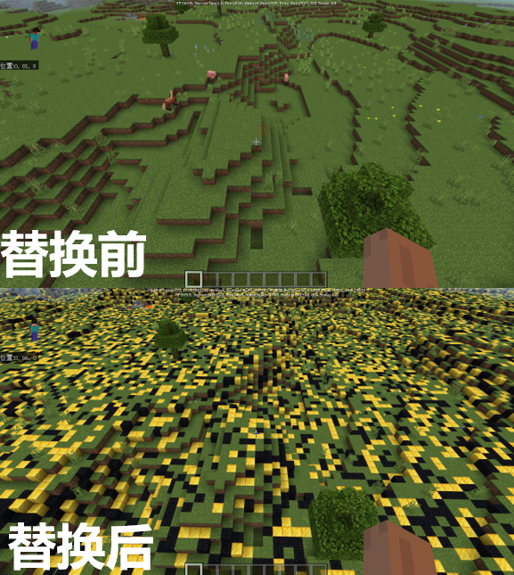
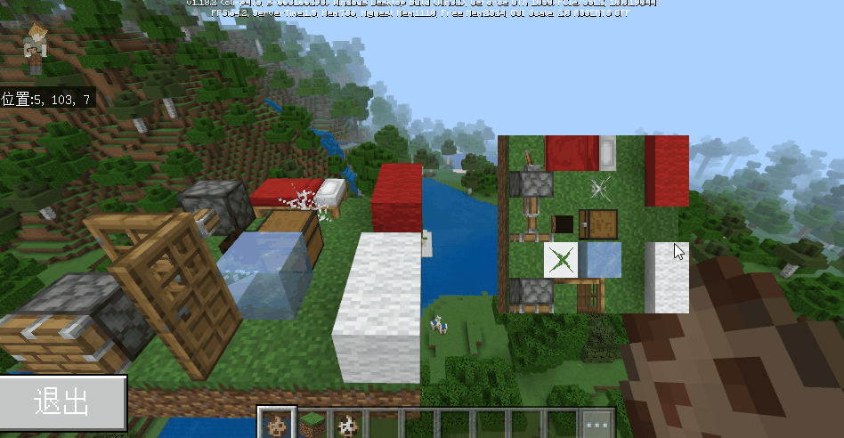

# 2.4 

2022.11.08: Version number (v2.4 BE1.18.0) 

Includes Mod PC package, mobile beta launcher, and server engine. 

### Tips 

1. On October 27, the first beta version of 2.4 will be launched. 

2. On November 8, the stable version of 2.4 will be launched. 

3. On November 25, all channels will update the 2.4 version player package, and players will be updated to 2.4 version one after another. Please arrange the update rhythm reasonably. 

4. Download [2.4 Demo](https://g79.gdl.netease.com/2.4DemoV4.zip). 

## Major Function Introduction 

### 1. Entity & Player Motion Device Interface 

Three different types of motion device interfaces have been added for entities and players, which can be used to control the motion trajectory of entities and players: 
1. Track Motion Device: used to drive entities and players to move in a straight line from one point to another. 

 

2. Velocity Motion Device: used to drive entities and players to move at a constant speed or variable speed according to initial velocity and acceleration. 

 

3. Orbit Motion Device: used to drive entities and players to move around specified coordinates or specified entities. 

 

For details, please refer to [Entity Motion Device Interface](../Interface/Entity/Behavior.md#addentitytrackmotion) and [Player Motion Device Interface](../Interface/Player/Behavior.md#addplayertrackmotion) 

### 2. Custom Terrain Height: Add Replacement Node 
A new height control node has been added: Replacement Node. Developers can configure it in the biome configuration file to flexibly control and replace blocks in the terrain. 
For example, the following figure is the effect achieved using the new version of the Replacement Node. 

For details, refer to <a href="../../../mcguide/20-Gameplay Development/15-Custom Game Content/4-Custom Dimensions/2-Biomorphology.html#5. Custom Biome Height (NetEase Version)">This document</a>. 

 

### 3. Supplement of native UI control interface 
1. Added a series of interfaces and added dynamic opening/closing support for native UI. For details, see interface [native UI](../interface/native UI.md)

2. Added an interface for getting and popping all UI stack tops, covering both custom UI and native UI types, see the interface [GetTopUI](../Interface/Custom UI/General.md#gettopui) for details 

### 4. UI supports rendering block meshes 
Added the [render block mesh model interface](../Interface/Custom UI/UI Control.md#renderblockgeometrymodel), which supports rendering block mesh data to UI, and can be used with paper doll controls to achieve drag and rotate effects. 

 

## API Changes 

### Added 

1. Added [HidePauseGUI](../Interface/Native UI.md#hidepausegui)(Client), Hide Pause Button Native UI<!--by hxj--> 

1. Added [HideChatGUI](../Interface/Native UI.md#hidechatgui)(Client), Hide Chat Button Native UI<!--by hxj--> 

1. Added [HideReportGUI](../Interface/Native UI.md#hidereportgui)(Client), Hide Report Button Native UI<!--by hxj--> 

1. Added [HideFoldGUI](../Interface/Native UI.md#hidefoldgui)(Client), Hide Drop-down Button Native UI<!--by hxj--> 

1. Added [HideEmoteGUI](../Interface/Native UI.md#hideemotegui)(Client), Open the emoticon interface<!--by hxj--> 

1. Added [HideVoiceGUI](../Interface/Native UI.md#hidevoicegui)(Client), Hide the native UI of the voice button<!--by hxj--> 

1. Added [GetTopUI](../Interface/Custom UI/General.md#gettopui)(Client), Get the UI name at the top of the UI stack, you can get the native UI or the UI generated by PushScreen<!--by cxz--> 

1. Added [PopTopUI](../Interface/Custom UI/General.md#poptopui)(Client), Pop up the UI at the top of the UI stack<!--by cxz--> 

1. Added [OpenPauseGui](../Interface/Native UI.md#openpausegui)(Client), Open the original pause interface<!--by hxj--> 

1. Added [OpenFoldGui](../Interface/Native UI.md#openfoldgui)(Client), Open the original drop-down interface<!--by hxj--> 

1. Added [OpenVoiceGui](../Interface/Native UI.md#openvoicegui)(Client), Open the original voice interface<!--by hxj--> 

1. Added [OpenReportGui](../Interface/Native UI.md#openreportgui)(Client), Open the original report interface<!--by hxj--> 

1. Added [OpenEmoteGui](../Interface/Native UI.md#openemotegui)(Client), Open the emoticon interface<!--by hxj--> 

1. Add [AddEntityTrackMotion](../Interface/Entity/Behavior.md#addentitytrackmotion)(Server), Add track motion to entity (excluding player)<!--by wangdingdong--> 

1. Add [AddEntityVelocityMotion](../Interface/Entity/Behavior.md#addentityvelocitymotion)(Server), Add velocity motion to entity (excluding player)<!--by wangdingdong--> 

1. Add [AddEntityAroundPointMotion](../Interface/Entity/Behavior.md#addentityaroundpointmotion)(Server), Add point-around motion to entity (excluding player)<!--by wangdingdong--> 

1. Add [AddEntityAroundEntityMotion](../Interface/Entity/Behavior.md#addentityaroundentitymotion)(Server), Add entity motion devices to entities (excluding players)<!--by wangdingdong--> 

1. Add [GetEntityMotions](../Interface/Entity/Behavior.md#getentitymotions)(Server), Get all motion devices on entities (excluding players)<!--by wangdingdong--> 

1. Add [RemoveEntityMotion](../Interface/Entity/Behavior.md#removeentitymotion)(Server), Remove motion devices on entities (excluding players)<!--by wangdingdong--> 

1. Added [StartEntityMotion](../Interface/Entity/Behavior.md#startentitymotion)(Server), Start a motion device on an entity (excluding players)<!--by wangdingdong--> 

1. Added [StopEntityMotion](../Interface/Entity/Behavior.md#stopentitymotion)(Server), Stop a motion device on an entity (excluding players)<!--by wangdingdong--> 

1. Added [AddPlayerTrackMotion](../Interface/Player/Behavior.md#addplayertrackmotion)(Server), Add a track motion device to the player<!--by wangdingdong--> 

1. Added [AddPlayerVelocityMotion](../Interface/Player/Behavior.md#addplayervelocitymotion)(Server), Add a velocity motion device to the player<!--by wangdingdong--> 

1. Added [AddPlayerAroundPointMotion](../Interface/Player/Behavior.md#addplayeraroundpointmotion)(Server), Add point-around motion to the player<!--by wangdingdong--> 

1. Added [AddPlayerAroundEntityMotion](../Interface/Player/Behavior.md#addplayeraroundentitymotion)(Server), Add entity-around motion to the player<!--by wangdingdong--> 

1. Added [GetPlayerMotions](../Interface/Player/Behavior.md#getplayermotions)(Server), Get all motions on the player<!--by wangdingdong--> 

1. Added [RemovePlayerMotion](../Interface/Player/Behavior.md#removeplayermotion)(Server), Remove the motion on the player<!--by wangdingdong--> 

1. Added [StartPlayerMotion](../Interface/Player/Behavior.md#startplayermotion)(Server), Start a motion device on the player<!--by wangdingdong--> 

1. Added [StopPlayerMotion](../Interface/Player/Behavior.md#stopplayermotion)(Server), Stop a motion device on the player<!--by wangdingdong--> 

1. Added [HideShopGate](../Interface/Shop.md#hideshopgate)(Client), Hide the entrance to NetEase Mall<!--by cxz--> 

1. Added [ShowShopGate](../Interface/Shop.md#showshopgate)(Client), Show the entrance to NetEase Mall<!--by cxz--> 

1. Added [OpenShopWindow](../Interface/Shop.md#openshopwindow)(Client), Open the NetEase Mall window<!--by cxz--> 

1. Add [OpenItemDetailWindow](../Interface/Mall.md#openitemdetailwindow)(Client), Open the details interface of a specific product<!--by cxz--> 

1. Add [CloseShopWindow](../Interface/Mall.md#closeshopwindow)(Client), Close the NetEase Mall window<!--by cxz--> 

1. Add [RenderBlockGeometryModel](../Interface/Custom UI/UI Control.md#renderblockgeometrymodel)(Client), Rendering mesh model<!--by jishaobin--> 

1. Add [EntityMotionStartServerEvent](../Event/Entity.md#entitymotionstartserverevent)(Server), Entity motion start event<!--by wangdingdong--> 

1. Added [EntityMotionStopServerEvent](../Event/Entity.md#entitymotionstopserverevent)(Server), Entity motion stop event<!--by wangdingdong--> 

1. Added [UrgeShipEvent](../Event/UI.md#urgeshipevent)(Server), This event is triggered when the player clicks the mall urges shipment button<!--by cxz--> 

1. Added [InputMode](../Enumeration Value/InputMode.md), Controller input mode<!--by cxz--> 

1. Added [UICategory](../Enumeration Value/UICategory.md), Native UI type name<!--by cxz--> 

### Adjustment 

1. Adjusted [GetItemBasicInfo](../Interface/Item.md#getitembasicinfo)(Server), Added fuel time, food satiety, food nutritional value, weapon attack power, armor defense power fields<!--by huangxiaojie03--> 

1. Adjusted [GetItemBasicInfo](../Interface/Item.md#getitembasicinfo)(client), added fuel time, food satiety, food nutritional value, weapon attack power, armor defense power fields<!--by huangxiaojie03--> 

1. Adjusted [ServerSpawnMobEvent](../Event/World.md#serverspawnmobevent)(server), added entityId return parameter<!--by cxz--> 

1. Adjust [AddPlayerCreatedClientEvent](../event/world.md#addplayercreatedclientevent)(client), adjust the event triggering time, and also take effect on localPlayer<!--by wangdingdong--> 

