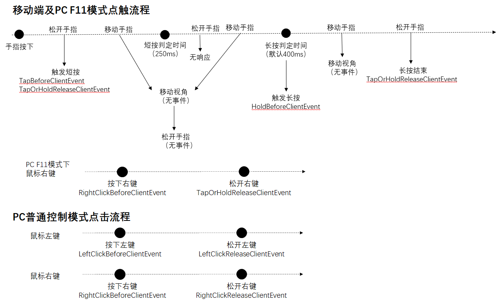

--- 
sidebarDepth: 1 
--- 
# Control 

# Index 

| Event | 

 | Description | 
| --- | --- | --- | 
| [ClientJumpButtonPressDownEvent](control.md#clientjumpbuttonpressdownevent) | Client | Jump button press event, return value setting parameters only work for the current press event | 
| [ClientJumpButtonReleaseEvent](control.md#clientjumpbuttonreleaseevent) | Client | Jump button press release event | 
| [GetEntityByCoordEvent](control.md#getentitybycoordevent) | Client | Triggered when the player clicks the screen. When multiple fingers are on the screen, only the first one will be triggered. | 
| [GetEntityByCoordReleaseClientEvent](control.md#getentitybycoordreleaseclientevent) | Client | Triggered when the player releases the screen after clicking it. When multiple fingers are on the screen, only the last finger is released. | 
| [HoldBeforeClientEvent](control.md#holdbeforeclientevent) | Client | Triggered when the player long presses the screen and is about to respond to the game. Triggered only in F11 mode on mobile or PC. In non-F11 mode of PC, you can use the RightClickBeforeClientEvent event to listen to the right mouse button. | 
| [LeftClickBeforeClientEvent](control.md#leftclickbeforeclientevent) | Client | Triggered when the player presses the left mouse button. Only triggered in the normal control mode of PC (ie non-F11 mode). | 
| [LeftClickReleaseClientEvent](control.md#leftclickreleaseclientevent) | Client | Triggered when the player releases the left mouse button. Only triggered in the normal control mode of PC (ie non-F11 mode). | 
| [OnBackButtonReleaseClientEvent](control.md#onbackbuttonreleaseclientevent) | Client | Triggered when the back button (currently specifically the back button in the Android system navigation) is released | 
| [OnClientPlayerStartMove](control.md#onclientplayerstartmove) | Client | The mobile button is pressed to trigger the event. If you press another direction key while holding down one direction key, it will not be triggered a second time. | 
| [OnClientPlayerStopMove](control.md#onclientplayerstopmove) | Client | The mobile button is pressed and released to trigger the event. If you press multiple direction keys at the same time, you need to release all the direction keys to trigger the event | 
| [OnKeyPressInGame](control.md#onkeypressingame) | Client | Triggered when a key is pressed or released | 
| [RightClickBeforeClientEvent](control.md#rightclickbeforeclientevent) | Client | Triggered when the player presses the right mouse button. Only triggered on PC (both normal control mode and F11 mode). | 
| [RightClickReleaseClientEvent](control.md#rightclickreleaseclientevent) | Client | Triggered when the player releases the right mouse button. Only triggered in normal control mode (not F11 mode) on PC. Right-click under F11, pressing will trigger RightClickBeforeClientEvent, and releasing will trigger TapOrHoldReleaseClientEvent | 
| [TapBeforeClientEvent](control.md#tapbeforeclientevent) | Client | Triggered when the player clicks the screen and releases it, and the game is about to respond. Only triggered in F11 mode on mobile or PC. Non-F11 mode of PC can use LeftClickBeforeClientEvent event to listen to the left mouse button | 
| [TapOrHoldReleaseClientEvent](control.md#taporholdreleaseclientevent) | Client | Triggered when the player clicks the screen and releases it. Only triggered in F11 mode on mobile or PC. In non-F11 mode of PC, you can use LeftClickReleaseClientEvent and RightClickReleaseClientEvent events to monitor mouse release | 
# Control 

## ClientJumpButtonPressDownEvent 

Client 

- Description 

Jump button press event, the return value setting parameter only works for the current press event 

- Parameters 

| Parameter name | 
Data type
 | Description | 
| :--- | :--- | :--- | 
| continueJump | bool | Set whether to execute jump logic | 

- Return value 

None 

## ClientJumpButtonReleaseEvent 

Client 

- Description 

Jump button press and release event 

- Parameters 

None 

- Return value 

None 

## GetEntityByCoordEvent 

Client 

- Description 

Triggered when the player clicks the screen. When multiple fingers are on the screen, only the first one will be triggered. 

- Parameters 

None 

- Return value 

None 

## GetEntityByCoordReleaseClientEvent 

Client 

- Description 

Triggered when the player releases the screen after clicking it. When multiple fingers are on the screen, only the last finger is released. 

- Parameters 

None 

- Return value 

None 

## HoldBeforeClientEvent 

Client 

- Description 

Triggered when the player long presses the screen and is about to respond to the game. Only triggered in F11 mode on mobile or PC. In non-F11 mode of PC, you can use the RightClickBeforeClientEvent event to listen to the right mouse button 

- Parameters 

| Parameter name | 
Data type
 | Description | 
| :--- | :--- | :--- | 
| cancel | bool | Set to True to intercept the original version of digging blocks/using items/interacting with entities | 

- Return value 

None 

- Remarks 
- The processing order of players long pressing the screen is: 
1. The player clicks the screen and does not drag or release the hand within the long press judgment time (the default is 400 milliseconds, which can be modified through the SetHoldTimeThreshold interface) 
2. Trigger the event 
3. If the event is not canceled, dig blocks/use items/interact with entities and other operations are performed according to the items in the main hand, the type of object at the crosshairs, and the distance from the player 
That is, this event will only be triggered once at the moment of reaching the long press judgment time. If you keep pressing it, it will not be triggered continuously. You can use TapOrHoldReleaseClientEvent to listen for releasing after long pressing. 
- Similar to the TapBeforeClientEvent event, it is captured by the UI layer, and clicks that do not penetrate the world will not trigger this event. 

## LeftClickBeforeClientEvent 

Client 

- Description 

Triggered when the player presses the left mouse button. Only triggered in the normal control mode of the PC (that is, non-F11 mode). 

- Parameters 

| Parameter name | 
Data type
 | Description | 
| :--- | :--- | :--- | 
| cancel | bool | Set to True to intercept the original version of mining blocks or attack responses | 

- Return value 

None 

## LeftClickReleaseClientEvent 

Client 

- Description 

Triggered when the player releases the left mouse button. Only triggered in the normal control mode of the PC (ie non-F11 mode). 

- Parameters 

None 

- Return value 

None 

## OnBackButtonReleaseClientEvent 

Client 

- Description 

Triggered when the back button (currently specifically the back button in the Android system navigation) is released 

- Parameters 

None 

- Return value 

None 

- Notes 
- Currently only available on the Android platform 

## OnClientPlayerStartMove 

Client 

- Description 

The move button press triggers the event. If you press another direction key while holding down one direction key, it will not be triggered a second time 

- Parameters 

None 

- Return value

None 

## OnClientPlayerStopMove 

Client 

- Description 

The event is triggered when the move button is pressed and released. If multiple direction keys are pressed at the same time, all direction keys need to be released to trigger the event 

- Parameters 

None 

- Return value 

None 

## OnKeyPressInGame 

Client 

- Description 

Triggered when a key is pressed or released 

- Parameters 

| Parameter name | 
Data type
 | Description | 
| :--- | :--- | :--- | 
| screenName | str | Current screenName | 
| key | str | Key code (Note: the int type here is converted to str type, for example, "1" corresponds to 1 in the enumeration value document), see [KeyBoardType enumeration](../enumeration value/KeyBoardType.md)| | 
| isDown | str | Whether it is pressed, 1 for pressed, 0 for popped up | 

- Return value 

None 

## RightClickBeforeClientEvent 

Client 

- Description

Fired when the player presses the right mouse button. Only fires on PC (both normal control mode and F11 mode). 

- Parameters 

| Parameter name | 
Data type
 | Description | 
| :--- | :--- | :--- | 
| cancel | bool | Set to True to intercept the original item use/entity interaction response | 

- Return value 

None 

## RightClickReleaseClientEvent 

Client 

- Description 

Fired when the player releases the right mouse button. Only fires in normal control mode (not F11 mode) on PC. Right-click under F11, pressing will trigger RightClickBeforeClientEvent, and releasing will trigger TapOrHoldReleaseClientEvent 

- Parameters 

None 

- Return value 

None 

- Remarks 
- For the mouse click process in the normal control mode of PC, see the picture in the [TapOrHoldReleaseClientEvent](#taporholdreleaseclientevent) note 

## TapBeforeClientEvent 

Client 

- Description 

Triggered when the player clicks the screen and releases it, and the game is about to respond. Triggered only in F11 mode on mobile or PC. The non-F11 mode of PC can use the LeftClickBeforeClientEvent event to monitor the left mouse button 

- Parameters 

| Parameter name | 
Data type
 | Description | 
| :--- | :--- | :--- | 
| cancel | bool | Set to True to intercept the original attack or placement response | 

- Return value 

None 

- Notes 
- The order of processing when a player clicks the screen is: 
1. The player clicks the screen without dragging and releases the hand within the short press judgment time (250 milliseconds) 
2. The event is triggered 
3. If the event is not canceled, the attack or placement operation is performed according to the type of object at the crosshair and the distance from the player 
- Unlike the GetEntityByCoordEvent event, clicks that are captured by the UI layer and do not penetrate the world will not trigger the event, for example: 
1. Click the original move/jump button, 
2. Block the game operation through SetIsHud(0) 
3. When using the AddTouchEventHandler interface for the button, the isSwallow parameter is set to True 

## TapOrHoldReleaseClientEvent 

Client 

- Description 

Triggered when the player releases the hand after clicking the screen. Triggered only in F11 mode on mobile or PC. In non-F11 mode on PC, you can use LeftClickReleaseClientEvent and RightClickReleaseClientEvent events to listen for mouse release 

- Parameters 

None 

- Return value 

None 

- Notes 
- This event will be triggered when releasing the hand after a short or long press 
- See the figure below for the touch flow in F11 mode on mobile and PC 
 

