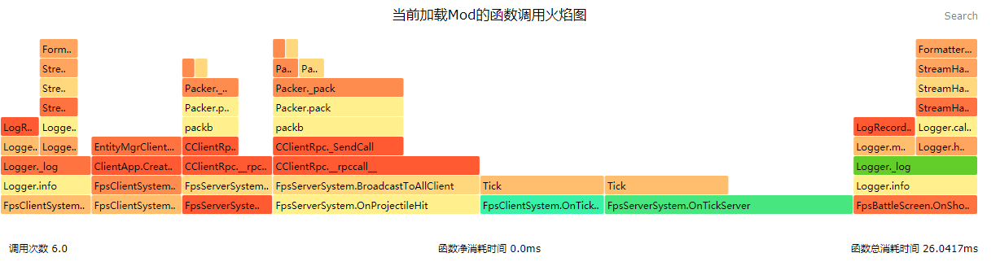

--- 
sidebarDepth: 1 
--- 
# Debug 

## GetEnableReconnectNetgame 

<span style="display:inline;color:#7575f9">Client</span> 

method in mod.client.extraClientApi 

- Description 

Get whether to allow reconnection after disconnection 

- Parameters 

None 

- Return value 

| <div style="width: 4em">Data type</div> | Description | 
| :--- | :--- | 
| bool | Whether to allow reconnection after disconnection | 

- Example 

```python 
import mod.client.extraClientApi as clientApi 
clientApi.GetEnableReconnectNetgame() 
``` 

## GetKeepResourceWhenTransfer 

<span style="display:inline;color:#7575f9">Client</span> 

method in mod.client.extraClientApi 

- Description 

Get quick server switching settings 

- Parameters 

None 

- Return value 


| <div style="width: 4em">Data type</div> | Description | 
| :--- | :--- | 
| bool | Whether to set fast server switching | 

- Example 

```python 
# Turn on the fast server switching switch first 
import mod.client.extraClientApi as clientApi 
print clientApi.GetKeepResourceWhenTransfer() 
``` 

## GetResourceFastload 

<span style="display:inline;color:#7575f9">Client</span> 

method in mod.client.extraClientApi 

- Description 

Get resource fast loading settings 

- Parameters 

None 

- Return value 

| <div style="width: 4em">Data type</div> | Description | 
| :--- | :--- | 
| bool | Whether to turn on resource fast loading | 

- Example 

```python 
import mod.client.extraClientApi as clientApi 
print clientApi.GetResourceFastload() 
``` 

## ReloadAllMaterials 

<span style="display:inline;color:#7575f9">Client</span> 

method in mod.client.extraClientApi 

- Description


    Reload all material files 

- Parameters 

None 

- Return value 

| <div style="width: 4em">Data type</div> | Description | 
| :--- | :--- | 
| bool | Success | 

- Example 

```python 
import mod.client.extraClientApi as clientApi 
clientApi.ReloadAllMaterials() 
``` 

## ReloadAllShaders 

<span style="display:inline;color:#7575f9">Client</span> 

method in mod.client.extraClientApi 

- Description 

Reload all Shader files 

- Parameters 

None 

- Return value 

| <div style="width: 4em">Data type</div> | Description | 
| :--- | :--- | 
| bool | Success | 

- Notes 
- If the material is modified, it is recommended to use the ReloadAllMaterials method. 

- Example 

```python 
import mod.client.extraClientApi as clientApi 
clientApi.ReloadAllShaders()

``` 

## ReloadOneShader 

<span style="display:inline;color:#7575f9">Client</span> 

method in mod.client.extraClientApi 

- Description 

Reload a shader file 

- Parameters 

| Parameter name | <div style="width: 4em">Data type</div> | Description | 
| :--- | :--- | 
| shaderName | str | shader name | 

- Return value 

| <div style="width: 4em">Data type</div> | Description | 
| :--- | :--- | 
| bool | Success | 

- Notes 
- If multiple shaders are modified at the same time, it is recommended to use the ReloadAllShaders method. 

- Example 

```python 
import mod.client.extraClientApi as clientApi 
clientApi.ReloadOneShader("entity.fragment") 
``` 

## SetEnableReconnectNetgame 

<span style="display:inline;color:#7575f9">Client</span> 

method in mod.client.extraClientApi 

- Description 

Set whether to allow reconnection 

- Parameters 


| Parameter name | <div style="width: 4em">Data type</div> | Description | 
| :--- | :--- | :--- | 
| keep | bool | Whether to allow disconnection and reconnection | 

- Return value 

| <div style="width: 4em">Data type</div> | Description | 
| :--- | :--- | 
| bool | Whether successful | 

- Example 

```python 
import mod.client.extraClientApi as clientApi 
clientApi.SetEnableReconnectNetgame(True) 
``` 

## SetKeepResourceWhenTransfer 

<span style="display:inline;color:#7575f9">Client</span> 

method in mod.client.extraClientApi 

- Description 

Set fast server switching 

- Parameters 

| Parameter name | <div style="width: 4em">Data type</div> | Description | 
| :--- | :--- | :--- | 
| keep | bool | Whether to keep resources when switching servers, True means to keep resources, False means not to keep resources | 

- Return value 

| <div style="width: 4em">Data type</div> | Description | 
| :--- | :--- | 
| bool | Success | 

- Remarks 
- Fast server switching is achieved by keeping resources when switching servers, which can shorten the waiting time for server switching. 
- The two servers before and after the server switching need to ensure that the resources are exactly the same, that is, the server type is consistent. 
- The fast server switching setting is valid until you exit the game. If you want to switch to another type of server, you need to call clientApi.SetKeepResourceWhenTransfer(False) before switching servers 

- Example 

```python 
# Turn on the fast server switching switch first

import mod.client.extraClientApi as clientApi 
clientApi.SetKeepResourceWhenTransfer(True) 

# Then switch servers 
import lobbyGame.netgameApi as lobbyGameApi 
lobbyGameApi.TransferToOtherServer('123', 'game') 
``` 

## SetResourceFastload 

<span style="display:inline;color:#7575f9">Client</span> 

method in mod.client.extraClientApi 

- Description 

Set resource fast loading 

- Parameters 

| Parameter name | <div style="width: 4em">Data type</div> | Description | 
| :--- | :--- | :--- | 
| fastload | bool | Whether to fast load resources when entering the game, True means fast loading resources, False means not fast loading resources | 

- Return value 

| <div style="width: 4em">Data type</div> | Description | 
| :--- | :--- | 
| bool | Success | 

- Notes 
- Turning on fast resource loading can shorten the server switching waiting time. 
- Turning on fast resource loading will make the server switching slower than setting SetKeepResourceWhenTransfer, but it does not require that the resources of the two servers before and after the server switching are completely consistent. 
- Custom textures for items and blocks need to be defined in item_texture.json and terrain_texture.json to enable fast resource loading 
- Set fast resource loading to be valid until you exit the game, and automatically restore to False after exiting the game 

- Example 

```python 
# Set fast resource loading first 
import mod.client.extraClientApi as clientApi 
clientApi.SetResourceFastload(True) 

# Then switch servers 
import lobbyGame.netgameApi as lobbyGameApi 
lobbyGameApi.TransferToOtherServer('123', 'game') 
``` 


## StartMemProfile 

<span style="display:inline;color:#ff5555">Server</span><span style="display:inline;color:#7575f9">Client</span> 

### Server interface 

<span id="s0"></span> 
method in mod.server.extraServerApi 

- Description 

Start the server script memory analysis. After starting, call [StopMemProfile](#stopMemProfile) to generate the function memory flame graph in the path fileName. This interface only supports PC. The generated flame graph can be opened with a browser. Chrome browser is recommended. 

- Parameters 

None 

- Return value 

| <div style="width: 4em">Data type</div> | Description | 
| :--- | :--- | 
| bool | Execution result | 

- Notes 
- Since the analysis does not distinguish between the server and the client, when performing the analysis, only one end needs to startmemprofile and stopmemprofile, and there is no need to perform both ends at the same time. 
- When you put the mouse on a function block, the detailed information corresponding to the current function will be displayed below. For specific meanings, see <a href="../../../../mcguide/27-网络游戏/课5：实用知识/第6：插插调试小技巧.html#获取PerformanceAnalysisFlameGraph">GetPerformanceAnalysisFlameGraph</a> 

- Example 

```python 
import mod.server.extraServerApi as serverApi 
serverApi.StartMemProfile() 
modfunc()# Process the corresponding logic 
# Then call StopMemProfile through a timer or other triggering method 
serverApi.StopMemProfile(fileName) 
``` 

### Client interface 

<span id="c0"></span> 
method in mod.client.extraClientApi 

- Description 

Start the client script memory analysis. After starting, call [StopMemProfile](#stopMemProfile) to generate the function memory flame graph in the path fileName. This interface only supports PC. The generated flame graph can be opened with a browser. Chrome browser is recommended. 


- Parameters 

None 

- Return value 

| <div style="width: 4em">Data type</div> | Description | 
| :--- | :--- | 
| bool | Execution result | 

- Notes 
- Since the analysis does not distinguish between the server and the client, when performing the analysis, only one end needs to startmemprofile and stopmemprofile, and there is no need to perform both ends at the same time. 
- When you put the mouse on a function block, the detailed information corresponding to the current function will be displayed below. For specific meanings, see <a href="../../../../mcguide/27-网络游戏/课5：实用知识/第6：插插调试小技巧.html#获取PerformanceAnalysisFlameGraph">GetPerformanceAnalysisFlameGraph</a> 

- Example 

```python 
import mod.client.extraClientApi as clientApi 
clientApi.StartMemProfile() 
modfunc()# Process the corresponding logic 
# Then call StopMemProfile through a timer or other triggering method 
clientApi.StopMemProfile(fileName) 
``` 

## StartMultiProfile 

<span style="display:inline;color:#ff5555">Server</span><span style="display:inline;color:#7575f9">Client</span> 

### Server interface 

<span id="s0"></span> 
method in mod.server.extraServerApi 

- Description 

Start the server and client script performance analysis. After starting, call [StopMultiProfile](#stopmultiprofile) to generate the function performance flame graph in the path fileName. The data error is large when collecting data from both ends. It is recommended to use the single-end version of [StartProfile](#startprofile) first. This interface only supports PC. 

- Parameters 

None 

- Return value 

| <div style="width: 4em">Data type</div> | Description | 
| :--- | :--- | 
| bool | Execution result | 

- Example


```python 
import mod.server.extraServerApi as serverApi 
serverApi.StartMultiProfile() 
modfunc()# Process the corresponding logic 
# Then call StopMultiProfile through a timer or other triggering method 
serverApi.StopMultiProfile() 
``` 

### Client interface 

<span id="c0"></span> 
method in mod.client.extraClientApi 

- Description 

Start the server-side and client-side script performance analysis. After starting, call [StopMultiProfile](#stopmultiprofile) to generate a function performance flame graph in the path fileName. The data error is large when collecting data from both ends. It is recommended to use the single-end version of [StartProfile](#startprofile) first. This interface only supports the PC end. 

- Parameters 

None 

- Return value 

| <div style="width: 4em">Data type</div> | Description | 
| :--- | :--- | 
| bool | Execution result | 

- Example 

```python 
import mod.client.extraClientApi as clientApi 
clientApi.StartMultiProfile() 
modfunc()# Process the corresponding logic 
# Then call StopMultiProfile through a timer or other trigger method 
clientApi.StopMultiProfile() 
``` 

## StartProfile 

<span style="display:inline;color:#ff5555">Server</span><span style="display:inline;color:#7575f9">Client</span> 

### Server interface 

<span id="s0"></span> 
method in mod.server.extraServerApi


- Description 

Start the server script performance analysis. After starting, call [StopProfile](#stopprofile) to generate the function performance flame graph in the path fileName. This interface only supports PC. The generated flame graph can be opened with a browser. Chrome browser is recommended. 

- Parameters 

None 

- Return value 

| <div style="width: 4em">Data type</div> | Description | 
| :--- | :--- | 
| bool | Execution result | 

- Notes 
- Flame graph main page example: <br> 
- As shown in the flame graph, the vertical direction represents the call stack, and each layer is a function. The deeper the call stack, the higher the flame. The top is the function being executed, and the bottom is its parent function. When analyzing performance, we mainly look at the width of the flame graph (the color has no special meaning). The wider the flame graph, the greater the consumption of the function on the overall performance. Therefore, the function needs to be optimized. 
- When you put the mouse on a function block, the detailed information corresponding to the current function will be displayed below. The specific meaning can be seen in <a href="../../../../mcguide/27-网络游戏/课5：实用知识/第6：插插调试小技巧.html#获取PerformanceAnalysisFlameGraph">获取PerformanceAnalysisFlameGraph</a> 
- The core of optimization is mainly to reduce the number of calls and optimize the writing of functions. For developers, they only need to pay attention to the code developed by the developers. For some functions that call the mod framework or the top-level framework of the engine and cause large performance consumption, you can try to optimize by reducing the number of calls. 
- In addition, the flame graph supports searching for function keywords through the Search box in the upper right corner or the "F3" shortcut key. At the same time, you can click on the function to zoom in and view the corresponding call stack. 

- Example 

```python 
import mod.server.extraServerApi as serverApi 
serverApi.StartProfile() 
modfunc()# Process the corresponding logic 
# Then call StopProfile through a timer or other triggering method 
serverApi.StopProfile() 
``` 

### Client interface 

<span id="c0"></span> 
method in mod.client.extraClientApi 

- Description 

Start the client script performance analysis. After starting, call [StopProfile](#stopprofile) to generate a function performance flame graph in the path fileName. This interface only supports PC. The generated flame graph can be opened with a browser. Chrome browser is recommended. 

- Parameters 

None 

- Return value 

| <div style="width: 4em">Data type</div> | Description |

| :--- | :--- | 
| bool | Execution result | 

- Notes 
- Example of the flame graph main page: <br> 
- As shown in the flame graph, the vertical direction represents the call stack, and each layer is a function. The deeper the call stack, the higher the flame. The top is the function being executed, and the bottom is its parent function. When analyzing performance, the width of the flame graph is mainly considered (the color has no special meaning). The wider the flame graph, the greater the consumption of the function on the overall performance. Therefore, the function needs to be optimized. 
- When you put the mouse on a function block, the detailed information corresponding to the current function will be displayed below. For specific meanings, see <a href="../../../../mcguide/27-网络游戏/课5：实用知识/第6：插插调试小技巧.html#获取PerformanceAnalysisFlameGraph">获取PerformanceAnalysisFlameGraph</a> 
- The core of optimization is to reduce the number of calls and optimize the writing of functions. For developers, you only need to pay attention to the code developed by the developer. For some functions that call the mod framework or the top-level framework of the engine and cause high performance consumption, you can try to optimize by reducing the number of calls. 
- In addition, the flame graph supports searching for function keywords through the Search box in the upper right corner or the "F3" shortcut key. At the same time, you can click on the function to zoom in and view the corresponding call stack. 
- Please remove the call of this interface when listing 

- Example 

```python 
import mod.client.extraClientApi as clientApi 
clientApi.StartProfile() 
modfunc()# Process the corresponding logic 
# Then call StopProfile through a timer or other triggering method 
clientApi.StopProfile() 
``` 

## StartRecordEvent 

<span style="display:inline;color:#ff5555">Only available in Apollo</span> 

method in mod.server.extraServerApi 

- Description 

Start the script event sending and receiving statistics between the server and the client. After starting, call [StopRecordEvent](#stoprecordevent) to obtain the statistical information of the script event sending and receiving between the two function calls. It only supports rental service and Apollo network service environment (not supported in stand-alone environment) 

- Parameters 

None 

- Return value 

| <div style="width: 4em">Data type</div> | Description | 
| :--- | :--- | 
| bool | Execution result | 

- Example 

```python 
import mod.server.extraServerApi as serverApi 
suc = serverApi.StartRecordEvent() 
# Then call StopRecordEvent through a timer or other triggering method 
result = serverApi.StopRecordEvent()

for eventName, data in result.iteritems(): 
print "event[{}] send={} sendSize={} recv={} recvSize={}".format(eventName, data["send_num"], data["send_size"], data["recv_num"], data["recv_size"]) 
``` 

## StartRecordPacket 

<span style="display:inline;color:#ff5555">Only available for Apollo</span> 

method in mod.server.extraServerApi 

- Description 

Start the statistics of engine packet reception and transmission between the server and the client. After starting, call [StopRecordPacket](#stoprecordpacket) to obtain the statistics of engine packet reception and transmission between the two function calls. Only supports rental service and Apollo network service environment (does not support stand-alone environment) 

- Parameters 

None 

- Return value 

| <div style="width: 4em">Data type</div> | Description | 
| :--- | :--- | 
| bool | Execution result | 

- Example 

```python 
import mod.server.extraServerApi as serverApi 
suc = serverApi.StartRecordPacket() 
# Then call StopRecordPacket through a timer or other trigger method 
result = serverApi.StopRecordPacket() 
for packetName, data in result.iteritems(): 
print "packet[{}] send={} sendSize={} recv={} recvSize={}".format(packetName, data["send_num"], data["send_size"], data["recv_num"], data["recv_size"]) 
``` 

## StopMemProfile 

<span style="display:inline;color:#ff5555">Server</span><span style="display:inline;color:#7575f9">Client</span> 

### Server interface 

<span id="s0"></span> 
method in mod.server.extraServerApi 

- Description 


Stop server script memory analysis and generate flame graph, used with [StartMemProfile](#startMemProfile), this interface only supports PC side 

- Parameters 

| Parameter name | <div style="width: 4em">Data type</div> | Description | 
| :--- | :--- | :--- | 
| fileName | str | Specific path, relative to the path of the PC development package, the default is "flamegraph.svg", located in the PC development package directory, for custom paths, please make sure the file suffix is ".svg" | 

- Return value 

| <div style="width: 4em">Data type</div> | Description | 
| :--- | :--- | 
| bool | Execution result | 

- Example 

```python 
import mod.server.extraServerApi as serverApi 
serverApi.StartMemProfile() 
modfunc()# Process the corresponding logic 
# Then call StopMemProfile through a timer or other triggering methods 
serverApi.StopMemProfile(fileName) 
``` 

### Client interface 

<span id="c0"></span> 
method in mod.client.extraClientApi 

- Description 

Stop client script memory analysis and generate flame graph, used with [StartMemProfile](#startMemProfile), this interface only supports PC side 

- Parameters 

| Parameter name | <div style="width: 4em">Data type</div> | Description | 
| :--- | :--- | :--- | 
| fileName | str | Specific path, relative to the path of the PC development package, the default is "flamegraph.svg", located in the PC development package directory, custom path, please make sure the file suffix is ".svg" | 

- Return value 

| <div style="width: 4em">Data type</div> | Description | 
| :--- | :--- | 
| bool | Execution result | 

- Example 

```python

import mod.client.extraClientApi as clientApi 
clientApi.StartMemProfile() 
modfunc()# Process the corresponding logic 
# Then call StopMemProfile through a timer or other triggering method 
clientApi.StopMemProfile(fileName) 
``` 

## StopMultiProfile 

<span style="display:inline;color:#ff5555">Server</span><span style="display:inline;color:#7575f9">Client</span> 

### Server interface 

<span id="s0"></span> 
method in mod.server.extraServerApi 

- Description 

Stop the dual-end script performance analysis and generate a flame graph. Used with [StartMultiProfile](#startmultiprofile). This interface only supports PC side 

- Parameters 

| Parameter name | <div style="width: 4em">Data type</div> | Description | 
| :--- | :--- | :--- | 
| fileName | str | Specific path, relative to the path of the PC development package, the default is "flamegraph.svg", located in the PC development package directory, for custom paths, please make sure the file suffix is ".svg" | 

- Return value 

| <div style="width: 4em">Data type</div> | Description | 
| :--- | :--- | 
| bool | Execution result | 

- Example 

```python 
import mod.server.extraServerApi as serverApi 
serverApi.StartMultiProfile() 
modfunc()# Process the corresponding logic 
# Then call StopMultiProfile through a timer or other trigger method 
serverApi.StopMultiProfile() 
``` 

### Client interface 

<span id="c0"></span>
method in mod.client.extraClientApi


- Description 

Stops dual-end script performance analysis and generates a flame graph. Used with [StartMultiProfile](#startmultiprofile). This interface only supports PC. 

- Parameters 

| Parameter name | <div style="width: 4em">Data type</div> | Description | 
| :--- | :--- | :--- | 
| fileName | str | Specific path, relative to the path of the PC development package, the default is "flamegraph.svg", located in the PC development package directory. For custom paths, make sure the file suffix is ".svg" | 

- Return value 

| <div style="width: 4em">Data type</div> | Description | 
| :--- | :--- | 
| bool | Execution result | 

- Example 

```python 
import mod.client.extraClientApi as clientApi 
clientApi.StartMultiProfile() 
modfunc()# Process the corresponding logic 
# Then call StopMultiProfile through a timer or other triggering methods 
clientApi.StopMultiProfile() 
``` 

## StopProfile 

<span style="display:inline;color:#ff5555">Server</span><span style="display:inline;color:#7575f9">Client</span> 

### Server interface 

<span id="s0"></span> 
method in mod.server.extraServerApi 

- Description 

Stop server script performance analysis and generate flame graph, used with [StartProfile](#startprofile), this interface only supports PC side 

- Parameters 

| Parameter name | <div style="width: 4em">Data type</div> | Description | 
| :--- | :--- | :--- | 
| fileName | str | The specific path is relative to the path of the PC development package. The default is "flamegraph.svg", which is located in the PC development package directory. For a custom path, please make sure the file suffix is ".svg" | 

- Return value 


| <div style="width: 4em">Data type</div> | Description | 
| :--- | :--- | 
| bool | Execution result | 

- Example 

```python 
import mod.server.extraServerApi as serverApi 
serverApi.StartProfile() 
modfunc()# Process the corresponding logic 
# Then call StopProfile through a timer or other triggering method 
serverApi.StopProfile() 
``` 

### Client interface 

<span id="c0"></span> 
method in mod.client.extraClientApi 

- Description 

Stop client script performance analysis and generate a flame graph. Used with [StartProfile](#startprofile). This interface only supports PC. 

- Parameters 

| Parameter name | <div style="width: 4em">Data type</div> | Description | 
| :--- | :--- | :--- | 
| fileName | str | Specific path, relative to the path of the PC development package, the default is "flamegraph.svg", located in the PC development package directory, for custom paths, please make sure the file suffix is ".svg" | 

- Return value 

| <div style="width: 4em">Data type</div> | Description | 
| :--- | :--- | 
| bool | Execution result | 

- Example 

```python 
import mod.client.extraClientApi as clientApi 
clientApi.StartProfile() 
modfunc()# Process the corresponding logic 
# Then call StopProfile through a timer or other trigger method 
clientApi.StopProfile() 
``` 

## StopRecordEvent


<span style="display:inline;color:#ff5555">Apollo only</span> 

method in mod.server.extraServerApi 

- Description 

Stop the script event sending and receiving statistics between the server and the client and output the results. Used in conjunction with [StartRecordEvent](#startrecordevent), the output result is a dictionary, the key is the network package name, and the value dictionary records the sending and receiving information. See the example for details. Only rental service and Apollo network service environment are supported (standalone environment is not supported) 

- Parameters 

None 

- Return value 

| <div style="width: 4em">Data type</div> | Description | 
| :--- | :--- | 
| dict | Send and receive package information. If StartRecordEvent has not been called, it will return None | 

- Example 

```python 
import mod.server.extraServerApi as serverApi 
suc = serverApi.StartRecordEvent() 
# Then call StopRecordEvent through a timer or other triggering method 
result = serverApi.StopRecordEvent() 
for eventName, data in result.iteritems(): 
print "event[{}] send={} sendSize={} recv={} recvSize={}".format(eventName, data["send_num"], data["send_size"], data["recv_num"], data["recv_size"]) 
``` 

## StopRecordPacket 

<span style="display:inline;color:#ff5555">Only available in Apollo</span> 

method in mod.server.extraServerApi 

- Description 

Stop the engine packet statistics between the server and the client and output the results. Used in conjunction with [StartRecordPacket](#startrecordpacket), the output result is a dictionary, the key is the network packet name, and the value dictionary records the sending and receiving information. See the example for details. It only supports rental services and Apollo network service environments (does not support stand-alone environments) 

- Parameters 

None 

- Return value 

| <div style="width: 4em">Data type</div> | Description | 
| :--- | :--- |

| dict | Packet information. If StartRecordPacket has not been called, None is returned. | 

- Example 

```python 
import mod.server.extraServerApi as serverApi 
suc = serverApi.StartRecordPacket() 
# Then call StopRecordPacket via a timer or other triggering method 
result = serverApi.StopRecordPacket() 
for packetName, data in result.iteritems(): 
print "packet[{}] send={} sendSize={} recv={} recvSize={}".format(packetName, data["send_num"], data["send_size"], data["recv_num"], data["recv_size"]) 
``` 

