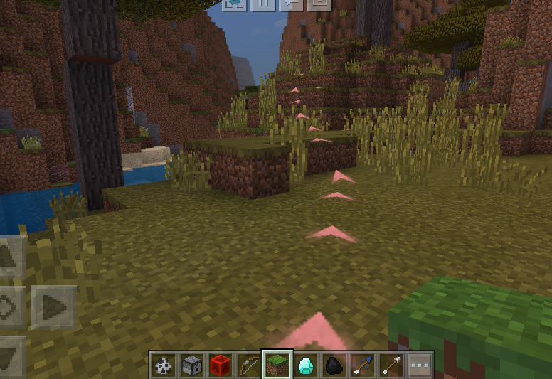

--- 
sidebarDepth: 1 
--- 
# Navigation 

## GetNavPath 

<span style="display:inline;color:#7575f9">Client</span> 

method in mod.client.extraClientApi 

- Description 

Get the path from the local player to the target point. Developers can customize the navigation system through this interface. 

- Parameters 

| Parameter name | <div style="width: 4em">Data type</div> | Description | 
| :--- | :--- | :--- | 
| pos | tuple(float,float,float) | Coordinates of the target point | 
| maxTrimNode | int | The maximum number of grids to try when smoothing the search path. Setting it too large will affect the pathfinding performance. Default value 16 | 
| maxIteration | int | The maximum number of iterations for A-star pathfinding. Default value 800 | 
| isSwimmer | bool | Whether the target point is in water. Default is False | 

- Return value 

| <div style="width: 4em">Data type</div> | Description | 
| :--- | :--- | 
| int or list(tuple(float,float,float)) | Return 1: Parameter error<br>Return 2: The chunk where the player is located has not been loaded<br>Return 3: The end point is a solid block and the path cannot be found<br>Return list(tuple(float,float,float),): A list of coordinate points from the start point to the end point. Note that the list may be empty, indicating that the local player is too far from the ground or is blocked and cannot move. | 

- Notes 
- After the pathfinding algorithm iterates a certain number of times (i.e., the value of maxIteration), if the target point is not found, the interface will return the **local optimal solution**, that is, the path of the point closest to the set target point in the set of currently searched points, but this path may be inaccurate or wrong (for example, the direction to the end point is a dead end). <br>This may occur in the following situations: the target point cannot be reached (surrounded, etc.), the chunk where the target point is located is not loaded, the target point is far away (but still within the chunk loading range) or the terrain is complex (for example, there is a long wall between the end point and the end point). 
- In the above cases, the situation where the target point is far away or the terrain is complex can be avoided by increasing the value of maxIteration, but this will also increase the client's lag. 
- If the end point is in the water, the isSwimmer parameter needs to be set to True, but it is not necessary if the route only passes through water. However, it should be noted that the pathfinding performance in the water is very low. When other parameters remain unchanged, the maximum path length calculated by a single pathfinding will be much smaller. 

## StartNavTo 

<span style="display:inline;color:#7575f9">Client</span> 

method in mod.client.extraClientApi 

- Description 

We provide a navigation system implementation based on GetNavPath, which generates sequence frames on the path to guide the player to the target point, and will re-navigate when the player deviates from the path. 

- Parameters 

| Parameter name | <div style="width: 4em">Data type</div> | Description |

| :--- | :--- | :--- | 
| pos | tuple(float,float,float) | Coordinates of the target point | 
| sfxPath | str | The path of the sequence frame material that constitutes the navigation path. The style can refer to the arrow pointing up | 
| callback | function | The **callback function** that will be called when the player reaches the end. This function needs to accept a bool parameter. | 
| sfxIntl | float | The interval between two adjacent sequence frames. Default value 2 | 
| sfxMaxNum | int | The maximum number of sequence frames that exist at the same time. Default value 16 | 
| sfxScale | tuple(float,float) | The scale of the width and height of the sequence frame. Default value is (0.5, 0.5) | 
| maxIteration | int | The maximum number of iterations of A-star pathfinding. Default value 800 | 
| isSwimmer | bool | Whether the target point is in water. The default value is False | 
| fps | int | Sequence frame rate, the default value is 20, and it is not recommended to exceed 30 | 
| playIntl | int | The interval between adjacent sequence frames in one round, the default value is 8 frames, and it must not be less than 0, otherwise the default value will be used | 
| duration | int | The number of frames for a single sequence frame to be played continuously, the default value is 60 frames, and it must not be less than 10, otherwise the default value will be used | 
| oneTurnDuration | int | The playback interval (frames) between two rounds of sequence frames, the default value is 90 frames, and it must be at least 1.5 times of duration, otherwise it will be calculated as 1.5 * duration | 
| sfxDepthTest | bool | Whether the sequence frame opens depth detection, the default value is False, and the sequence frame will be blocked by the scene when it is set to True | 

- Return value 

| <div style="width: 4em">Data type</div> | Description | 
| :--- | :--- | 
| int | Return 0: Navigation starts normally<br>Return -1: The local player is too far away from the ground or is blocked and cannot move<br>Return 1: Parameter error<br>Return 2: The chunk where the player is located has not been loaded<br>Return 3: The end point is a solid block and the path cannot be found | 

- Notes 
- After the pathfinding algorithm iterates a certain number of times (that is, the value of maxIteration), if the target point is not found, the interface will return the **local optimal solution**, that is, the path of the point closest to the set target point in the set of currently searched points, but this path may be inaccurate or wrong (for example, the direction to the end point is a dead end). <br>This may occur in the following situations: the target point cannot be reached (surrounded, etc.), the chunk where the target point is located is not loaded, the target point is far away (but still within the block loading range) or the terrain is complex (for example, there is a long wall between the end point and the target point). 
- In the above cases, the situation where the target point is far away or the terrain is complex can be avoided by increasing the value of maxIteration, but this will also increase the client's lag. 
- If the destination is in the water, the isSwimmer parameter needs to be set to True, but it is not necessary if the route only passes through water. However, it should be noted that the pathfinding performance in the water is very low. When other parameters remain unchanged, the maximum path length calculated by a single pathfinding will be much smaller. 
- The callback function accepts a bool parameter. When the parameter is True, it means that the player has reached the vicinity of the destination, but it does not mean that the navigation is over. If the player leaves the destination again, the navigation system will try to navigate again, and the developer needs to manually call stop navigation at a certain time (refer to [StopNav interface](navigation.md#StopNav)). When the parameter is False, it means that the player has deviated from the route and reached a state where the destination cannot be reached (that is, those cases where the return value is not 0), in which case the navigation will automatically terminate. 
```python 
# An example of a callback function that stops navigation when reaching the destination 
from mod_log import logger as logger 
def myCallback(result): 
if result: 
extraClientApi.StopNav() 
else: 
logger.info('something happened in navigation') 
# If the destination is far away, a callback function example for segmented navigation is required 
def myCallback2(result): 
if result: 
if GetDistence(localplayerPos, destinationPos) < sfxIntl*2: 
extraClientApi.StopNav() 
else: 
extraClientApi.StartNavTo(destinationPos, ...) 
else: 
logger.info('something happened in navigation') 
``` 
- If the previous navigation is not completed, calling it again will overwrite the previous navigation 
- Example of navigation effect using default parameters: <br> 

## StopNav


<span style="display:inline;color:#7575f9">Client</span> 

method in mod.client.extraClientApi 

- Description 

Terminate the current navigation 

- Parameters 

None 

- Return value 

None 

