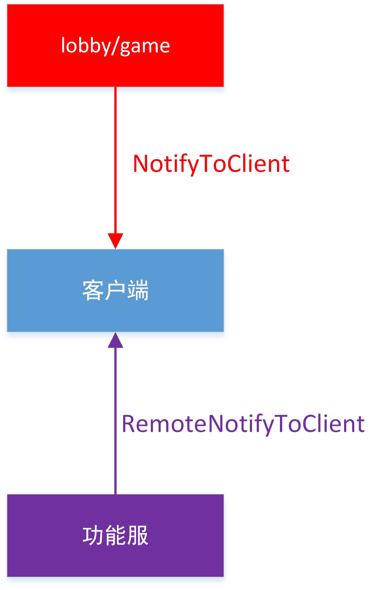
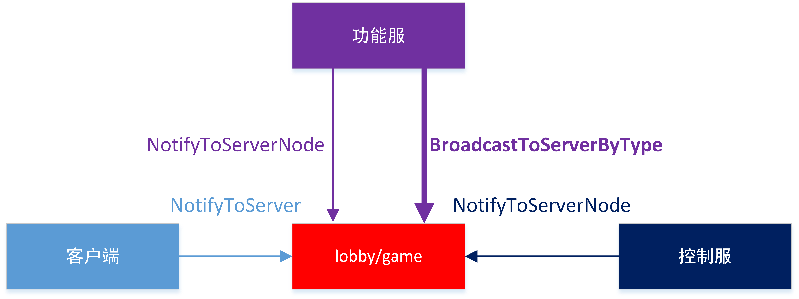
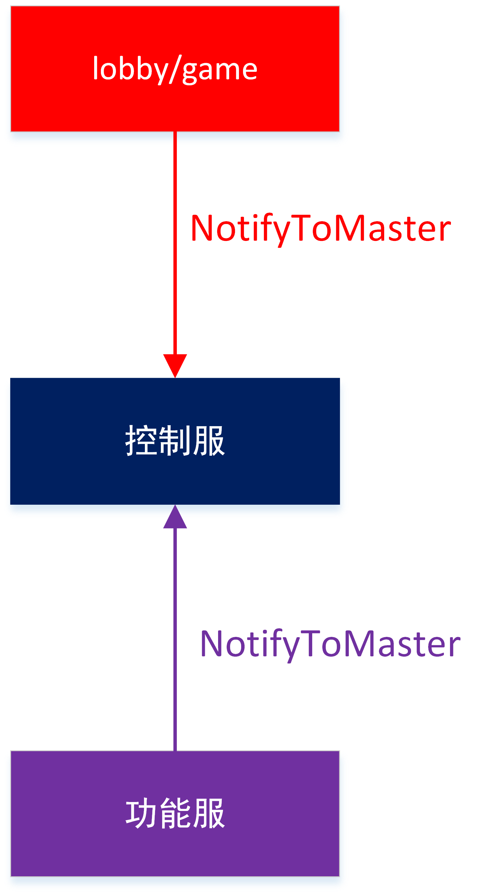
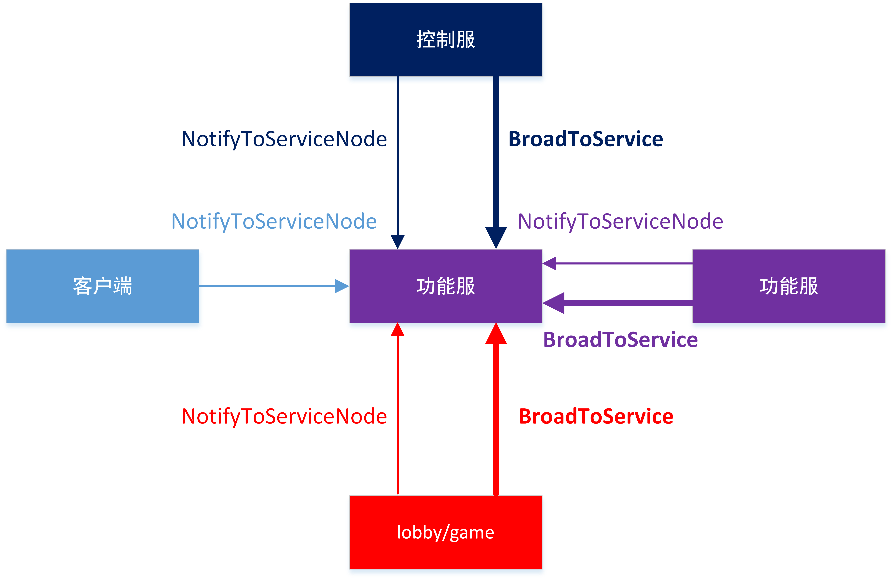
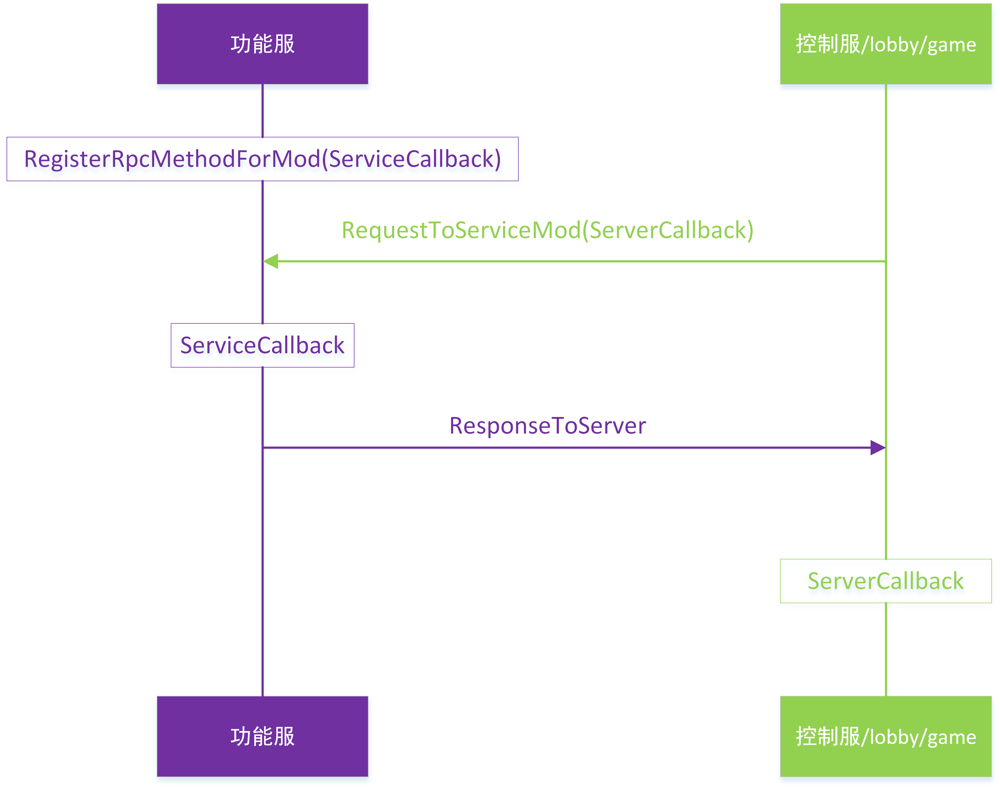

--- 
sidebarDepth: 1 
--- 

# <span id="8-Server communication"></span>8-Server communication 

### Communication interface diagram 

The communication interface diagram is as follows 

The thin arrow is a single-point message, and the thick arrow is a broadcast message 

#### Client communication interface 

The interface for sending messages to the client is as follows 

 

#### lobby/game communication interface 

The interface for sending messages to lobby/game is as follows 

 

#### Control server communication interface 

The interface for sending messages to the control server is as follows 

 

#### Functional service communication interface 

The interface for sending messages to the functional service is as follows 

 

#### Functional service RPC call process 

1. **Functional service** calls `RegisterRpcMethodForMod` to register the RPC call and sets the callback function to `ServiceCallback` 
2. **Control service/lobby/game** calls `RequestToServiceMod` to trigger the RPC call and sets the callback function to `ServerCallback` 
3. **Functional service** executes `ServiceCallback` 
4. **Functional service** sends a response message to **Control service/lobby/game**

5. **Control server/lobby/game**Execute callback `ServerCallback`

The process is as follows


Apollo communication related API.

<span id="client and game/lobby communication"></span> 
### client and game/lobby communication 

<span id="NotifyToClient"></span> 
#### NotifyToClient 

- Description 

Game/lobby interface, game/lobby sends events to the specified client 

- Parameters 

| Parameter name | Data type | Description | 
| :--- | :--- | :--- | 
| targetId | str | player playerId | 
| eventName | str | event name | 
| eventData | dict | event parameters | 
- Return value 

None 
- Example 

```python 
#Example of server sending message to client 
#client mod 
class testClient(ClientSystem): 
def __init__(self,namespace,systemName): 
ClientSystem.__init__(self, namespace, systemName)
                self.ListenForEvent('serverNamespace', 'serverSystem', 'PlayerJoinOKEvent', self, self.OnPlayerJoinOK)
        def OnPlayerJoinOK(self, args):
                The result of #args is: {'uid':123, 'name':'nickname'}
                print 'OnPlayerJoinOK', args
#game/lobby mod
class testServer(ServerSystem):
        def __init__(self, namespace, systemName):
                ServerSystem.__init__(self, namespace, systemName)
        def testNotifyClient(self):
                player = {}
                player['uid'] = 123
                player['name'] = 'nickname'
                playerId = '456'
                self.NotifyToClient(playerId, "PlayerJoinOKEvent", player)
 ```

<span id="NotifyToServer"></span> 
#### NotifyToServer 

- Description 

Client interface, sends events to lobby/game servers. Note that a player can only exist in one game or lobby, and cannot exist in two servers at the same time. 

- Parameters 

| Parameter name | Data type | Description | 
| :--- | :--- | :--- | 
| eventName | str | Event name | 
| eventData | dict | Event parameter | 
- Return value 

None 
- Example 

```python 
#Example of client sending message to server 
#client mod 
class testClient(ClientSystem): 
def __init__(self,namespace,systemName): 
ClientSystem.__init__(self, namespace, systemName) 
def testNotifyServer(self): 
player = {} 
player['uid'] = 123 
player['name'] = 'nickname' 
self.NotifyToServer("PlayerJoinEvent", data) 
#game/lobby mod 
class testServer(ServerSystem): 
def __init__(self, namespace, systemName): 
ServerSystem.__init__(self, namespace, systemName) 
self.ListenForEvent('clientNamespace', 'clientSystem', 'PlayerJoinEvent', self, self.OnPlayerJoin) 
def OnPlayerJoin(self, args): 
#args result is: {'uid':123, 'name':'nickname'} 
print 'OnPlayerJoin', args 
``` 
Apollo communication related API. 

<span id="master and game/lobby communication"></span> 
### master and game/lobby communication 

<span id="NotifyToMaster"></span> 
#### NotifyToMaster 

- Description 

lobby/game interface, lobby/game sends events to master. 


- Parameters 

| Parameter name | Data type | Description | 
| :--- | :--- | :--- | 
| eventName | str | Event name | 
| eventData | dict | Event parameter | 
- Return value 

None 
- Example 

```python 
# Example of server sending message to master 
#master mod 
class testMaster(MasterSystem): 
def __init__(self,namespace,systemName): 
MasterSystem.__init__(self, namespace, systemName) 
self.ListenForEvent('lobbyNamespace', 'lobbySystem', 'PlayerJoinOKEvent', self, self.OnPlayerJoinOK) 
def OnPlayerJoinOK(self, args): 
#args result is: {'uid':123, 'name':'nickname'} 
print 'OnPlayerJoinOK', args 
#lobby mod 
class lobbyServer(ServerSystem): 
def __init__(self, namespace, systemName): 
ServerSystem.__init__(self, namespace, systemName) 
def testNotifyMaster(self, args): 
player = {} 
player['uid'] = 123 
player['name'] = 'nickname' 
self.NotifyToMaster("PlayerJoinOKEvent", player) 
``` 
<span id="NotifyToServerNode"></span> 
#### NotifyToServerNode 

- Description 

Master interface, master sends events to a certain lobby/game 

- Parameters 

| Parameter name | Data type | Description | 
| :--- | :--- | :--- | 
| targetId | int | lobby/game server id | 
| eventName | str | event name | 
| eventData | dict | event parameters | 
- return value 

none 
- example 


```python
#Example of master sending a message to a server
#master mod
class testMaster(MasterSystem):
        def __init__(self,namespace,systemName):
                MasterSystem.__init__(self, namespace, systemName)
        def testNotifyServer(self):
                player = {}
                player['uid'] = 123
                player['name'] = 'nickname'
                self.NotifyToServerNode(4000, "PlayerJoinEvent", data)
#lobby mod, server id is 4000
class lobbyServer(ServerSystem):
        def __init__(self, namespace, systemName):
                ServerSystem.__init__(self, namespace, systemName)
                self.ListenForEvent('masterNamespace', 'masterSystem', 'PlayerJoinEvent', self, self.OnPlayerJoin)
        def OnPlayerJoin(self, args): #The result of args is: {'uid':123, 'name':'nickname'} 
print 'OnPlayerJoin', args 
``` 
Apollo communication related API. 

<span id="service and master communication"></span> 
### service and master communication 

<span id="BroadcastToService"></span> 
#### BroadcastToService 

- Description 

Master interface, master broadcasts messages to all services. 

- Parameters 

| Parameter name | Data type | Description | 
| :--- | :--- | :--- | 
| eventName | str | Event name | 
| eventData | dict | Event parameters | 
- Return value 

None 
- Example 

```python 
#master broadcasts messages to all services. 
#service mod
class ServiceApiSys(ServiceSystem):
        def __init__(self,namespace,systemName):
                ServiceSystem.__init__(self, namespace, systemName)
                self.ListenForEvent("NeteaseExtraApi", "extraApiMaster", "MasterBroadcastEvent", self, self.OnMasterBroadcastEvent)

        def OnMasterBroadcastEvent(self, args):
                print "OnMasterBroadcastEvent", args
        
#master mod
class masterServer(MasterSystem):
        def __init__(self, namespace, systemName):
                MasterSystem.__init__(self, namespace, systemName)
                masterHttp.RegisterMasterHttp("/api/service-broadcast-event", self, self.OnServiceBroadcastEvent)
        def OnServiceBroadcastEvent(self, clientId, requestBody):
                reqData = json.loads(requestBody)
                self.BroadcastToService("MasterBroadcastEvent", reqData)
                responseBody = json.dumps({
                        'code': 0,
                        'message': "success",
                        'entity': {},
                })
                masterHttp.SendHttpResponse(clientId, responseBody) ``` 
<span id="NotifyToServiceNode"></span> 
#### NotifyToServiceNode 

- Description 

Master interface, master sends a message to a service. 

- Parameters 

| Parameter name | Data type | Description | 
| :--- | :--- | :--- | 
| targetId | int | Service server id | 
| eventName | str | Event name | 
| eventData | dict | Event parameters | 
- Return value 

None 
- Example 

```python 
#master sends a message to a service. 
#service mod
class ServiceApiSys(ServiceSystem):
        def __init__(self,namespace,systemName):
                ServiceSystem.__init__(self, namespace, systemName)
                self.ListenForEvent("NeteaseExtraApi", "extraApiMaster", "MasterEvent", self, self.OnMasterEvent)
        def OnMasterEvent(self, args):
                print "OnMasterEvent", args
#master mod
class masterServer(MasterSystem):
        def __init__(self, namespace, systemName):
                MasterSystem.__init__(self, namespace, systemName)

                masterHttp.RegisterMasterHttp("/api/service-event", self, self.OnServiceEvent)
        def OnServiceEvent(self, clientId, requestBody):
                reqData = json.loads(requestBody)
                self.NotifyToServiceNode(8000, "MasterEvent", reqData)
                responseBody = json.dumps({
                        'code': 0,
                        'message': "success",
                        'entity': {},
                })
                masterHttp.SendHttpResponse(clientId, responseBody)
 ```
<span id="service and service/master communication"></span>
### Service and service/master communication

<span id="RegisterRpcMethod"></span>
#### RegisterRpcMethod

- describe

The service/master interface is used to listen to requests sent by the service/master. It is usually used for official plug-in development. Server masters should use [RegisterRpcMethodForMod](#RegisterRpcMethodForMod). Requirements: MCStudio opens the configuration file directory, opens the deploy.json file, and then configures the module_names information for the service 

- Parameters 

| Parameter name | Data type | Description | 
| :--- | :--- | :--- | 
| module | str | The module to which service/master belongs, a module in module_names in the deploy.json file | 
| event | str | Event name | 
| func | function | Listener function | 
- Return value 

None 
- Example 

```python 
#Service and master communication example. Service and service communication are similar, so I won't repeat them here 
#service mod 
class testService(ServiceSystem): 
def __init__(self,namespace,systemName): 
ServiceSystem.__init__(self, namespace, systemName) 
#Register service method. Note that an event can only be registered once, otherwise the subsequent listening function will overwrite the previous listening function 
                self.RegisterRpcMethod('idv_service','PlayerJoinOKEvent', self.OnPlayerJoinOK)
        def OnPlayerJoinOK(self, serverId, callbackId, args):
                The result of #args is: {'uid':123, 'name':'nickname'}
                print 'OnPlayerJoinOK', args
                response = {}
                response['result'] = 1
                self.ResponseToServer(serverId, callbackId, response)
#master mod
class masterServer(MasterSystem):
        def __init__(self, namespace, systemName):

                MasterSystem.__init__(self, namespace, systemName)
        def OnCallback(self, suc, args):
                #If successful: suc=True, args= {'result' : 1}
                #If it times out, suc is False
                if not suc:
                        print 'OnCallback timeout'
                        return
                print 'OnCallback success', args
        def testNotifyService(self):
                player = {}
                player['uid'] = 123
                player['name'] = 'nickname'
                self.RequestToService("idv_service", "PlayerJoinOKEvent", data, self.OnCallback, 2)
 ```
<span id="RegisterRpcMethodForMod"></span>
#### RegisterRpcMethodForMod

- describe

Service interface, listens for requests sent by service/master. service/master uses [RequestToServiceMod](#RequestToServiceMod) to send a request 

- Parameters 

| Parameter name | Data type | Description | 
| :--- | :--- | :--- | 
| func | function | Listener function | 
| event | str | Event name | 
- Return value 

None 
- Example 

```python 
#service and master communication example.service and service communication are similar, so I won't repeat them here 
#service mod 
class testService(ServiceSystem): 
def __init__(self,namespace,systemName): 
ServiceSystem.__init__(self, namespace, systemName) 
#Register service method. Note that an event can only be registered once, otherwise the subsequent listener function will overwrite the previous listener function 
self.RegisterRpcMethodForMod('PlayerJoinOKEvent', self.OnPlayerJoinOK) 
def OnPlayerJoinOK(self, serverId, callbackId, args):
                The result of #args is: {'uid':123, 'name':'nickname'}
                print 'OnPlayerJoinOK', args
                response = {}
                response['result'] = 1
                self.ResponseToServer(serverId, callbackId, response)
#master mod
class masterServer(MasterSystem):
        def __init__(self, namespace, systemName):
                MasterSystem.__init__(self, namespace, systemName)

        def OnCallback(self, suc, args):
                #If successful: suc=True, args= {'result' : 1}
                #If it times out, suc is False
                if not suc:
                        print 'OnCallback timeout'
                        return
                print 'OnCallback success', args
        def testNotifyService(self):
                player = {}
                player['uid'] = 123
                player['name'] = 'nickname'
                self.RequestToServiceMod("idv_service", "PlayerJoinOKEvent", data, self.OnCallback, 2)
 ```
<span id="RequestToService"></span>
#### RequestToService

- describe

service/master interface, send request to service/master, usually used for official plugin development, server owner please use [RequestToServiceMod](#RequestToServiceMod) 

- Parameters 

| Parameter name | Data type | Description | 
| :--- | :--- | :--- | 
| module | str | The module to which service/master belongs. You need to add a mod.json file in the root directory of service mod and configure module_names. For details, please refer to the mod.json configuration in the service of any plugin. | 
| event | str | Event name | 
| eventData | dict | Event parameters | 
| callback | function | Used to process the service/master return message. The default is empty, indicating that there is no callback function. The callback function parameters include: whether the success status, service/master return data. If timeout, the parameters are False, None | 
| timeout | int | Callback function timeout, in seconds. The default is 2s | 
- Return value 

None 
- Example 

```python 
#Service communication example with master. Service communication with service is similar to this, so I won't repeat it here 
#service mod 
class testService(ServiceSystem): 
def __init__(self,namespace,systemName): 
ServiceSystem.__init__(self, namespace, systemName) 
def OnCallbackFromMaster(self, suc, args): 
#If successful: suc=True, args= {'result' : 'hello'} 
#If timeout, suc is False 
if not suc: 
print 'OnCallback timeout' 
return 
print 'OnCallbackFromMaster success', args 
def testNotifyMaster(self): 
player = {} 
player['uid'] = 123

player['name'] = 'nickname' 
self.RequestToService("master_module", "RequestMasterEvent", player, self.OnCallbackFromMaster, 2) 
#master mod 
class masterServer(MasterSystem): 
def __init__(self, namespace, systemName): 
MasterSystem.__init__(self, namespace, systemName) 
#Register master method, note that an event can only be registered once, otherwise the subsequent listening function will overwrite the previous listening function 
self.RegisterRpcMethod("master_module", 'RequestMasterEvent', self.OnRequestMaster) 
def OnRequestMaster(self, serverId, callbackId, args): 
#args result is: {'uid':123, 'name':'nickname'} 
print 'OnRequestMaster', args 
response = {} 
response['result'] = 'hello' 
self.ResponseToServer(serverId, callbackId, response) 
``` 
<span id="RequestToServiceMod"></span> 
#### RequestToServiceMod 

- Description 

Master interface, send a request to the service. Require the service to call [RegisterRpcMethodForMod](#RegisterRpcMethodForMod) to listen for requests 

- Parameters 

| Parameter name | Data type | Description | 
| :--- | :--- | :--- | 
| modname | string | Type of the service process, corresponding to the "Type" configuration under the function service configuration in MCStudio | 
| method | string | Event name | 
| args | dict | Event parameters | 
| callback | function | Used to process the service return message, the default is empty, indicating that there is no callback function. The callback function parameters include: whether the success status, service return data. If timeout, the parameters are False, None | 
| timeout | int | Callback function timeout, in seconds. The default is 2s | 
- Return value 

None 
- Example 

```python 
#Service communication example with master. Service communication with service is similar to this, so I won’t repeat it here. 
#service mod 
class testService(ServiceSystem): 
def __init__(self,namespace,systemName): 
ServiceSystem.__init__(self, namespace, systemName) 
#Register service method, note that an event can only be registered once, otherwise the subsequent listening function will overwrite the previous listening function 
self.RegisterRpcMethodForMod('PlayerJoinOKEvent', self.OnPlayerJoinOK) 
def OnPlayerJoinOK(self, serverId, callbackId, args): 
#The result of args is: {'uid':123, 'name':'nickname'} 
print 'OnPlayerJoinOK', args 
response = {} 
response['result'] = 1 
self.ResponseToServer(serverId, callbackId, response)

#master mod
class masterServer(MasterSystem):
        def __init__(self, namespace, systemName):
                MasterSystem.__init__(self, namespace, systemName)
        def OnCallback(self, suc, args):
                #If successful: suc=True, args= {'result' : 1}
                #If it times out, suc is False
                if not suc:
                        print 'OnCallback timeout'
                        return
                print 'OnCallback success', args
        def testNotifyService(self):
                player = {}
                player['uid'] = 123
                player['name'] = 'nickname'
                self.RequestToServiceMod("idv_service", "PlayerJoinOKEvent", data, self.OnCallback, 2)
 ```
<span id="ResponseToServer"></span>
#### ResponseToServer 

- Description 

Service/master interface, returns a message to the service/master. If the callback parameter of the function RequestToService is empty, the interface cannot be called. 

- Parameters 

| Parameter name | Data type | Description | 
| :--- | :--- | :--- | 
| serverId | int | master/service server id | 
| callbackId | int | callback function id | 
| eventData | dict | event parameter | 
- Return value 

None 
- Example 

```python 
#service communication example with master.service communication with service is similar to this, so it is not repeated here 
#service mod 
class testService(ServiceSystem): 
def __init__(self,namespace,systemName): 
ServiceSystem.__init__(self, namespace, systemName) 
#Register service method. Note that an event can only be registered once, otherwise the subsequent listening function will overwrite the previous listening function 
self.RegisterRpcMethodForMod('PlayerJoinOKEvent', self.OnPlayerJoinOK)
        def OnPlayerJoinOK(self, serverId, callbackId, args):
                The result of #args is: {'uid':123, 'name':'nickname'}
                print 'OnPlayerJoinOK', args
                response = {}
                response['result'] = 1
                self.ResponseToServer(serverId, callbackId, response)

#master mod
class masterServer(MasterSystem):
        def __init__(self, namespace, systemName):
                MasterSystem.__init__(self, namespace, systemName)
        def OnCallback(self, suc, args):
                #If successful: suc=True, args= {'result' : 1}
                #If it times out, suc is False
                if not suc:
                        print 'OnCallback timeout'
                        return
                print 'OnCallback success', args
        def testNotifyService(self):
                player = {}
                player['uid'] = 123
                player['name'] = 'nickname'
                self.RequestToServiceMod("idv_service", "PlayerJoinOKEvent", data, self.OnCallback, 2)
 ```
Apollo communication related API.

<span id="service and master communication"></span> 
### service and master communication 

<span id="NotifyToMaster"></span> 
#### NotifyToMaster 

- Description 

Service interface, service sends a message to the master. 

- Parameters 

| Parameter name | Data type | Description | 
| :--- | :--- | :--- | 
| eventName | str | Event name | 
| eventData | dict | Event parameters | 
- Return value 

None 
- Example 

```python 
#service sends a message to the master. 
#master mod
class MasterApiSys(MasterSystem):
        def __init__(self,namespace,systemName):
                MasterSystem.__init__(self, namespace, systemName)
                self.ListenForEvent('NeteaseExtraApi', 'extraApiService', 'ServiceEvent', self, self.OnServiceEvent)
        def OnServiceEvent(self, args):
                print "OnServiceEvent", args
#service mod

class ServiceApiSys(ServiceSystem): 
def __init__(self, namespace, systemName): 
ServiceSystem.__init__(self, namespace, systemName) 
def DoSendToMaster(self, args): 
self.NotifyToMaster("ServiceEvent", args) 
``` 
<span id="service and game/lobby communication"></span> 
### service and game/lobby communication 

<span id="BroadcastToServerByType"></span> 
#### BroadcastToServerByType 

- Description 

service interface, service broadcasts messages to a certain type of server 

- Parameters 

| Parameter name | Data type | Description | 
| :--- | :--- | :--- | 
| serverType | str | lobby/game service type | 
| eventName | str | event name | 
| eventData | dict | Event parameters | 
- Return value 

None 
- Example 

```python 
#service example of communicating with game/lobby 
#service mod 
import server.extraServiceApi as serviceApi 
ServiceSystem = serviceApi.GetServiceSystemCls() 
class testService(ServiceSystem): 
def __init__(self,namespace,systemName): 
ServiceSystem.__init__(self, namespace, systemName) 
def testNotify(self): 
player = {} 
player['uid'] = 123 
player['name'] = 'nickname' 
self.BroadcastToServerByType('battle_game_server_type', 
"PlayerJoinEvent", player) 
#lobby mod(server type is battle_game_server_type) 
class lobbyServer(ServerSystem): 
def __init__(self, namespace, systemName): 
                ServerSystem.__init__(self, namespace, systemName)
                self.ListenForEvent('serviceNamespace', 'serviceSystem',
                        'PlayerJoinEvent', self, self.OnPlayerJoin)
        def OnPlayerJoin(self, args):
                The result of #args is: {'uid':123, 'name':'nickname'}

print 'OnPlayerJoin', args 
``` 
<span id="BroadcastToService"></span> 
#### BroadcastToService 

- Description 

service/lobby/game interface, service/lobby/game broadcasts messages to all services. 

- Parameters 

| Parameter name | Data type | Description | 
| :--- | :--- | :--- | 
| eventName | str | Event name | 
| eventData | dict | Event parameters | 
- Return value 

None 
- Example 

```python 
#service/lobby/game broadcasts messages to all services. 
#service mod
class ServiceApiSys(ServiceSystem):
        def __init__(self,namespace,systemName):
                ServiceSystem.__init__(self, namespace, systemName)
                self.ListenForEvent("NeteaseExtraApi", "extraApiDev", "ServerBroadcastEvent", self, self.OnServerBroadcastEvent)
                self.ListenForEvent("NeteaseExtraApi", "extraApiService", "ServiceBroadcastEvent", self, self.OnServiceBroadcastEvent)
        def OnServerBroadcastEvent(self, args):
                print "OnServerBroadcastEvent", args
                self.BroadcastToService("ServiceBroadcastEvent", args)
        
        def OnServiceBroadcastEvent(self, args):
                print "OnServiceBroadcastEvent", args
        
#lobby mod
class lobbyServer(ServerSystem):
        def __init__(self, namespace, systemName): 
ServerSystem.__init__(self, namespace, systemName) 
def DoBroadcastToService(self, args): 
self.BroadcastToService("ServerBroadcastEvent", args) 
``` 
<span id="NotifyToServerNode"></span> 
#### NotifyToServerNode 

- Description 

Service interface, service sends a message to a lobby/game. 

- Parameters


| Parameter name | Data type | Description | 
| :--- | :--- | :--- | 
| targetId | int | lobby/game server id | 
| eventName | str | event name | 
| eventData | dict | event parameter | 
- Return value 

None 
- Example 

```python 
#service sends a message to game/lobby 
#service mod 
class testService(ServiceSystem): 
def __init__(self,namespace,systemName): 
ServiceSystem.__init__(self, namespace, systemName) 
def testNotifyServer(self): 
player = {} 
player['uid'] = 123 
player['name'] = 'nickname' 
self.NotifyToServerNode(4000, "PlayerJoinEvent", player) 
#lobby mod 
class lobbyServer(ServerSystem): 
def __init__(self, namespace, systemName): 
ServerSystem.__init__(self, namespace, systemName) 
self.ListenForEvent('serviceNamespace', 'serviceSystem', 'PlayerJoinEvent', self, self.OnPlayerJoin) 
def OnPlayerJoin(self, args): 
#args result is: {'uid':123, 'name':'nickname'} 
print 'OnPlayerJoin', args 
``` 
<span id="NotifyToServiceNode"></span> 
#### NotifyToServiceNode 

- Description 

service/lobby/game interface, service/lobby/game sends a message to a service. 

- Parameters 

| Parameter name | Data type | Description | 
| :--- | :--- | :--- | 
| targetId | int | Service server id | 
| eventName | str | Event name | 
| eventData | dict | Event parameters | 
- Return value 

None 
- Example 


```python
#service/lobby/gameSend a message to a service
#service mod
class ServiceApiSys(ServiceSystem):
        def __init__(self,namespace,systemName):
                ServiceSystem.__init__(self, namespace, systemName)
                self.ListenForEvent("NeteaseExtraApi", "extraApiDev", "ServerEvent", self, self.OnServerEvent)
                self.ListenForEvent("NeteaseExtraApi", "extraApiService", "ServiceEvent", self, self.OnServiceEvent)
        def OnServerEvent(self, args):
                print "OnServerEvent", args
                self.NotifyToServiceNode(8001, "ServiceEvent", args)
        def OnServiceEvent(self, args):
                print "OnServiceEvent", args
        
#lobby mod
class lobbyServer(ServerSystem):
        def __init__(self, namespace, systemName): 
ServerSystem.__init__(self, namespace, systemName) 
def DoSendToService(self, args): 
self.NotifyToServiceNode(8000, "ServerEvent", args) 
``` 
<span id="RegisterRpcMethod"></span> 
#### RegisterRpcMethod 

- Description 

Service interface, usually used for official plugin development, server owners please use [RegisterRpcMethodForMod](#RegisterRpcMethodForMod). This interface registers a listening function to listen to requests sent by lobby/game. 

- Parameters 

| Parameter name | Data type | Description | 
| :--- | :--- | :--- | 
| module | str | The module to which the service belongs. You need to add a mod.json file in the root directory of the service mod and configure module_names. For details, please refer to the mod.json configuration in the service in any plugin | 
| func | function | Listener function | 
| event | str | Event name | 
- Return value 

None 
- Example 

```python 
#service communication example with game/lobby 
#service mod 
class testService(ServiceSystem): 
def __init__(self,namespace,systemName): 
ServiceSystem.__init__(self, namespace, systemName) 
self.RegisterRpcMethod("idv_service", 'PlayerJoinOKEvent', self.OnPlayerJoinOK) 
def OnPlayerJoinOK(self, serverId, callbackId, args): 
#The result of args is: {'uid':123, 'name':'nickname'} 
print 'OnPlayerJoinOK', args

#lobby mod 
class lobbyServer(ServerSystem): 
def __init__(self, namespace, systemName): 
ServerSystem.__init__(self, namespace, systemName) 
def testNotifyService(self): 
player = {} 
player['uid'] = 123 
player['name'] = 'nickname' 
self.RequestToService("idv_service", "PlayerJoinOKEvent", args) 
``` 
<span id="RegisterRpcMethodForMod"></span> 
#### RegisterRpcMethodForMod 

- Description 

service interface, listens for requests from lobby/game, lobby/game uses [RequestToServiceMod](#RequestToServiceMod) to send requests 

- Parameters 

| Parameter name | Data type | Description | 
| :--- | :--- | :--- | 
| method | string | event name | 
| func | function | listener function | 
- return value 

none 
- example 

```python 
#service communication example with game/lobby 
#service mod 
class testService(ServiceSystem): 
def __init__(self,namespace,systemName): 
ServiceSystem.__init__(self, namespace, systemName) 
self.RegisterRpcMethodForMod('PlayerJoinOKEvent', self.OnPlayerJoinOK) 
def OnPlayerJoinOK(self, serverId, callbackId, args): 
#args result: {'uid':123, 'name':'nickname'} 
print 'OnPlayerJoinOK', args 
response = {} 
response['result'] = 1 
self.ResponseToServer(serverId, callbackId, response) 
#lobby mod 
class lobbyServer(ServerSystem): 
def __init__(self, namespace, systemName): 
ServerSystem.__init__(self, namespace, systemName) 
def OnCallback(self, suc, args): 
#If successful: suc=True, args= {'result' : 1} 
#If timeout, suc is False 
if not suc: 
print 'OnCallback timeout'

return 
print 'OnCallback success', args 
def testNotifyService(self): 
player = {} 
player['uid'] = 123 
player['name'] = 'nickname' 
self.RequestToServiceMod("idv_service", "PlayerJoinOKEvent", args, self.OnCallback, 2) 
``` 
<span id="RequestToService"></span> 
#### RequestToService 

- Description 

service/lobby/game interface, usually used for official plug-in development, server owners please use [RequestToServiceMod](#RequestToServiceMod). lobby/game sends a request to the service, and the two services can communicate through this interface. 

- Parameters 

| Parameter name | Data type | Description | 
| :--- | :--- | :--- | 
| module | str | The module to which the service belongs. You need to add a mod.json file in the root directory of the service mod and configure module_names. For details, please refer to the mod.json configuration in the service in any plugin. | 
| event | str | Event name | 
| eventData | dict | Event parameters | 
| callback | function | Used to process the service return message. The default is empty, indicating that there is no callback function. The callback function parameters include: whether the status is successful, and the service return data. If the timeout is exceeded, the parameters are False or None | 
| timeout | int | The callback function timeout period, in seconds. The default is 2s | 
- Return value 

None 
- Example 

```python 
#service example of communicating with game/lobby 
#service mod 
class testService(ServiceSystem): 
def __init__(self,namespace,systemName): 
ServiceSystem.__init__(self, namespace, systemName) 
self.RegisterRpcMethod("idv_service", 'PlayerJoinOKEvent', self.OnPlayerJoinOK) 
def OnPlayerJoinOK(self, serverId, callbackId, args): 
#args result is: {'uid':123, 'name':'nickname'} 
print 'OnPlayerJoinOK', args 
#lobby mod 
class lobbyServer(ServerSystem): 
def __init__(self, namespace, systemName): 
ServerSystem.__init__(self, namespace, systemName) 
def testNotifyService(self):
                player = {}
                player['uid'] = 123
                player['name'] = 'nickname'
                self.RequestToService("idv_service", "PlayerJoinOKEvent", args)
 ```
<span id="RequestToServiceMod"></span>

#### RequestToServiceMod 

- Description 

lobby/game interface, lobby/game sends events to service. Requires service to call [RegisterRpcMethodForMod](#RegisterRpcMethodForMod) to listen for requests 

- Parameters 

| Parameter name | Data type | Description | 
| :--- | :--- | :--- | 
| modname | string | Type of service process, corresponding to the "Type" configuration under the function service configuration in MCStudio | 
| method | string | Event name | 
| args | dict | Event parameters | 
| callback | function | Used to process service return messages, the default is empty, indicating that there is no callback function. The callback function parameters include: whether the status is successful, service return data. If timeout, the parameters are False, None | 
| timeout | int | Callback function timeout, in seconds. The default is 2s | 
- Return value 

None 
- Example 

```python 
#service example of communicating with game/lobby 
#service mod 
class testService(ServiceSystem): 
def __init__(self,namespace,systemName): 
ServiceSystem.__init__(self, namespace, systemName) 
self.RegisterRpcMethodForMod('PlayerJoinOKEvent', self.OnPlayerJoinOK) 
def OnPlayerJoinOK(self, serverId, callbackId, args): 
#args result: {'uid':123, 'name':'nickname'} 
print 'OnPlayerJoinOK', args 
response = {} 
response['result'] = 1 
self.ResponseToServer(serverId, callbackId, response) 
#lobby mod 
class lobbyServer(ServerSystem): 
def __init__(self, namespace, systemName):
                ServerSystem.__init__(self, namespace, systemName)
        def OnCallback(self, suc, args):
                #If successful: suc=True, args= {'result' : 1}
                #If it times out, suc is False
                if not suc:
                        print 'OnCallback timeout'
                        return
                print 'OnCallback success', args
        def testNotifyService(self):
                player = {}
                player['uid'] = 123
                player['name'] = 'nickname'
                self.RequestToServiceMod("idv_service", "PlayerJoinOKEvent", args, self.OnCallback, 2)
 ```

<span id="ResponseToServer"></span> 
#### ResponseToServer 

- Description 

Service interface, returns a message to lobby/game. If the callback parameter of the function RequestToService is empty, the interface cannot be called. 

- Parameters 

| Parameter name | Data type | Description | 
| :--- | :--- | :--- | 
| serverId | int | lobby/game server id | 
| callbackId | int | callback function id | 
| eventData | dict | event parameter | 
- Return value 

None 
- Example 

```python 
#service communication example with game/lobby 
#service mod 
class testService(ServiceSystem): 
def __init__(self,namespace,systemName): 
ServiceSystem.__init__(self, namespace, systemName) 
self.RegisterRpcMethodForMod('PlayerJoinOKEvent', self.OnPlayerJoinOK) 
def OnPlayerJoinOK(self, serverId, callbackId, args): 
                The result of #args is: {'uid':123, 'name':'nickname'}
                print 'OnPlayerJoinOK', args
                response = {}
                response['result'] = 1
                self.ResponseToServer(serverId, callbackId, response)
#lobby mod
class lobbyServer(ServerSystem):
        def __init__(self, namespace, systemName):
                ServerSystem.__init__(self, namespace, systemName)
        def OnCallback(self, suc, args):
                #If successful: suc=True, args= {'result' : 1}
                #If it times out, suc is False
                if not suc:
                        print 'OnCallback timeout'
                        return
                print 'OnCallback success', args
        def testNotifyService(self):
                player = {}
                player['uid'] = 123
                player['name'] = 'nickname'
                self.RequestToServiceMod("idv_service", "PlayerJoinOKEvent", args, self.OnCallback, 2)
 ```
Apollo communication related API.


<span id="client and service communication"></span> 
### client and service communication 

<span id="NotifyToServiceNode"></span> 
#### NotifyToServiceNode 

- Description 

Client interface, send events to service server 

- Parameters 

| Parameter name | Data type | Description | 
| :--- | :--- | :--- | 
| serverId | int | server id | 
| eventName | str | event name | 
| eventData | dict | Event parameters, including: `__neteaseProxyId__`, indicating the proxy server id of the current client connection; `__uid__`, indicating the uid of the current client | 
- Return value 

None 
- Example 

```python 
#Example of client sending message to service 
#client mod 
import client.extraClientApi as clientApi 
ClientSystem = clientApi.GetClientSystemCls()
class testClient(ClientSystem):
        def __init__(self,namespace,systemName):
                ClientSystem.__init__(self, namespace, systemName)
        def testNotify(self):
                player = {}
                player['name'] = 'nickname'
                self.NotifyToServiceNode(8000, 'ClientToServiceEvent', player)
#service mod
class testService(ServiceSystem):
        def __init__(self, namespace, systemName):
                ServiceSystem.__init__(self, namespace, systemName)
                self.ListenForEvent('clientNamespace', 'clientSystem', 'ClientToServiceEvent', self, self.OnClientToService)
        def OnClientToService(self, args):
                #args results: {'__neteaseProxyId__': 2000, '__uid__': 123, 'name': nickname} 
print 'OnClientToService', args 
``` 
<span id="RemoteNotifyToClient"></span> 
#### RemoteNotifyToClient 

- Description 

service interface, service sends events to the specified client

    
- Parameters 

| Parameter name | Data type | Description | 
| :--- | :--- | :--- | 
| uid | int/long | Netease uid of the player, unique identifier of the player | 
| proxyId | int | The id of the proxy server to which the current client is connected. This parameter can be obtained through NotifyToServiceNode, AddServerPlayerEvent, GetOnlineServerInfoOfPlayer, GetOnlineServerInfoOfMultiPlayers interfaces or events | 
| eventName | str | Event name | 
| eventData | dict | Event parameters | 
- Return value 

None 
- Example 

```python 
#service Example of sending a message to the client 
#client mod 
import client.extraClientApi as clientApi 
ClientSystem = clientApi.uid() 
class testClient(ClientSystem): 
def __init__(self,namespace,systemName): 
ClientSystem.__init__(self, namespace, systemName)
                self.ListenForEvent('serviceNamespace', 'serviceSystem', 'ServiceToClientEvent', self, self.OnServiceToClient)
        def OnServiceToClient(self, args):
                The result of #args: {'uid': 123, 'name': nickname}
                print 'OnServiceToClient', args
#service mod
class testService(ServiceSystem):
        def __init__(self, namespace, systemName):
                ServiceSystem.__init__(self, namespace, systemName)
        def testNotify(self):
                player = {}
                player['uid'] = 123
                player['name'] = 'nickname'
                self.RemoteNotifyToClient(123, 8000, 'ServiceToClientEvent', player)
 ```