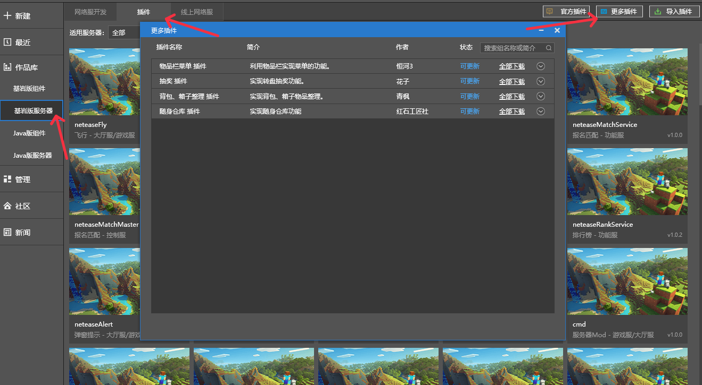

# Introduction to third-party plugins 

## Overview 

​ Third-party plugins are contributed by developers with excellent quality and their number will continue to increase. More developers are welcome to join and build the Apollo plugin ecosystem together. Interested parties can contact by email: minecraftstarter@163.com 

## Download instructions 

​ You can go to McStudio's Bedrock Edition server - Plugins - More Plugins to download third-party plugins. 

 

## Introduction 

### Lottery plugin 

Introduction: The lottery is realized in the form of a turntable. The props, currency and prize pool consumed by the lottery can be customized. For details, see the download file. 

Author: Hanako 

### Inventory menu plugin 

Introduction: Implement the function of the shortcut bar menu, and customize the menu icon and callback function. For details, see the download file. 

Author: Ganges 3 - Flashing 

### Backpack and box sorting plug-in 

Introduction: You can sort backpack and box items in dictionary order or custom order. For details, see the download file. 

Author: Qingfeng 

### Portable warehouse plug-in 

Introduction: Implement the portable warehouse function. The unlocking consumption of the warehouse supports customization. For details, see the download file. 

Author: yangzii——Redstone Craftsman Society 

### Illustrations Plugin 

Introduction: It can realize illustrations with two-level classification labels. The first-level classification labels are arranged horizontally, and the second-level classification labels are arranged vertically. After selection, the corresponding content pictures or paperdool, text description and jump logic are displayed. 

Author: Soldier 

### Treasure Chest Gift Pack Plugin 

Introduction: The types and quantities of items in treasure chests and gift packs can be specified or randomly drawn. In addition, a whitelist of announcement items can be specified, and the entire server will be announced after obtaining the corresponding items from the gift pack. 

Author: Moxun Workshop 

### Currency Plugin 

By extending the neteaseTrade plugin, it supports the increase/decrease of multiple currencies, daily/weekly acquisition limit control, and currency list UI display. 

Author: Rouwanzi 

### Experience level plug-in 

This plug-in provides configuration of experience level for the main server configuration: 
1. Supports configuration of experience required for each level upgrade. 
2. Supports configuration of player maximum level, maximum experience gained per day, maximum experience gained per week, and refresh time. 

Author: cm world builder 

### Minimap plug-in 

It implements functions similar to the Java version of VoxelMap minimap, providing players with previews of surrounding terrain creatures, as well as path points and other functions. 

Author: Sticky beast 

### Scheduled refresh of biological blocks plug-in 

Refresh entities and blocks at fixed times to facilitate special activities on the server. 

Author: Cuki 

### Task plugin 

Provide a weekly daily task system for the RPG mainline. 

Author: Hanako 

### Placeholder plugin 

A placeholder management plugin that provides a common interface to register placeholders/translation texts to facilitate other plugins to translate and prompt information related to plugin data. 

Author: Soldier 

### Voting plugin 

This plugin is used to provide the function of voting for the entire server, supports rich text, and can embed pictures/buttons/hyperlinks in the introduction; supports custom options, can realize single selection, multiple selection and other operations, and can display the current ratio after the player casts all votes; provides a rich and efficient query interface. 

Author: Redstone Artisan Society 

### 7stars Mount Plugin 

View all mounts in the game in the interface, and summon your own mounts. 

Author: Redstone Craftsman Society 

### Custom decomposition plug-in 

The decomposition plug-in can decompose the synthesized items into the unsynthesized items. You can also decompose the items into any items you want by modifying the configuration file 

Author: Caoyu 

### Custom synthesis plug-in 

Configure your own unique synthesis formula in soldierCraftService. 
The synthesis formula supports up to 9 different items and 3 different economic plug-in currencies. The synthesis result can be an item, or a callback function can be executed to achieve some other synthesis results.

Author: Soldier 

### Queue Plugin 

When the main server is full, players are transferred to a dedicated queue server to queue up and enter the main server in an orderly manner. 

Author: Mr_Tam 

### Season 5 Core Plugin 

A plugin ported from Java Season 5. Functions: entity density detection, limiting creatures from refreshing in a certain world, player entry and exit prompts, fixed online position, block interaction cooldown, disabled item list, piston push restrictions, a large number of game rule configurations, protection for specific dimensions and block interaction restrictions, etc. 

Author: Cuki 

### Achievement Plugin 

Developers can use this plugin to create their own achievement system. The plugin provides a complete interface framework and a complete set of backend interfaces. 

Author: Bit Carrot 

### Holographic Plugin 

Realize the creation of holographic text in Bedrock Edition, with built-in multiple animation schemes; streamer, typing, scrolling, text. 
All edited by in-game commands, you can get started without much learning cost.

Author: 17Artist 

### Scheduled Entity Cleanup Plugin 

Used for the server to clean up useless entities autonomously to reduce memory resource usage and optimize server performance. This plugin also provides entity quantity query and entity cleanup interfaces, which server owners can call to query, limit and clean up, and supports auxiliary functions such as prompts and logs. 

Author: Jizhu Workshop 

### Battle Pass Plugin 

It can provide players with daily and weekly tasks. Completing tasks can earn points, and accumulating points to a certain number will unlock rewards. At the same time, the battle pass is divided into free and paid versions. Players who purchase the paid version can get more rewards 

Author: Jizhu Workshop 

### Bio health bar plugin 

Used to display the name, health and damage of the biome 

This is a pure client plugin, which will not change the biome's death information or name, etc. It is applicable to both biomes and players. 

Author: cm world builder 

### Sky Island plugin 

After installing this plugin, you can implement basic Sky Island server functions, including many custom functions and rich APIs, which are convenient for developers to create secondary works 

Author: Puppy 
