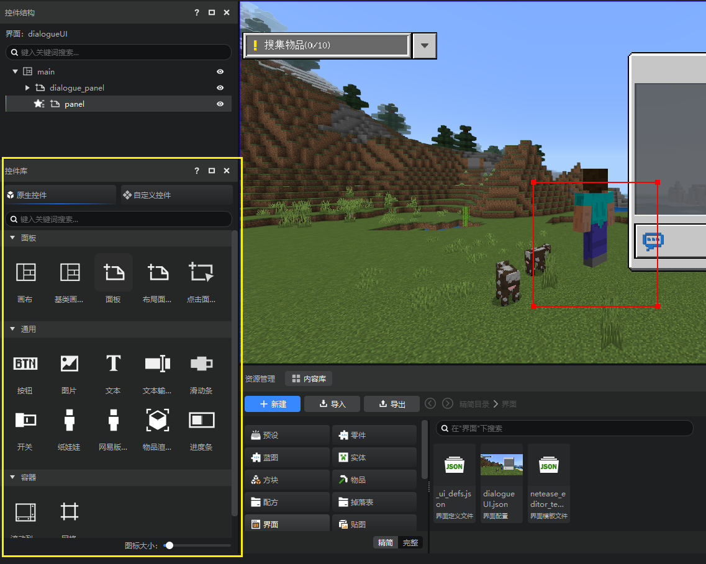
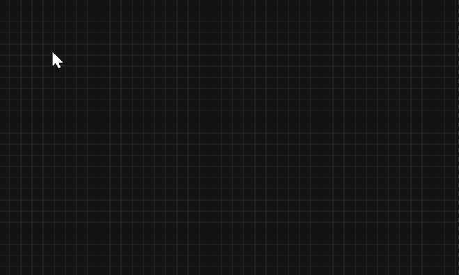
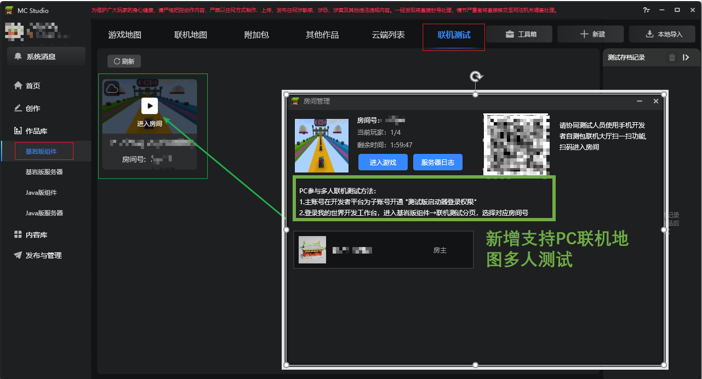
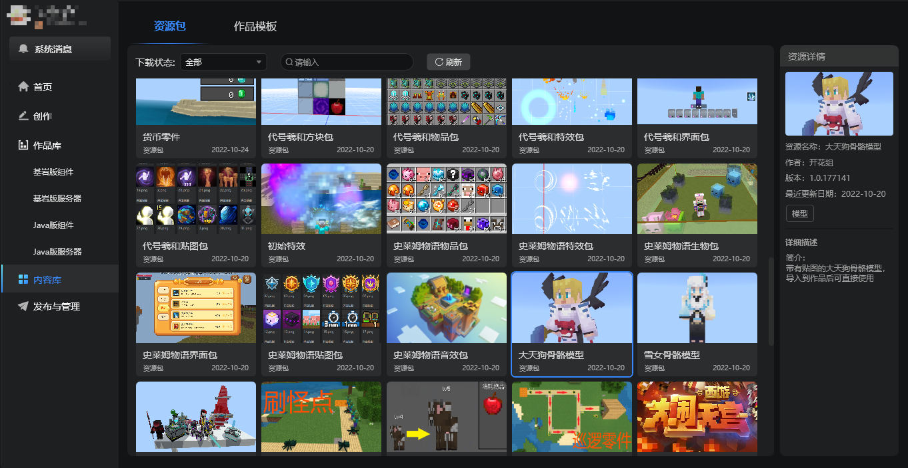
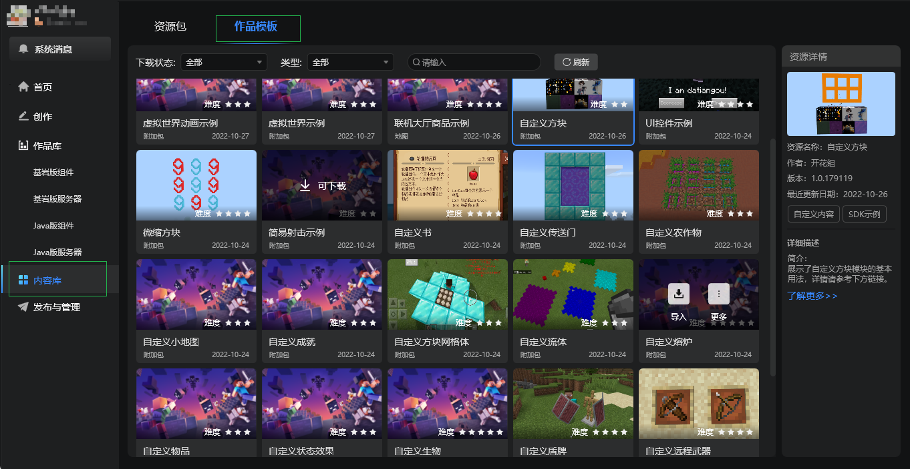
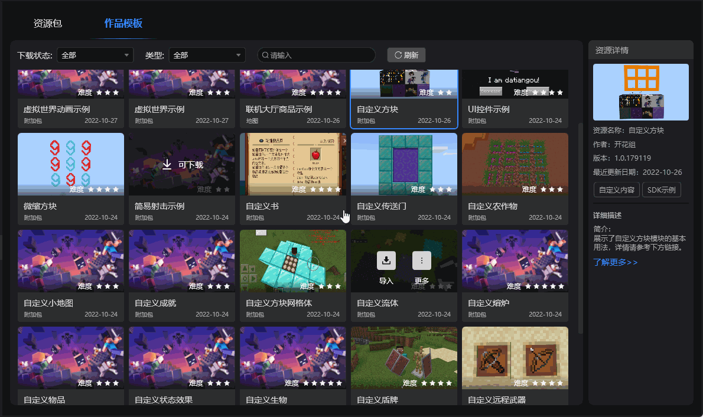
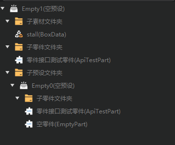

--- 
front: https://nie.res.netease.com/r/pic/20221031/b98ab8a9-6957-4753-875e-fd8a7d00d963.png 
hard: Getting Started 
time: 10 minutes 
selection: 13 
--- 

# 2022.11.1 Version 1.0.16 

## Editing Tips for Old Versions 

1. The upgrade prompts are strengthened when creating and editing old versions. 

2. **The old version editor will no longer support new features in the future. It is strongly recommended that developers use the new version editor for module development. ** 

## Interface Editor 

1. The custom control library is expanded to the control library, which is divided into two tabs: native controls and custom controls. 

 

2. Native controls can be created by dragging to a specified location in the embedded game or a specified control structure level. 

 

3. The function area only retains the operation buttons for the controls. 

 

4. Added slider controls 

## Logic Editor supports word segmentation search 

1. When searching for nodes in a blueprint, you can add spaces between multiple keywords to perform word segmentation to search for nodes with these keywords in the name. In addition, word segmentation also supports direct input of pinyin for recognition. 

 

## Online map works support PC multiplayer testing 

1. Whether it is a mobile or PC online map work, you can start multiplayer testing in the Minecraft development workbench, and support both the mobile test end and the PC test end to enter the same room. 
For details, please refer to [Online lobby work multiplayer testing](../../26-Online lobby/20-Online lobby debugging and multiplayer testing document.md). 

 

## Content library adds work template paging 

> For details, please refer to [Content library usage instructions](../../15-Resource management/11-Content library.md). 

1. The original resources are classified into the **Resource Package** page, which is used to store resource package files (.mep suffix) that can be directly imported into the current existing works. 

 

2. Added **Work Template** page to store template files that need to be created as new works, similar to the templates in the new work window. 

 

3. Move the examples in the original resources of the content library to the Work Template page, and developers can directly create works for testing. 

 

## Configuration 

1. Modify the [Item Configuration](../../20-Gameplay Development/15-Custom Game Content/1-Custom Items/1-Custom Basic Items.md) configuration and add some attributes. 

2. Modify [biome configuration](../../20-Gameplay Development/15-Custom Game Content/4-Custom Dimension/2-biome landform.md) configuration and add some properties. 

## Others 

1. Optimize the tree structure of the stage and preset levels. 

 

2. The right-click menu of the debug tool command debugging window is translated into Chinese. 

3. The code completion prompts of the debug tool command debugging are arranged in the order of letters a→z to facilitate developer positioning. 

4. Other experience optimization and problem fixes.