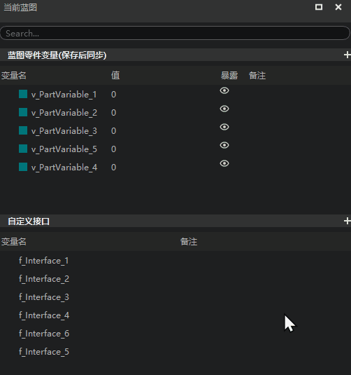
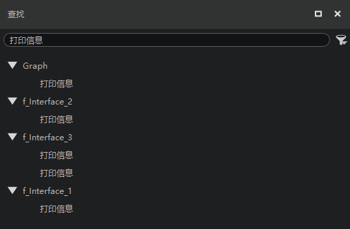
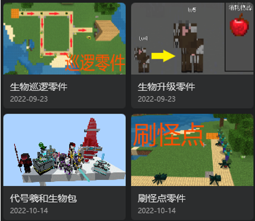
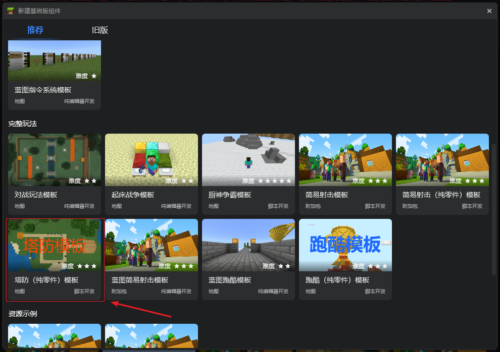
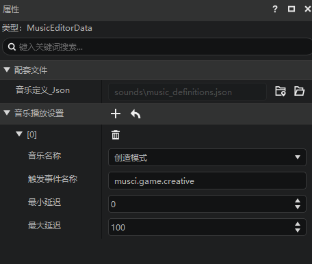
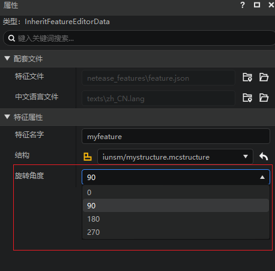
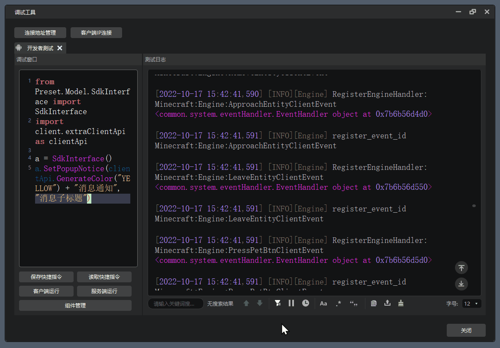

--- 
front: https://nie.res.netease.com/r/pic/20221017/45eb5c29-a770-48a0-b4f5-52433c15b778.png 
hard: Getting Started 
time: 10 minutes 
selection: 12 
--- 
# 2022.10.18 Version 1.0.15 
## Server Opening Tool 2.0 is officially released 

1. Supports the use of Spigot and module SDK to create Bedrock Edition mobile game servers. For details, please refer to [Server Opening Tool 2.0](../../27-Network Games/Course 8: Using Spigot to Open Servers/10-Overview of Java Edition Online Games Supporting Bedrock Edition Clients.md) 

## Level Editor supports placing creatures 

1. Supports placing non-preset creatures, and managing and modifying the properties of creatures in the stage 
2. Supports placing original creatures and custom creatures. For details, refer to [Place and manage creatures](../../20-Gameplay development/11-Assembly simple gameplay/4-Place and manage creatures.md) 

## Logic editor 

1. Blueprint part variables, custom interfaces, and variables allow developers to drag and modify and save the list order 

 

2. The [Search] function supports locating nodes in the custom interface graph 

 

## Templates and content library 

1. The content library adds monster spawning point parts, creature upgrade parts, and creature patrol parts, and fixes the code Xihe creature package details page problem. 

 

2. Add a tower defense (pure parts) template to the new work recommendation page 

 

## Configuration 

1. Add [music](../../20-Gameplay Development/15-Custom Game Content/8-Custom Music.md) configuration 

 

2. [Feature](../../20-Gameplay Development/15-Custom Game Content/4-Custom Dimension/4-Custom Feature.md) configuration to modify the rotation angle when placing 

 

## Debugging tools 

1. Provide <a href="../../../mcguide/30-Test/1-Use debugging tools for mobile and computer debugging.html#_5-Log filtering by tag" rel="noopenner">Log tag filtering function</a>, and also support developers to add custom log tags 
 
2. Support only displaying the log window or only displaying the debug window 
 
3. Different types of fields in the log window are displayed through text of different colors 

## Others 

1. Other experience optimization and problem fixes