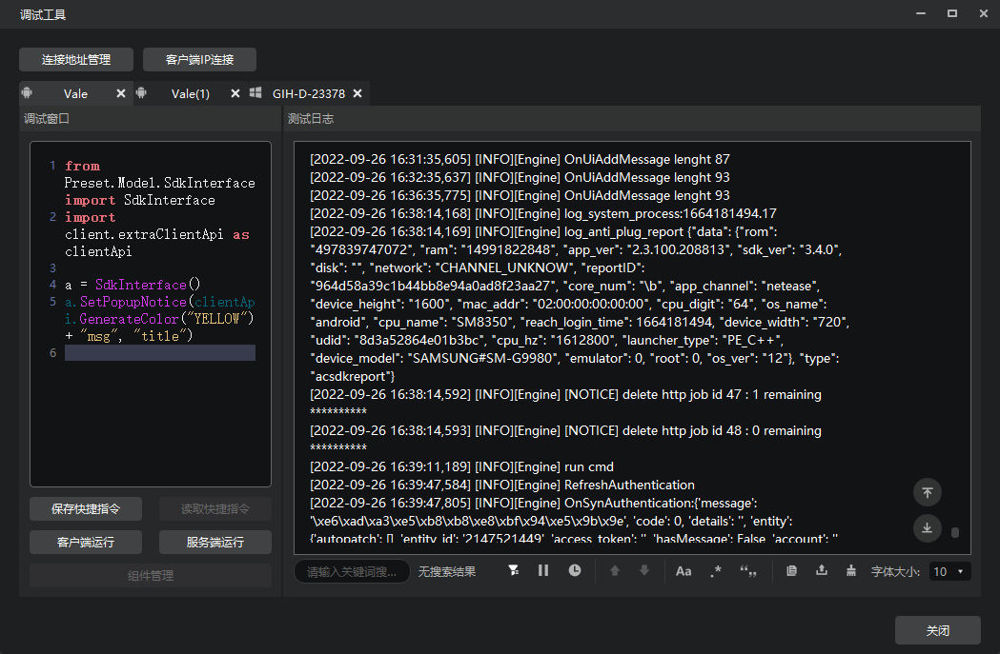
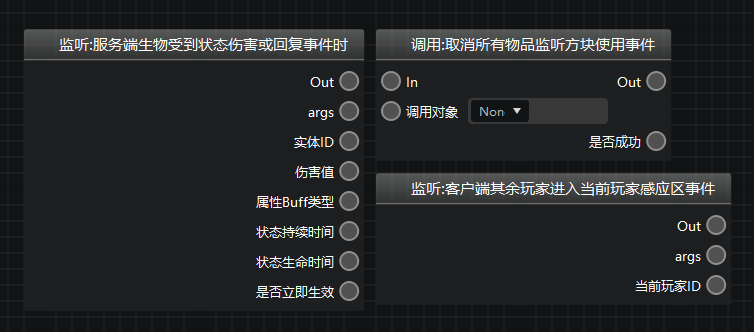
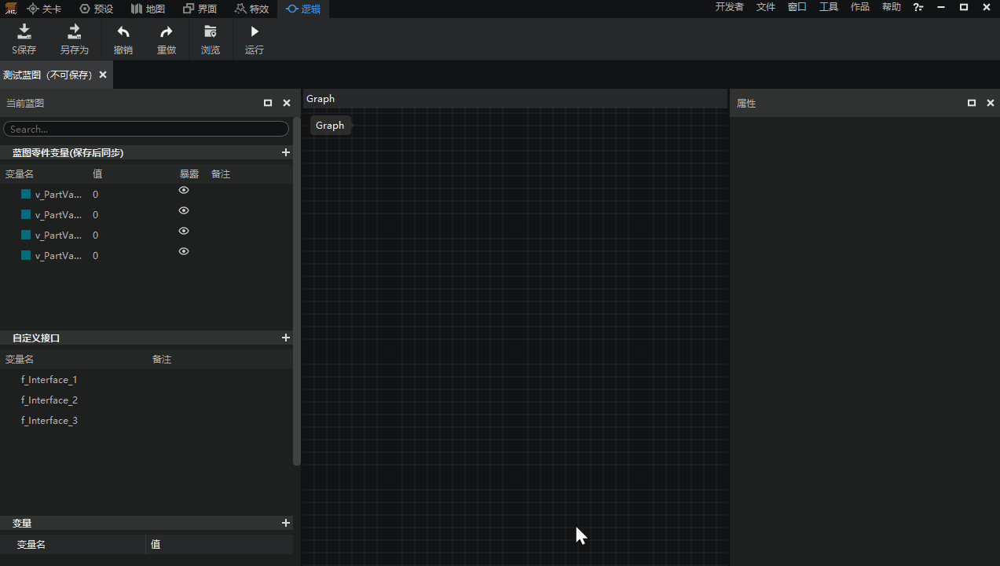
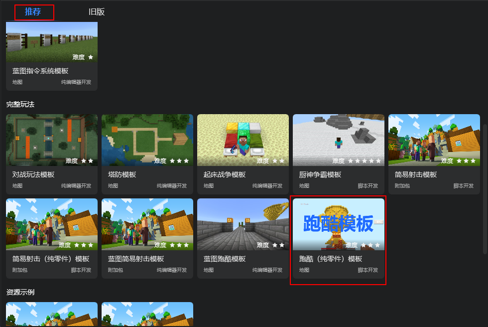
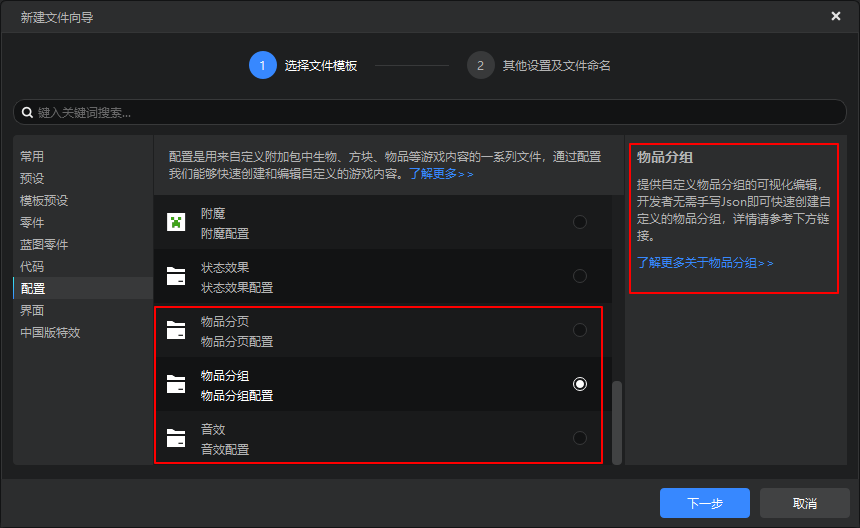
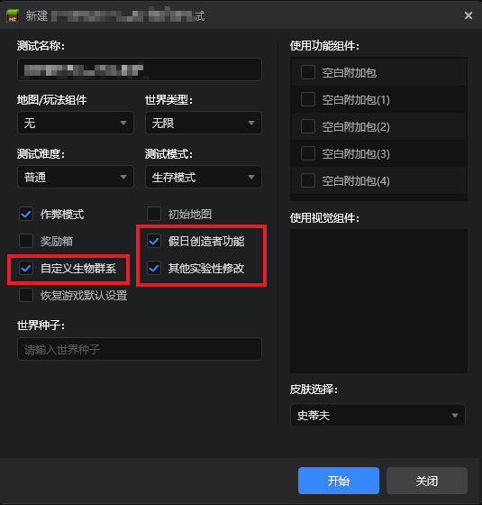

--- 
front: https://nie.res.netease.com/r/pic/20221002/bee54b20-c93c-48e3-aaa2-61d8646d599a.png 
hard: Getting Started 
time: 10 minutes 
selection: 10 
--- 

# 2022.9.28 Version 1.0.14 

## Debugging Tools 

We have launched a comprehensive upgrade of the debugging tools! The new version of the debugging tools improves the developer experience in the following processes: 

1. **Component synchronization**: When self-testing components, modify the component file on the PC side and synchronize it directly to the mobile test side, eliminating the long waiting time for machine review. 
2. **Multi-terminal log**: View the logs of the game tested on the computer and other devices on the computer, including the test logs of the mobile test client and other PC development kits. 
3. **Code debugging**: Use Python code to debug the ongoing game testing process directly, and provide code completion function. In addition, developers can view the debugging code history, and can save the written code as a shortcut command for easy reuse at any time. 

For more details about the new version of the debugging tool, please see [this document](../../30-Test/1-Use the debugging tool for mobile and computer debugging.md). 

 

## Logic Editor 

1. Optimized the node width display, and now the node with a longer name can fully display the name 
 

2. Allow developers to add notes for custom interfaces and custom variables 
 

## Map Editor 

Now supports adding the content on the clipboard to the material library directly through the right-click menu. 
 

## Templates and content library 

1. The content library adds resources related to the quarterly module Journey to the West-Havoc in Heaven: physical item block configuration, special effect resources, structure resources, texture resources, and interface resources. 

 

2. Add parkour (pure parts) template to the new work recommendation page 

 

## Configuration 
Added [Item Paging](../../20-Gameplay Development/15-Custom Game Content/13-Custom Item Paging.md), [Item Grouping](../../20-Gameplay Development/15-Custom Game Content/12-Custom Item Grouping.md), [Custom Sound Effects](../../20-Gameplay Development/15-Custom Game Content/8-Custom Music.md) three configurations 

 

## Others 

1. The development and testing interface supports some experimental gameplay options 
 
2. The drop-down box style of the entity preset overall template is optimized 
3. Other experience optimizations and problem fixes