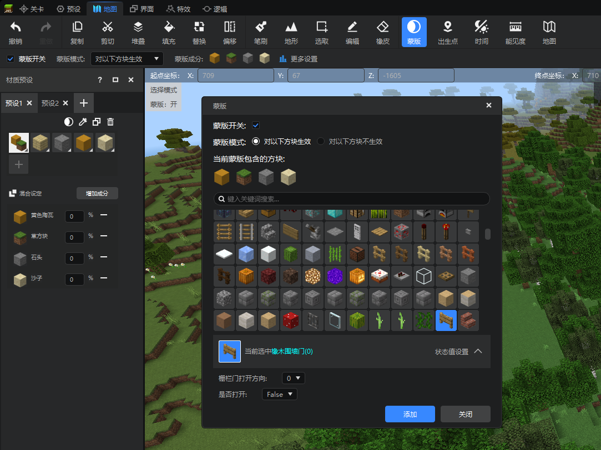
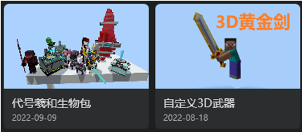
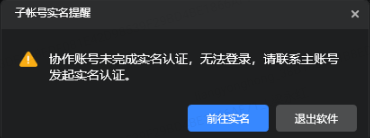

--- 
front: https://nie.res.netease.com/r/pic/20220922/76df5e70-1f2d-4ecc-b68e-d7dca22f75c4.png 
hard: Getting Started 
time: 10 minutes 
selection: 9 
--- 

# 2022.9.15 Version 1.0.13 

## Map Editor - Masks 

The map editor now supports masks. Masks are global settings. When enabled, map editing operations only take effect on blocks specified by the mask. Masks will be applied to any operation that will modify blocks. 
For more information about masks, see [this document](../../14-地图制作/4-口罩工具说明.md). 

 

## Content Library 

Added 2 new resources: Codename Xihe Biological Package, [Custom 3D Weapons](../../20-Gameplay Development/15-Custom Game Content/1-Custom Items/9-Custom 3D Items/1-Custom 3D Items (I).md). 

 

## Others 

1. The time when the network service map download shows the archive clearing 
2. The collaborative account real-name authentication pop-up window, the unauthenticated collaborative sub-account must complete the real-name authentication within the specified period, and the normal use of the function will be affected if the real-name is not completed within the specified period. 

