--- 
front: https://nie.res.netease.com/r/pic/20220831/50aae489-470f-4970-afcd-4c792784dfbf.png 
hard: Getting Started 
time: 10 minutes 
selection: 8 
--- 
# 2022.8.31 Version 1.0.12 

## Presets/Configurations 

1. Added custom status effect configuration 

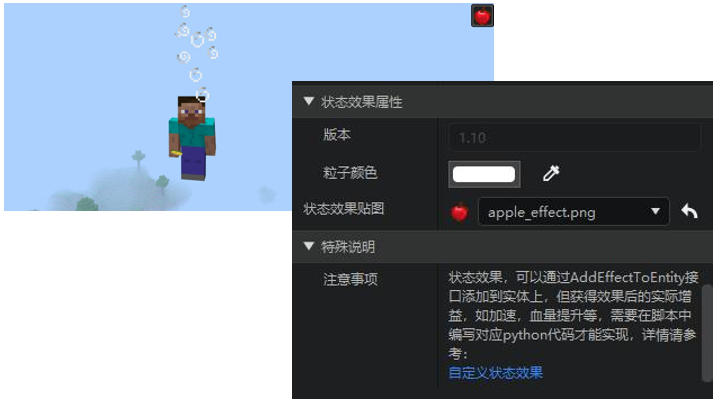 

2. The following entity data has been added 

| Special creatures | Ender Dragon, Enderman, Ghast, Slime, Magma Cube, Tropical Fish, Wither | 
| --- | --- | 
| Special non-creatures | TNT, Ender Crystal, Area Effect Cloud, Shulker | 
| Mounts | Horse, Zombie Horse, Skeleton Horse, Mule, Donkey, Alpaca | 
| Mine Cart | Mine Cart, Hopper Mine Cart, Transport Mine Cart, Command Block Mine Cart | 
3. All native models can be selected for the resource pack model of the entity configuration 
4. Support automatic generation of block presets when placing blocks (officially effective in version 2.3, currently available for testing on the modpc package) 
5. UI presets add a constant loading option 

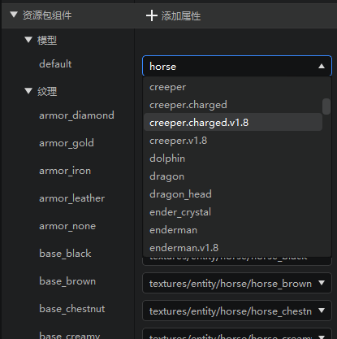 

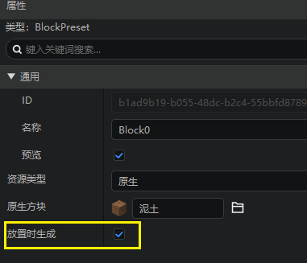 

## Launcher 

1. When deleting the work being edited, it will prompt that the work is occupied 
2. Add a beta version link to the pop-up window when launching the ModPC package test 

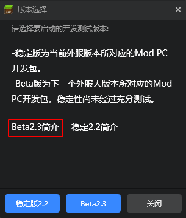 

## Map Editor 

Now the map editor's brush material, fill, replace and other tools all support the selection of block status values! For details, please refer to [this document](../../14-Map Production/3-Block Status Value Setting Instructions.md). 

Open the corresponding window. If you select a block that can modify the status value, there will be a [Status Value Setting] option in the lower right corner after selecting it. Click it to expand the status value option. After adjusting the status value through the drop-down box, the block with the status value will be applied to the tool you are using. 

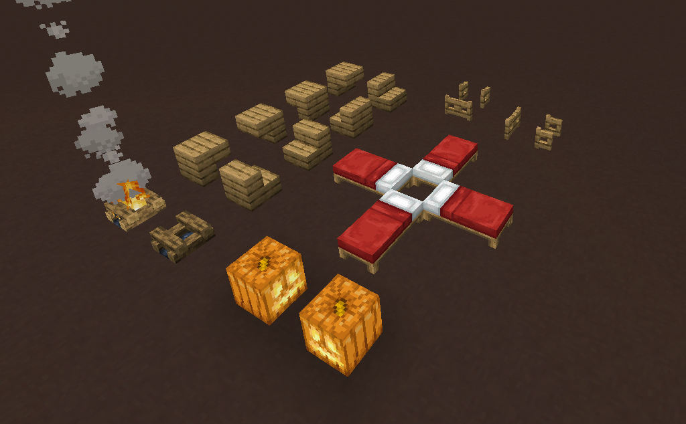 

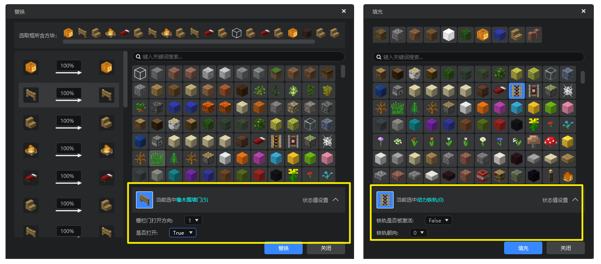 

> Note: Some special status values of some blocks can be found on the wiki, but when placing blocks, since the original block logic cannot take effect, we have blocked this part of the status value, and they will not be displayed in the status value setting options. 

## Special Effects Editor

### Special Effects Editor Timeline Update 

We have updated the timeline of the special effects editor. In addition to its appearance update, this update mainly includes the following features: 

1. Optimized the timeline's direct control of the delay of the Chinese version of the special effects. 
- Now developers can attach the same special effects file to different attachment points, and drag and modify the delay of specific special effects under each attachment point on the timeline. 

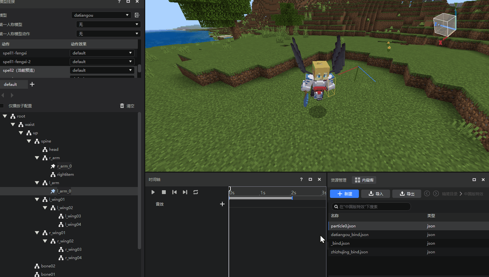 

> Note: The delay adjusted on the timeline will now be recorded in the special effects bind file and overwrite the delay in the original special effects file. If you want to continue to use the delay configured in the special effects file, please adjust it directly in the property panel instead of adjusting the handle on the timeline. 
> If you want to synchronize the delay data on the timeline to the special effects file itself, please click the [Synchronize File] button in the track properties window, so that the delay data on the timeline will be written to the special effects file configuration. 
> 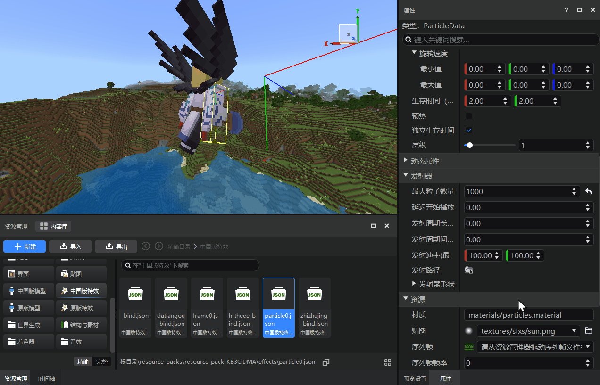 

2. The left half of the special effect timeline window is changed to [hanging point name + special effect file name] to make the distinction between special effects clearer. 

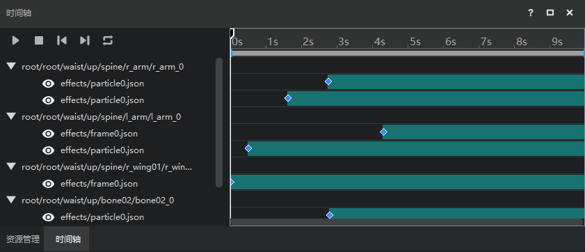 

3. Skeleton model actions support hanging sound effects. 

> Note: The current version only supports original sound effects, and does not support manually added sound effects. 

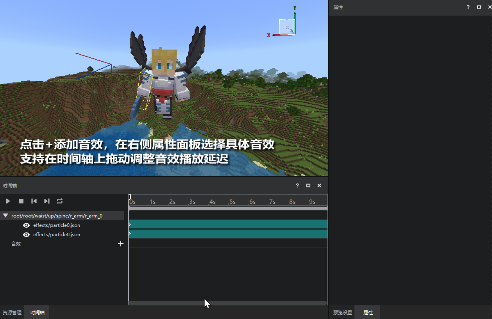 

### Other changes: 
- Support step-by-step undo for offset and rotation adjustments of blockbench model anchor points 

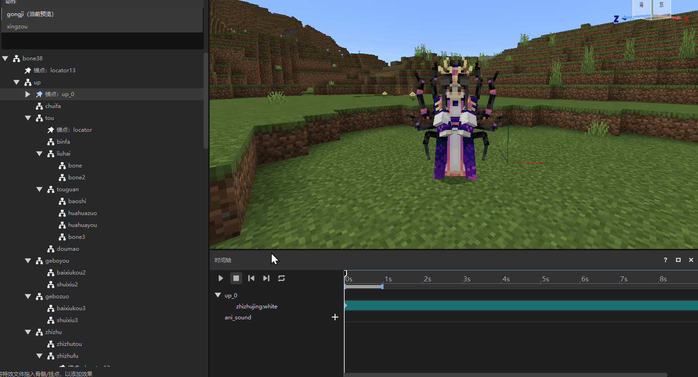 

## UI Editor 

1. Keep the property grouping and scroll bar position unchanged when refreshing the property panel 
2. Add options of adding animation and playing animation in the right-click menu of the control structure 
3. The ui json file now only saves properties that are not equal to the default value 
4. When the property value type is wrong, a red error mark is displayed 
5. Optimize the "default image" style of the image control 

## Templates and Content Library 

1. The content library adds 12 official modules "Three Strikes on the White Bone Demon", task chains, and parkour related resources; 
2. The content library updates the instructions for using the resources related to "Codename: Xihe" and "Slime Story". 

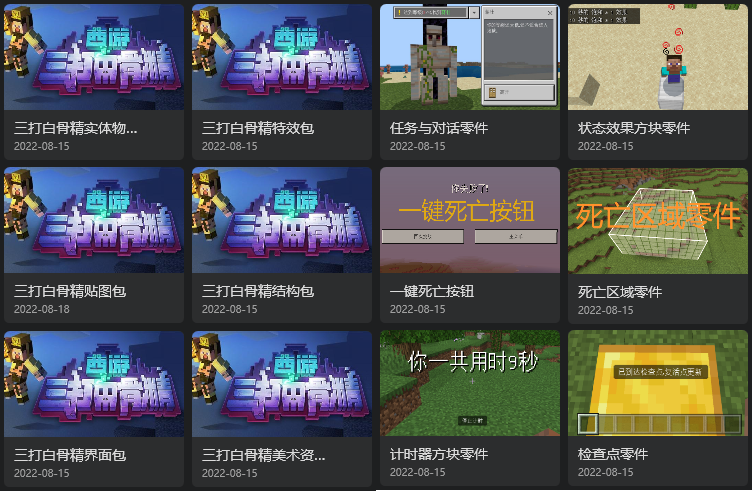 

3. Add task chain (pure parts) template to the new work recommendation page 

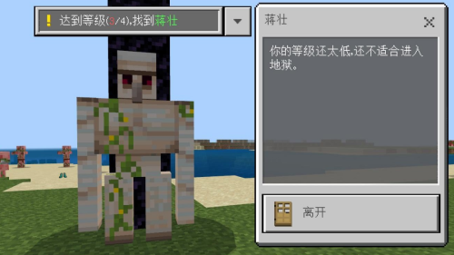 

## Others

1. The import and export resource package pop-up window supports expansion and collapse of all 

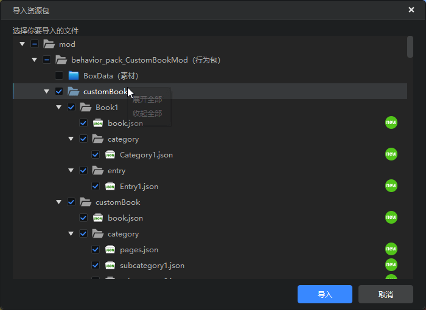 

2. Other performance and experience optimization, problem fixes, document updates