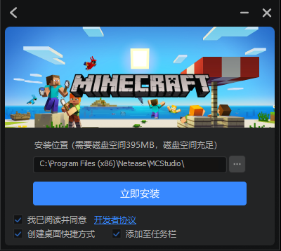
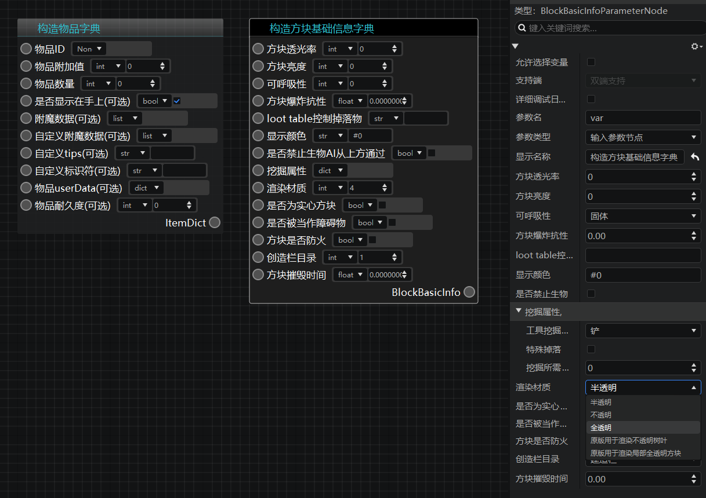
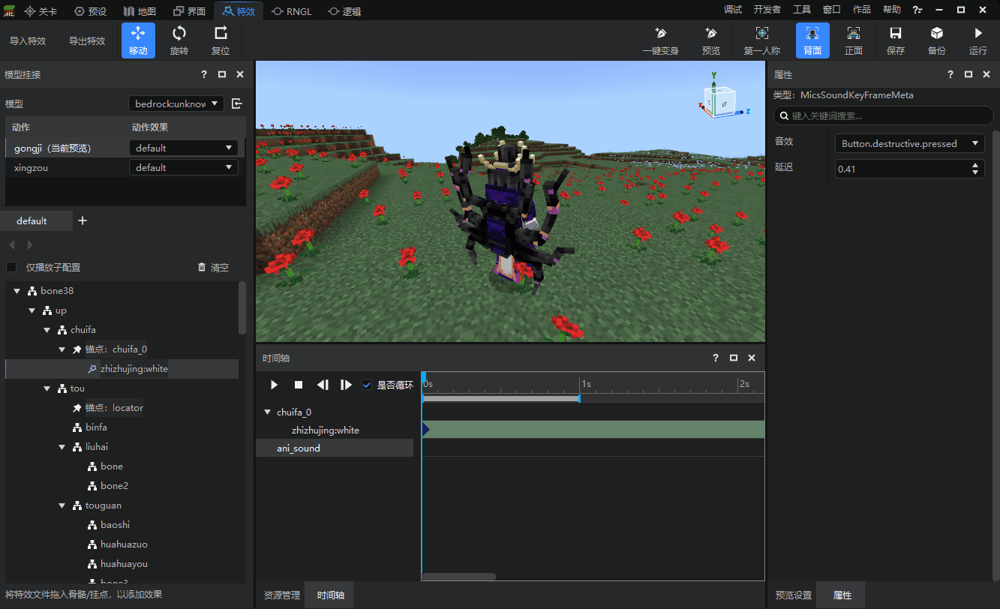
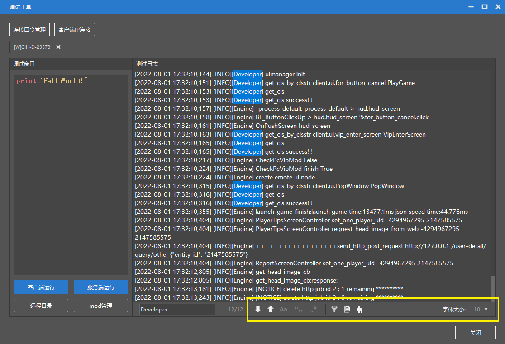
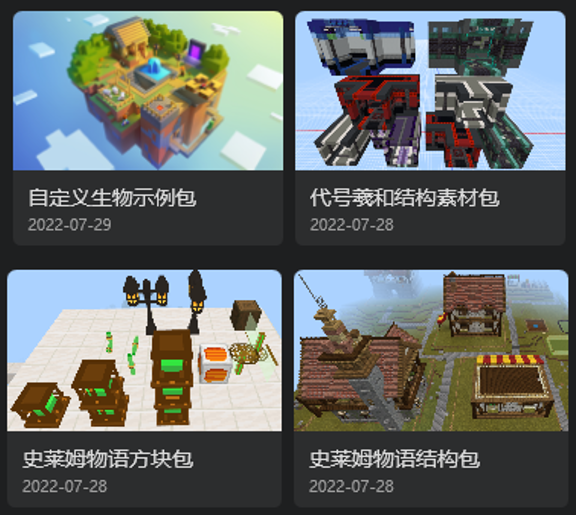

--- 
front: 
hard: Getting Started 
time: 10 minutes 
selection: 6 
--- 

# 2022.8.2 Version 1.0.11 

## Installer Optimization 

- Interaction and visual optimization 
 

## Logic Editor 

- The default left window of a new blueprint is changed to "Current Blueprint" 
- Added two nodes, the construction item dictionary and the block basic information dictionary. Simple applications no longer need to query documents 
- **【Please note】The construction item dictionary and the construction block basic information dictionary nodes will only take effect after the 2.3 package is launched, and cannot be used for 2.2 version components. Currently, it can only be tested on the modpc package. ** 

 

## Special Effects Editor 

- Now you can undo the offset, rotation, and other operations on the bone model hanging point. 
- Support for sound effects hooking up to Bedrock Edition model actions. **Currently only supports some of the built-in sound effects**, which can be selected in the [Sound Effect] drop-down box in the sound track properties menu. 
 

## Presets, Configurations 

- Resource packs for entity configurations now automatically add render_controllers and materials 
- Disable capital letters when creating new entity configurations/presets 
- Add entities from the Caves and Cliffs version 

## Map Editor 

- Support for placing structures directly in the map. The structures saved in the work will be directly displayed in the [Structure] tab of the [Material Library] window. Developers can directly place the structure in the scene by clicking the mouse like placing materials. 
- **Note that the [Structure] tab will only display the structure files in the current work, and it will not be used across works like materials. ** 
 

## Debug tool optimization 

- Log font size setting 
- Advanced search function, including regular expression matching, case sensitivity, whole word matching, etc. 
- Enter search and highlight search text 
- PC side uses debugging tools to support disconnection and reconnection 
 

## Content library 
- Slime Story Block Pack

- Custom creature sample pack 
- Slime Story structure pack 
- Codename Xihe structure material pack 
 

## Other updates 

- Player presets merged due to resource pack import will now also merge player preset properties 
- Import resource pack menu optimization 
- Network service mod selection is sorted alphabetically 
- Other performance and experience optimizations, bug fixes, document updates 
