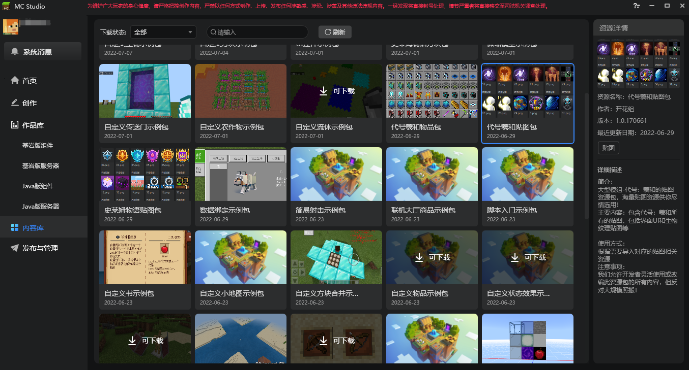
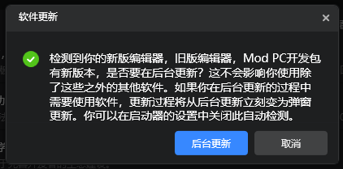
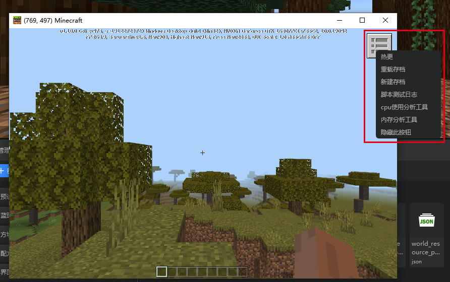
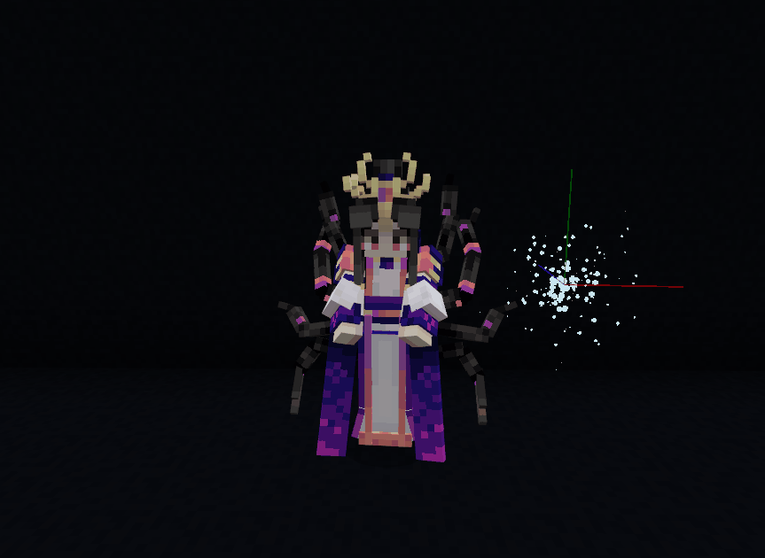
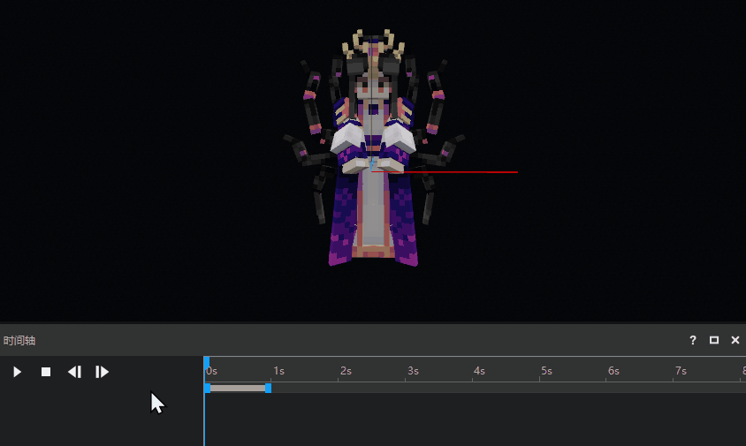
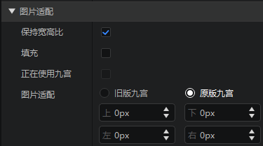

--- 
front: 
hard: Getting Started 
time: 10 minutes 
selection: 4 
--- 

# 2022.7.7 Version 1.0.9 

## Workbench 

### Content Library 

- Added a "Content Library" tab to the launcher. For instructions, see [Content Library](../../15-Resource Management/11-Content Library.md) 
- Provides developers with a large number of configurations, preset parts, special effect maps and other game resources required in the development process in the form of custom resource packages 
- Supports one-click download and import to the current work, helping developers create richer and more interesting works! 

 

### Launcher adds background update function 

- After opening the launcher, if we detect that the editor or Mod PC development package has been updated, a prompt will pop up directly 
- Other operations can be performed during background update 

 

### Mod PC development package adds new shortcut operations 
For details, please see [ModPC Development Package Developer Menu](../../30-Test/00-ModPC Development Package Introduction.md#2. Developer Menu) 
- A shortcut operation button is added in the upper right corner of the Mod PC package 
- Functions include hot update, reload, create a new archive and test, etc. 
- Can shorten the waiting time during the test process 

 

### More support for original model particles 

- Now you can adjust the relative position and rotation of the Bedrock Edition model's mounts just like adjusting the FBX model 
- Control the original version particles to pause and resume playback through the timeline 

 
 

### Interface Editor Optimization 

- When deleting the interface file, it will prompt the custom control to be deleted 
- The image path of the variable area image control only displays the image name 
- The nine-square attribute restores the old version style 
- When creating the interface, add the option of "Whether to enable the base class canvas" 
- When dragging resources into the image control, uv_size will no longer be automatically set 

 

### Other updates 

- Fixed the problem that some SDK interfaces do not have corresponding blueprint nodes 
- Added a blueprint node for constructing Transform 
- The "traditional" map type is abandoned when creating a new map in the launcher 
- Added MSAA for embedded games in the editor settings 
- Added an "Apply" button to the recipe properties of the recipe configuration 
- Updated the cloud list style 
- Built-in parts can be created through the new file wizard 
- Remind to save editor data when the account exits abnormally 
- Other performance and experience optimizations, problem fixes