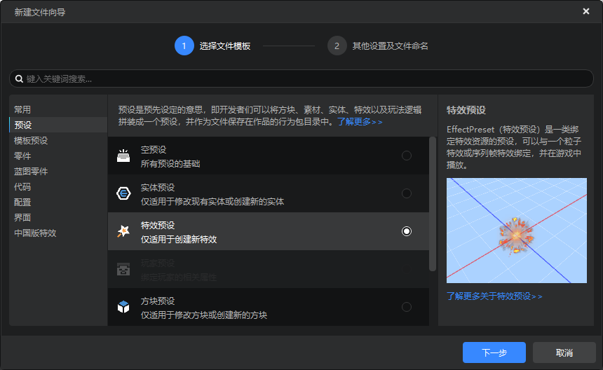
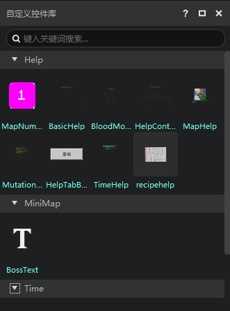
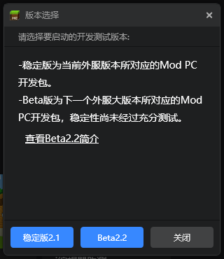

--- 
front: 
hard: Getting Started 
time: 10 minutes 
selection: 3 
--- 

# 2022.6.7 Version 1.0.8 

## Workbench 

### New File Wizard Optimization 

- Added a brief document for the currently selected item, click to jump to the official website document 
- Search is no longer case-sensitive 
- Optimized naming box rules 

 

### Interface Editor Optimization 

- Added loading status when reading interface files 
- Added pop-up prompts for wrong operations 
- Added grouping to the custom control library, and now it will be grouped according to the interface file to which the custom control belongs 
- Simplified interface files, no longer save default values 
- Added deletion and dereference to variable deletion 

 

### Other updates 

- Added script test log in the launcher toolbox. If you accidentally close it, you can open it again here. 
- Avoid sensitive words when the editor randomly names the space 
- Optimize the drop-down box with search bar 
- Other issues fixed, experience and performance optimization, document update 

## Module SDK 

- Updated the 2.2 development kit beta version. You can choose 2.2beta in the version selection in the development kit to experience it. 
- For more documents, please refer to <a href="../../../mcdocs/1-ModAPI/Update Information/2.2.html">2.2 Version ModAPI Update Notes</a>. 

