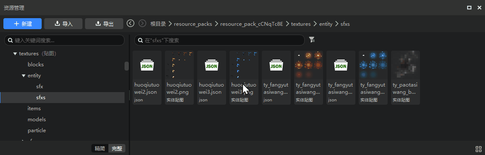
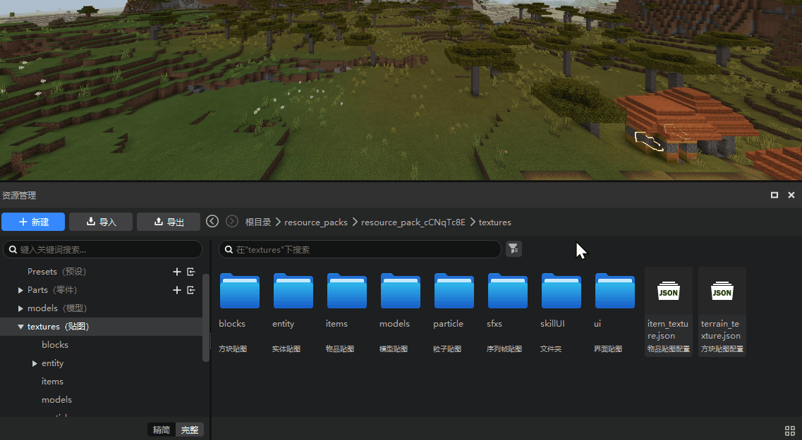

--- 
front: https://nie.res.netease.com/r/pic/20220510/cb899036-bb98-4853-bc51-01bc189f8643.png 
hard: Getting Started 
time: 15 minutes 
selection: 
--- 

# 2022.5.10 Version 1.0.6 

## Workbench 

### Editor interface update! 

- We have optimized the visual style of the interface, and the obsidian-like interface brings a more immersive experience. 
- The contrast between text and background has been greatly improved, which can reduce visual fatigue caused by long-term use. 

- The hierarchy of text and background has been optimized, and the rounded corner cards are used appropriately. The relationship between the elements of the interface is clearer, and it is clear to use at a glance. 

 

### New upgrade of resource manager 

- There are many updates in the resource manager. For details, please refer to [Resource Manager (New Version)](../../15-Resource Management/2.5-Resource Manager (New Version).md). 
- [Forward], [Back] and [Breadcrumb Navigation] functions allow you to quickly jump between parent and child directories 

 

- Added [Simplified Mode] to provide a simpler and clearer resource classification method for developers who are not fully familiar with the file structure of Minecraft add-on packs. 

 

- Optimized the search rules and added the [Filter] function. The search function supports penetrating searches of subfolders at all levels of the selected directory.

 

### Interface Editor Refactoring 

- There are many updates to the resource manager. For details, please refer to [Interface Editor Revision Notes](../../18-Interface and Interaction/0-Interface Editor Revision Notes.md). 
- The [parsing] ability and [compatibility] of the interface Json file are improved. Almost all legal interface Jsons can be parsed, and even if they cannot be parsed, your interface file will not be forced to be modified. 

 

- All inherited controls can be expanded in the editor to display the [complete control structure]. For example, the following figure is the "switch" control built into the editor. You can now expand this control and learn its structure. 

 

- Remove the old version of the inherited control function and replace it with [Inherit original control]. 

- Added the [Custom control] function. You can add a control (and sub-controls) to the control library, and reuse your custom control from the control library by simply dragging and dropping.

 

- Added [Variable], [Property Reference] and [Universal Control Reference] functions, which can modify the property values of other controls in a certain control. 

 

### Beginner's Tutorial 

When you open each editor for the first time, a beginner's tutorial will pop up to guide the functions of each window. 

 

### Other updates 

- When testing the online lobby map, add the server log function, see [Online lobby test server log](../../26-Online lobby/20-Online lobby debugging and multiplayer test document.md) for details. 
- Added a new button to the configuration panel of the level editor, and the default layout will display the configuration panel 
- The new file wizard supports creating new special effect files 
- The blueprint part variables have been opened to the part property panel, which can be modified directly in the preset editor and the part property panel of the level editor 
- Added a reset function to the server settings of the online game configuration, which can automatically add the existing machine IP 
- Post-processing parts support real-time effect in the editor 
- The recipe selection box supports custom blocks 
- Modified the preset preloading mechanism, now it will be fixed at (0,100,0), and fix the problem that the preloaded preset cannot be loaded due to the archive point being too far away 
- Other problem fixes, experience and performance optimization 

