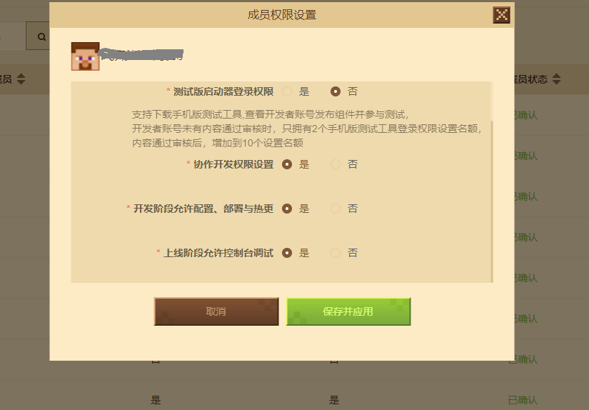

--- 
front: https://nie.res.netease.com/r/pic/20220408/179f0219-272e-4b5c-a2e1-648d9aaa9de8.png 
hard: Getting Started 
time: 5 minutes 
selection: 
--- 

# 2022.4.12 Version 1.0.5 

## Workbench 

### Template Update 

- Added a new template for merging blocks into meshes 
- Added a new template for custom shields. For details, please see [Custom Shields](../../20-Gameplay Development/15-Custom Game Content/1-Custom Items/8-Custom Shields.md) 
- Updated the blueprint simple shooting template. For details, please see [Update (errata)](../../20-Gameplay Development/12-Visual Programming/30-New Version Example Tutorial (Video)/07-Making Simple Shooting Add-on Pack (Video)/00.md) 

 

 

### New Server Plugin 

- In the pop-up window of creating a new Bedrock Edition server on the workbench, a blank plug-in has been added, which can be used to create a new plug-in. For details, please see [Use the workbench to create a new plug-in](../../27-Network Games/Course 6: Plug-in Tutorial/Section 0: Use the workbench to create a new plug-in.md) 
- New plug-ins support the creation of lobby server mods and game server mods separately 
- The plug-in import interface has also been updated 

 

### Sub-account deployment function expansion 

- You can grant sub-accounts higher permissions on the developer platform 
- If the sub-account is granted deployment permissions in the development and review stages: then the sub-account has all permissions except deletion 
- If the sub-account is granted debugging permissions in the online stage: then the sub-account has the permissions to debug and view logs 
- For details, please see [Sub-account deployment and console debugging function](../../27-Online Games/Course 5: Practical Knowledge/Section 19: Sub-account deployment and console debugging function.md) 

 

### Operation instruction permission management 

- The main account can specify whether each operation instruction is allowed to be operated by the sub-account in the workbench 

- When copying the server to the review stage and the online stage, the settings of the operation instruction will also be inherited 

 

### Other updates 

- Logic editor access module SDK New interface in 2.1, automatically restore the position and scale when the last closing occurs when opening a blueprint
- For works of add-on type, the stage of the level editor will display a pre-loading prompt
- Blueprint part variables support dual-end synchronization

- Optimize the entity preset attribute panel, add mouse hover tips to the attributes, and you can view the relevant APIs 
- Fix other issues, optimize experience and performance 

## Module SDK 

- Update the module SDK 2.1 stable version. As shown below, you can use the 2.1 stable version for testing during development and testing. 
- For details, refer to <a href="../../../mcdocs/1-ModAPI/Update Information/2.1.html" rel="noopenner">ModAPI Update Information</a>. 

## Bedrock Edition Server Tools 

- For details, refer to <a href="../../../mcdocs/2-Apollo/0-Apollo Update Information.html" rel="noopenner">Apollo Update Information</a>. 

