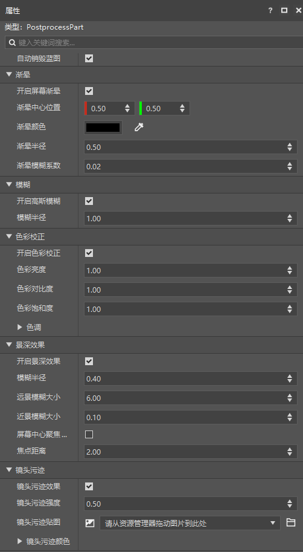
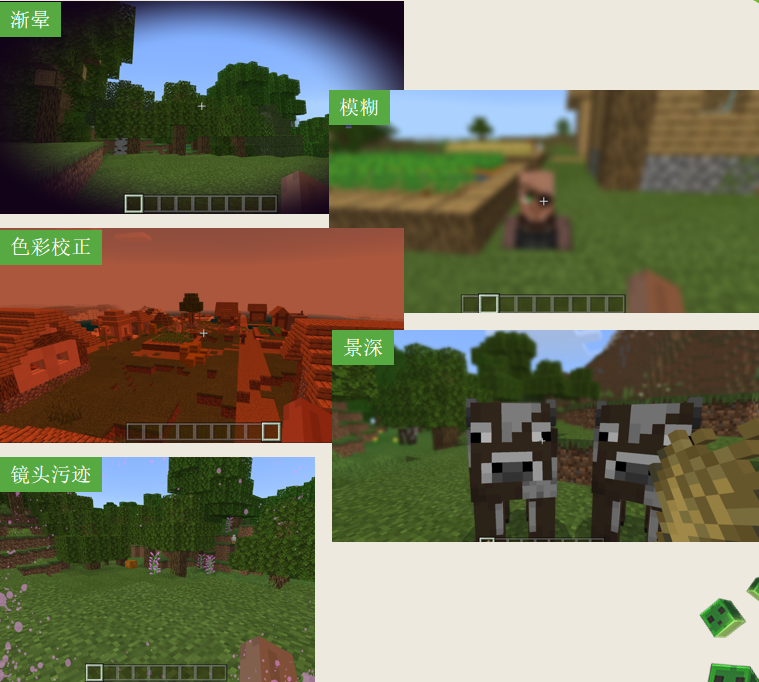
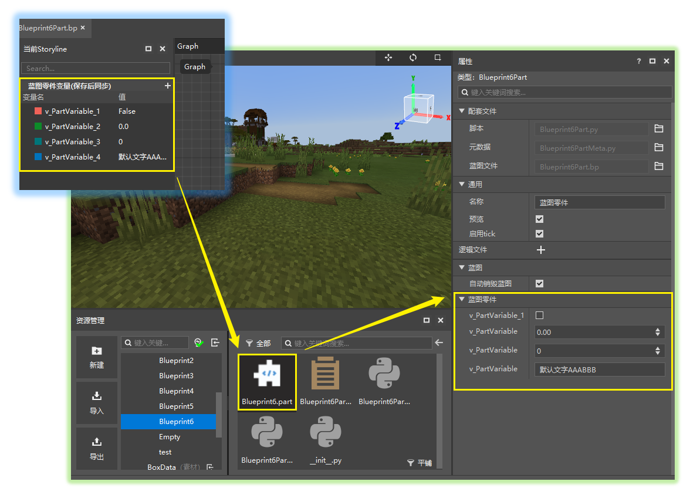
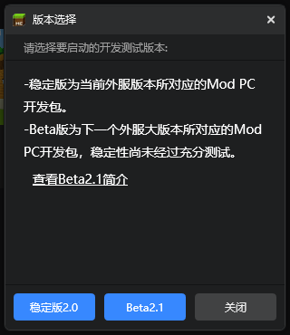

--- 
front: https://nie.res.netease.com/r/pic/20220408/179f0219-272e-4b5c-a2e1-648d9aaa9de8.png 
hard: Getting Started 
time: 5 minutes 
selection: 
--- 
# 2022.3.29 Version 1.0.4 
## Workbench 

### New post-processing parts 

- Used to quickly set up and use post-processing effects such as vignetting, lens stains, blur, etc. in the game. For details, please see [Post-processing parts](../../20-Gameplay Development/11-Assembly Simple Gameplay/11-Built-in Parts/06-Post-processing Parts.md) 
- The post-processing part properties are shown in the figure 

 

- The effects of various post-processing are as follows 

 

### Blueprint variables are open to the part's property panel 

- A new element type [Blueprint Part Variable] has been added to the logic editor. For details, please see [Blueprint Part Variable](../../20-Gameplay Development/12-Visual Programming/10-New Version Logic Editor Instructions/40-Script Elements.md#Variables) 

- This type of variable can be directly synchronized to the property panel of the .part file, and supports directly modifying the default value of the blueprint part variable through the property panel when the blueprint file is closed 
- In addition, it also supports customizing the display name and grouping of variables in the blueprint part property panel. 

 

### Other updates 

- Added a toolbox button to the creation page of the launcher 
- Added some old templates to the recommended templates of the launcher 
- Most templates have been updated and no longer use deprecated interfaces 
- The network service paging is adapted to the Apollo PC service 
- Optimized node parameters related to the logic editor ID 
- Added more "Caves and Cliffs" version items to the editor 
- Other problem fixes, performance optimization 

## Module SDK Beta 

- The second beta package of Module SDK2.1 has been updated. As shown in the figure below, Beta2.1 can be used for testing during development and testing. 
- For details, please refer to <a href="../../../mcdocs/1-ModAPI/Update Information/2.1.html" rel="noopenner">ModAPI Update Information</a>. 

 

## Bedrock Edition Service Tool 

- For details, please refer to <a href="../../../mcdocs/2-Apollo/0-Apollo Update Information.html" rel="noopenner">Apollo Update Information</a>.