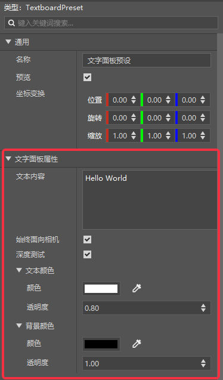
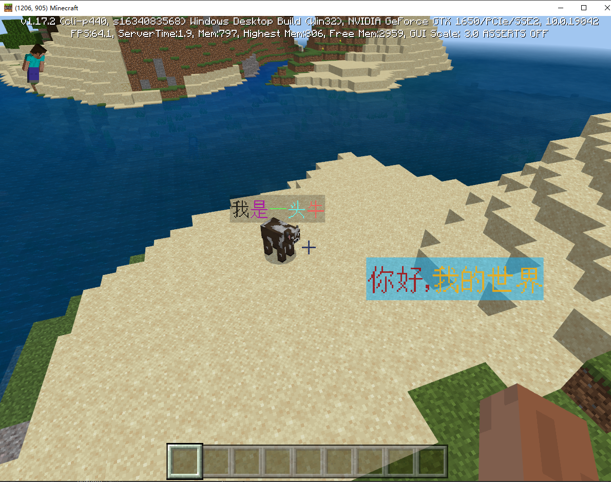
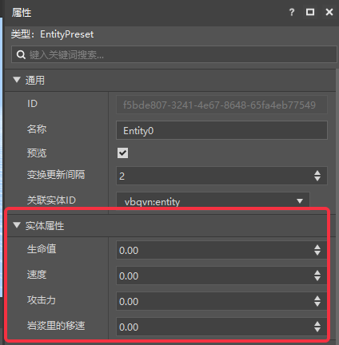
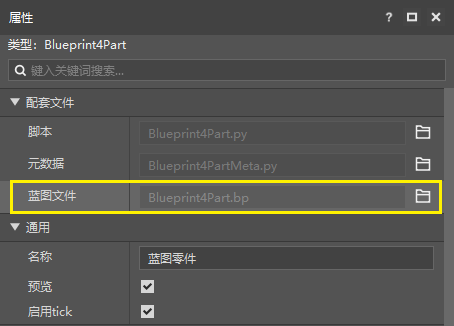
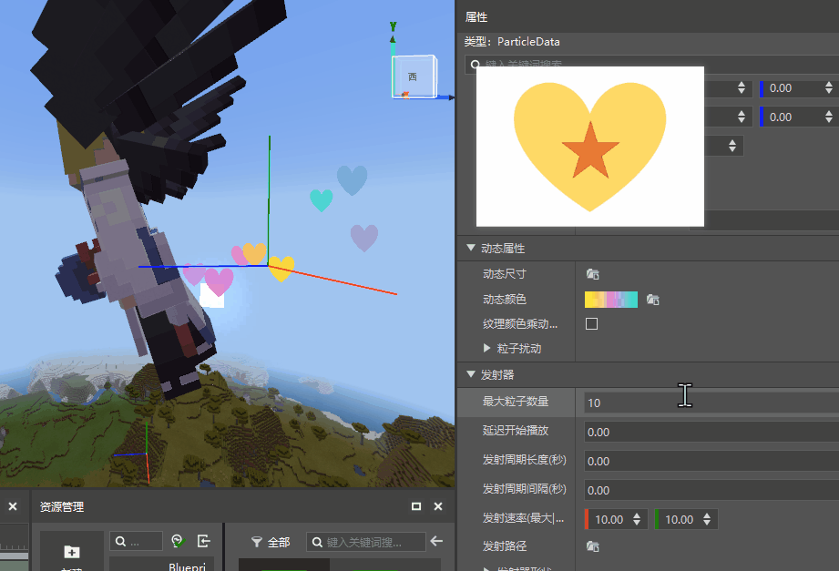

--- 
front: https://nie.res.netease.com/r/pic/20220408/5b8553e2-4a0a-4f41-9a47-c50be1bbd197.png 
hard: Getting Started 
time: 5 minutes 
selection: 
--- 
# 2022.3.15 Version 1.0.3 
## Workbench 
### Added text panel presets 

- Text panel presets can quickly customize entity names and map text signs in the editor. For details, please see [Text Panel Presets](../../20-Gameplay Development/11-Assembly Simple Gameplay/10-Presets/6-Text Panel Presets.md) 

- Text panel preset properties are shown in the figure 

 

- The text panel in-game effect is shown in the figure 

 

> Currently only effective in development and testing, the official server is expected to be launched in version 2.2, please developers arrange the development rhythm reasonably. 

### Entity preset adds attributes 

- Added four attributes: health, speed, attack power, and movement speed in magma. For details, please see [Entity Preset](../../20-Gameplay Development/11-Assembly Simple Gameplay/10-Preset/1-Entity Preset.md) 

 

> Currently only effective in development and testing, the official server is expected to be launched in version 2.1, please developers arrange the development rhythm reasonably. 

### Add blueprint parts to the part properties panel 

The blueprint part properties will now display the corresponding blueprint file. Click the open button on the right to open the blueprint directly. 

 

### New blueprint node type: enumeration node 

The new member of the blueprint node type "[enumeration node](../../20-Gameplay Development/12-Visual Programming/10-New Version Logic Editor Instructions/72-Common Nodes.md#Enumeration Node)" can help you pass in the required enumeration value more quickly. 

 

### Particle dynamic color overlay 

You can now choose to have the particle's dynamic color overlay the original color of the particle map instead of directly overwriting it 

### Other updates 

- When there are multiple bb models in a folder, support selecting a specific model json file to import 
- Server modrequest.json supports mods that are not in the plugin directory 
- The launcher adds icons for the developer's B station and QQ group, welcome everyone to follow and join the group 
- Add modification time operation to cloud list works 
- Other experience optimizations 

## Module SDK Beta 

- This update includes the 2.1 beta package update of the module SDK. As shown in the figure below, you can use Beta2.1 for testing during development and testing. 
- For details, refer to <a href="../../../mcdocs/1-ModAPI/Update Information/2.1.html" rel="noopenner">ModAPI Update Information</a>. 

 

## Bedrock Edition Server Launch Tool 

- For details, please refer to <a href="../../../mcdocs/2-Apollo/0-Apollo Update Information.html" rel="noopenner">Apollo Update Information</a>. 

