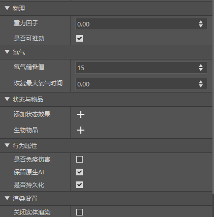
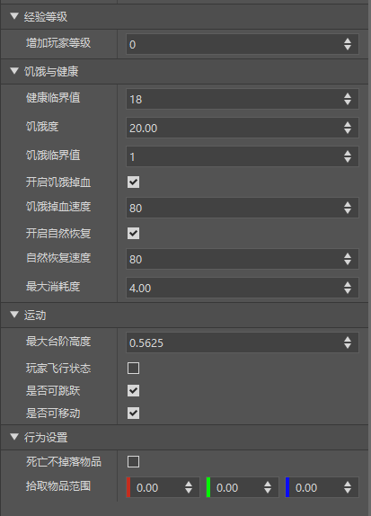
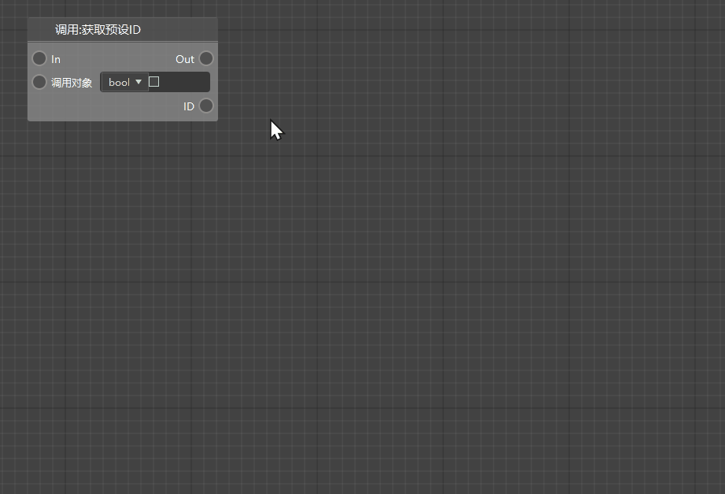

# 2022.3.1 Version 1.0.2 

### Presets support more properties 
- Player presets and entity presets have added multiple setting property columns. Developers can quickly set properties in the property panel. For details, see [Entity Presets](../../20-Gameplay Development/11-Assembly Simple Gameplay/10-Presets/1-Entity Presets.md#Setting Properties) and [Player Presets](../../20-Gameplay Development/11-Assembly Simple Gameplay/10-Presets/2-Player Presets.md#Setting Properties) 
- Entity setting properties are shown in the figure 
- Player settings properties as shown in the figure 

> Currently only effective in development and testing, it will be officially effective in the Chinese version 2.1 

### Blueprint supports node intelligent association 

- Automatically detect the port type of the node, hide the nodes that cannot be directly connected, and be compatible with the search function to help developers find the required nodes faster. 
- You can choose whether to turn on the node association function in the "Enable Association" checkbox at the top of the node list. 

 

### Other editor updates 

- The editor supports the blocks of the "Caves and Cliffs" version 
- Reduced the redundant parameter input boxes of some blueprint nodes, and further reduced the performance consumption when loading blueprint files, and improved the loading speed. 
- Other experience optimization, bug fixes and performance improvements 

### Apollo 
- For details, please refer to <a href="../../../mcdocs/2-Apollo/0-Apollo update information.html" rel="noopenner">Apollo update information</a>. 

