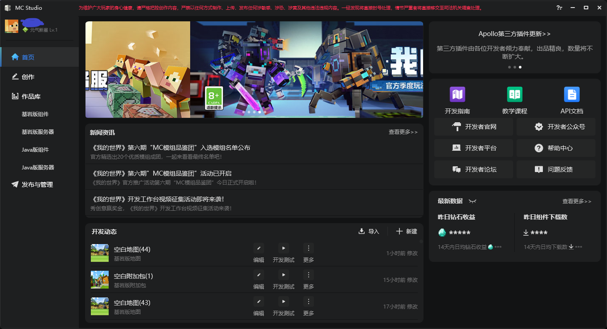
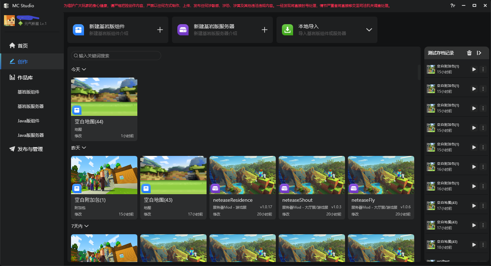
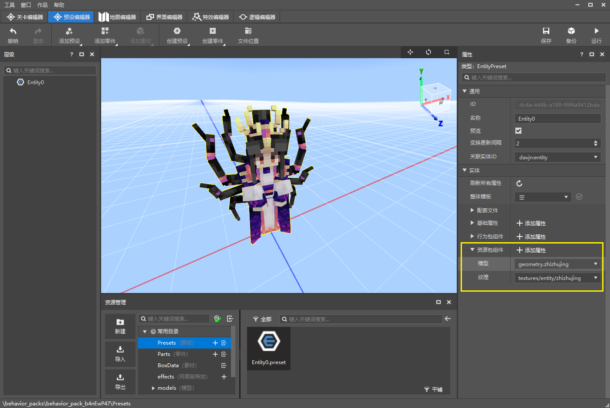

# 2022.1.20 Version 1.0.0 

Wish all developers a happy new year! ! 

### Launcher revision 

- Overall visual upgrade and interaction optimization 
- New homepage: Provides you with information closely related to developers, such as news information, update information, common function jump entrance, latest data of works, recent development dynamics, etc., as shown in the figure. 

 

- The recent page is upgraded to the creation page: It integrates the creation, import and export of works, start editing, development testing, jump publishing and other module creation-related functions, and also provides the time flow of works. Developers can manage their own workflow in the creation page. 

 

### Special Effects Editor supports original model particle optimization 

- The selected Bedrock Edition model group and anchor point can be highlighted in the preview window to facilitate developer positioning 
- After Microsoft particle effects are attached to the model, there is no need to restart the embedded game and they can be played directly 
- The configured Bedrock Edition model can now be directly applied to the entity preset 

 

### Other updates 

- Add more checks when Apollo completes configuration 
- Optimize hot update during the Apollo development phase, and optimize server hot update prompts 
- After opening the currently edited work directory from Windows, you can batch drag and drop special effect files to the skeleton for attachment 
- When testing Java modules, you can no longer select the Java version (Java 8 is used uniformly) 
- Other usability optimizations, performance optimizations, and stability improvements 
