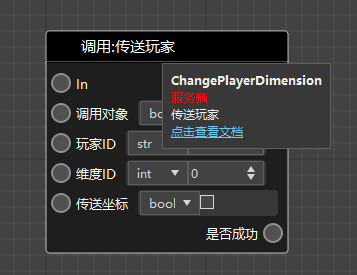
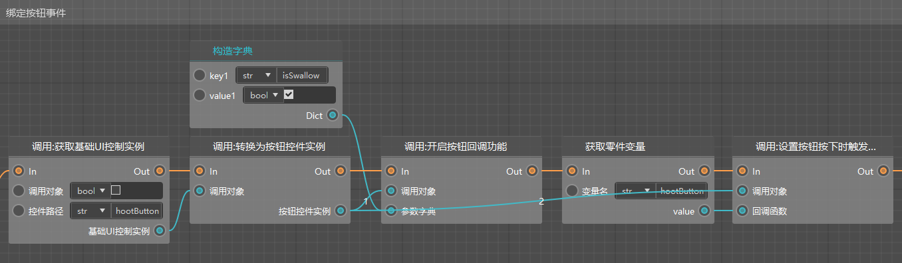

# 2022.1.6 Version 0.17.7 

This update only includes the new version of the editor. The update of the old version of the editor needs to wait for the next version. 

### Logic Editor Centralized Optimization 

- Default layout optimization 
- More detailed instructions and jump links are added to the mouse hover prompt of the node (see Figure 1 below) 
- The input box of the node return value is deleted, and the return value is supplemented with type and translation (see Figure 1 below) 
- The currently missing nodes (such as the interface of the UI control) are supplemented (see Figure 2 below, in the blueprint simple template) 
- A large number of parameters that should not be modified are blocked 
- The abandoned interfaces are blocked 
- The blueprint template built into the studio is updated 
- The same-name and same-function interfaces on the client and server are merged into one node 

 

 

### Special Effects Editor supports Microsoft particles 

- Import Microsoft particles: related json and texture import working directory 
- Bind Microsoft particles to Bedrock Edition model nodes: including add, delete, undo, copy, and paste operations 
- Play Microsoft particles while playing Bedrock Edition model actions 
- (If the actions of your Bedrock Edition model are all composed of uppercase letters, they will be automatically converted to lowercase) 

 

### Other updates 

- Hot update of Apollo network service during the open launch phase, the server can be hot updated to the next uncensored version of the current version 
- The code of sequence frame special effects has been refactored 
- Update Java client and fix log4j2 
- Other usability optimizations, performance optimizations and stability improvements 

