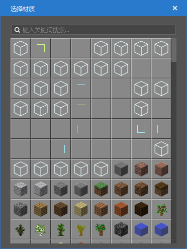
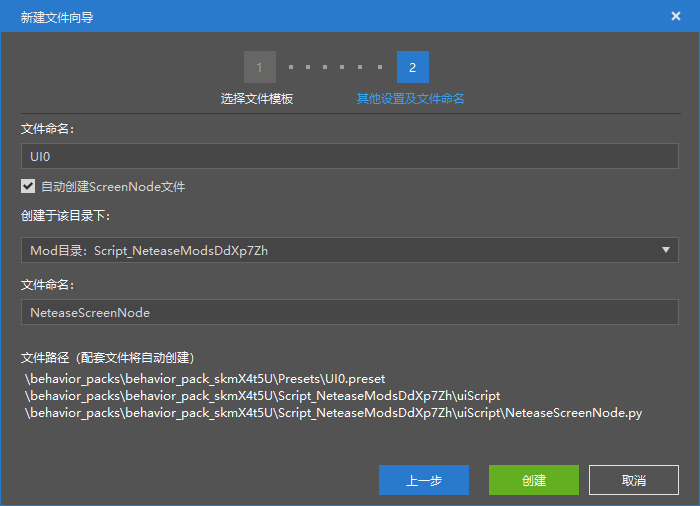

# 2021.12.23 Version 0.17.5 

This update only includes the new version of the editor. The update of the old version of the editor needs to wait for the next version. 

### Map Editor supports custom blocks 

The map editor's selection and editing functions have added support for custom blocks. Your custom blocks will be displayed at the top of the material list. 

 

### Special Effects Editor supports Bedrock Edition models 

Currently supports importing Bedrock Edition models, previewing, action list display and action playback. 

 

### New File Wizard Centralized Optimization 

- Added Template Presets Paging 
- Added Parts Paging, including Parts and Template Parts 
- Interface presets and ScreenNode scripts always go hand in hand, especially for Blueprint developers. We have simplified the steps of using the interface through interface presets. Now when creating a new interface preset, you can choose to create and bind the ScreenNode script at the same time. 

 

### Other Updates 

- You can create copies of presets and parts through the right-click menu of the Resource Manager 
- Optimized preset saving 
- The stage will record the expansion and collapse of instance entries 
- Optimized entity preset performance, part tick performance 
- Other performance optimizations and stability improvements 

