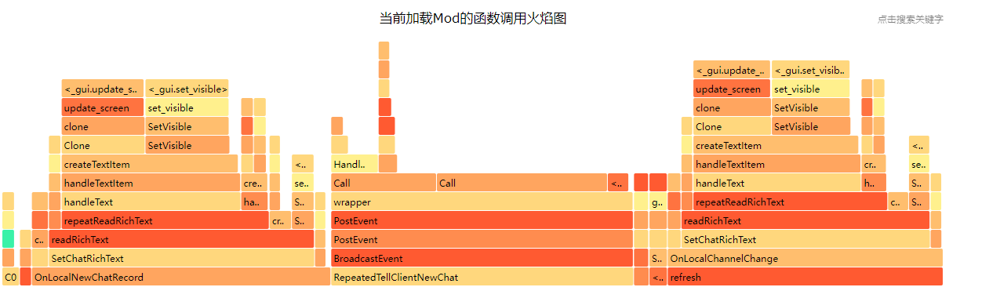
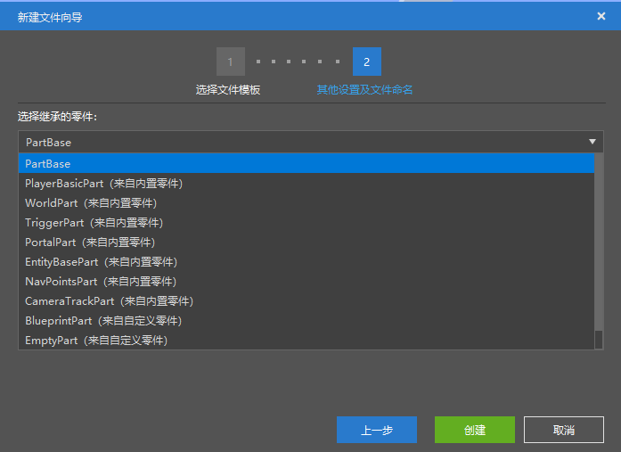
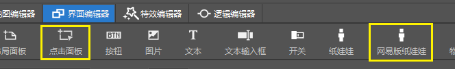
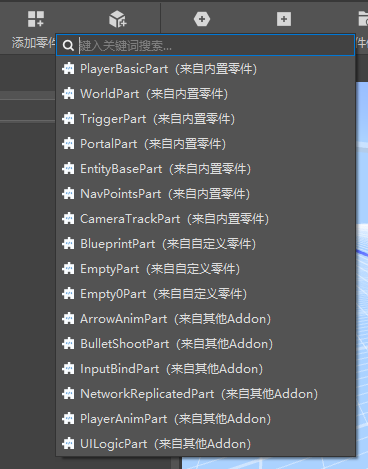

# 2021.12.9 Version 0.17.4 

### Apollo Performance Optimization Tool 

We provide a script performance monitoring tool for server developers. You can select the server to monitor, and after monitoring for a period of time, you can obtain the flame graph of the script function calls during this period, and optimize the code according to the flame graph. For details, see [Performance Optimization Tips](../../27-网络游戏/课5：实用知识/第16：Performance Optimization Tips.md). 

 

### Choose inheritance when creating parts 

When creating parts, you can choose to inherit built-in parts or other customized parts. 

Inheritance is object-oriented content. After using inheritance, in addition to the part code being inherited, the information of the part's property panel will also be inherited. 

 

### New controls added to the interface editor 

Added the following controls 

- Click on the panel to respond to mouse events, such as making a draggable panel 
- NetEase version of paper dolls 

 

### The editor supports attaching preset parts from other AddOns 

As shown below, when editing a work, check the desired add-on package, and then you can use presets and parts from other AddOns when assembling presets. 

Other resources, such as pictures, materials, etc., are still not supported in the editor, but they are effective in the actual game. 

 

### Special Effects Editor 

- Re-added the export of special effects and display of skeletons 
- Added the option to freeze Steve's pose 
- You can now undo changes to special effects, and delete points/special effects/skeleton in the model mounting panel 

### Other updates 

- Record the opened directory when selecting materials 
- Apollo script test supports \n escape character 
- Network service Mod configuration optimization 
- The logic editor blocks unsupported part event nodes (replaced with server/client events with the same function) 
- When importing resource packs, uncheck the files with the same name by default 
- Other performance optimizations and stability improvements 

