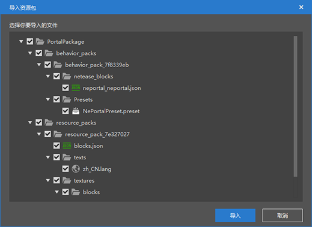
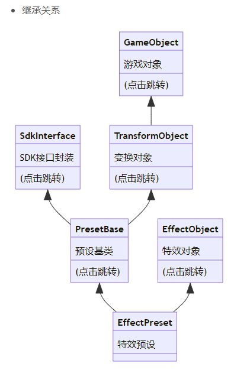
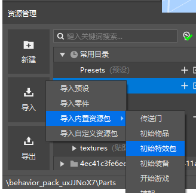
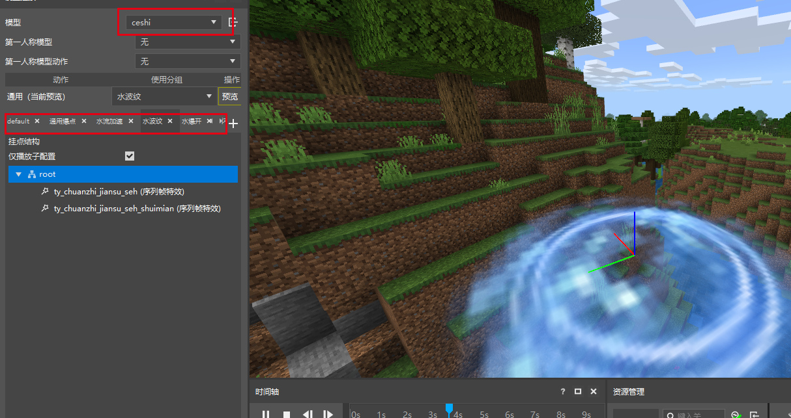
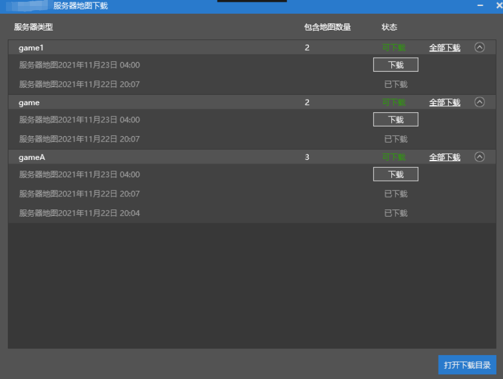

# 2021.11.25 Version 0.17.3 

### Resource pack supports AddOn 

Resource packs used to only support maps, but now they support AddOn. You no longer need to look at the type when importing resource packs. 

### Display more content when importing resource packs 

When importing a resource pack, the content in the resource pack is directly displayed, and you can only check some of the content. 

 

### The inheritance relationship of the Preset API is represented in the form of a graph 

As shown in the figure below, click on the class to jump to its api document, such as <a href="../../../mcdocs/3-PresetAPI/Preset Object/General/Transformation Object TransformObject.html" rel="noopenner"> Transformation Object TransformObject </a>. 

 

### Initial special effects package 

We have added some official special effects to the built-in resource package of the new version of the editor. You can import them in this way at the location of the picture below. 

 

Open the special effects editor and switch the model to ceshi. Different special effects are bound to different groups. 

 

### Network server map download function 

Added Apollo server map download function, you can select server-more-download server map to download. 
Only game servers that have checked "Save map" can perform the above download operation. 

 

### Other updates 

- Registered but uncertified developers can also use Studio! (You still need to authenticate to use more features) 
- Network service function menu optimization 
- Other issues fixed and performance optimized 
- The hierarchy menu of the preset editor allows dragging objects to change their positions 
- In the hierarchy menu of the preset editor, different types of objects will be classified (materials, presets, parts). Note that the parent-child relationship of presets will not be affected 
