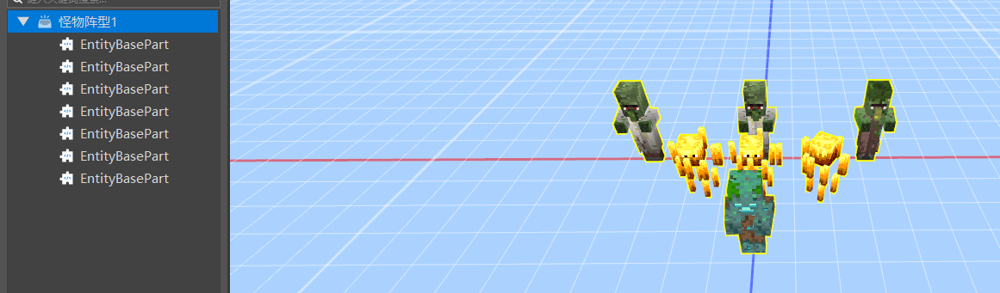
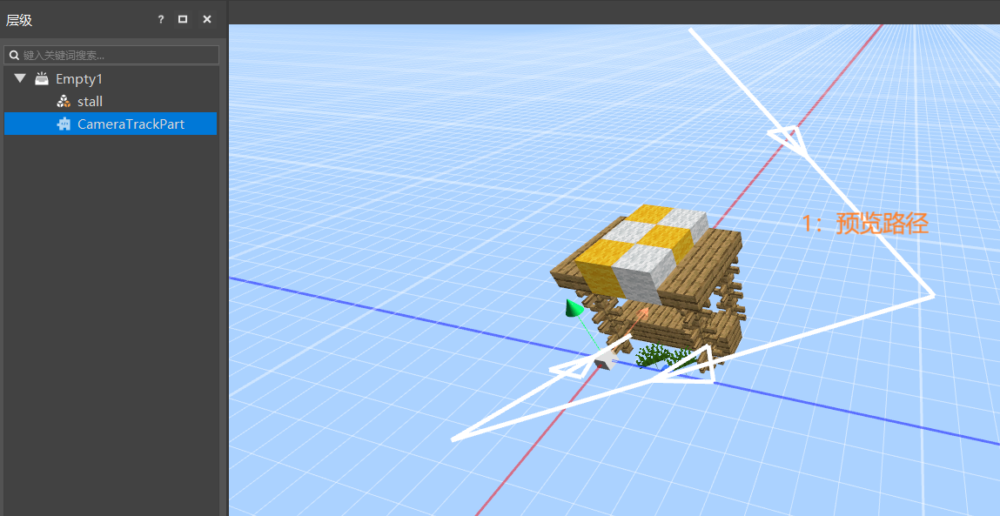
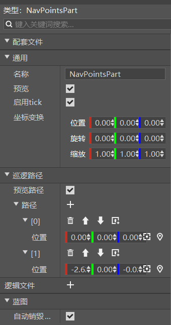

# 2021.11.11 Version 0.17.2 

### Logic Editor Rework 

After a long wait, we bring you a completely reworked logic editor. 

 

The new version of the logic editor has replaced the existing logic editor in the new version of the editor. You can quickly understand it through this video: [First Blueprint Module (Video)](../../20-Gameplay Development/12-Visual Programming/00-First Blueprint Mod/00-Tutorial Video.md). 

Compared with the original logic editor, the main changes of the new version of the logic editor are as follows: 

- The organization of icons is updated to node style 
- The usage method changes from attaching ets files to world components to using blueprint parts 
- All interfaces of the module SDK are provided, and the support for Python native interfaces is greatly expanded 
- Support for writing client logic (special effects, sound effects, models, animations, etc.) 
- Independent variable management 
- More starting events, complete event system support 
- Support for writing UI blueprints 

For details, please refer to the series of documents of the new version of the logic editor: [Overview of the redo of the logic editor] (../../20-Gameplay development/12-Visual programming/10-Instructions for the use of the new version of the logic editor/01-Understanding the new version of the logic editor.md). 

At present, the new version of the logic editor theoretically supports most of the functions of making modules, and everyone is welcome to try it. 

### Physical Parts 

New built-in parts, which can be attached to other presets and used for monster spawning and other needs, see [Physical Parts](../../20-Gameplay Development/11-Assembly Simple Gameplay/11-Built-in Parts/04-Physical Parts.md) 

 

### Camera Track Parts 

New built-in parts, which can be used to edit camera tracks and control the camera to play in real time in the game, and can be used for map display cutscenes, see [Camera Track Parts](../../20-Gameplay Development/11-Assembly Simple Gameplay/11-Built-in Parts/03-Camera TrackCameraTrackPart.md). 

 

## Path point parts 

New built-in parts for visually editing a series of path points. For details, please refer to [Navigation path parts](../../20-Gameplay development/11-Assembly simple gameplay/11-Built-in parts/05-Navigation path parts.md). 

 

### Other updates 

- Added a viewport toolbar above the editor's preview window 
- Copy preset function 
- Accurately adjust the resolution of the development kit 
- Support 1.12.0 original model format 
- The special effect editor supports adjusting the speed when previewing the animation 
- Special effect attachment supports copying groups

- Performance optimization, experience optimization and stability improvement 
