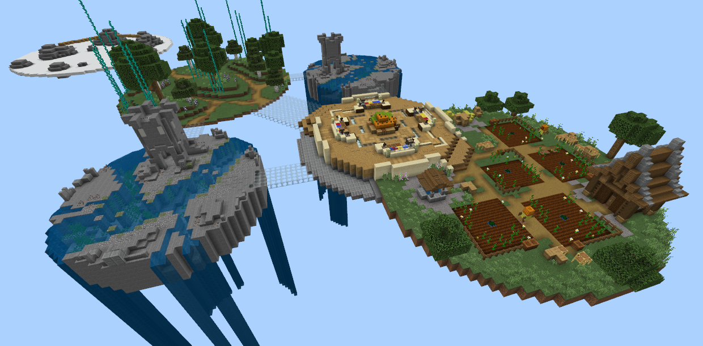
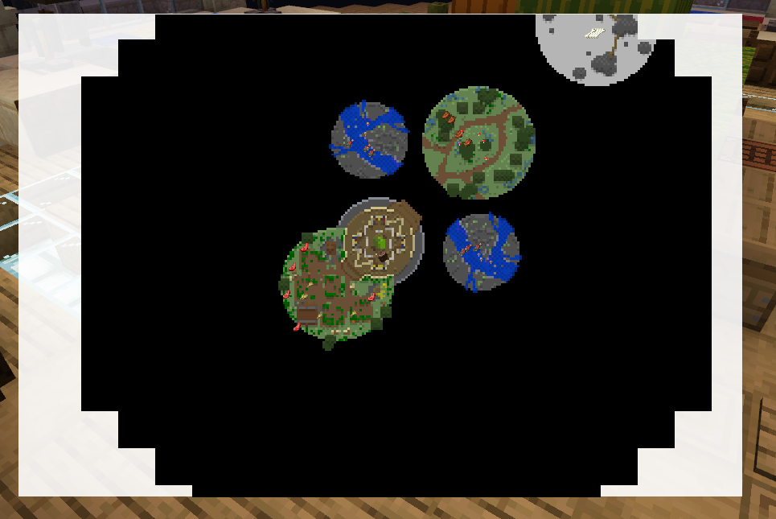
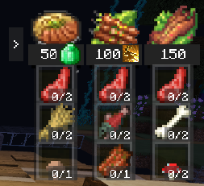
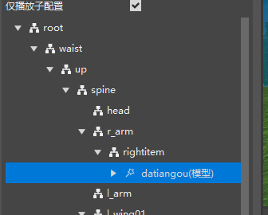
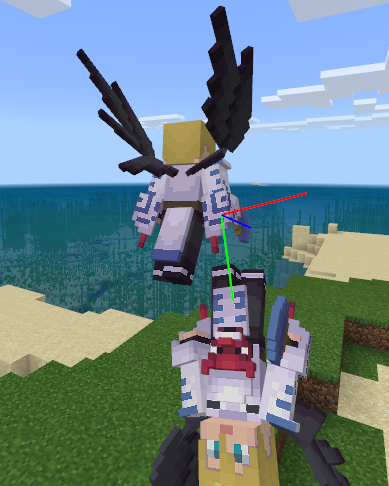
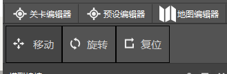

# 2021.10.14 Version 0.17.1 

### New template: Cooking God Battle 

This is a gameplay map template for a complete game. It has a certain size and includes the comprehensive application of various systems. It is recommended to learn this template after learning the simple shooting template. It is currently recommended to use the old version of the editor to open this template for learning and testing. 

Cooking God Battle is a scoring cooking game. The map of the competition includes a preparation area, a central kitchen, and several resource areas. 
After the game starts, players need to kill monsters in the resource area to collect resources, and bring the resources back to the central kitchen to synthesize food to get points. 
The synthesis of food is achieved through custom recipes and has a permanent UI prompt. 
Cooking God Battle also includes some skills and props. 
The resource area will automatically refresh monsters and other resources according to the rules. If the player steps on the blocks in the farthest resource area, they will disappear within a few seconds. 
This template also includes a permanent mini-map that can display the positions of various players and creatures in real time. The mini-map also has an expansion function. 

 

Chef God Contest uses the mini-map of Mod SDK. All resources that can be synthesized can be displayed in the mini-map. Click the mini-map to enlarge. 

 

Here is the recipe, which shows the food that can be synthesized in the current round. 

 

Note: Please do not directly put the Chef God Battle template on the resource center or put it on the resource center after slight processing. 

### Special Effects Editor supports the attachment of bone models 

You can add a bone model by right-clicking the bone node of the bone model. 

 

As shown in the figure below, the attachment and editor preview functions are currently supported. The interface actually attached in the game according to the attachment file will be released later. 

 

### Optimization of the movement and rotation handles of the hanging points 

The handles of the hanging points are now uniformly adjusted in the upper left corner of the special effect editor, and the currently displayed handle is always the handle of the currently selected hanging point. 

 

### Other updates 

- The configuration panel displays Chinese names 
- Parts hot update optimization 
- Parts attribute panel attributes use regular optimization 
- The configuration add feature interface can be double-checked, and multiple features can now be added at one time 
- Biological generation, custom feature distribution rules have been added to the configuration 
