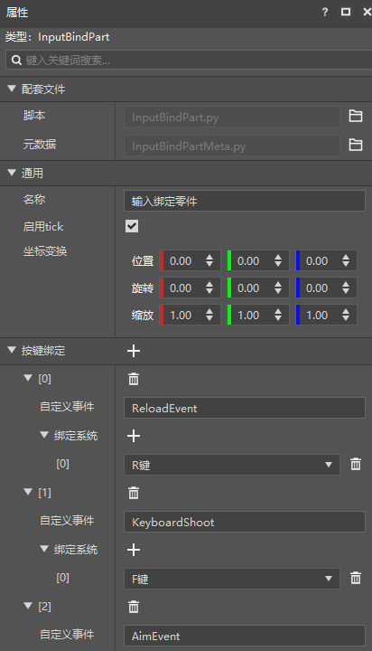
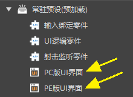
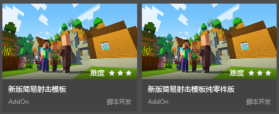

# 2021.9.24 Version 0.17.0 

### Mobile Mod Adaptation PC Optimization (New Version) 

The new version of the editor adds a key binding part, through which you can bind the keyboard keys to custom events. 

 

The new version of the simple shooting template has been updated and adapted to the PC by using the key binding component. As shown in the figure below, there are two UI presets under the resident presets, namely PC and PE interfaces. Different presets are used according to different platforms. For details on how to adapt, please move to [Adaptation PC Document](../../20-Gameplay Development/19-Mobile Computer Adaptation/1-PE Module Adaptation PC.md). 

 

### New version of simple shooting template pure parts version 

Now there are 3 versions of simple shooting templates in Studio, they use different code architectures, you can view different templates according to your needs 

- Old version: pure Mod SDK architecture 
- New version: projectile part uses entity presets, some player-related logic uses player presets, and the rest uses Mod SDK architecture 
- New version of pure parts version: pure preset architecture 

 

### Other updates 

- Trigger parts add api to get all entities in the current area 
- Apollo hot update optimization 
- Team components converted to parts 
- When creating a new ScreenNode using the New File Wizard, you can choose to place it in the Mod or Parts Catalog 
- A new batch of preset APIs, for details, refer to <a href="../../../mcdocs/3-PresetAPI/Update Information/1.24.0.html" rel="noopenner"> Preset API Update Information </a> 
- Overall optimization of the preset architecture 
- Performance optimization and bug fixes 
