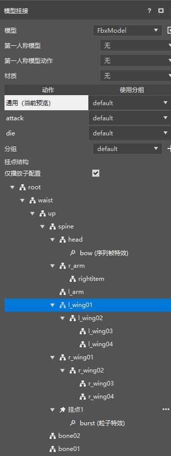
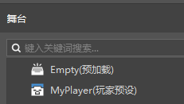
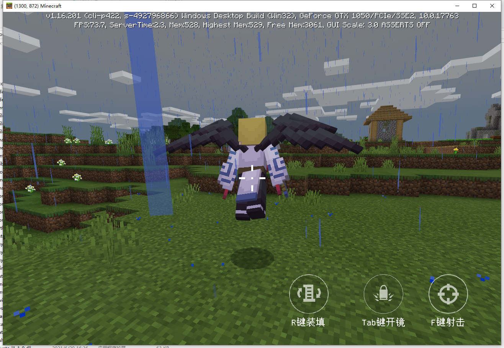

# 2021.9.9 Version 0.16.19 

### Effect Hook Rework 

Effect Hook now permanently displays all actions and bone structures. 

Effects can now be hung directly on bones (you can still right-click on bones to create hooks and hang effects on hooks). 

Both the new and old editors have received this update. 

 

### Preloaded Preset Optimization 

Checking on preloaded presets and player presets will now automatically display on the stage. 

And instances of preloaded presets and player presets on the stage no longer display coordinate transformation properties and transformation handles. 

You can use preloaded presets to make Add Ons, the relevant document is here (../../20-Gameplay Development/14-Preset Gameplay Programming/0-First Preset Mod/7-Use Preset to Make AddOn.md). 

 

### Mobile Mod Adaptation PC Optimization 

The old version of the editor has added a key binding component, through which you can bind keyboard keys to custom events. 

 

The simple shooting template has been updated and adapted to the PC by using the key binding component. The effect is as shown below. 

For more information on how to adapt, please visit [Adaptation to PC Document](../../20-Gameplay Development/19-Mobile Computer Adaptation/1-PE Module Adaptation to PC.md). The adaptation of the new version of the editor will be updated later. 

The cost of adapting the Mod from the mobile terminal to the computer terminal is not high, but it can increase the income of developers. Welcome everyone to actively adapt and synchronize your mobile terminal components to the computer terminal. 

 

### Other updates 

- You can turn on and off the special effect preset stroke in the level editor 
- Preset API document optimization 
- When importing resource packs, automatically merge the player presets and entity presets bound to the same entity 
- Add some comments when creating new parts 
- Now supports importing FBX model files without animation 
- Other problem fixes and stability optimization 
