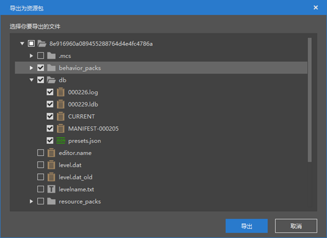
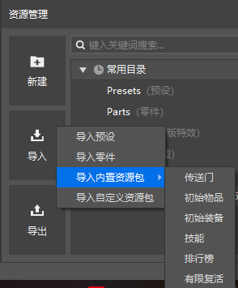
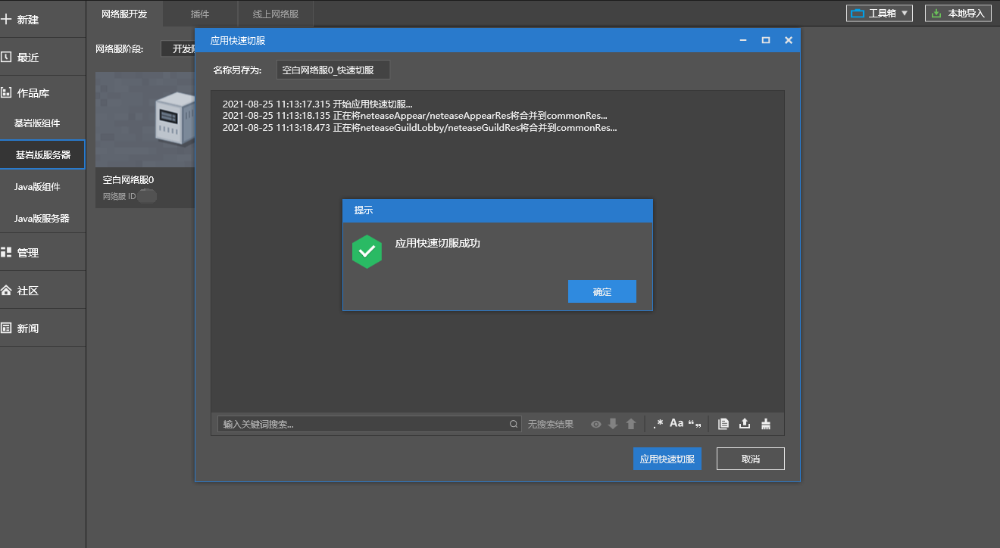
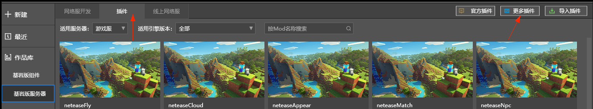
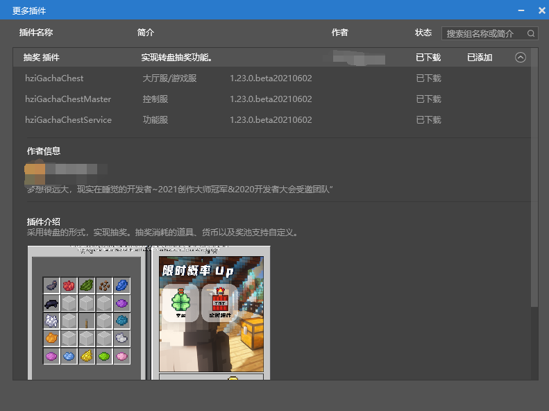

# 2021.8.26 Version 0.16.16 

### Import and export resource packages 

We added the built-in resource package structure in the previous version. In this version, you can export/import your own resource packages. For details, please refer to the [Resource Package](../../15-Resource Management/10-Resource Package.md) document. 

 

### Player-related parts return 

The player-related components of the old level editor have been returned as parts. You can add them through the import built-in resource package function of the resource manager. 

The returned modules are as follows: 

- Initial Items 
- Initial Equipment 
- Skills 
- Rankings 
- Limited Resurrection 

 

### Part Code Optimization 

Part syntax now only needs to support python2. For example, the following writing methods will no longer produce errors. 

```python 
for i in xrange(1, 5): 
print(i) 
print i 
print 1 <> 2 
print `1+2` 
``` 

In most cases, you can import in the file header of the part, and import is no longer limited to functions. 

```python 
from Preset.Model.PartBase import PartBase 
import random 
from Preset.Model.GameObject import registerGenericClass 
from Config import A, B #Config.py is a file in the same directory, A and B are functions/classes in Config.py 
from mod import client 
from mod.client import extraClientApi 
from mod.server import extraServerApi 
``` 

### Apollo Quick Server Switching 

For game types that require frequent server switching (such as mini-games), we provide a quick server switching function. For details, please refer to the [Quick Server Switching](../../27-Network Games/Course 5: Practical Knowledge/Section 11: Quick Server Switching.md) document. 


 

### Apollo third-party plug-ins 

Added a "More plug-ins" tab to view and download the official collection of third-party plug-ins. 

 

 

### Other updates 

- Optimize Unicode encoding issues 
- Optimize new parts 
- Optimize part syntax error prompts 
- A batch of new preset APIs, for details, refer to <a href="../../../mcdocs/3-PresetAPI/Update Information/1.23.3.html" rel="noopenner"> Preset API Update Information </a> 
- Bug fixes and stability optimization 
