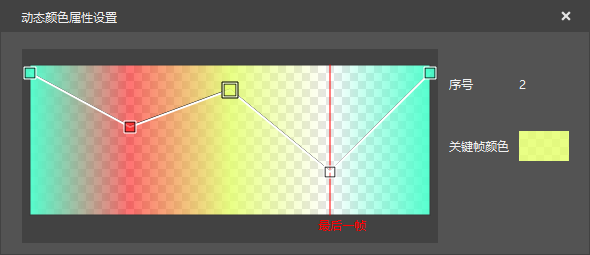
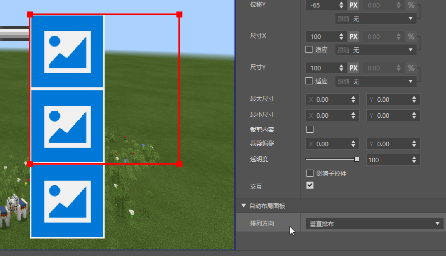
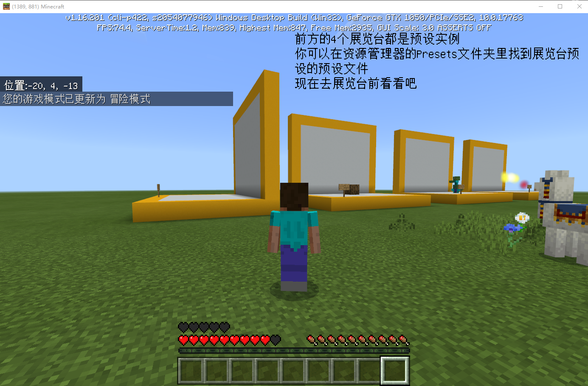
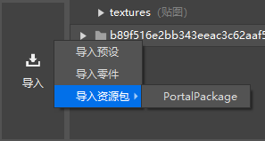
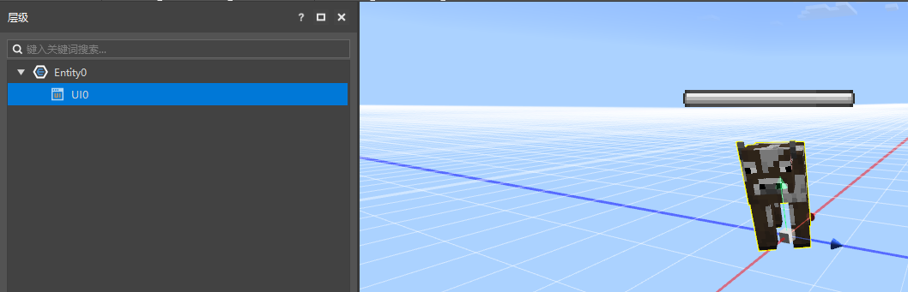
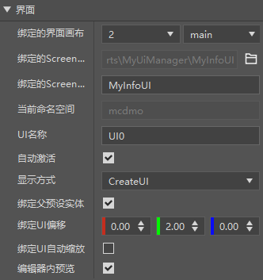
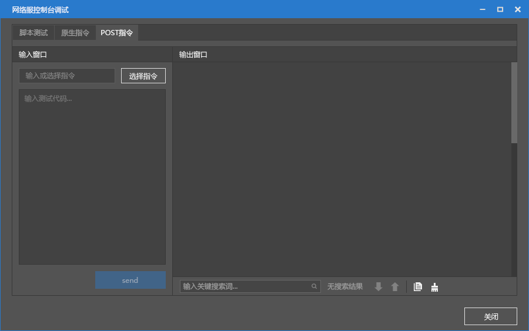

# 2021.8.12 Version 0.16.15 

### Sequence frame supports dynamic color 

Sequence frame effects now support adjusting the color of each frame. 

 

### Layout panel 

The interface editor adds a layout panel control. 

The controls under this panel control can be automatically arranged, and there are two arrangement modes to choose from: horizontal and vertical. 

 

### The development package supports rotation and scaling of materials 

Now you can preview rotated and scaled materials normally in the mod PC package. 

Block presets can be rotated, but cannot be scaled. 

Note: If you want to take effect on the mobile terminal, you still need to wait until the Chinese version of Minecraft 1.24 

 

### Portal presets 

Use the new version of the editor's resource manager to import resource packs to import portal presets. 

Imported resources include NePortalPreset (preset), and netortal:neportal (block configuration). 

This function is the same as the portal component function of the old editor-level editor. 

 

### Interface presets 

The preset architecture has added a new preset, the interface preset. 

You can create a UI preset and place it in the scene, or hang it under an existing preset. 

As shown in the figure below, a progress bar UI is hung under the entity preset (cow). 

 

The interface preset provides a series of parameters. For detailed introduction, please refer to the document [Interface Preset](../../20-Gameplay Development/11-Assembly Simple Gameplay/10-Preset/5-Interface Preset.md). 

Interface presets are available in the editor and Mod PC development kit. You need to wait until the 1.24 version of the Chinese version of Minecraft to use it on mobile devices. 

 

### Apollo debugging tool optimization 

Upgrade the Apollo console debugging function, optimize the input and output display of script tests, native commands, and POST commands. 

 

### Other updates 

- Preset API documentation optimization 
- Transaction table configuration optimization 
- Some new <a href="../../../mcdocs/3-PresetAPI/Update Information/1.23.2.html" rel="noopenner"> Preset API </a> 
- Preset API (1.23.1 and 1.23.2) added to the completion library 
- Bug fixes and stability optimization 
