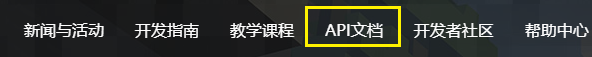

--- 
front: https://nie.res.netease.com/r/pic/20221108/151b6d0d-5ea5-43fc-a346-45c25572a2ca.gif 
hard: Getting Started 
time: minutes 
selection: 14 
--- 
# Module SDK version update 

For update information, please refer to the update information of the API document, as shown below. 

 

Or click the following link to jump 
- <a href="../../../mcdocs/1-ModAPI/Update Information/2.4.html" rel="noopenner"> 2.4 Update Information </a> 
- <a href="../../../mcdocs/1-ModAPI/Update Information/2.3.html" rel="noopenner"> 2.3 Update Information </a> 
- <a href="../../../mcdocs/1-ModAPI/Update Information/2.2.html" rel="noopenner"> 2.2 Update Information </a> 
- <a href="../../../mcdocs/1-ModAPI/Update Information/2.1.html" rel="noopenner"> 2.1 Update Information </a> 
- <a href="../../../mcdocs/1-ModAPI/Update Information/2.0.html" rel="noopenner"> 2.0 Update Information </a> 
- <a href="../../../mcdocs/1-ModAPI/Update Information/1.25.html" rel="noopenner"> 1.25 Update Information </a> 
- <a href="../../../mcdocs/1-ModAPI/Update Information/1.24.html" rel="noopenner"> 1.24 Update Information </a> 
- <a href="../../../mcdocs/1-ModAPI/Update Information/1.23.html" rel="noopenner"> 1.23 Update Information </a> 
- <a href="../../../mcdocs/1-ModAPI/Update Information/1.22.html" rel="noopenner"> 1.22 Update Information </a> 
- <a href="../../../mcdocs/1-ModAPI/Update Information/1.21.html" rel="noopenner"> 1.21 Update Information </a>