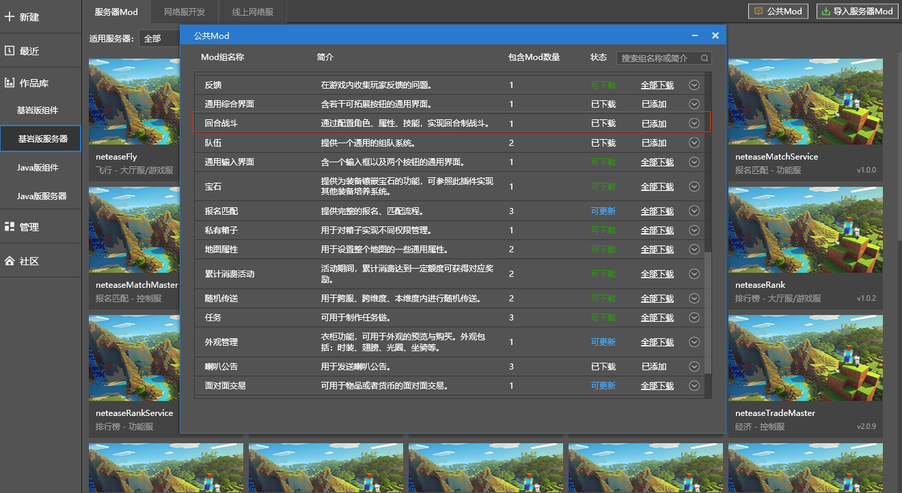

--- 
front: 
hard: Getting Started 
time: minutes 
--- 

# Version 1.23 

## Introduction 

The video includes the major features of versions 1.22 and 1.23, and introduces the new dimension templates: how to create the Nether, the End, the Super Flat World, and the Super Flat Nether; shows the game effects of virtual scenes; shows the miniature block effects and how to create them; shows the action fusion of the skeleton model and the translucent material effects. 

<iframe src="https://cc.163.com/act/m/daily/iframeplayer/?id=60ed3d3048e27490891c6702" height="600" width="800" allow="fullscreen" /> 

## Video corresponding demo 

Download address or source as follows: 

### 1. Custom dimension template 

​ [Download address](https://g79.gdl.netease.com/9d3b837a96af41958526f8e1ce373eae.zip) 

### 2. Virtual scene 

​ For details, see "Bedrock Edition Server - Server Mod - Public Mod - Turn-based Battle"  

### 3. Miniature Blocks 

​[Download address](https://g79.gdl.netease.com/micro_block_zhanshi.zip) 

### 4. Skeleton model supports action fusion and translucent materials 

​ [Download address](https://g79.gdl.netease.com/AnimRemixMod.zip)