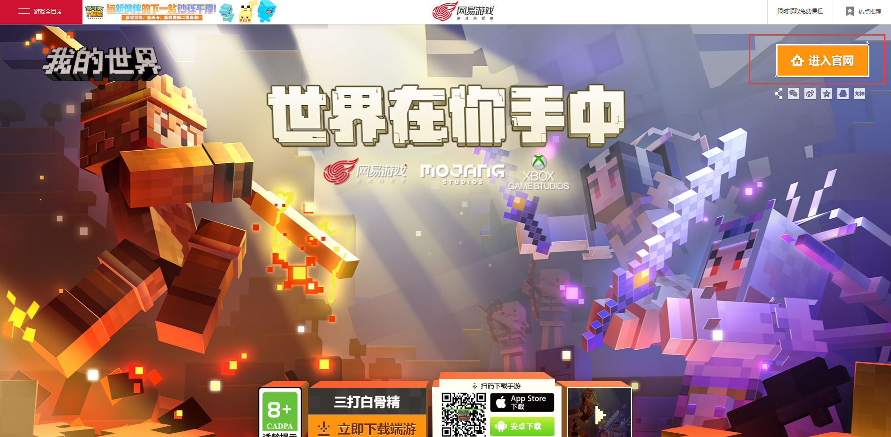
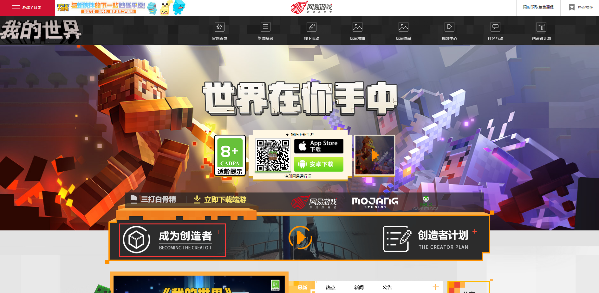
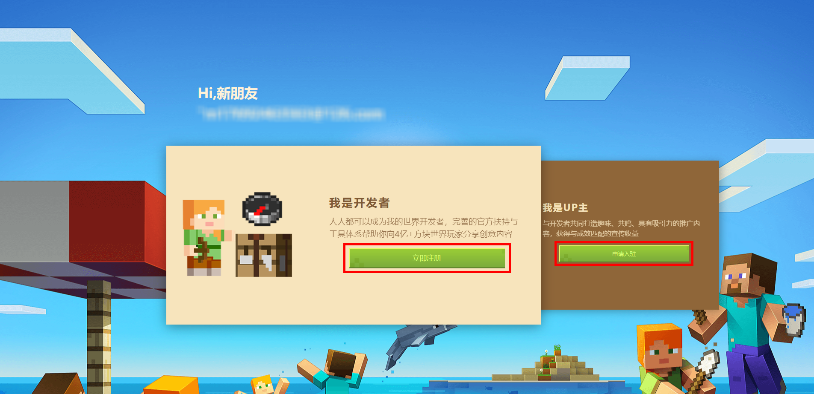
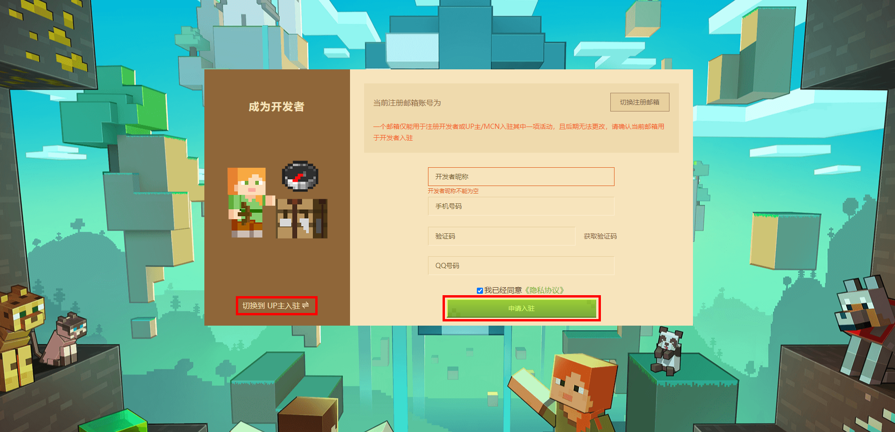
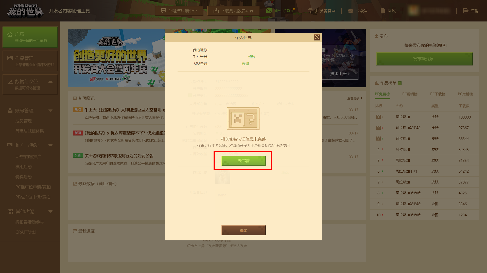
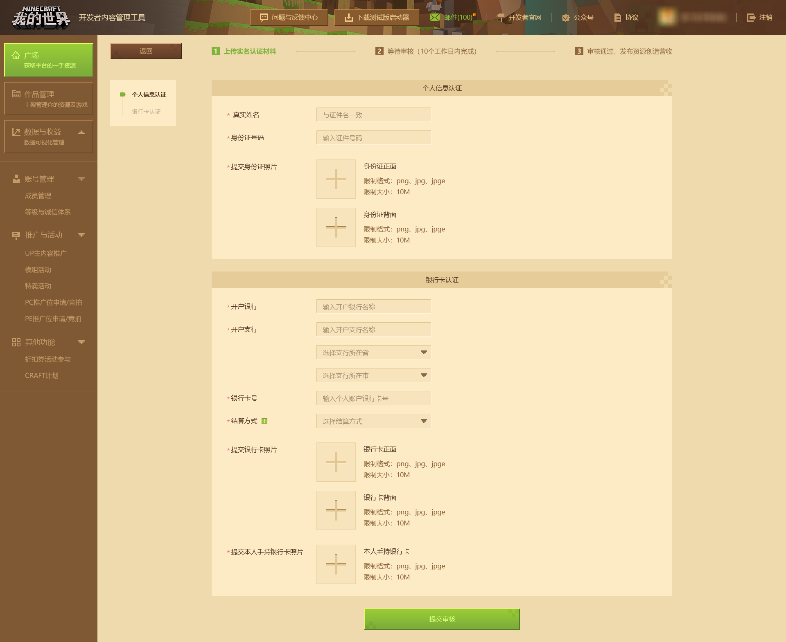
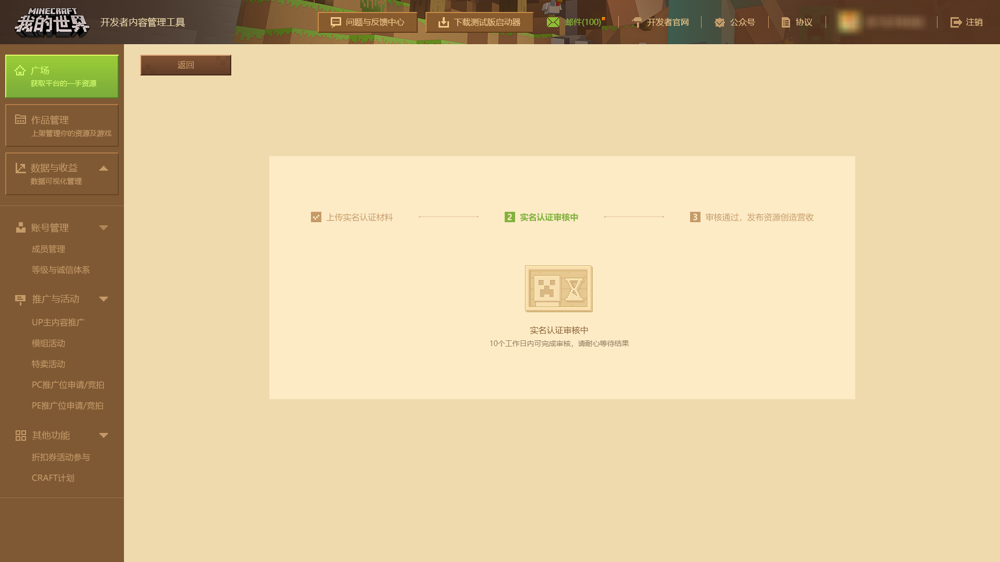

--- 
front: https://mc.163.com/dev/mcmanual/mc-dev/assets/img/0_3.28c76d80.png 
hard: Getting Started 
time: 10 minutes 
selection: true 
--- 
# How to register as a developer 
First, find the registration page on the **official website** ([or click here to go directly to the URL](https://mcdev.webapp.163.com/#/login) ) 

1 - In the search engine, search for "Minecraft" to find the [official website](http://mc.163.com/), and click the **[Enter the official website]** button in the upper right corner 

 

2 - In the [new webpage](http://mc.163.com/index.html ), click **[Become a creator]** button to go to the developer platform registration page 

 

3 - Jump to a new page, you can choose **Developer** or **UP主**, click the [Register Now] or [Apply for Settlement] button. (The following demonstration will take "I am a developer" as an example) 

 

4 - Fill in the information according to the prompts, check the "Privacy Agreement" and click the **[Apply for Settlement]** button. If you choose the wrong identity, you can quickly switch. (Note: The developer nickname cannot be modified after registration) 

 

5 - After successfully settling in, you need to perform real-name authentication, fill in your real name, ID card, bank card and other information, and click **[Go to complete]** to jump to the real-name authentication interface. 

 

 

After filling in the above information correctly and submitting it, wait for **real-name authentication review**. After passing, you can publish your work! 

 

## Developer Registration FAQ 

### Account Review Time 

Developer account review is generally passed within **7 working days. ** 

For developer account review, please contact the official by sending an email to **minecraftstarter@163.com**. 

Email title: [Developer Information Review Request] + Developer Nickname + Developer Account 

Email Content: 

> Developer Account: xxxx@xxx.com

> 
> Developer nickname: xxx 
> 
> Real name: xxx 
> 
> Mobile phone number: xxx 
> 
> Contact QQ: xxx 
> 
> ID number: xxx 
> 
> Submission time: xxx 

### Functional differences between developers and UP masters 

Currently, the developer platform does not support creators to switch between the two creative identities. Please carefully consider the most suitable creative form for yourself before registering. Different platform functions are available for different forms. Please see the table below for the main functional differences: 

| Creator Identity | Upload Components | Online Game Settlement | Release Bounty Tasks | Receive Bounty Tasks | Settle Income | 
| ---------- | -------- | ------------ | ------------ | ------------ | -------- | 
| Developer | ✔️ | ✔️ | ✔️ | ❌ | ✔️ | 
| UP Master | ❌ | ❌ | ❌ | ✔️ | ✔️ | 

- Upload Components: refers to [Uploading "Minecraft" works to the developer platform] (../35-Listing and Settlement/Course 05-Correct Ways and Means of Uploading Works.html), which can be put on the shelves in the resource center in the game after passing the review. 
- Online Game Settlement: refers to the online game content applied for through the "Minecraft" developer platform, so that players are no longer disturbed by time and regional factors to play online games and meet more friends with similar interests. 
- Release bounty tasks: In order to assist developers in promoting components, developers can release bounty tasks through the [**【Content Promotion】**](../40-Activities, Promotion and Revenue/Course08-Promote Works and Activities.html) function, and obtain exposure opportunities for components through **UP Master** in the form of revenue sharing. 
- Accept bounty tasks: **UP Master** can use the [**【Content Promotion】**](../40-Activities, Promotion and Revenue/Course08-Promote Works and Activities.html) function to receive bounty tasks, and expose components through their own traffic in exchange for revenue sharing. 
- Settlement of revenue: Creators can check their monthly revenue in [**【Revenue View and Settlement】**](../40-Activities, Promotion and Revenue/Course07-Revenue View and Settlement.html). If the cumulative revenue of a single platform on the computer version or mobile version reaches 1,000 yuan in the month, they can settle and withdraw in the next month. At the beginning of each calendar year, the Minecraft developer platform will open a limited-time withdrawal entrance for creators whose income is less than 1,000. Please pay attention to the broadcast email notification of the Minecraft developer platform. 

### Choose a settlement method that suits your actual situation 

When registering as a developer, you need to choose a **settlement method** (referring to the settlement of income obtained after contributing paid diamond components to the Chinese version of Minecraft). Developers should choose a settlement method that **suits their actual situation**. There are two types: 

1. Withholding and payment: Withholding by our company. Please note that this option is only for individual developers who are not companies. 

2. Self-prepared tax invoices: Issue invoices by yourself or ask the tax bureau to issue invoices on your behalf 

It is recommended that individual developers or small teams choose the "withholding and payment" settlement method, and company-type developers and individual industrial and commercial households choose the "self-prepared tax invoice" settlement method. 

### How to change the settlement information of the developer platform (such as changing the bank card, changing the settlement method, etc.) 

**Individual developers:** 

1. Click the avatar in the upper right corner of the developer platform and click "Modify settlement information" to submit the new bank information or settlement method. 
2. Before submitting the content, please make sure that the information you apply for matches the real-name information of the account. After changing the settlement information, you must wait for the review to take effect. 
3. Within 90 days after the change is successful, you will not be able to initiate a bank card and settlement type information modification application again. Regardless of whether it is passed or not, the platform will inform the review results through the developer platform email and SMS.

**Enterprise identity developer**: 

1. Changes are not supported unless there are special circumstances. If there are special circumstances, please contact the "Minecraft" developer channel management staff. 

### If the income is settled within the specified period, but the payment is not received when the payment is made 

Under normal circumstances, the payment will be received in about 30 working days after the income is settled. If the payment is still not received after the normal settlement period, please check whether your information is correct. 

1. If the bank card information is incorrect and the income cannot be received, the official will open the **"Update settlement information"** entrance for the account. Please click the avatar in the upper right corner of the developer platform as soon as possible, find the **"Change settlement information"** entrance in the personal information window, and upload the correct settlement information for review. The items that failed to be paid will be credited in the next week after the review is passed. If there is no timely change, it will affect the subsequent normal settlement process, please understand. 
2. If the payment was received normally in the past, but the payment was not received after the settlement period. You can contact us at **[Developer Platform]** - **[Developer FAQ]** - **[Feedback on other issues]**. When filling out the form, please remember to write down the **Contact information**. Under normal circumstances, the official staff will contact you through the contact information left. 
3. If you click on the settlement more than 5 days after the settlement is opened, the settlement information will be postponed to the next month. 

### I want to cancel the developer, how can I do it? 

After entering the developer platform, click the personal nickname in the upper right corner to open the **Personal Information Window**, click the **Apply to cancel the account** button, and wait for the review to pass. The cancellation application cannot be withdrawn after it is submitted, **and only one developer account is allowed to be registered with the same ID card, bank card information and mobile phone number. When the developer account is registered or cancelled, the personal information used will no longer be supported as the credential information for the second registration of the developer account. Please operate with caution. ** 
