--- 
front: https://mc.163.com/dev/mcmanual/mc-dev/assets/img/6_3.3720de82.png 
hard: Getting Started 
time: 10 minutes 
--- 
# Get to Know the Developer Platform 
***Last updated on: 2022/10/8, some function images were changed to adapt to the new page, and the introduction of several new module functions was added. *** 

After successfully registering as a developer, you can log in to the developer platform using your developer account. Plaza, work management, revenue and other functions are all here. Making good use of the developer platform is the first step to becoming a developer. 

In this tutorial, you will learn the following: 

- Understand **[Developer Platform Homepage and Toolbar](#Developer Platform Homepage and Toolbar). ** 
- Get familiar with **[Work Management Module](#Work Management Module). ** 
- Get in touch with **[Promotion and Activities](#Promotion and Activities). ** 

## Developer Platform Homepage and Toolbar 

### Minecraft Developer Agreement 

Click the **【Agreement】** button on the upper right side of the developer platform to view the developer agreement. 

The Developer Agreement launched by the Chinese version of Minecraft aims to create a healthy market environment for developers. Help developers show their creativity and gain revenue. Together, we will create a high-quality, fair, healthy and efficient content creation platform. 

 

### Square Module 

When you open the developer platform, the square module is displayed by default. In the square, you can see a lot of useful content. From left to right: 

- Technical Support: Development-related knowledge and skills can be found here. 
- News Information: Get to know the latest official activities and news information at the first time. 
- Latest Data: See the income of works under the account in the most intuitive and concise way. 
- Publish: Quickly jump to the work management page and publish works. 
- Works list: Understand the most popular gameplay themes at the moment. 

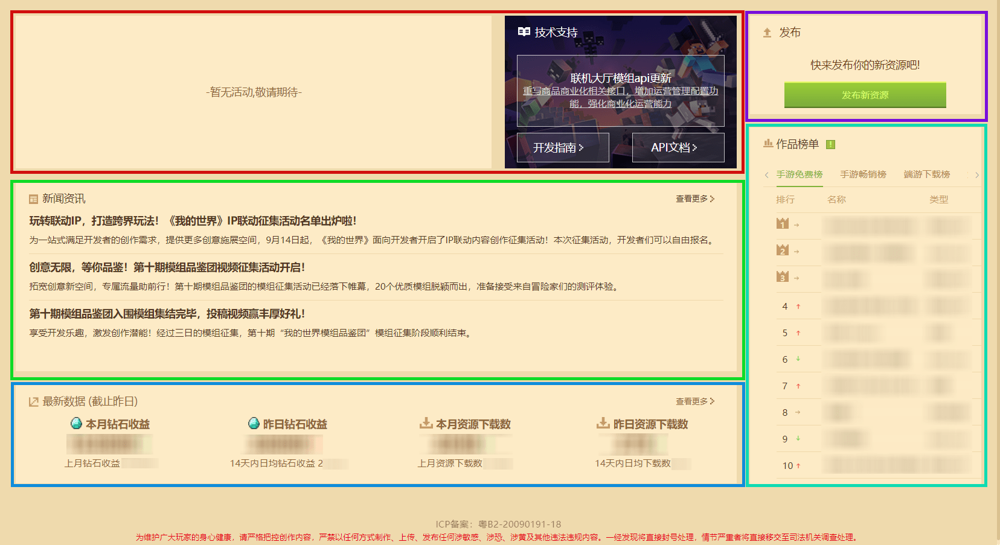 

### Questions and Feedback Center 

Click the **[Questions and Feedback Center]** button in the middle of the top of the developer platform to view it. 

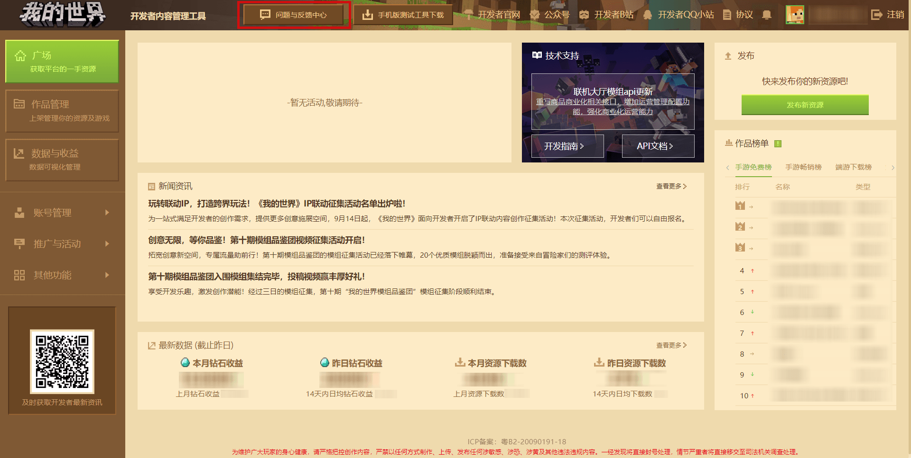 

There are many common questions here, such as: What is the developer level? , How long does it take to review a component? , etc. Select the relevant question to see the official answer! 

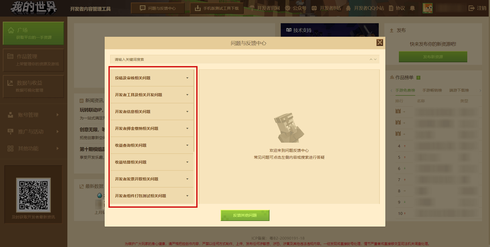 

### Test version launcher 

In order to facilitate developers to test their own mobile version components, you can use the mobile version test tool to view the component performance in the test environment. 

 

Find the **[Download mobile version test tool]** button in the middle of the top of the developer platform. After clicking it, the download QR code and button of the mobile version test tool will pop up. Select different QR codes to download according to the situation of your own mobile phone. 

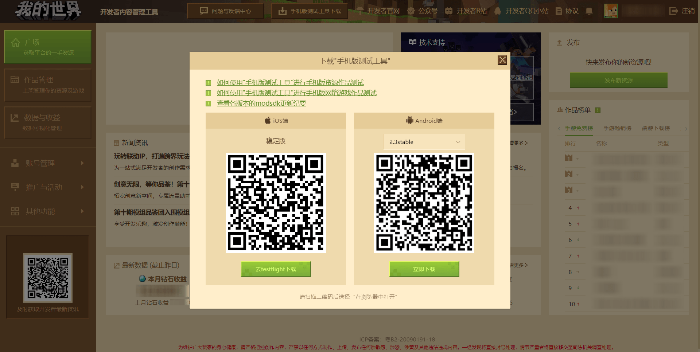 

### Developer Platform Email 

The official will provide the latest information through the platform's internal email, such as: new developer platform, game client, module development kit, Minecraft developer tool station update and other information, as well as various support plans or developer activities. 

 

Click the **[Email]** button in the toolbar above to open the mailbox and check the received emails. Developers are usually notified by email from the developer platform. Remember to check the email frequently and clean up the read emails regularly. 

### View, authenticate and modify developer information 

Click the avatar and developer nickname in the upper right corner to open the personal information, where you can view the relevant information of the developer account: real name, bank account, avatar, etc. **Please do not disclose information such as the developer platform account and password easily. ** 

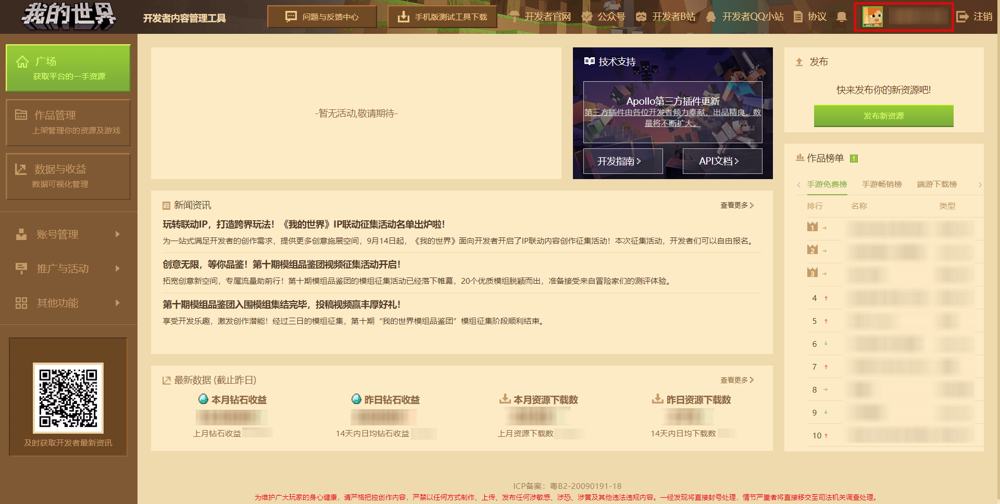 

You can add contact information (mobile phone, QQ number) here, apply for enterprise developer certification, cancel account, modify avatar, add developer information, or change settlement information that complies with regulations. 

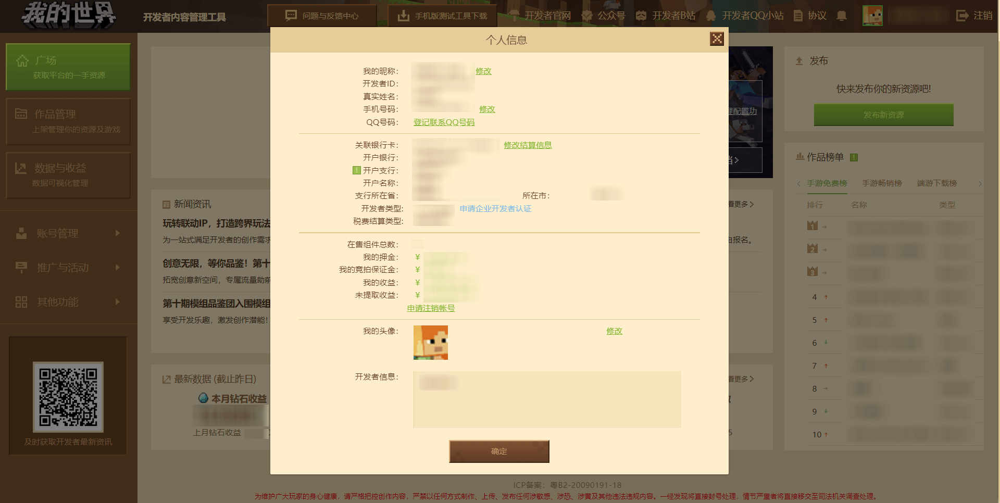 

### Join the Developer QQ Station Discussion Channel 

There is the **Developer QQ Station** application entrance in the upper right corner of the developer platform. Click to enter and scan the code to apply. Please fill in your developer email and developer nickname in the application information. The channel brings together developers from all over the world, who can learn development knowledge, participate in channel or official activities, and provide feedback to the official. 

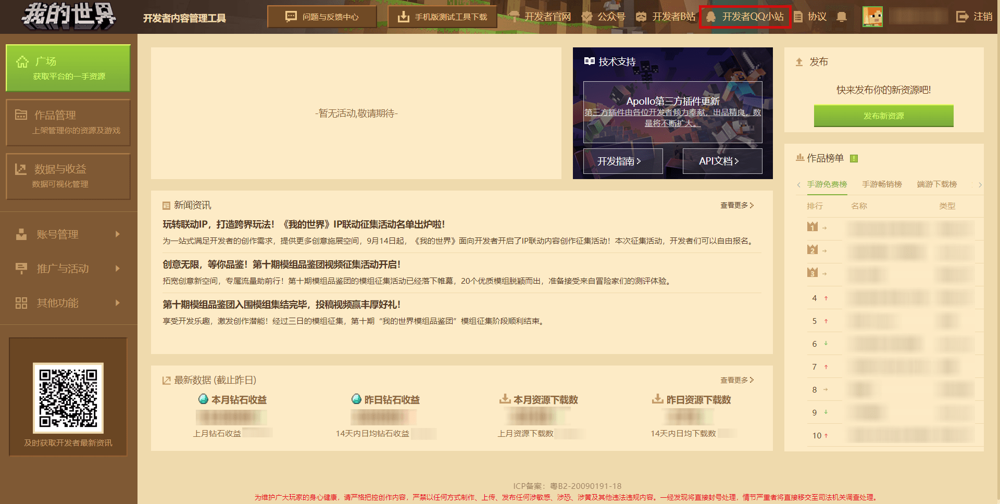 

### Follow the Minecraft official account to get the latest information 

There is a QR code for the **Minecraft Developer** official account in the lower left corner of the developer platform. Scan the code to follow and get the latest information and development skills in the development circle as soon as possible! 

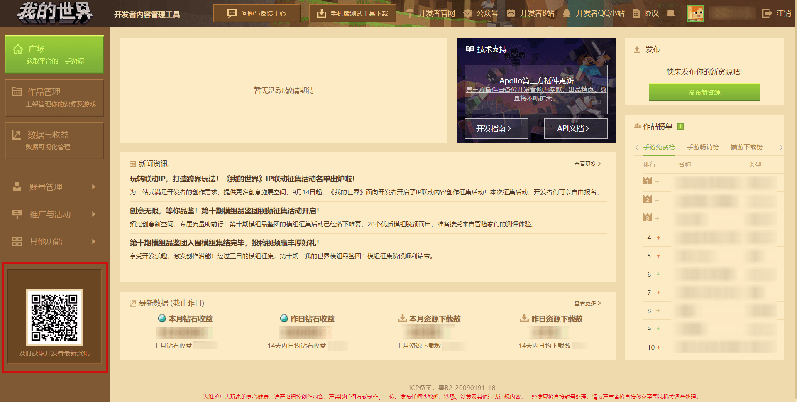 

### Subscribe to the developer's B station account to watch development tutorial videos 

There is a **Developer B station account** jump entrance in the upper right corner of the developer platform. Click it to enter and watch the latest tutorial videos in the development circle as soon as possible. 

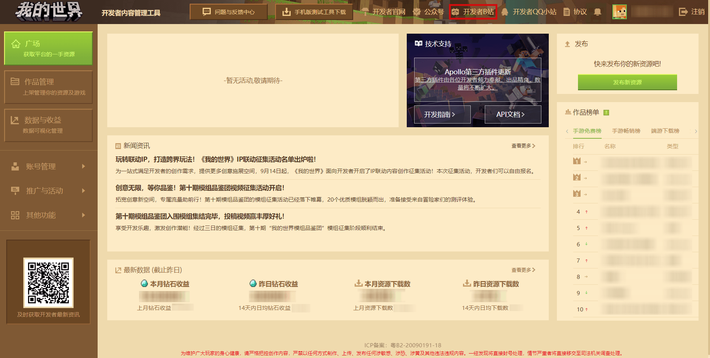 

## Main functions of the developer platform 

The developer platform has many key functions, including publishing works, viewing income, promotion, etc. The following will briefly introduce some of the main functions, and the following chapters will expand and introduce them in detail. 

 

## [Work Management Module](../35-Listing and Settlement/Course 04-Understanding Work Management Module.html) 

Click the **[Work Management]** button on the left side of the developer platform, and work publishing and updating will be done here. 

### [Upload Resources](../35-Listing and Settlement/Course 05-Correct Ways and Means to Upload Works.html) 

In Work Management, you can publish new resources for mobile or computer versions. Select the version in the upper left corner and click the **[Publish New Resources]** button on the right. 

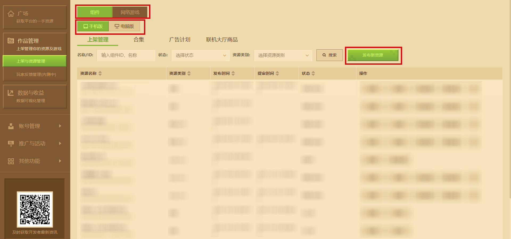 

Different versions also have different types, such as components, online games, and online lobby products. Be careful to distinguish them. 

### Player Feedback Management 

Using the **Player Feedback Management Function**, you can handle players' feedback on their Bedrock Edition works in the game client. The function provides multiple search conditions and supports exporting feedback records into a table to local computer. Click reply to reply to player feedback. When the feedback is replied again, it will be combined with the original feedback content and sent to the developer's mailbox. 

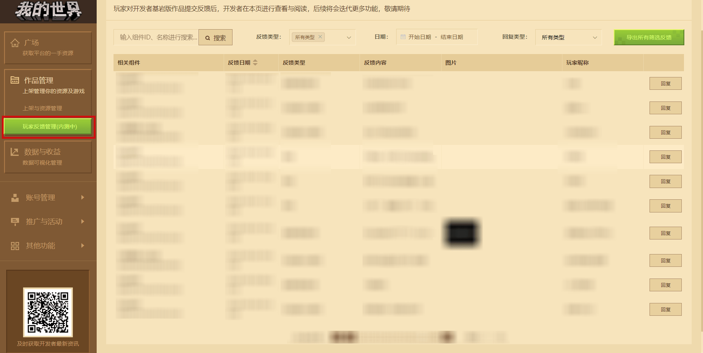 

### [Data Analysis](../40-Activities, Promotions and Revenues/Course 06-Use Data Analysis to Statistic Resource Consumer Behavior.html) 

Click the **[Data Analysis]** button in the data and revenue on the left side of the developer platform to open it. The data analysis page provides many functions and real-time data to developers, allowing developers to flexibly count the behavior of resource consumers. 

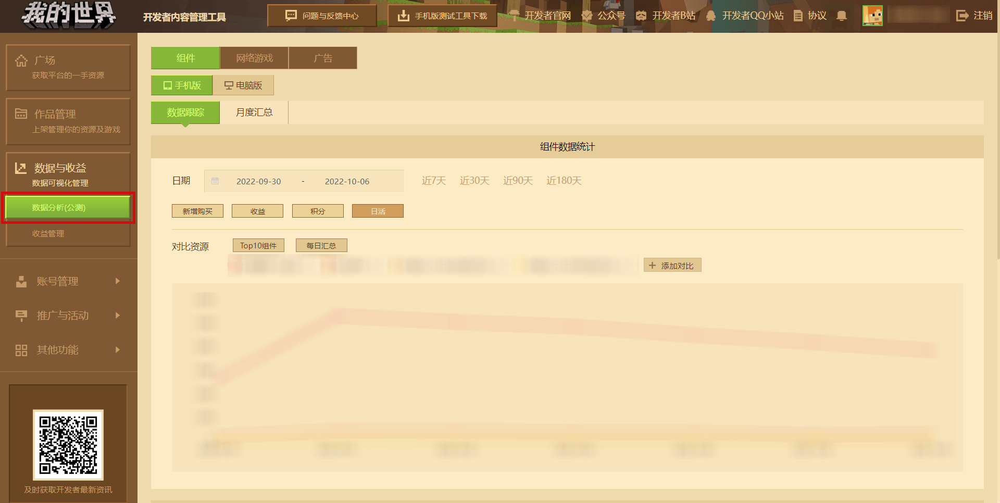 

### [Revenue View and Settlement](../40-Activities, Promotions and Revenues/Course 07-Revenue View and Settlement.html) 

Similar to data analysis, click **[Revenue View]** in the data and revenue on the left side of the developer platform. You can modify different revenue types at the top of the page, and view the revenue of a resource component on the far right. 

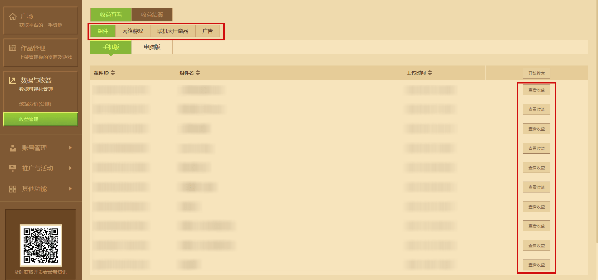 

Revenue settlement includes diamond revenue for each month, and you can settle revenue here. 

### [Member Management Module](../32-Developer Account and Team/Course 15-Use Member Management Module to Achieve Multi-Account Collaboration.html) 

Click Member Management under **[Account Management]**, where you can add members of the developer account, adjust the account's permissions and initiate real-name authentication, collaborate on developing online games, use mobile testing resource functions, etc. 

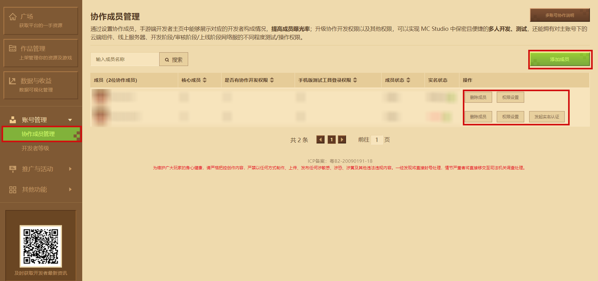 

### [Developer Level](../32-Developer Account and Team/Course 14-Developer Level.html) 

Click Developer Level under **[Account Management]** to learn about the account's basic level, monthly contribution capacity, and credit score. 

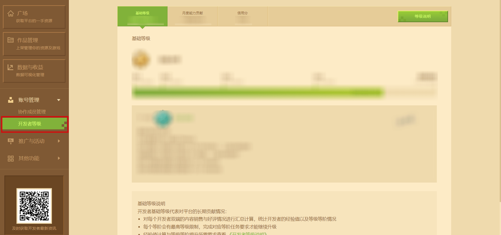 

## [Promotion and Activities](../40-Activities, Promotion and Revenue/Course08-Promote Works and Activities.html) 

In order to help developers better promote resources, multiple promotion channels are combined through the **[Promotion and Activities]** function to help themselves increase resource exposure and customer acquisition, and indirectly increase conversion rate. 

### Activity Participation 

When the official has a special event, you can select your own work on the **[Activity Participation]** page and submit it for review to participate in the event. 

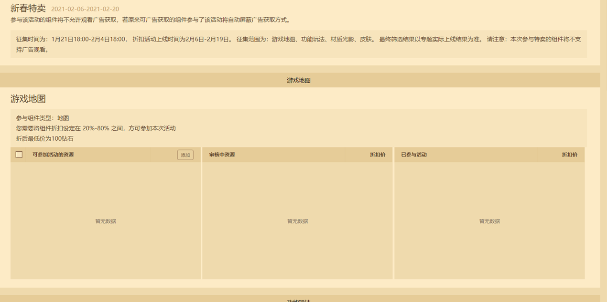 

### Content Promotion 

Content promotion is to obtain exposure opportunities for components through the live broadcast of goods in the form of revenue sharing. You can publish bounty tasks on the content promotion page under Promotion and Activities on the left. 

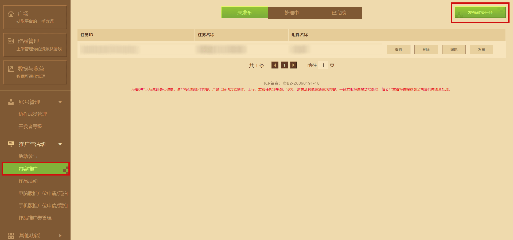 

### Works Activities 

The Works Activities function will occasionally release official works collection and promotion channel activities. Developers are requested to read the activity announcement carefully before signing up, and select works that meet the activity conditions and satisfy themselves. They will have the opportunity to be selected and obtain exposure resources inside and outside the game, which will help the revenue of the works. 

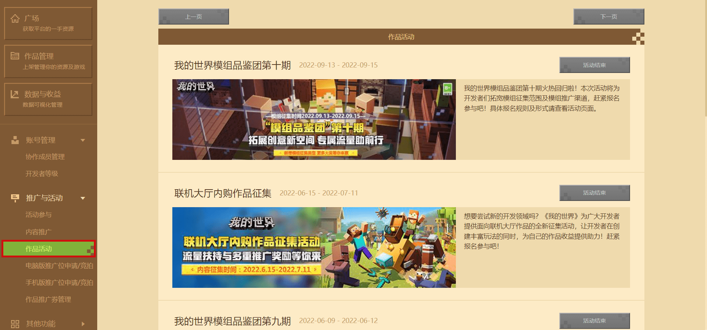 

### [Promotion Position Application and Bidding](../40-Activities, Promotion and Revenue/Course16-Promotion Position Application and Bidding Trial Operation Guide.html) 

The promotion position entrances in the mobile and computer versions of the client have been integrated into the **Promotion Position Application and Bidding** function into the **[Promotion and Activities]** module. Combined with the self-service application process, developers can receive the results of promotion position application and bidding more clearly, conveniently and promptly. 

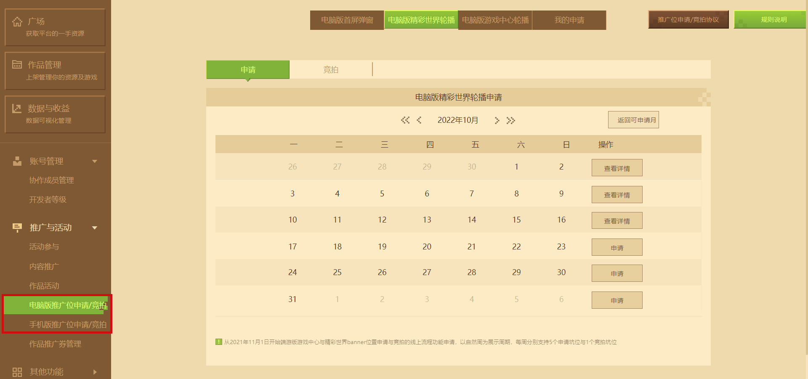 

### [Work Promotion Voucher Management](../40-Activities, Promotion and Revenue/Course 17-Developer Work Promotion Voucher Usage Guide.html) 

Using the **Work Promotion Voucher Management** function with the **Developer Work Promotion Voucher** , developers can promote the work resources they want to promote anytime and anywhere. Achieve **precise delivery** during popular periods and strive to achieve the best exposure effect. The **Developer Work Promotion Voucher** currently obtained will expire 3 months later. Please use it as soon as possible before the expiration date. 

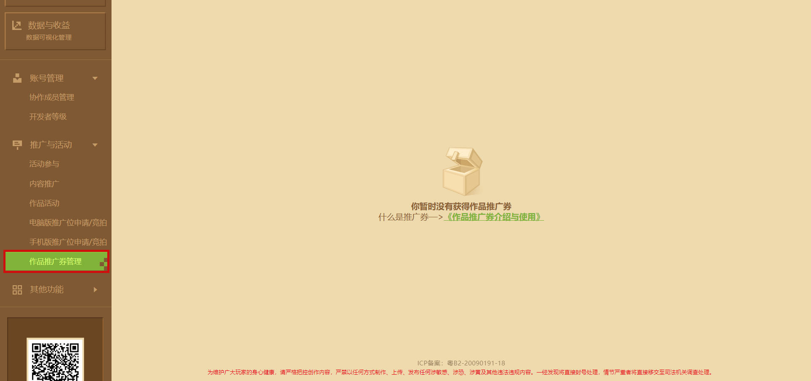