--- 
front: https://nie.res.netease.com/r/pic/20210730/6b8ee910-f423-4421-9627-110415c820ca.png 
hard: Getting Started 
time: 15 minutes 
selection: true 
--- 
# MC Studio Instructions 
## Basic Introduction 

MC Studio is a development tool that integrates developer launcher, map editor, level editor, logic editor, special effects editor, cloud testing platform and other functions. It can provide great convenience for "Minecraft" developers to develop and publish works. Here we mainly introduce the functions of the developer launcher and briefly introduce the development method of the "Minecraft" Chinese version components. 

Let's take a quick look at the video first: 

<iframe src="https://cc.163.com/act/m/daily/iframeplayer/?id=6253cfaeb8a81f8fa0842cb1" height="600" width="800" allow="fullscreen" /> 

## Developer Account 

Currently, MC Studio is open to developers of the Chinese version of "Minecraft". After logging in with a non-developer account, you can submit information in the "Publish" tab in the launcher and apply to become a developer. After becoming a developer, you can use all the functions of MC Studio. 

## Developer Launcher 

The current developer launcher mainly provides the following functions: 
1. Home page: Learn about developer-related information 
2. Creation: Create new works, import and export works, test, and manage workflows 
3. Works library: Manage all works of the current account, including all components and server resources of the Bedrock Edition and JAVA Edition 
4. Release and management: Jump to the developer platform for work review and release 

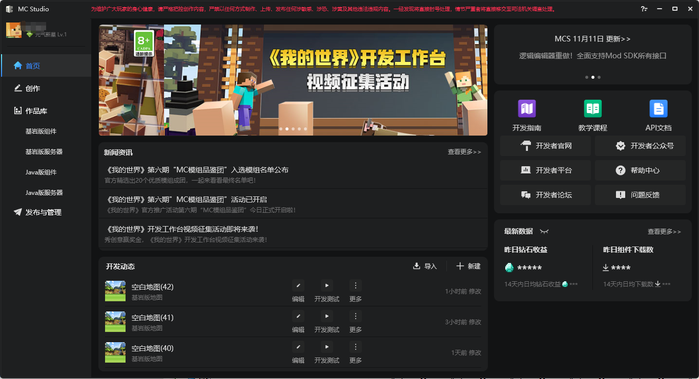 

### Create a new work 

Currently, only Bedrock Edition works can be created through MC Studio (other types of works need to be imported into MC Studio through "local import"). 

If you want to create a new map, we need to click the `Create a new Bedrock Edition component` button on the creation page, select the recommended or old version work in the pop-up window, move the mouse to the first item "Blank Map" in the list, and click the button "Create a new map". 

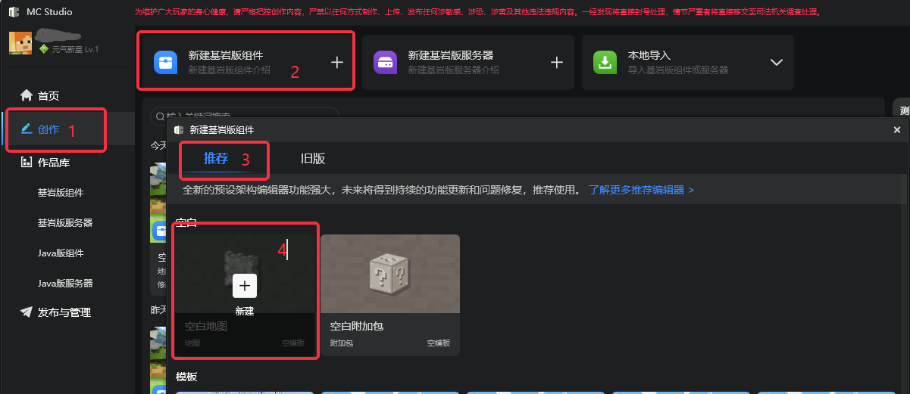 

In the dialog box that pops up, you can make basic map settings. If there are already non-map Bedrock Edition works in MC Studio, they will be displayed in the "Import Functionality" and "Import Material Lighting" lists (in the red box in the figure below). The imported functionality and material lighting files will be copied to the new map (so you only need to import them once). 

Click "Start Editing" to open the editor and start making your own map. 

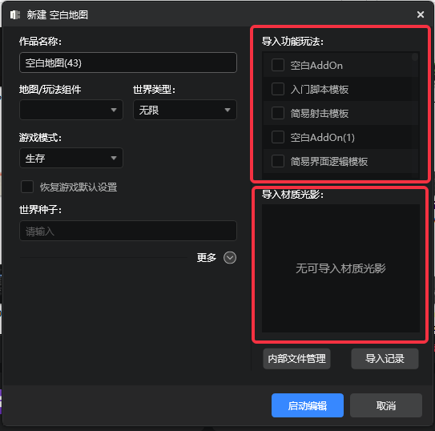 

In addition to creating a new map, you can also create a blank AddOn. AddOn is an additional package. For a detailed explanation, see [wiki](https://minecraft-zh.gamepedia.com/%E9%99%84%E5%8A%A0%E5%8C%85). AddOn does not contain map files. 

Currently, some templates are provided in the launcher. Developers can modify them based on the templates to improve development efficiency. In addition to the classification of maps and AddOns, templates also have different creation methods, which are divided into "pure editor development" and "script development". 

**Pure editor development**: This part of the template is completely made with the editor. After creating it, you can directly start the editor for editing. 

**Script development**: This part of the template contains a more complex Python script. After creating it, you can view and modify related files through "More" and "Open Directory". Of course, you can also use the editor to edit resources other than Python scripts. 

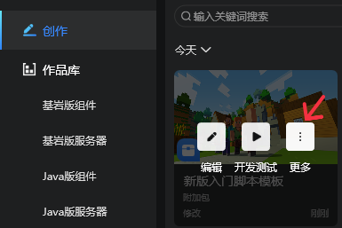 

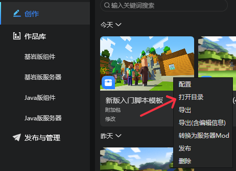 

### Bedrock Edition Components 

The Bedrock Edition Components tab lists all Bedrock Edition components and online games under the current account. Among them, "Game Map", "AddOn", and "Other Works" are local works, and "Cloud List" is the works that developers have uploaded to the Chinese version of "Minecraft" platform. 

Studio can also import already made components. Click the "Local Import" button in the upper right corner. In the pop-up dialog box, you can choose to import maps, AddOns, materials, lighting, and skins from Bedrock Edition or Java Edition. 

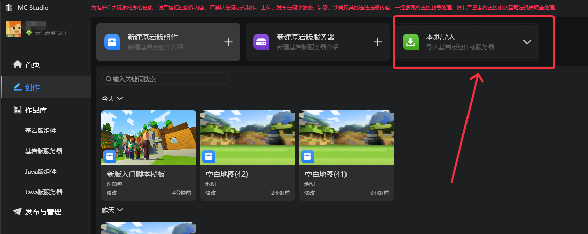 

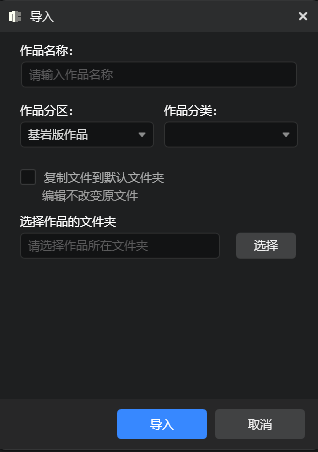 

Created or imported works can be developed and tested. Development testing will start the latest Mod PC development package to test the work. 

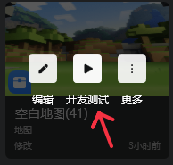 

MC Studio supports testing multiplayer online gameplay on a single computer. First, start the development test of the work (at this time, the first client will be created and the LAN room will be automatically built), and then start other Mod PC development packages from the toolbox. 

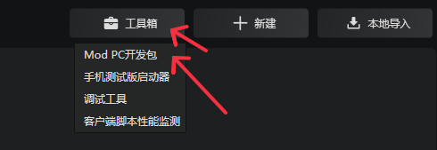 

In the newly started Mod PC development package, click "Game" on the main interface, and click the room that has been created in "Friends". This way, you can enter the room that was automatically created during the development test of the previous work and test the multiplayer online gameplay. 

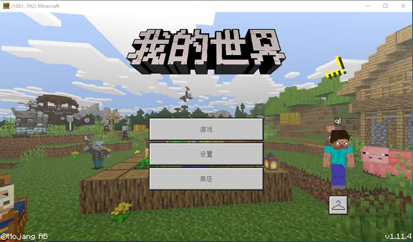 

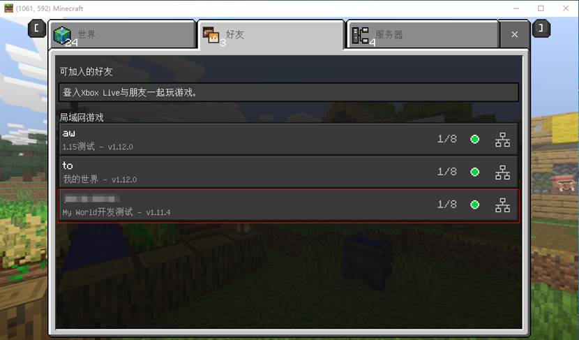 

After the development test is passed, in the "More" menu of the work page, upload it to the developer platform through "Publish". For details, see [Publish Works](#Publish Works) below. 
During development and testing, you can press F11 to switch between PC and PE operation modes. 

### Publish work

After the component type work is completed, it needs to be published to the platform so that players can search and download your work from the resource center in the game. 
In the "More" of the work page, click "Publish", and you will be redirected to the [Developer Platform](https://mcdev.webapp.163.com/#/login) and fill in the basic information of the work for you. 

> If you have not logged in to the developer platform before, you will be redirected to the login interface. 

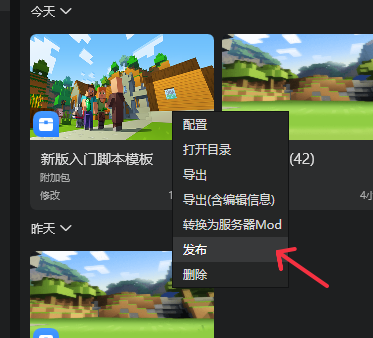 

After filling in the relevant information on the release resource page, click Submit for Review Now to submit the work to the official for preliminary review and prepare for subsequent release and testing. 

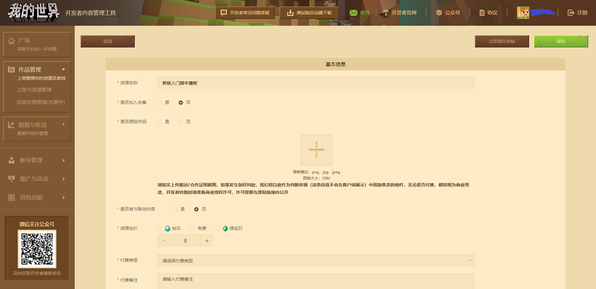 

### Other paging 

*Home* 

The home page will provide you with information closely related to developers, such as news, update information, common function jump entrance, latest data of works, recent development dynamics, etc., as shown in the figure. 

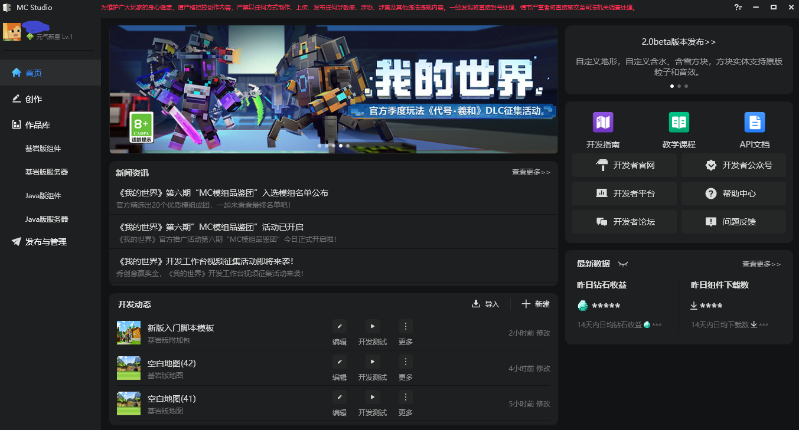 

*Bedrock Edition Server* 

The page will list all online games under the current developer account, which can be downloaded locally for testing. If you want to develop online games, you need to apply for it separately. After approval, you can obtain the server opening tools and related materials to develop online games. For specific information on how to develop Bedrock Edition online games, please refer to the Apollo section in the series of documents. 

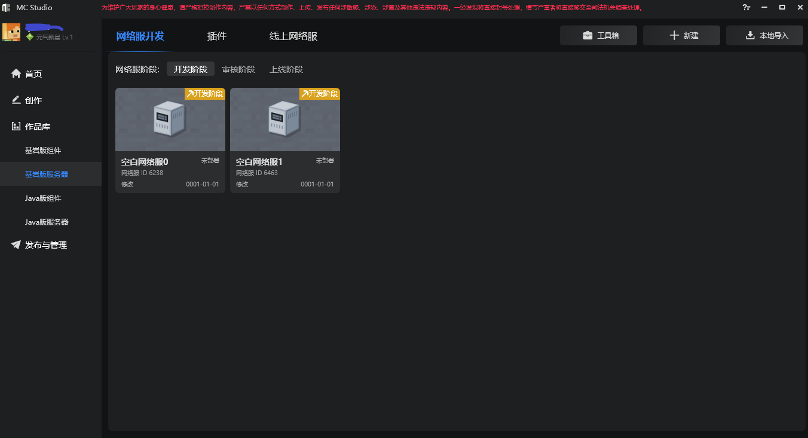 

*Java Components and Servers* 

The structure of the Java works page is basically the same as the Bedrock Edition works page. Currently, MC Studio does not support the editing of Java works, and can only import Java works for testing. 

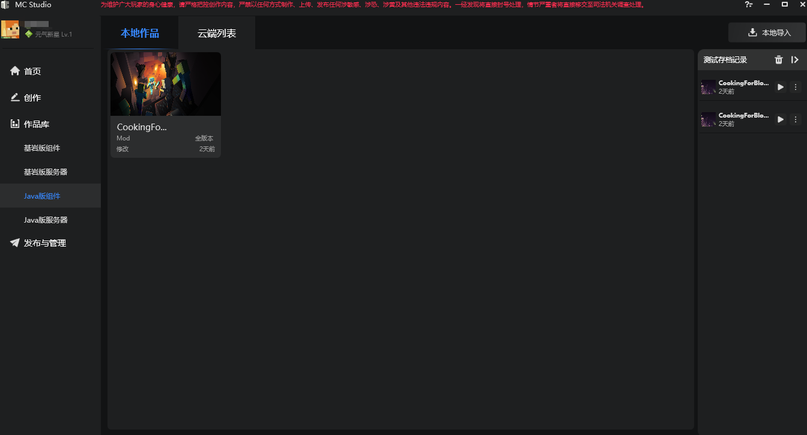 

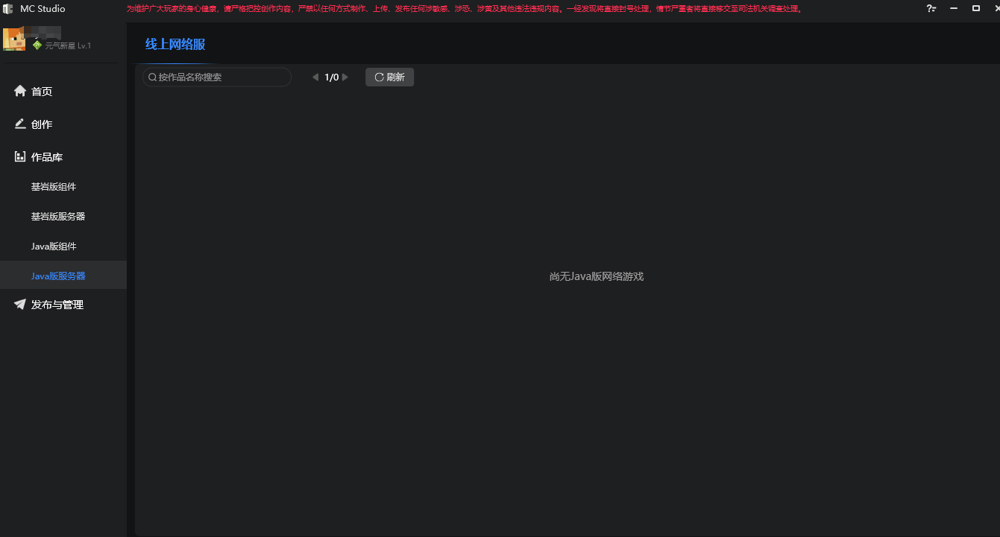 

*Release and Management* 

Release and Management will jump to the developer platform, where you can submit components to the Minecraft Chinese version platform. After approval, all players can download the component from Minecraft Chinese version. 

## Component Development Method 

There are many ways to develop components for Minecraft Chinese version, and developers can choose the method they are familiar with. The advantages of choosing MC Studio for component development are: 

- Basically, operations are performed in a graphical interactive interface; 

- No requirements for programming skills; 

- No need to pay attention to tedious details (such as component file structure requirements, uuid, etc.), MC Studio has already handled it. 

If there is more complex logic in the component, you can use redstone and command blocks, Mod SDK, and logic editor to implement it. 

**Redstone and command blocks** are ways to implement complex logic provided by the game itself, so I won't go into details here. 

**Mod SDK** is a set of Python interfaces provided by the Chinese version of "Minecraft" to control various elements in the game. Using this set of interfaces, you can create various innovative and fun components. To use Mod SDK, you need to be able to program in Python, which is suitable for developers and development teams with certain programming skills. There is a detailed introduction to Mod SDK on the official website. 

The **Logic Editor** packages Mod SDK into a graphical programming language, which is not as flexible as Python programming, but has a lower threshold for use and is suitable for entry-level developers. However, if you have a certain programming foundation or the ability to learn programming, we still recommend using programming to implement the logic of the work.