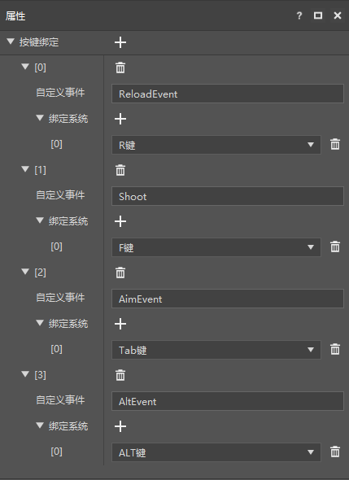

--- 
front: https://nie.res.netease.com/r/pic/20220408/fd58eff7-ab4c-4f98-94b5-87912c6e8e4d.png 
hard: Getting Started 
time: 15 minutes 
selection: true 
--- 

# Learning Route Guide 

## Welcome to make Chinese version of Minecraft mods 

If you are committed to making Minecraft mods, we provide you with a series of tools that will significantly reduce the difficulty of mod development and greatly speed up the mod development process. 

Before using these tools, you need to register as a developer. 

[Register as a developer](./10-Register as a developer.html) 

## What is a mod 

Minecraft is a popular game with a large number of lovely and tolerant players. We make some modifications based on Minecraft (the original game) to give players a different experience. These modifications are mods. 

Modules are usually much smaller than the original game and are easier to make. After a series of learning, I believe you can also make your own modules. 

 

## Module development process 

The development process of different types of modules may be completely different. Taking a more complex role-playing gameplay map as an example, it can be divided into roughly 5 stages as shown below. 

In addition to "module content design", you can use the tools provided by the Chinese version or third-party tools to assist your work. Next, we will explain every link that may be encountered in module development. 

 

## Development toolset provided by the Chinese version 

The Chinese version provides several effective tools for the above links. They are mainly integrated with the Minecraft Development Workbench (MC Studio), which you can download here. 

[Download development tools](https://mc.163.com/dev/process.html#xz) 

Currently, the Chinese version provides a total of 4 major tools, see the left part of the picture below, among which MC Studio contains other tools on the right side of the picture below. 

 

## The first work (module) 

Each module of Minecraft is called a work. All your works are displayed in the development tool bench (MC Studio). You can also create and manage works through the tool bench. In addition, the workbench has many other functions. 

[Instructions for use of the Minecraft development workbench](./20-MC%20Studio instructions.html) 

The workbench currently only supports the creation of Bedrock Edition works. If you have a Java Edition module that you have created, you can use the import function of the workbench.

You can complete your first mod with some simple operations, try it now! 

[Make the first add-on pack](../20-Gameplay Development/13-Mod SDK Programming/1-Mod Development Introduction/2-Make the first Mod.html) 

## Map and building production 

If you plan to make 

- A beautiful map 
- A building 
- Some local maps in the gameplay module 

You can use the map editor. The map editor is part of the Minecraft Editor (MC Editor), and the editor is integrated in the development workbench (MC Studio). 

[Map Editor Instructions](../14-Map Making/2-Map Editor Instructions.html) 

<a href="../../mconline/40-Art Tutorial/2.Architecture Tutorial/01.Architecture Construction Ideas and Basic Methods.html" rel="noopenner">Architecture Construction Ideas and Basic Methods</a> 

The structure function is mainly used to make a local map. You can save part of the map as a structure and use it in your gameplay module. To do this, in addition to the map editor, you also need to use the module SDK for programming and other tools. 

 

## Models and Actions 

If you want to introduce a new creature image or a strange-looking block in the module, then you need to make your own model. If you need your model to move, you also need to animate the model. 

The Chinese version of Minecraft, Bedrock Edition, supports two types of models. One is the native model, which is used by most models in Minecraft. Using block bench, you can easily make original models, textures and animations. 

[Original Model Production Guide](../16-Art/6-Models and Actions/01-Original Model Production Guide.html) 

<a href="../../mconline/40-Art Tutorial/6.Models and Model Actions/04.BLOCKBENCH Teaching.Output Model Case.html" rel="noopenner"> BLOCKBENCH Teaching </a> 

The other is the skeleton model, which is widely used in model and animation production in the film and television game industry. The entry threshold is high, but it can provide better results than the Bedrock Edition. Blender is a free and powerful software that can be used to make skeleton models. 

[Skeleton Model Production Guide (Blender)](../16-Art/6-Models and Actions/03-Skeleton Model Production Guide (Blender).html) 

Other subsequent knowledge is required to apply the original model or skeleton model to the module. 

 

## Make light and shadow or special art effects 

If you want to make exquisite light and shadow, or make custom materials for your model to achieve special art effects, you need to use materials and shaders (Shader). 

[Introduction to Shader Use](../16-Art/7-Material and Shader/Introduction to Shader Use.html) 

It should be noted that the learning threshold of Shader is very high, and the number of lights and shadows in the corresponding Chinese version of the module market is also very small. If you can make cool lights and shadows, I believe you will definitely be favored by players! 

## Visual effects

The flames of zombies burning at dawn and the rain in the wild are all visual effects. 

The Chinese version of Minecraft provides you with two ways to make and use special effects, one is the original special effects, and the other is the Chinese special effects. 

You can use the third-party software Snow Storm, or directly write Json to make original special effects, and configure the special effects through additional packages and finally apply them in the module. 

<a href="../../mconline/10-addon教程/第17章：原版颗细胞和特效粒/课10.简单教学.html" rel="noopenner"> Original special effects example teaching </a> 

In addition to the original special effects, we provide a production tool specifically for the Chinese special effects - the special effects editor. 

[Basic Introduction to Special Effects Editor](../16-艺术/9-特效/0-基本介绍.html) 

Note: The original special effects can be attached to the original model and used together with it; the Chinese special effects can be attached to the skeleton model. The two technical solutions cannot be mixed. Of course, you can use the original model and original special effects in one block, and use the skeleton model and Chinese special effects in another creature. 

 

## Interface and interaction 

The most important difference between video games (including modules, of course) and movies, comics, novels, etc. is that games require player participation, and a large part of this participation is interaction, that is, the player's operation can affect the game. 

Physical buttons and touch interfaces are both forms of interaction. For mobile terminals, the use scenarios of interface interaction are obviously more. 

The interface editor of the Chinese version of the tool provides you with the function of graphical operation to create the interface, and you can preview the interface in real time during the creation process. 

[Interface Editor Instructions](../18-Interface and Interaction/1-Interface Editor Instructions.html) 

<a href="../../mconline/10-addon Tutorial/Chapter 16: Creating Interfaces/Course 01. Understanding Interface Controls.html" rel="noopenner"> Understanding Interface Controls </a> 

 

## Gameplay 

If you want your custom creatures to swim in the water, change the model of the blocks, or let your Steve perform cool combos, you need to develop gameplay. 

For this, you have two powerful weapons to use, namely add-on editing and Python programming. 

Add-ons are a series of Json configuration files provided by Microsoft. You can modify all aspects of the game by adding Json files. 

Mod SDK is a set of Python programming tools for Chinese version module development with events as the core. In addition to writing code directly, you can also use the preset architecture in combination with the editor to improve development efficiency in certain scenarios. 

Before understanding gameplay development, you may need to understand some basic concepts of Minecraft. 

[Basic concepts of Minecraft](../20-Gameplay development/10-Basic concepts/1-Basic concepts of Minecraft.html) 

<a href="../../mconline/10-addon tutorial/Chapter 02: Understanding the Minecraft world/Course 01. Understanding the Minecraft world.html" rel="noopenner"> Understanding the Minecraft world </a> 

 

## Assemble simple gameplay

The editor provides some built-in gameplay modules for developers to use directly without programming, such as built-in presets and parts. 

[Level Editor Instructions](../20-Gameplay Development/11-Assembly Simple Gameplay/3-Level Editor.html) 

Built-in Resource Package 

## Visual Programming (Blueprint) 

The built-in gameplay modules in the editor may not meet your ambitions. If you need more special gameplay, you have to start programming. At present, we provide you with a comprehensive set of visual programming tools. You can achieve more customized needs by connecting nodes. This set of tools is built into the logic editor of the new version of the editor, and it can currently meet almost all the requirements that can be achieved by module SDK programming. 

[Overview of the New Logic Editor](../20-Gameplay Development/12-Visual Programming/10-Instructions for Using the New Logic Editor/01-Understanding the New Logic Editor.html) 

It is recommended that you watch the following video for preliminary learning: 

- [First Blueprint Mod](../20-Gameplay Development/12-Visual Programming/00-First Blueprint Mod/00-Tutorial Video.html) 

- [Making Parkour Map](../20-Gameplay Development/12-Visual Programming/30-New Version Sample Tutorial (Video)/05-Making Parkour Map (Video).md) 

- [Making a Simple Shooting Add-on Pack](../20-Gameplay Development/12-Visual Programming/30-New Version Sample Tutorial (Video)/07-Making a Simple Shooting Add-on Pack (Video)/01.md) 

 

## Python Programming 

Currently, some more complex gameplay logic can only be implemented through Python programming. We provide a powerful module SDK (Mod SDK) for developers to use. Using this tool well requires some basic knowledge of Python programming as a prerequisite, which you can learn on [this website](https://www.liaoxuefeng.com/wiki/897692888725344). 

[Introduction to Script Development](../20-Gameplay Development/13-Module SDK Programming/2-Python Script Development/0-Introduction to Script Development.html) 

<a href="../../mconline/10-addon tutorial/Chapter 10: Your First MOD/Course 01. Get to Know MODSDK.html" rel="noopenner"> Get to Know MODSDK </a> 

Programming is inseparable from the use of interfaces. In addition to the interfaces provided by Python, you also need to use a series of interfaces (APIs) provided by the module SDK. The documents of these interfaces are in the technical manual, and you may need to consult them in real time during the programming process. 

<a href="../../mcdocs/1-ModAPI/接口/通用/指数.html" rel="noopenner"> Mod API - 通用接口 - 指数 </a> 

Recently, we launched a new fully object-oriented preset architecture, which has brought significant efficiency improvements to the production of gameplay maps, custom creatures/entities, etc. The editor fully supports the preset architecture, and you can easily create, preview and edit related files. 

[First Preset Mod](../20-Gameplay Development/14-Preset Gameplay Programming/0-First Preset Mod/) 

The preset architecture has a certain degree of difficulty. We have provided a video for developers and recommend everyone to learn 

- [First Preset Module (Video)](../20-Gameplay Development/14-Preset Gameplay Programming/0-First Preset Module (Video)/01.html) 

The preset architecture also provides a series of APIs for reference. 

<a href="../../mcdocs/3-PresetAPI/Preset Management/PresetApi.html" rel="noopenner"> Preset Management API </a> 

## Custom Game Content 

In most cases, if you want to modify or add blocks, entities, and other content included in the original game, you need to use an add-on package (Add On). The gameplay-related parts of the add-on package are mainly Json files. You can find the add-on packages that come with Minecraft in the download directory of the development workbench (MC Studio), which are divided into behavior packages and resource packages: 

- Behavior pack: \MCStudioDownload\game\MinecraftPE_Netease\(version number)\data\behavior_packs\vanilla

- Resource pack: \MCStudioDownload\game\MinecraftPE_Netease\(version number)\data\resource_packs\vanilla 

The editor provides full Chinese and interface support for the modification of add-on packs, which can avoid manual editing of Json files. At present, the support for behavior packs is relatively complete, and it supports the editing of some resource packs. We will provide editor support for all add-on pack contents in the future. 

[Configuration](../20-Gameplay Development/15-Custom Game Content/0-Configuration.html) 

 

For the add-on pack editing functions that the editor does not currently support, you can directly edit the Json file to implement it. 

In addition to modifying properties, you can also edit the AI of creatures through add-ons, specify models, textures, animations (including animation logic), materials and special effects (including the playback logic of special effects) for entities and blocks, etc. 

[Custom Basic Items](../20-Gameplay Development/15-Custom Game Content/1-Custom Items/1-Custom Basic Items.html) 

<a href="../../mconline/10-addon tutorial/Chapter 06: Getting to Know Addon/Course 01. Getting to Know Addon.html" rel="noopenner"> Getting to Know Addon </a> 

## Mobile and Computer Adaptation 

It is a good idea to put your finished components on the Chinese version of the mobile phone (PE). But My World itself provides cross-platform functions, and we also provide you with a tutorial on component adaptation. You can spend very little work to synchronize your exquisite and excellent components on the computer (PC), bringing you more fans and income. 

Why not! 

[PE module adapted to PC](../20-Gameplay development/19-Mobile computer adaptation/1-PE module adapted to PC.html) 

 

## Online games 

The online service opening tool (Apollo) is a tool for developing and deploying the server cluster of the online game of Minecraft PE. It integrates plug-ins, load balancing, cluster management, operation instructions and other functions. Developers only need to focus on MOD business logic to develop more gameplay components, bringing more possibilities for the innovative expansion of the online service of Minecraft. 

The online service developer is referred to as the "server owner". After applying to become a developer, the server owner also needs to apply for a test machine for the deployment and development of the online service. After the development is completed, it is necessary to review and apply for a formal machine for the final launch. 

For the application of the test machine, you can view the tutorial: <a href="../../mcguide/27-网络游戏/课1：成为阿pollo服务主及相关准备/第3：入入申请.html">入入申请</a>. 

After obtaining the test machine, you need to connect to the development machine. You can view the course: <a href="../../mcguide/27-网络游戏/课1：成为阿pollo服务主及相关准备/第5：连接开发机.html">连接开发机</a>. 

After the machine is successfully connected, you can follow the guide video to complete a series of basic operations. You can view the course: <a href="../../mcguide/27-网络游戏/课3：简单网络服模板执行与综合操作/第1：简单网络服视频教程.html">简单网络服视频教程</a>. 

For the rest of the teaching content, please refer to the official website - teaching center - online games and the official website - online courses - network service plug-in tutorial. 

 

 

## Testing 

Games are usually made in an editor or using third-party software, but during the development process, you often need to frequently test the logic you write or whether the resources you make/import can run normally in the real game. 

At this time, you need to use the testing tools we provide. The development workbench provides several testing methods, including clicking Run in the editor, clicking the development test of the work, and developing and testing through the archive. 

The tools used for development testing are mainly the Bedrock Development Board (Mod PC Development Kit), which is a development version of Minecraft specifically used for testing. During the test, you can view the logs sent in real time when the game is running, manage module files, and use debugging code. In addition to single-player testing, we also support online testing and mobile testing. 

[Use the Mod PC Development Kit for LAN Multiplayer Testing](../30-Test/0-ModPC Development Kit Multiplayer Testing.html) 

[Use the debugging tool for mobile and computer debugging](../30-Test/1-Use the debugging tool for mobile and computer debugging.html) 

## Upload your work 

After you have worked hard to complete your module, tested it, and there are no errors (bugs), you can upload your work to the Chinese version of the resource center. 

For this step, you need to use the developer platform. Of course, if you want to sell your module in the resource center (even if it is free), you still need to abide by a series of rules we have set. 

[The correct way and channel to upload works](../35-Shelf and Settlement/Course05-The correct way and channel to upload works.html) 

[Specifications and review strategies for component listing](../35-Shelf and Settlement/Course03-Specifications and review strategies for component listing.html) 

## Sales and income 

Now it's time to talk about money. Don't be shy. We need both self-realization and filling our stomachs. 

When your paid components generate income, we will share it with you. The relevant income can be easily queried on the developer platform. 

In addition to simple sales, you can participate in various activities we prepare for you on the developer platform and use our plan to promote your components. 

[Revenue View and Settlement](../40-Activities, Promotion and Revenue/Course07-Revenue View and Settlement.html) 

[Content Promotion Module](../40-Activities, Promotion and Revenue/Course08-Promote Works and Activities.html) 

## Questions and Feedback 

Documents are limited, but Minecraft and module development are unlimited. 

There are always contents that are not covered by documents. If you have other questions, you can check here to see if we have already answered them. 

[FAQ](../50-FAQ/) 

If not, we very, very, very welcome your feedback on anything you want to know and where we did not do well. Your feedback is the source of our progress. 

[Click this link](https://qun.qq.com/qqweb/qunpro/share?_wv=3&_wwv=128&inviteCode=1VX5Hn&from=181074&biz=ka&shareSource=5#/pc) to join the Minecraft Developer QQ Channel. 

The channel is mainly used for communication between developers and official event releases. When applying for a channel, you need to note the developer's nickname and developer email. 

Developer email: <a href="../../mcguide/50-Frequently Asked Questions/90-Other Problem Feedback Channels.html">minecraftstarter@163.com</a> 

Generally used to apply for recommended positions, as well as feedback on problems and suggestions encountered on the platform. 

Developer Forum: http://mc.netease.com/forum-111-1.html 

You can communicate with other developers! According to the corresponding issues in the forum feedback, you can also report illegal components, or appeal if you have doubts about the results of illegal handling. 

