--- 
front: https://nie.res.netease.com/r/pic/20220408/2a1d5a0e-4f50-46cb-9c0c-243672135587.png 
hard: Getting Started 
time: 30 minutes 
selection: true 
--- 

# Map Editor Instructions 

## Basic Introduction 

The map editor is a map editing tool for Bedrock Edition (C++ version). The interface is divided into three parts: a menu bar that provides basic functions, a toolbar that integrates various tools and properties, and an operation area for map drawing and modification. 

Currently, the map editor provides commonly used convenient tools such as brush tools, terrain tools, eraser tools, and selection tools. Developers can use these tools in the operation area to modify and draw map archives like using drawing software. 

It is recommended to follow the video below to learn. 

<video id="video" controls="" preload="none" width=800 height=450> 
<source id="mp4" src="https://mc.v.netease.com/2020/0316/364bf2f89fce29f049ee14951c3bda56qt.mp4" type="video/mp4"> 
</video> 

## Camera movement method 

In the operation area of the editor, the default camera movement method is similar to the flight mode of Minecraft: 

- The WASD keys control the movement of the front, back, left, and right, the Shift key moves down, and the space bar moves up; 

- Press and hold the right mouse button and move the mouse to adjust the current viewing angle; 

- Use the mouse wheel to move forward/backward along the current camera direction. 

The movement mode can be changed to camera mode in the menu's settings->operation mode. In camera mode, the W/S keys control the movement to move forward/backward along the camera direction. 

## Functional structure 

The main operations of the map editor are divided into 4 modules: 

- **Select**: Select a specific set of blocks, and the selected blocks will display a bounding box; 
- **Edit**: Quickly edit the selected blocks; 
- **Brush**: Switch to the brush tool and use the brush to quickly place blocks; 
- **Terrain**: Switch to the terrain tool to quickly construct terrain. 

### Selection function 

Click the "Select" button in the toolbar to enter the selection mode, and then you can select blocks in the operation area. 

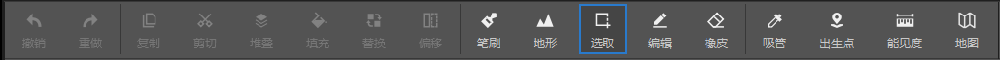 

In the operation area, select a square as the starting point, then hold down the left button and drag to the end point to generate a bounding box with the starting point and the end point as the diagonal line. 

You can switch to the multiple selection mode (button on the right) in the upper left corner, and you can pull multiple bounding boxes at the same time. The square in the bounding box is the selected square. 

The following operations can be performed on the bounding box: 

- Left-click on the specified face and long-press and drag to adjust the position of the face; 

- Left-click on the edge of the specified face and long-press and drag to adjust the position of the faces adjacent to the face; 

* After selecting the bounding box, drag the red, green and blue axis points on the coordinate axis with the left mouse button to move the bounding box in the corresponding direction; drag the white origin to move the bounding box freely; 

- There are two ways to cancel the bounding box: 1. Right-click the bounding box and then click the Deselect button; 2. Use the shortcut key to cancel the selection of the bounding box; 

- Ctrl+mouse wheel to adjust the vertical position of the bounding box; 

- Use the keyboard arrow keys to adjust the horizontal position of the bounding box. 

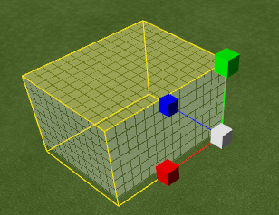 

The following immediate operations can be performed on the selected bounding box and the blocks inside it: 

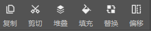 

- Cut/Copy: Cut/Copy the bounding box and the blocks inside to the clipboard; 

- Stack: Stack the selected area along the X/Y/Z axis for a specified number of times; 

- Fill: Replace all spaces in the selected area with the selected blocks; 

- Replace: Replace all blocks of a certain type in the selected area with the selected blocks; 

- Offset: Offset the selected area and the blocks inside it by a specified distance in a specified direction; 

- Delete: After selecting the bounding box, use the delete shortcut key to quickly delete the model inside the bounding box. 

### Editing function 

After selecting the bounding box, click the edit button on the toolbar to enter the edit mode; at this time, editing the selected area will change the block structure inside it. 

The image displayed during the editing process is the result of simulation generation. After the editing is completed, click "Confirm Generation" above the game window to make it formally effective. 

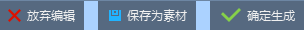 

In the editing mode, the operation method of the bounding box is basically the same as that in the selection mode, but in the editing mode, the operation will simultaneously modify the blocks in the bounding box (such as face adjustment, overall movement, scaling, etc.). 

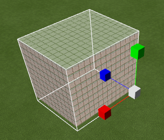 

Operations such as rotation and regular scaling can be performed in the secondary toolbar called out in edit mode. 

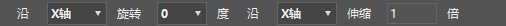 

### Brush function 

Click the "Brush" button in the toolbar to enter brush mode. In brush mode, click or long press the left button in the operation area to quickly generate blocks. In the material preset window, you can adjust the parameters of the brush to generate blocks. 

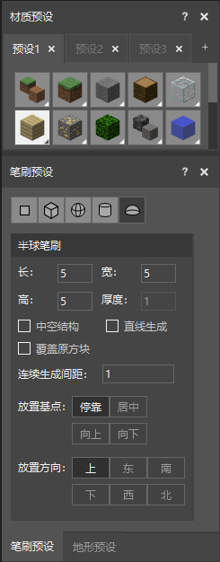 

Currently, brushes of various shapes such as single point, square, sphere, cylinder, hemisphere, etc. are provided. There are many setting parameters for brushes. Let's take the hemisphere brush as an example: 

- Brush size: Except for the single point brush which is fixed to 1 block size, other brushes can set the length, width and height parameters; 
- Hollow structure: After checking, a hollow structure will be generated (only valid for volumes larger than 3x3x3), and the thickness of the wall is determined by the "thickness" parameter; 
- Straight line generation: After checking, first click one coordinate and then click another coordinate to generate a block on the line segment with two points as endpoints; 
- Overwrite original blocks: If checked, the brush blocks will overwrite existing blocks that overlap on the map; 
- Continuous generation spacing: When you hold down the mouse and drag, the spacing of the generated blocks; 
- Placement base point: When "Dock" is selected, the brush block will be placed next to the block selected by the mouse. For example, if the mouse is selected on the top of the block, the brush block will be generated on the top of the block, and if the mouse is selected on the bottom of the block, the brush block will be generated below the block; when "Center" is selected, the brush block will be generated with the selected block as the center; when "Up" is selected, the brush block will be generated with the selected block as the lower vertex; when "Down" is selected, the brush block will be generated with the selected block as the upper vertex. 
- Placement direction: For non-centrally symmetrical brush shapes, different placement directions can be selected; taking the hemisphere brush as an example, there are 6 placement directions, and you can actually experience the placement effects of different directions in the editor. 
- Block orientation: For blocks with orientation (such as beds, end candles, etc.), the orientation of the block can be adjusted by the "up, down, left, right" direction keys next to the number keys. For rails, redstone lines, etc., the corresponding orientation is generated by the connection relationship between blocks. 

### Terrain function 

Click the "Terrain" button on the toolbar to enter the terrain operation mode. In the terrain operation mode, you can quickly adjust the blocks in the area by clicking or long pressing. The following is a detailed introduction to the effect of each terrain operation. 

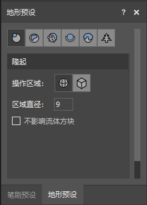 

- Bump: Make the blocks in the specified area bulge 1 grid. The area can be a spherical area or a cubic area, and the area size can be set by the area diameter or area side length. If "Do not affect fluid blocks" is checked, the terrain operation will not affect the existing water or magma blocks. 
- Erosion: Remove protruding blocks. The meaning of the parameters is the same as Bump. 
- Smoothing: Remove protruding blocks, fill the concave areas, and make the selected area smoother. The meaning of the parameters is the same as Bump. 
- Fill: Fill the concave areas and holes. The meaning of the parameters is the same as Bump. 
- Top Cover: Cover the selected area with a layer of the material selected in the Material Preset window. If "Replace" is selected in the effect, the existing top block will be replaced. If "Overlay" is selected, a new block will be generated above the existing top block. The number of blocks to be replaced or overlaid can be set by "Number of Layers". The meanings of other parameters are the same as those of bulge. 
- Plants: Generate plants at the selected coordinates. The available plant types include 6 types of trees, bamboo, cactus, and mushrooms. Among them, oak trees, spruce trees, and jungle trees can choose the size (normal or large). It should be noted that there are certain restrictions on plant generation. For example, cacti cannot be generated on grass blocks, trees cannot be generated on stones, etc. When the mouse click position does not meet the generation conditions, plants will not be generated, and the editor bottom bar will prompt "The current type of plant cannot be placed at this location." 

### Material function 

After selecting the bounding box, you can use the "Save as Material" function to store the model in the bounding box into the material library for long-term use. 

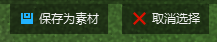 

After selecting the material in the material library, you can freely place it multiple times in the game. After placement, click "Confirm Generation" to generate the corresponding block in the game. 

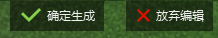

The material data is saved in the mdl file, and the material library can be used between different maps. 

- Import: Model resources such as FBX can be converted into material files by importing, or you can import material files directly. 

First select the corresponding model file (support fbx or obj format files). 

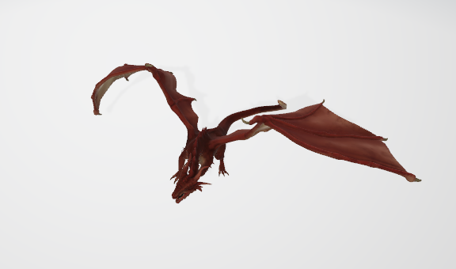 

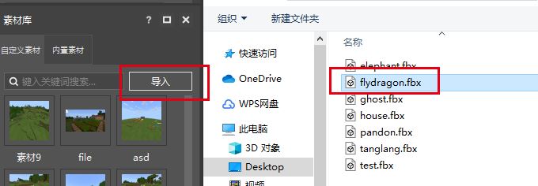 

​ Then set the corresponding material name and the size of the material to be converted 

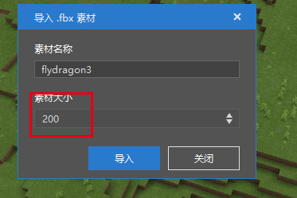 

​ The converted material can be placed in the map scene. 

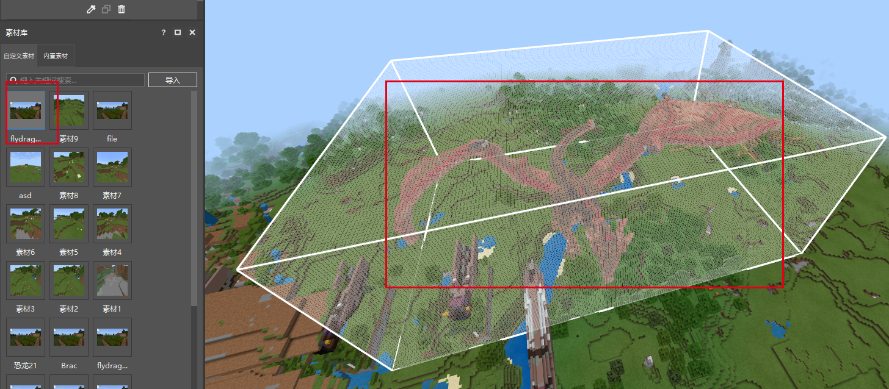 

- Export: The generated material files can also be shared with other developers for collaborative use through the export function. Select the corresponding material file, right-click and use the export function to export the generated material file. 

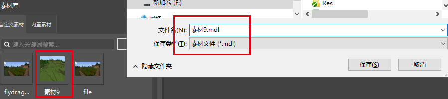 

## Structure function 

Select the "Save as structure" function to save the blocks within the bounding box selection range as a structure file. 

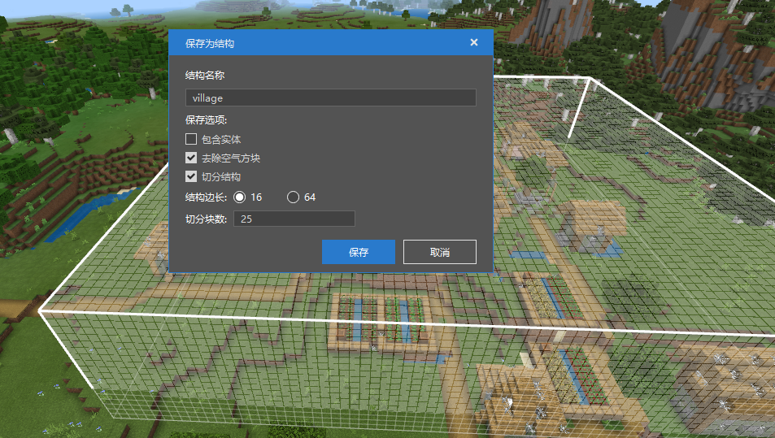 

Select Include Entity: The saved structure data file will contain entity (dynamic, movable) object information. 

If you choose to remove air blocks, the generated structure data file will not contain air block information. 

If you choose to split the structure, the structure will be split into multiple structure data files according to the selected structure side length, which is suitable for saving block information in a large range. 

The generated structure file is in the structures/namespace folder of the behavior pack of the current work. 

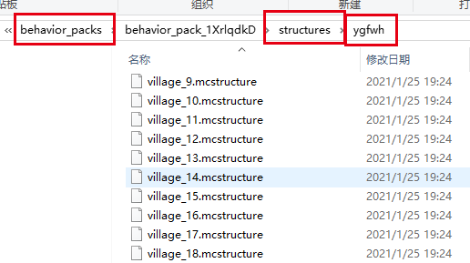 

To use the structure block, enter the folder and file name of the corresponding structure file to use this structure. 

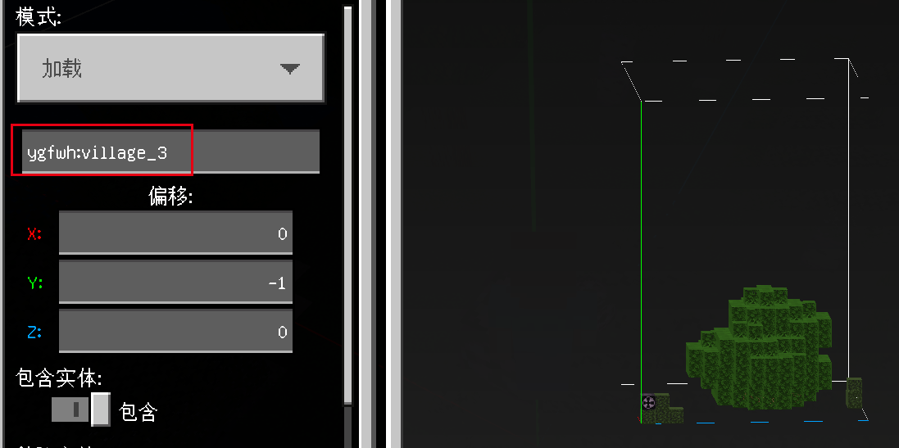 

If you choose to split the structure, the blocks in the selected range will be generated into multiple structure files and saved, and the configuration information of the basic coordinates of each corresponding structure file will be generated at the same time.

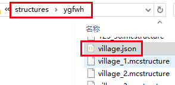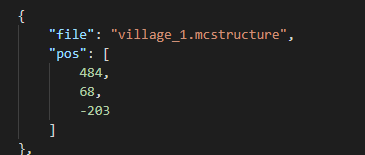 

Parse this configuration file, set the corresponding coordinates and structure file name information in the script through the <a href="../../mcdocs/1-ModAPI/界面/世界/地图.html#placestructure" rel="noopenner"> PlaceStructure </a> interface of ModSDK, and you can generate and restore the saved map data in the corresponding dimension map. 

## Common shortcut keys 

The following are commonly used shortcut keys. 

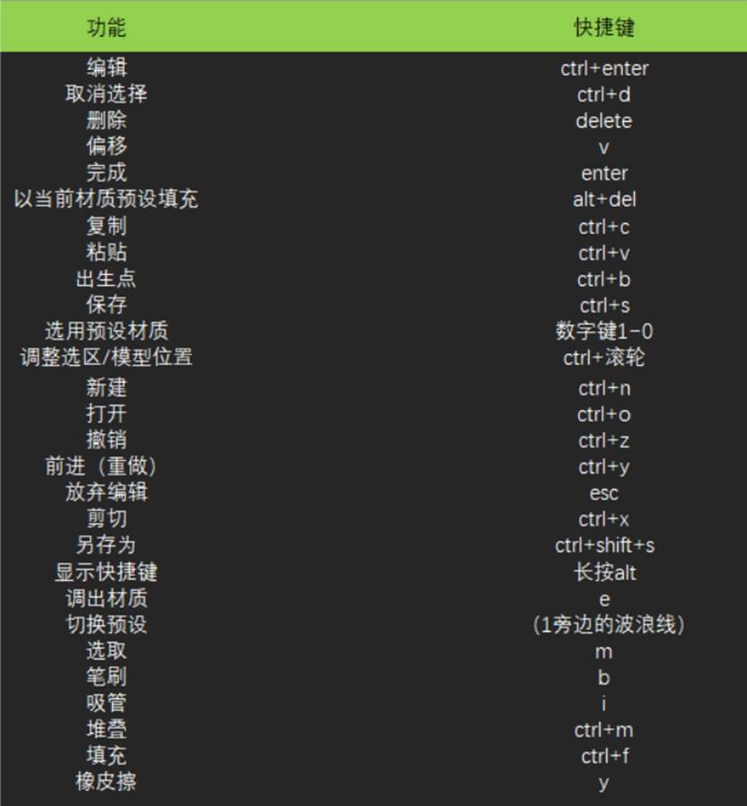 
