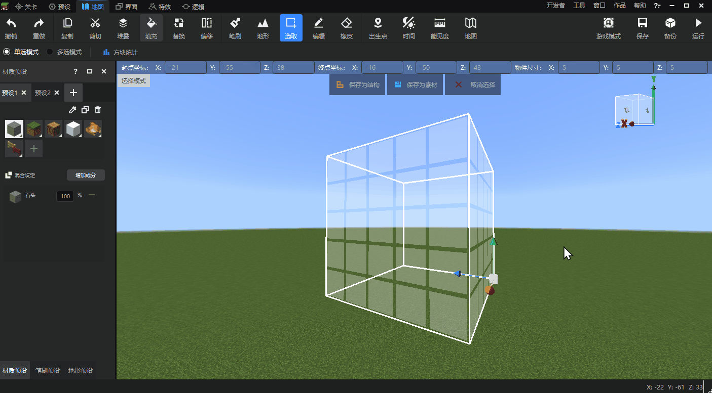

# Block state value setting 

[This update](../10-New content/1-Development workbench/976-1.0.12.md), we have added a new block state value setting function in the map editor. This function allows developers to set the state value of the block in detail when using material presets, brushes, fills, replaces and other block operations. This function is designed to solve the problem that the map editor can only use the default state value of the block and cannot meet the diverse map design needs of developers. 

Let's take a closer look at how to use the block state value setting function! 

## Material preset state value setting 

We create a new material preset. In the [Select Material] window, we select a block with multiple state values, and you can see the [State Value Setting] tab in the lower right corner of the window. 

Expand the tab, we can see the configurable state value of the currently selected block, and directly modify the state value of the selected block by adjusting the drop-down box and apply it to the material preset. 

 

- As can be seen from the example above, each material in the mixed material can be edited with a separate state value. 
- The block map itself cannot reflect the state value change. In order to facilitate developers to accurately judge each material in the mixed material, when the mouse hovers over a block in the mixed material panel, the specific state value configuration of the block will be displayed through a prompt box. 

The configured material preset can be applied to multiple functions such as brushes and fills, and the state value settings can be retained. 

## Fill tool state value setting 

The block selection of the fill tool can also be precisely adjusted using the state value setting. 

We can directly use the preset items set in the material preset for filling, or we can directly select the block we need to use, set its state value below, and apply it directly. 

 

## Replacement tool state value settings 

After the state value is introduced, the same blocks with different state values will be displayed separately in the replacement window, so that developers can replace one state value separately without affecting the blocks with other state values. 

Developers can hover the mouse over the block in the left window, check the state value information displayed in the prompt box, and determine whether it is the state value they need to replace. 

 

## Other instructions 

- The [Eyedropper] and [Copy] tools in the material preset window will retain the block state value information. 
- The [Block Statistics] function in the toolbar will combine the same blocks with different state values, instead of counting each state value separately.