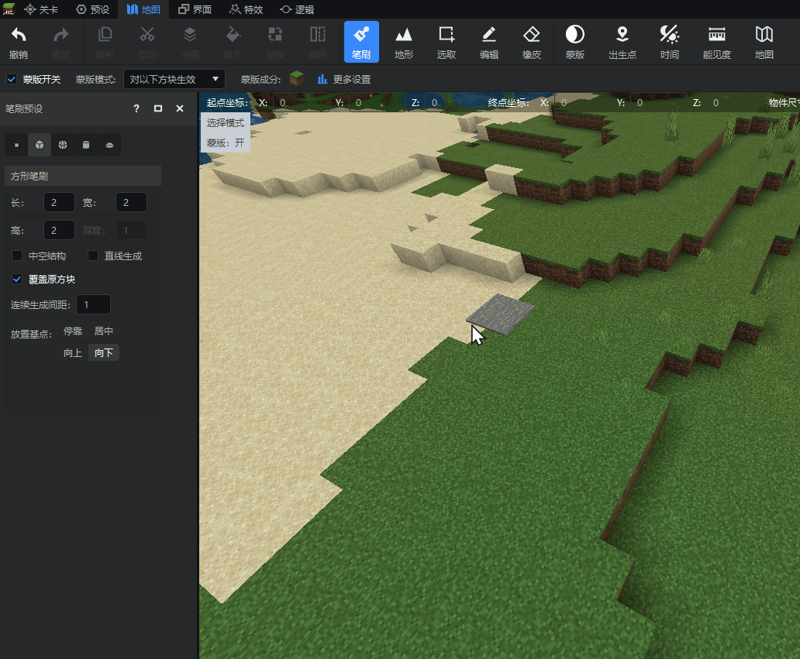
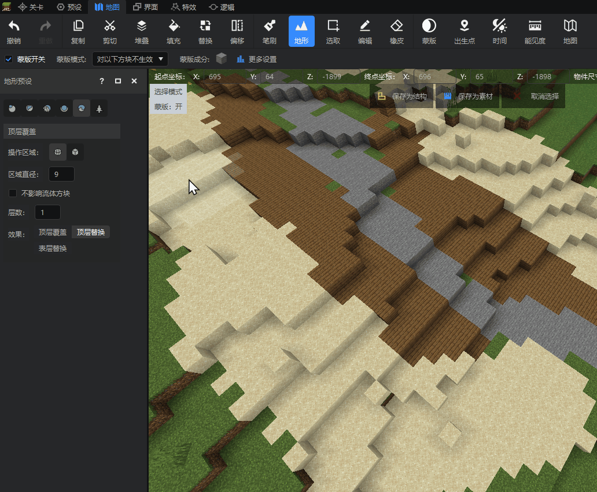
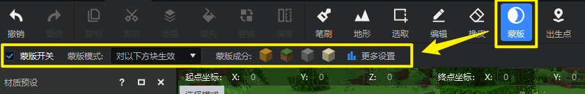
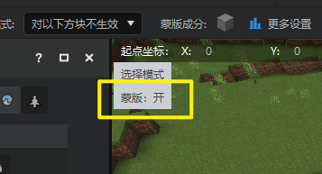
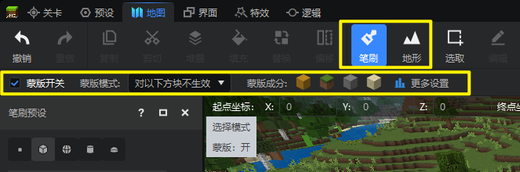

--- 
front: 
hard: Getting Started 
time: 10 minutes 
selection: 
--- 

# Mask Tool Description 

The new version of the map editor now supports masks. Let's take a look at how to use the mask tool! 

## What is a mask 

Masks can be used to limit the objects that developers can edit the map. There are 2 types of masks: 

### 1. Effective for the following blocks 

Map editing operations will only modify the blocks in the mask component. For example, when you want your brush to only cover the grass blocks in the map without affecting other blocks, you can use this mask. 

 

### 2. Not effective for the following blocks 

Map editing operations will only modify blocks other than the blocks in the mask component. For example, when you want your top-level overlay operation to not affect your stone path and only cover other blocks next to it, you can use this mask. 

 

## Basic Mask Settings 

### 1. Mask Toolbar Options 

Open the map editor and find the [Mask] button in the top toolbar. Click the [Mask] button to display the mask options in the secondary toolbar. 

 

- **Mask Switch**: Checkbox to enable or disable the mask function. 
- **Mask Mode**: Drop-down box with two options, [Effective for the following blocks] and [Not effective for the following blocks]. 
- **Mask Component**: The blocks included in the current mask. 
- **More Settings**: More detailed configuration of the mask, click to open the mask settings window. 

> The mask on status will be displayed in the upper left corner of the preview window. 
> 
>  

### 2. Mask settings window 

The mask settings window allows developers to configure the mask in more detail. In addition to the [Mask Switch] and [Mask Mode] options in the toolbar, you can also add or delete mask component blocks directly in the settings window. 

#### 1) Add mask components 

To add more blocks to the mask component, just search and select the corresponding blocks below, and click the blue [Add] button below. After selecting, click the [Close] button to immediately take effect. 
> The mask tool supports detailed settings for the status values of blocks in the component. For example, you can select an upside-down oak staircase block. 
> **The same** blocks with **different status values** will be listed as different component blocks in the [Current mask contains blocks] column. 

 

#### 2) Delete mask components 

Just click the block you want to delete again in the [Current mask contains blocks] column to delete it from the mask component. 

 

### 3. Apply material presets to masks 

Developers can directly apply the selected block combination in the material preset to the mask component settings with one click. Simply click the [Apply as Mask] button on the left side of the eyedropper tool to set the current mask component to all blocks in the selected block preset. 
> Block presets contain percentage information, but it will not take effect after being applied as a mask component. Even if the percentage of a block in the block preset is 0%, it will still be applied to the mask component. 
> Applying a block preset as a mask will retain the status value settings of each block in the block preset. 

 

## Use of masks with other tools 

Mask is a global control option. When the mask is turned on, it will take effect on all operations in the map editor that can modify blocks, so developers need to use the mask tool according to their needs and in appropriate situations. 

### 1. Brush and terrain 

In [previous article](#What is a mask) we have used animated images to illustrate the application of masks in brush and terrain operations. 
When performing brush or terrain operations, the mask secondary toolbar will also be displayed, allowing developers to quickly configure the mask without having to perform extra switching steps. 

 

### 2. Fill 

After the mask is turned on, the developer's [Fill] operation will take effect. 
1. When the mask mode is [Effective for the following blocks], the fill operation will not modify the non-mask component blocks in the selection. 
2. When the mask mode is [Not effective for the following blocks], the fill operation will not modify the mask component blocks in the selection. 

### 3. Replace 

After the mask is turned on, the developer's [Replace] operation will take effect. Blocks that are determined to be unmodifiable by the mask cannot be clicked in the replacement window. 

 

### 4. Eraser 

After the mask is turned on, the blocks that are determined by the mask to be unmodifiable will not be erased by the eraser tool. 

### 5. Edit 

The use of masks in editing operations may be somewhat counterintuitive. For example: try to move the birch board block in the selection below upwards. We set the mask to "only apply to birch board blocks" and then start the move operation.

 

From the above picture, we can see that after we click OK to generate, the birch board block disappears directly, which goes against our intuition. 

The main reason is that in MC, it is impossible to directly offset or rotate blocks. Instead, the old blocks need to be deleted before generating new blocks, which is divided into two steps: ① Deletion of the original blocks; ② Generation of new blocks. 

In step ①, the mask takes effect and only the birch board block is deleted. In step ②, the mask takes effect and we try to generate birch boards at the new position but fail, because the new position is currently air. When we try to replace the air block here with the birch board block, the mask will prevent us from generating it, resulting in generation failure. So the final result is that only the old birch board block is deleted without generating a new birch board block at the new position after the move. 

Similar situations may also occur when performing operations such as rotation, scaling, and flipping. 

### 6. Others 

In addition to the above tools, any other operations that modify the block will be affected by the mask tool, such as the placement of materials in the material library. 

