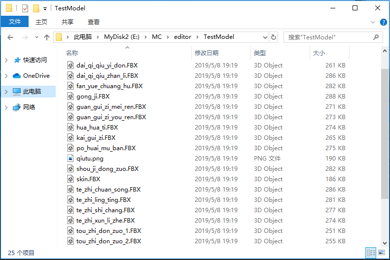

# Resource Import (Old Version) 

Generally, we will use other professional production software to produce game resources. Some resources can be used directly for the work, such as image resources and sound effect resources. Some resources need to be converted to a format due to the special format requirements of the Minecraft engine, such as model resources. Currently, the following formats of resource conversion are supported: 

- Free Model produced by BlockBench software is converted to a block model in Bedrock Edition; the function entry is button 1 in the figure below, and the specific introduction is in [Custom Block Model](../20-Gameplay Development/15-Custom Game Content/2-Custom Block/5-Custom Block Model.md). 
 

- FBX models exported by professional modeling software such as 3D Max are converted to bone models in Bedrock Edition; the function entry is button 2 in the figure above. 

The following is a detailed introduction to how to import FBX model files. 

Go to [DEMO Example Download](../20-Gameplay Development/13-Module SDK Programming/60-Demo Example.md), click the "Download DEMO" button in the figure below to download the offline document, and use the resource "6-4 Resource Production->Tools and Examples->fbxRes->datiangou" to learn. 

 

Click the Import FBX Model button and select the folder where the model is located (such as the datiangou folder mentioned above). A typical FBX model folder is as follows (this is a model with multiple actions). 
 

Take the above model as an example, select the "TestModel" folder when importing, select the main model file in the pop-up interface, and then click "Next". The main model is usually named skin.FBX. If there is no skin.FBX file in the file, you need to manually select the correct main model file, otherwise the import may go wrong. 
 

Next, select the texture file corresponding to the model. Generally, the editor will automatically select the corresponding texture. Click "Finish" and the model is imported. 
 

The converted model files are stored in the mesh, skeleton, and animation folders under the models folder. 
