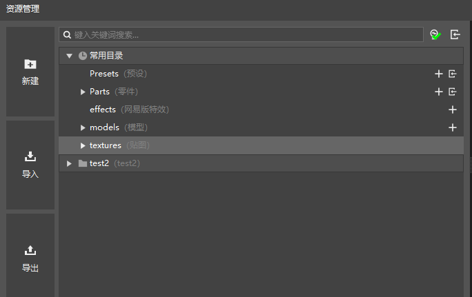
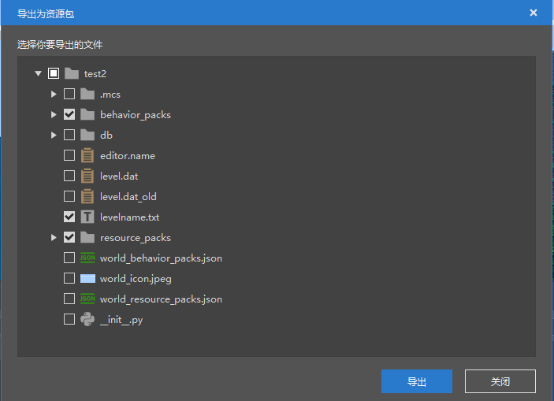
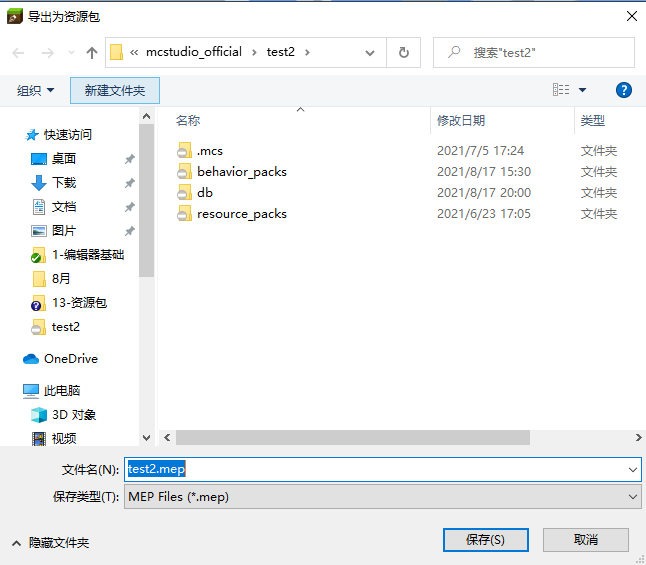
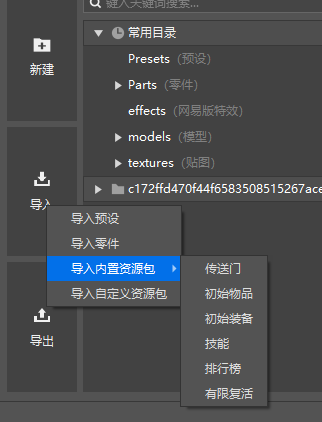
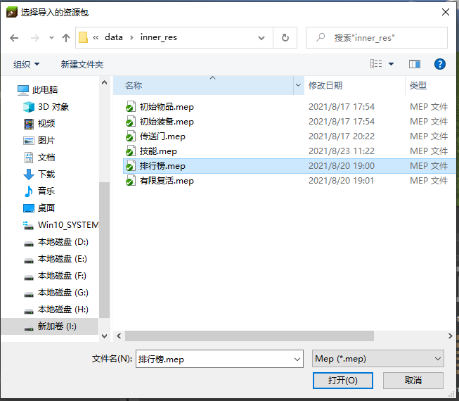

--- 
front: https://nie.res.netease.com/r/pic/20220408/8607da19-6e64-4f3e-bbaf-2432573d305b.png 
hard: Getting Started 
time: 5 minutes 
selection: true 
--- 
# Resource package import and export 

The resource package contains a part of the components that can be shared. It can be imported into other components to achieve the reuse of some common modules. 

You can import built-in resources or resource packages in a specified location 

## Resource package export 

You can use the "Export" function in the resource manager to create a resource package: 

 

After clicking the "Export" button, the "Export as Resource Package" interface will pop up. In this interface, you can select the corresponding file and then click the "Export" button to export. 

 

After clicking the "Export" button, select the corresponding file path to save as a resource package (mep file), and a resource package will be successfully exported. 

 

## Resource package import 

You can use the "Import" button in the resource manager to import resource packages 

Select "Import built-in resource packages", you can directly import built-in resource packages 

 

Select "Import custom resource packages", you can select the path of the resource package to import 

 

## Import rules 

1. For general files in resource packs, if the corresponding files do not exist in the target component, they will be directly copied to the corresponding path. If the same files exist in the target component, they will be skipped directly. If there are files with the same name but different contents in the target component, the import will be terminated and a conflict will be prompted. 

2. For files in behavior_pack_XXX and resource_pack_XXX, they will be merged into the corresponding paths in the first behavior_pack_XXX and resource_pack_XXX in the target component. 

3. For special files in resource_pack_XXX, each file will be merged accordingly. If the merge cannot be correct, the import will be terminated and a conflict will be prompted. 

4. The relative paths of special files are blocks.json, materials/common.json, models/mobs.json, models/netease_models.json, sounds/sound_definitions.json, textures/flipbook_textures.json, textures/flipbook_textures_items.json, textures/item_texture.json, textures/terrain_texture.json, ui/_ui_defs.json and the lang files in the texts directory. 

## Notes 

1. When exporting a resource package, if the file in the relevant path has changed, it needs to be exported again. 

2. Import and export of the Script directory is not supported yet. 

