--- 
front: https://nie.res.netease.com/r/pic/20220711/2b99dca5-e81c-45f1-9b88-3a97966ebd75.png 
hard: Getting Started 
time: 5 minutes 
selection: true 
--- 
# Content Library 
## 1. Introduction 
1. The content library is an online module development resource library, which stores additional package configurations, preset parts, structural materials, special effect maps and other resources related to the development of MC Bedrock Edition modules. The materials here can be used/adapted by developers freely, helping developers to create better modules faster! 
2. The content library is divided into two pages: resource packages and work templates: 
> Resource packages: used to store resource package files that can be directly imported into existing works (.mep suffix) 
> Work templates: used to store template files that can be created as works, similar to the reference templates of new works. 

## 2. Instructions 
### Access and browsing 
1. Every time you open the Minecraft development workbench, you can get all the currently available resource packs in the content library page, or click the refresh button to refresh the resources in the content library. 

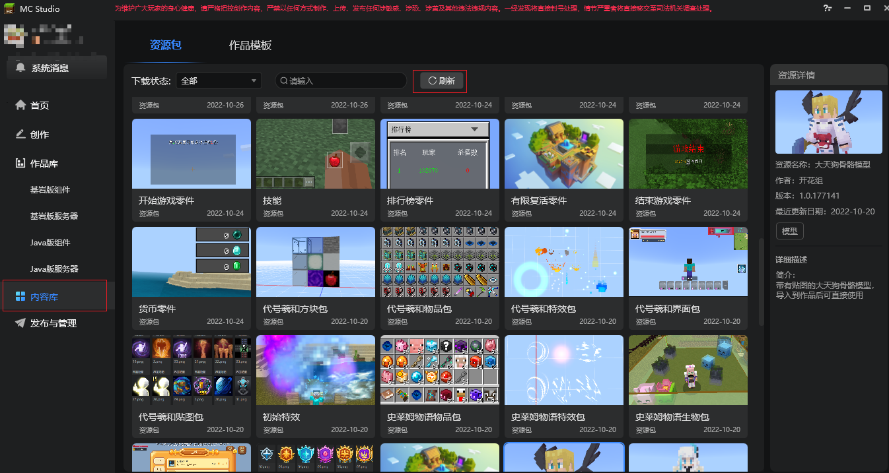 

2. Through the search, filter and top label functions, developers can quickly query the resources they want. 
> The label defaults to multi-select mode, that is, to filter out resources that meet multiple labels at the same time. When you check the **label single selection** in the figure, the label will be set to single selection mode. Clicking a label will automatically deselect other labels. 

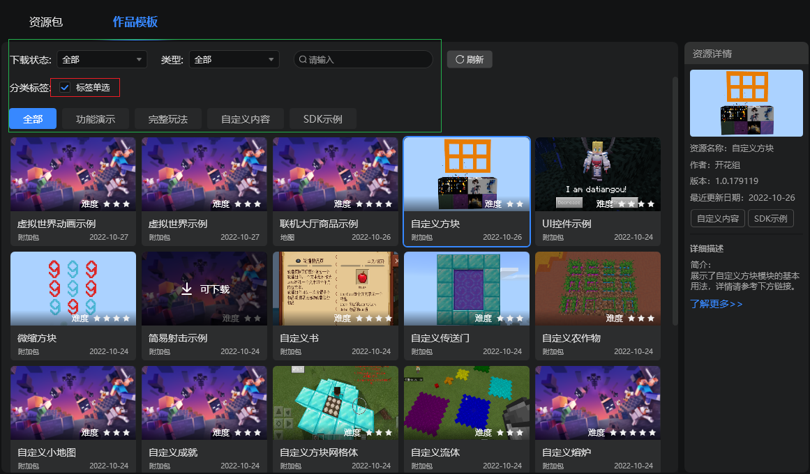 

3. Click the resource card to view the detailed introduction of the resource pack in the resource details on the right, such as the author, version information and instructions for use, etc. 

### Download resources 
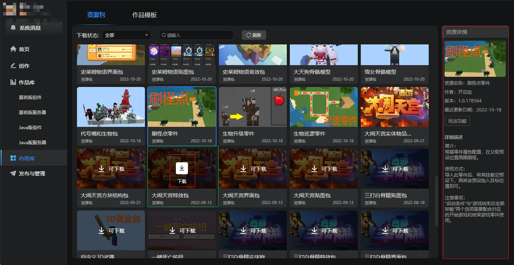 

1. When you confirm that you need the resource, you can click Download to download the resource package to your local computer. If the resource package is large or the network speed is poor, you need to wait patiently for the progress bar to complete, as shown in the figure below 

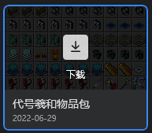 

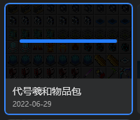 

2. After the download is complete, the download button of the resource card disappears. Move the mouse to the resource to see the import and more menus, as shown in the figure below. 

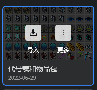 

### Import resources 
#### 1. Import resource package resources 
1. When we need to import the resource files in the resource package page into the work, we need to ensure that the work has been opened with the editor, otherwise the following prompt will appear. 

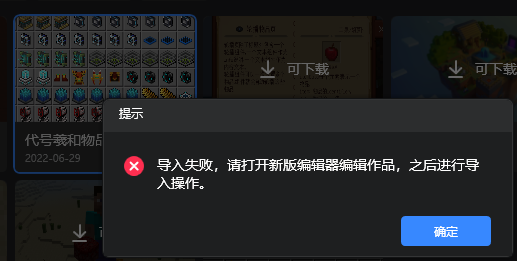 

2. If the work has been opened with an editor, clicking the import button will automatically switch to the editor interface, and the import resource package pop-up window will pop up, as shown below 

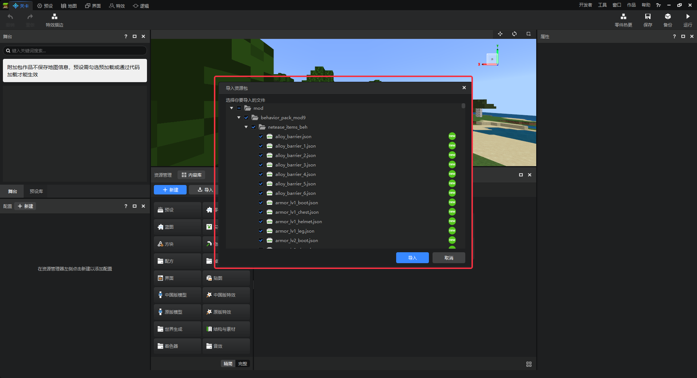

3. We can refer to the icon prompts on the right side of each resource and check the files we want according to our needs. In general, we only need to keep the default status for import. 

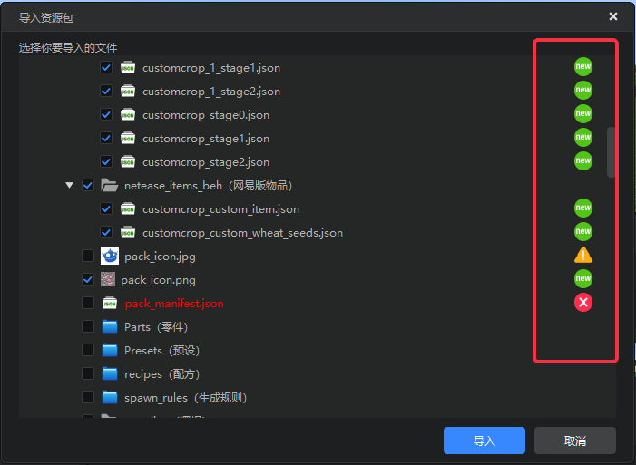 

> 1. When the icon on the right side of the file is green "new", it means that the file is a brand new file and can be directly imported into the work. 
> 2. When the icon on the right side of the file is yellow warning style, it means that the file may have an identical file in the work. It is not checked by default. If you check it, the local resource will be overwritten. 
> 3. When the icon on the right side of the file is red conflict style, it means that the file conflicts with the existing resources in the work and cannot be repaired. If you check it, the local resource will be overwritten. Please carefully confirm and choose whether to import. 

#### 2. Import work template resources 
1. Click the Import button to directly import the template resource into the developer's work library. After the import is completed, a pop-up window will appear. Click **Go to view** to go to the creation page to view the newly created work, or select **Start editing** to directly open the editor. 

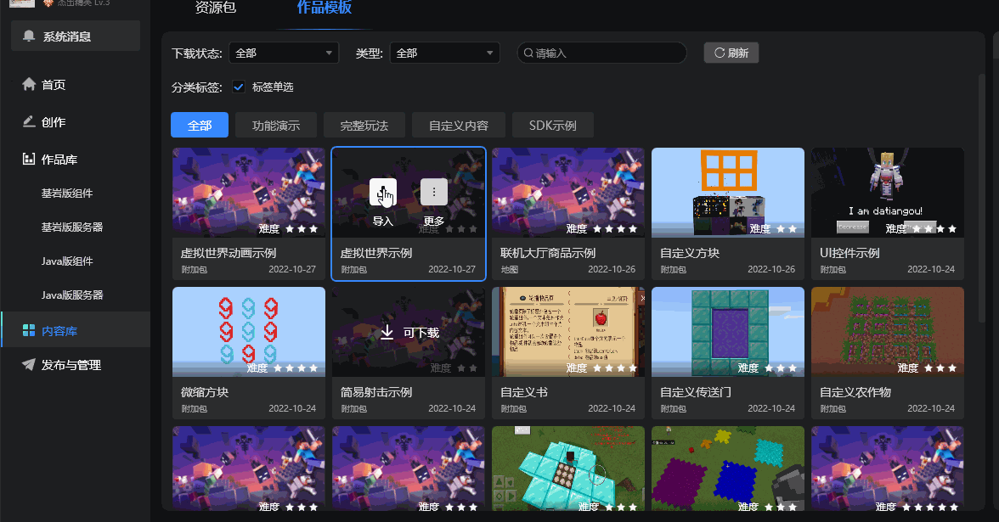 

## 3. Other matters 
1. A content library button is also added to the upper left corner of the resource manager in the editor. Click it to call out the Minecraft development workbench and switch to the content library page, as shown in the figure below 
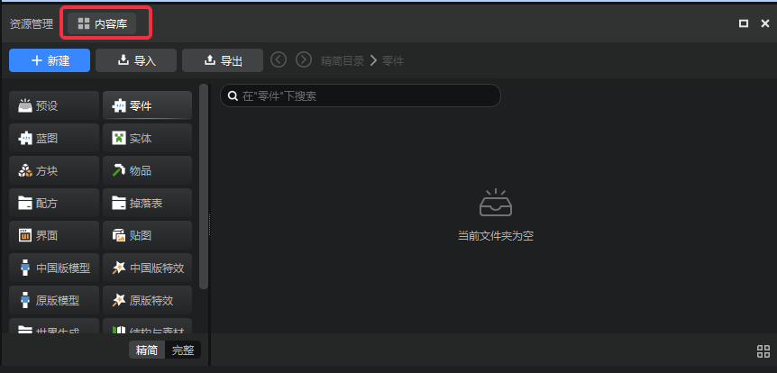