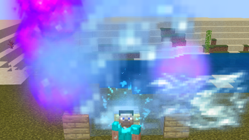
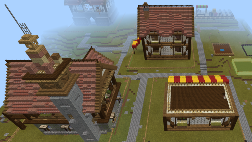
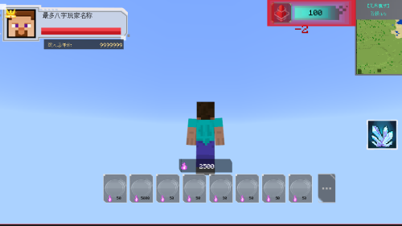
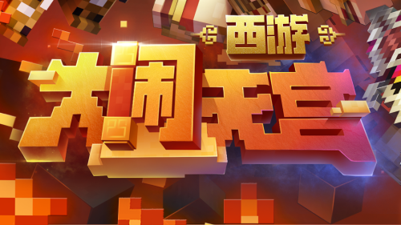
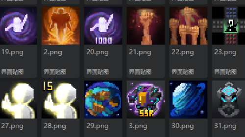
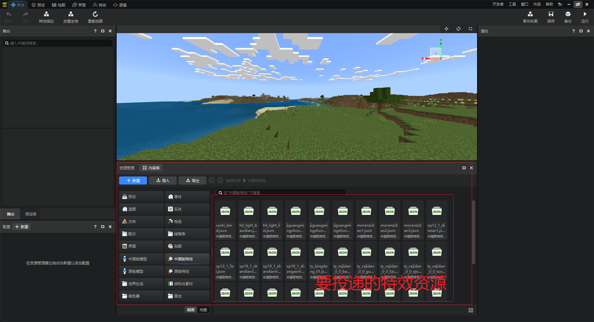
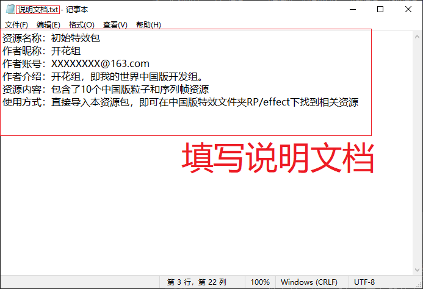
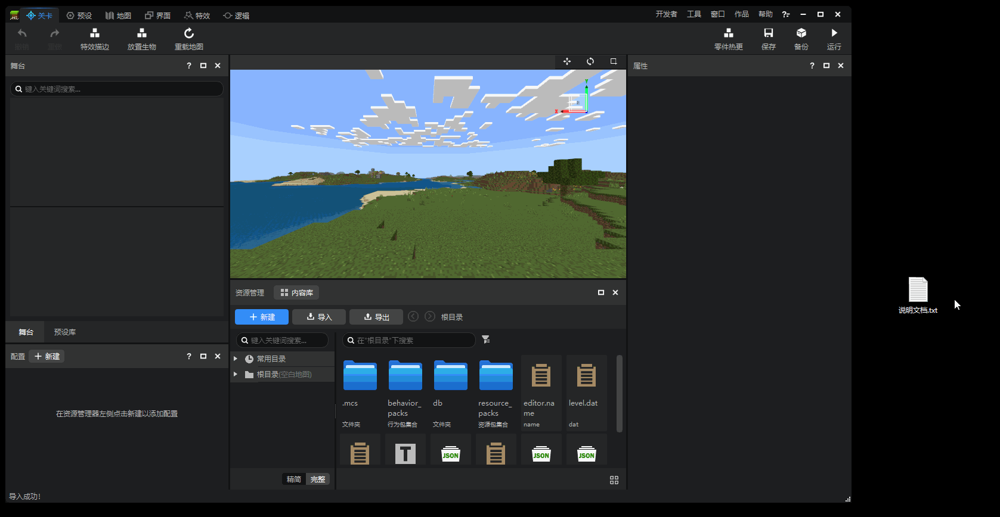
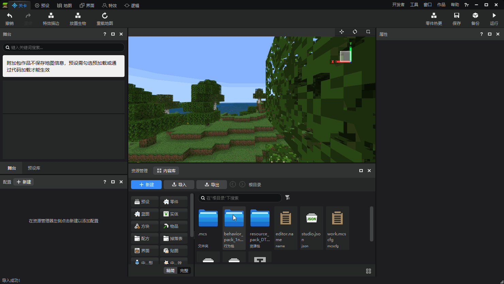
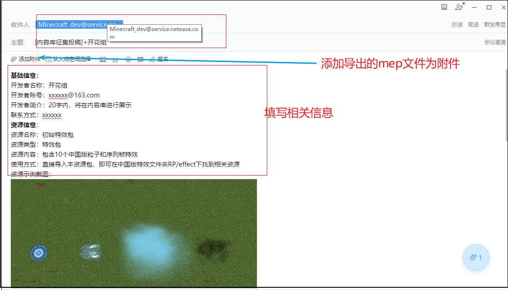

--- 
front: https://nie.res.netease.com/r/pic/20220711/2b99dca5-e81c-45f1-9b88-3a97966ebd75.png 
hard: Getting Started 
time: 10 minutes 
selection: true 
--- 
# Content Library Collection Activity Submission Guide 
## 1. Collection Time 
For details, please refer to [Activity Link](https://mc.163.com/dev/nrkzj/) 

1. Content Collection: October 12, 2022 - November 2, 2022 
2. Preliminary Review and Problem Feedback: November 3, 2022 - November 9, 2022 
3. Resource Problem Fix: November 10, 2022 - November 24, 2022 
4. Final review results announced: November 30, 2022 
5. Award distribution: within 45 working days after the review results are announced 
6. Resource storage: after the review is completed 
## 2. Collection scope 
For details, please refer to [activity link](https://mc.163.com/dev/nrkzj/) 

This event provides the following 8 recommended types for developers to refer to. It is particularly important to emphasize that in addition to the above 8 recommended types, developers are also welcome to submit other types of resources. As long as the resources are helpful and improved for module development, the jury will refer to the existing types for scoring and awards~ 
1. Special effects package: Chinese version particles, Chinese version sequence frame special effects and original particle special effects 
 
2. Building and scene material packages: used to build structures (.mcstructure suffix) or materials (.mdl suffix) of various buildings in the game 
 

3. Interface package: various HUD and interactive window resources used to interact with players, such as achievement system, skill bar, customized character display interface, etc. 
 

4. Sound effect package: background music or sound effect files used to simulate game environments or specific actions, supporting three formats: ogg, wav, and fsb 

5. Character model: model resources for players or entities, supporting skeleton models (fbx format) and original bb models 

6. Modular function package: code used to implement a specific function, such as code packages for chain mining, automatic planting, etc. 

7. Complete gameplay example: a package that implements a complete gameplay, such as the official module Havoc in Heaven and other gameplay modules. 
 

8. Texture collection: Texture resources used in physical skins, items, blocks, interfaces, etc. 
 

## 3. Event Rewards 
For details, please see [Event Link](https://mc.163.com/dev/nrkzj/) 

1. First Prize (3 winners): 1500 bonus + commemorative edition peripheral gift package 
2. Second Prize (5 winners): 800 bonus + commemorative edition peripheral gift package

3. Third Prize (10 winners): 300 yuan bonus + peripheral gift package 
4. Creation Encouragement Award (no quantity limit): peripheral gift package 

> As long as your resources meet the competition rules and meet the entry standards, you can at least get the Creation Encouragement Award. After evaluation, you will have the opportunity to get higher awards such as cash and commemorative peripheral rewards 

## IV. Submission Guide 
**1. Select your own submission type, you can choose the recommended type or free play** 

**2. Open the submitted resources with an editor. Here we use the special effects package as an example. As shown in the figure below, confirm that you want to submit all the Chinese special effects** 
 

**3. Create a new text file (txt file), name it as Instructions Document.txt, and fill in your own information and resource usage instructions** 
 

**4. Put the description document into the editor file, so that you can check the export option in the next step** 
 

**5. Click Export, check all the json and texture resources related to special effects, and of course don't forget the description document .txt imported in the previous step** 
 

>If you are not sure which json and textures the submitted resources depend on, you can export all of them and explain the details of your submission in the description document. 

**6. Edit the email in the following format, add the mep file you just exported to the attachment, and send it to the mailbox Minecraft_dev@service.netease.com** 
 

## 5. Tips 
1. If developers encounter problems during the submission process, they can scan the code to enter the Minecraft Developer Channel → Content Library Collection Activity Sub-channel for consultation and communication. 
