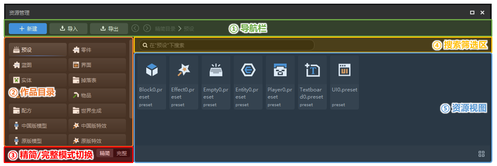
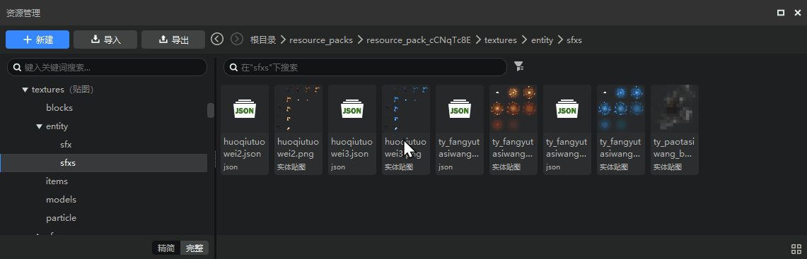
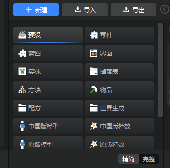
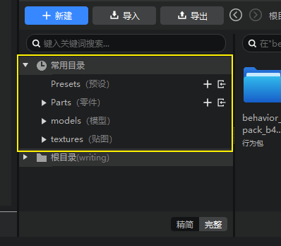
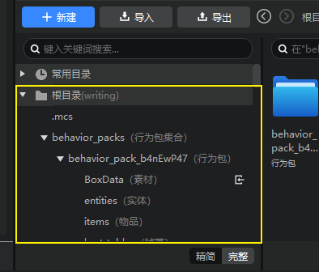
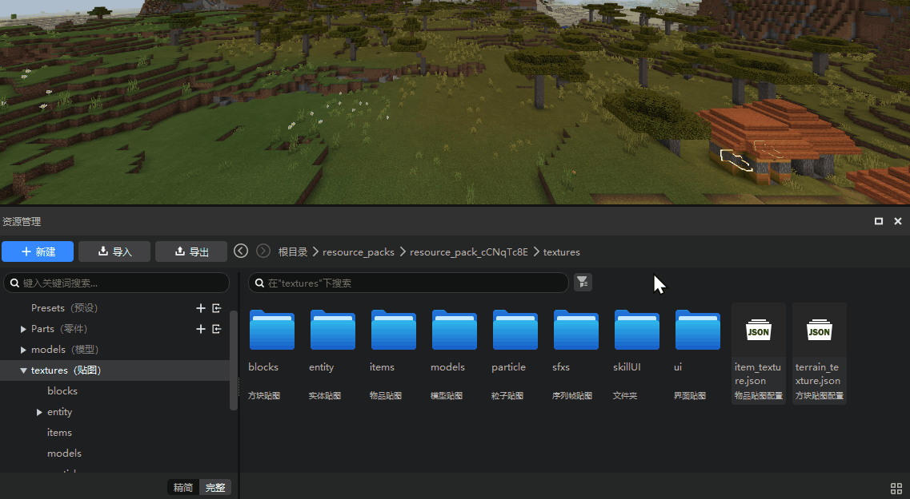
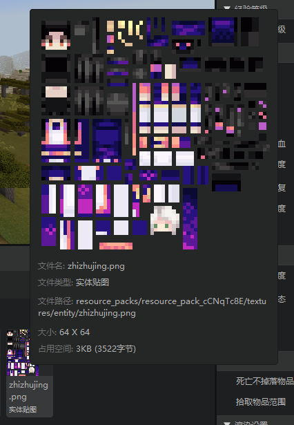
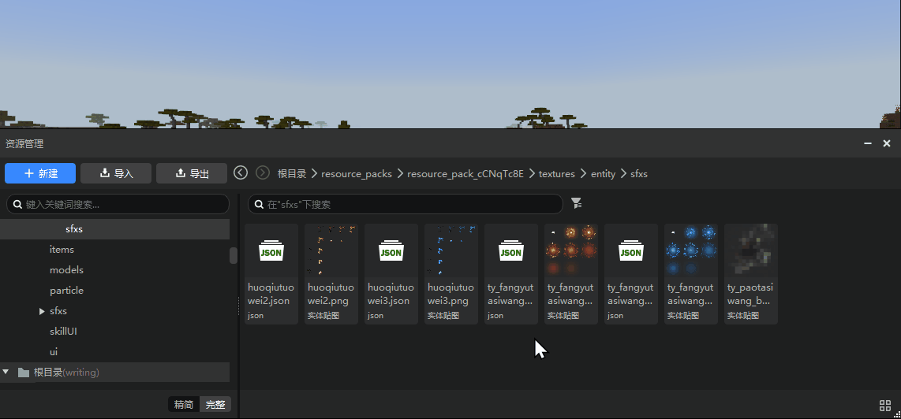

# Resource Manager (New Version) 
In this update, we have upgraded the Resource Manager to provide developers with a more convenient file location, search and management experience. Let's take a look at the new version of the Resource Manager! 

## New Interface Overview 

The new version of the Resource Manager interface is divided into 5 functional areas: 
1. Navigation bar 
2. Works directory 
3. Compact/full mode switch 
4. Search filter area 
5. Resource view 

We will introduce these 5 functional areas one by one below. 

 

## Navigation bar 

The navigation bar contains three more important operation buttons: [**New**], [**Import**], and [**Export**]. 

+ Clicking the New button will automatically open the New File Wizard, which is used to create files supported by various editors. 
+ The Import button integrates all the file types that can be imported into the editor. Developers no longer need to find different buttons in each editor to import different types of files! 
+ The Export button is generally used to export some files in the work directory as resource packages, so that they can be saved separately or reused in other works. 

At the same time, the new version of the resource manager also provides [**Forward**], [**Back**] buttons and **Breadcrumb navigation** in the navigation bar. 

 

## Work Directory 
Here is the file directory of the current work. Click the required directory to display all the files under the path on the right. 

There are two display modes for the work directory: 

#### Compact Mode 
The default display mode of the new version of the editor is [Compact Mode]. Compact Mode is designed to provide a relatively simple and clear resource classification method for developers who are not fully familiar with the file structure of the Minecraft add-on package. In this mode, when developers locate the files they need, they no longer need to expand the complete file structure tree layer by layer. Instead, they can directly click a category button with an icon and find all the files in the category directly on the right. The simplified mode is more suitable for daily lightweight use and for novice developers to get started with the editor. 

 

#### Full mode 
The full mode is the traditional full tree structure display mode. In the full mode, the work directory interface is divided into two parts: 
1. **Common directories:** Some default frequently used directories will be displayed here. Developers can customize common directories: ① If you want to add a folder to the common directory, just right-click it in the work directory window and select [**Add to Common Directory**]; ② If you want to delete a common directory, just right-click it and click [**Delete from Common**]. 

 

2. **Complete directory:** The complete directory starts from the root directory and can be expanded layer by layer to display each subfolder. Clicking a subfolder can display all the files in the folder on the right. 

 

## Switch between simplified and complete modes 

The default display mode of the new editor is [**Lite Mode**]. The purpose of the Lite Mode is to provide a relatively simple and clear resource classification method for developers who are not fully familiar with the file structure of the Minecraft add-on pack. In this mode, when developers locate the files they need, they no longer need to expand the complete file structure layer by layer. Instead, they can directly click a category button with an icon and find all the files of the category directly on the right. **Lite Mode is more suitable for daily lightweight use and for novice developers to get started with the editor. Experienced and mature developers can click [Complete] here to switch to the traditional tree file structure for more precise file location and management. ** 

 

## Search Filter Area 

Here we provide a search box where developers can enter keywords to locate all files in the directory whose file names contain the keyword. **The search function of the new resource manager supports penetrating searches of subfolders at all levels of the selected directory**, instead of only searching the current folder as before. 

In addition, we also provide [Filter] for developers to further filter the currently displayed files to achieve a more precise positioning effect. 
> Note that the filter is hidden in Lite mode, but the search box is still available. 

 

## Resource View 

In the new version of Resource Manager, we use a card style to display more file information (including longer file name display and file type display). When the mouse hovers over a file card, the detailed information of the file will be displayed in a floating window; image files will also display thumbnails. 

 

After selecting a file or folder, its file path will be displayed at the bottom. Click Copy to copy its full path (local computer disk path). 

Click the view button in the lower right corner to switch between card tile and list views. 

 

