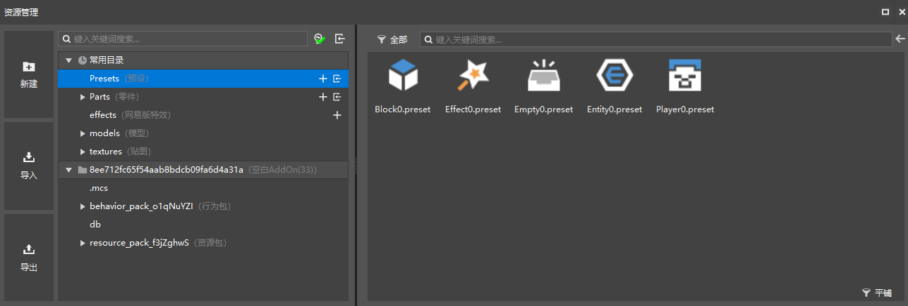
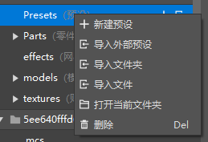
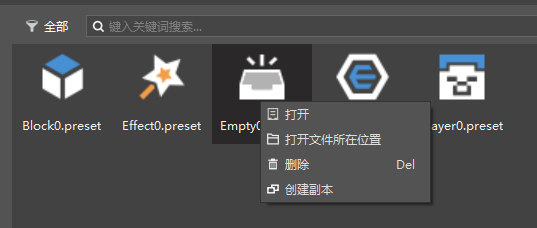
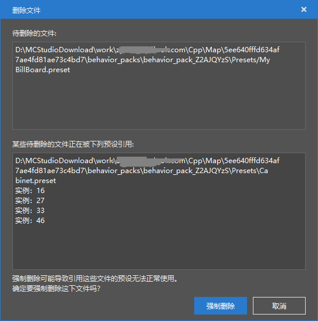

--- 
front: https://nie.res.netease.com/r/pic/20220408/9f03706b-2b66-4da3-a573-d95b00d77588.png 
hard: Getting Started 
time: 10 minutes 
selection: true 
--- 
# Resource Manager 

## Function Introduction 

In the Resource Management Window 

- On the left are the New Button, Import Button, and Export Button. 
- The middle is divided into two parts: Common Directory and Work Directory. Common Directory is a shortcut to the folder in the work. 
- When a folder is selected in the directory on the left, the contents of the folder will be displayed on the right. 

 

Right-click a folder to perform the following operations on the folder. The operations provided by each folder are different. 

 

Right-click a file to perform the following operations on it. The operations provided by different files are different. 

 

- Open: Open the selected file 
- Open the file location: Open the folder where the file is located in the system resource manager 
- Delete: Delete the selected file from the work folder 
- Create a copy: Create a copy of the selected content (currently only supports presets and parts) 
> The right-click menu of a part folder also provides a create copy option, which has the same function as the above create copy. 
## Delete presets and delete parts 

In the preset architecture, there are a large number of reference relationships, including references to preset files and references to preset instances. 

When deleting a preset or part, if it is already in use, the following interface will pop up. Forced deletion will automatically delete its references in other presets and instances in the scene. 

 

The parts under the preset architecture are not a single file, but a series of supporting files (as mentioned above). 

|&nbsp;&nbsp;&nbsp;&nbsp;&nbsp;&nbsp;&nbsp;&nbsp;|--&nbsp;script_\*\*\*&nbsp;&nbsp;*//Folder, Python script folder, generally script plus a specific string. * 
|&nbsp;&nbsp;&nbsp;&nbsp;&nbsp;&nbsp;&nbsp;&nbsp;&nbsp;&nbsp;&nbsp;|--&nbsp;Parts&nbsp;&nbsp;*//Folder, which contains links to subfolders of parts folders. Under normal circumstances, it should be the same as the content of the Parts folder, automatically generated, and generally no processing is required. * 

|&nbsp;&nbsp;&nbsp;&nbsp;&nbsp;&nbsp;&nbsp;&nbsp;&nbsp;|--&nbsp;Parts&nbsp;&nbsp;*//Folder, where all parts folders are placed. * 
|&nbsp;&nbsp;&nbsp;&nbsp;&nbsp;&nbsp;&nbsp;&nbsp;&nbsp;&nbsp;&nbsp;|--&nbsp;\*\*\*&nbsp;&nbsp;*//Folder, where all files of a part are placed. The name is confirmed when creating a new one, and do not modify it. * 
|&nbsp;&nbsp;&nbsp;&nbsp;&nbsp;&nbsp;&nbsp;&nbsp;&nbsp;&nbsp;&nbsp;&nbsp;&nbsp;&nbsp;|--&nbsp;\*\*\*.part&nbsp;&nbsp;*//Part body file. *
|&nbsp;&nbsp;&nbsp;&nbsp;&nbsp;&nbsp;&nbsp;&nbsp;&nbsp;&nbsp;&nbsp;&nbsp;&nbsp;&nbsp;|--\*\*\*Part.py&nbsp;&nbsp;*//Part script file. *
|&nbsp;&nbsp;&nbsp;&nbsp;&nbsp;&nbsp;&nbsp;&nbsp;&nbsp;&nbsp;&nbsp;&nbsp;&nbsp;&nbsp;|--&nbsp;\*\*\*PartMeta.py&nbsp;&nbsp;*//Part metadata file. *
|&nbsp;&nbsp;&nbsp;&nbsp;&nbsp;&nbsp;&nbsp;&nbsp;&nbsp;&nbsp;&nbsp;&nbsp;&nbsp;&nbsp;|--&nbsp;\_init\_.py&nbsp;&nbsp;*//For import, do not delete. *

> Deleting any file of a part in the Parts folder will trigger the deletion of the entire part. 
